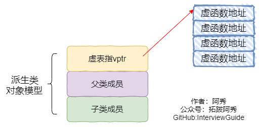

## 1、extern"C"的用法

为了能够**正确的在C++代码中调用C语言**的代码：在程序中加上extern "C"后，相当于告诉编译器这部分代码是C语言写的，因此要按照C语言进行编译，而不是C++。

### 哪些情况下使用extern “C”

（1）C++代码中调用C语言代码；

（2）在C++中的头文件中使用；

（3）在多个人协同开发时，可能有人擅长C语言，而有人擅长C++；

举个例子，C++中调用C代码：

```
#ifndef __MY_HANDLE_H__
#define __MY_HANDLE_H__

extern "C"{
    typedef unsigned int result_t;
    typedef void* my_handle_t;
    
    my_handle_t create_handle(const char* name);
    result_t operate_on_handle(my_handle_t handle);
    void close_handle(my_handle_t handle);
}
```

综上，总结出使用方法，**在C语言的头文件中，对其外部函数只能指定为extern类型，C语言中不支持extern "C"声明，在.c文件中包含了extern "C"时会出现编译语法错误。**

所以使用extern "C"全部都放在于cpp程序相关文件或其头文件中。

### 总结出如下形式

#### （1）C++调用C函数：

```
//xx.h
extern int add(...)

//xx.c
int add(){
    
}

//xx.cpp
extern "C" {
    #include "xx.h"
}
```

#### （2）C调用C++函数

```
//xx.h
extern "C"{
    int add();
}
//xx.cpp
int add(){    
}
//xx.c
extern int add();
```


## 1、C++编译是和C有什么不同

**编译区别**：由于C++支持函数重载，因此编译器编译函数的过程中会**将函数的参数类型也加到编译后的代码中**，而**不仅仅是函数名**；而C语言并不支持函数重载，因此编译C语言代码的函数时不会带上函数的参数类型，一般只包括函数名。


## 2、你知道空类的大小是多少吗？

1. C++空类的大小不为0，不同编译器设置不一样，vs设置为1；
2. C++标准指出，不允许一个对象（当然包括类对象）的大小为0，不同的对象不能具有相同的地址；
3. 带有虚函数的C++类大小不为1，因为每一个对象会有一个vptr指向虚函数表，具体大小根据指针大小确定；
4. C++中要求对于类的每个实例都必须有独一无二的地址,那么编译器自动为空类分配一个字节大小，这样便保证了每个实例均有独一无二的内存地址。


## 3、构造函数一般不定义为虚函数的原因

（1）**创建一个对象时需要确定对象的类型，而虚函数是在运行时动态确定其类型的**。**在构造一个对象时，由于对象还未创建成功，编译器无法知道对象的实际类型**

（2）**虚函数的调用需要虚函数表指针vptr，而该指针存放在对象的内存空间中，若构造函数声明为虚函数，那么由于对象还未创建，还没有内存空间，更没有虚函数表vtable地址用来调用虚构造函数了**

（3）虚函数的作用在于通过父类的指针或者引用调用它的时候能够变成调用子类的那个成员函数。而**构造函数是在创建对象时自动调用的，不可能通过父类或者引用去调用，因此就规定构造函数不能是虚函数**

（4）析构函数一般都要声明为虚函数，这个应该是老生常谈了，这里不再赘述


## 4、为什么析构函数一般写成虚函数？

由于类的多态性，基类指针可以指向派生类的对象，如果删除该基类的指针，就会调用该指针指向的派生类析构函数，而派生类的析构函数又自动调用基类的析构函数，这样整个派生类的对象完全被释放。

如果析构函数不被声明成虚函数，则编译器实施静态绑定，在删除基类指针时，只会调用基类的析构函数而不调用派生类析构函数，这样就会造成派生类对象析构不完全，造成内存泄漏。

所以将析构函数声明为虚函数是十分必要的。在实现多态时，当用基类操作派生类，在析构时防止只析构基类而不析构派生类的状况发生，要将基类的析构函数声明为虚函数。

```cpp
#include <iostream>
using namespace std;

class Parent{
public:
	Parent(){
		cout << "Parent construct function"  << endl;
	};
	~Parent(){
		cout << "Parent destructor function" <<endl;
	}
};

class Son : public Parent{
public:
	Son(){
		cout << "Son construct function"  << endl;
	};
	~Son(){
		cout << "Son destructor function" <<endl;
	}
};

int main()
{
	Parent* p = new Son();
	delete p;
	p = NULL;
	return 0;
}
//运行结果：
//Parent construct function
//Son construct function
//Parent destructor function
```

将基类的析构函数声明为虚函数：

```cpp
#include <iostream>
using namespace std;

class Parent{
public:
	Parent(){
		cout << "Parent construct function"  << endl;
	};
	virtual ~Parent(){
		cout << "Parent destructor function" <<endl;
	}
};

class Son : public Parent{
public:
	Son(){
		cout << "Son construct function"  << endl;
	};
	~Son(){
		cout << "Son destructor function" <<endl;
	}
};

int main()
{
	Parent* p = new Son();
	delete p;
	p = NULL;
	return 0;
}
//运行结果：
//Parent construct function
//Son construct function
//Son destructor function
//Parent destructor function
```

但存在一种特例，在`CRTP`模板中，不应该将析构函数声明为虚函数，理论上所有的父类函数都不应
该声明为虚函数，因为这种继承方式，不需要虚函数表。

**（基类指针指向派生类对象时，同名函数调用父类的；同名虚函数调用时确定，用子类的）**

### 小林：

析构函数被设为虚函数主要是为了解决基类指针指向派生类对象时的资源释放问题。

如果我们有一个基类指针，它实际上指向一个派生类对象，当我们删除这个基类指针时，如果析构函数不是虚函数，那么就只会调用基类的析构函数，而不会调用派生类的析构函数。这可能会导致派生类对象的一些资源没有被正确释放，从而引发内存泄漏等问题。

如果我们将析构函数设置为虚函数，那么在删除基类指针时，会首先调用派生类的析构函数，然后再调用基类的析构函数，从而确保所有的资源都能被正确释放。


## 5、了解模板吗？可以实现一个特定类型的吗？

C++模板是一种对类型进行参数化的工具，通常有两种形式：函数模板和类模板。函数模板针对仅参数类型不同的函数；类模板针对仅数据成员和成员函数类型不同的类。使用模板的目的就是能够让程序员编写与类型无关的代码。

### 代码参考

```cpp
template <typename T>
T add(T a, T b) {
    return a + b;
}
```

### 特化

在C++中，可以使用特化来为特定类型提供特定的实现。例如，我们可以为某个特定类型定义一个函数模板，然后在该类型上特化该函数模板，以提供特定于该类型的实现。以满足特定需求或优化性能。

C++中有两种主要的特化形式：类模板特化和函数模板特化。

1. 类模板特化（Class Template Specialization）：
   类模板特化允许为特定类型提供独立于通用模板定义的实现。特化的语法如下所示：
   ```cpp
   template <typename T>
   class MyTemplate {
       // 通用模板实现
   };

   template <>
   class MyTemplate<int> {
       // int类型的特化实现
   };
   ```
   在上述示例中，`MyTemplate` 是一个通用的类模板，但通过 `template <>` 和类型 `int` 的特化声明，我们为 `int` 类型提供了特殊的实现逻辑。

2. 函数模板特化（Function Template Specialization）：
   函数模板特化允许为特定类型提供独立于通用模板定义的函数实现。特化的语法如下所示：
   
   ```cpp
   template <typename T>
   void myFunction(T arg) {
       // 通用模板实现
}
   
   template <>
   void myFunction<int>(int arg) {
       // int类型的特化实现
   }
   ```
   在上述示例中，`myFunction` 是一个通用的函数模板，但通过 `template <>` 和类型 `int` 的特化声明，我们为 `int` 类型提供了特殊的函数实现。

需要注意的是，特化是一种有选择地为特定类型提供实现的机制，通常用于处理特定类型的边界情况或针对某些类型进行性能优化。在使用特化时，应慎重考虑，并确保特化实现真正符合需求，避免滥用导致代码的复杂性增加。


## 7、指针和引用的区别？

### 区别

- **指针是一个变量，存储的是一个地址，引用跟原来的变量实质上是同一个东西，是原变量的别名**
- **指针可以有多级，引用只有一级**
- **指针可以为空，引用不能为NULL且在定义时必须初始化**
- **指针在初始化后可以改变指向，而引用在初始化之后不可再改变**
- sizeof指针得到的是本指针的大小，sizeof引用得到的是引用所指向变量的大小
- 当把指针作为参数进行传递时，也是将实参的一个拷贝传递给形参，两者指向的地址相同，但不是同一个变量，在函数中改变这个变量的指向不影响实参，而引用却可以。
- **引用本质是一个指针**，同样会占4字节内存；指针是具体变量，需要占用存储空间（，具体情况还要具体分析）。
- **引用在声明时必须初始化为另一变量，一旦出现必须为typename refname &varname形式；指针声明和定义可以分开，可以先只声明指针变量而不初始化，等用到时再指向具体变量。**
- **引用一旦初始化之后就不可以再改变（变量可以被引用为多次，但引用只能作为一个变量引用）；指针变量可以重新指向别的变量。**
- 不存在指向空值的引用，必须有具体实体；但是存在指向空值的指针。

### 参考代码

```cpp
void test(int *p)
{
　　int a=1;
　　p=&a;
　　cout<<p<<" "<<*p<<endl;
}

int main(void)
{
    int *p=NULL;
    test(p);
    if(p==NULL)
    cout<<"指针p为NULL"<<endl;
    return 0;
}
//运行结果为：
//0x22ff44 1
//指针p为NULL
```

```cpp
void testPTR(int* p) {
	int a = 12;
	p = &a;

}

void testREFF(int& p) {
	int a = 12;
	p = a;

}
void main()
{
	int a = 10;
	int* b = &a;
	testPTR(b);//改变指针指向，但是没改变指针的所指的内容
	cout << a << endl;// 10
	cout << *b << endl;// 10

	a = 10;
	testREFF(a);
	cout << a << endl;//12
}
```

在编译器看来, int a = 10; int &b = a; 等价于 int * const b = &a; 而 b = 20; 等价于 *b = 20; 自动转换为指针和自动解引用.


## 8、指针和const的用法

1. 当const修饰指针时，由于const的位置不同，它的修饰对象会有所不同。
2. `int *const p2`中`const`修饰`p2`的值,所以理解为`p2`的值不可以改变，即`p2`只能指向固定的一个变量地址，但可以通过`*p2`读写这个变量的值。顶层指针表示指针本身是一个常量
3. `int const *p1`或者`const int *p1`两种情况中const修饰`*p1`，所以理解为`*p1`的值不可以改变，即不可以给`*p1`赋值改变`p1`指向变量的值，但可以通过给p赋值不同的地址改变这个指针指向。底层指针表示指针所指向的变量是一个常量。


## 9、为什么不能把所有的函数写成内联函数?/内联函数的缺点？

内联函数以代码复杂为代价，它以省去函数调用的开销来提高执行效率。

所以一方面如果内联函数体内代码执行时间相比函数调用开销较大，则没有太大的意义；

另一方面每一处内联函数的调用都要复制代码，消耗更多的内存空间，因此以下情况不宜使用内联函数：

- 函数体内的代码比较长，将导致内存消耗代价
- 函数体内有循环，函数执行时间要比函数调用开销大

在内联函数内**不允许用循环语句和开关语句**，如果内联函数有这些语句，则编译将该函数视同普通函数那样产生函数调用代码,递归函数是不能被用来做内联函数的

### 什么是内联函数

在C++中，使用关键字"inline"可以声明一个内联函数。声明为内联函数的函数会在**编译时被视为候选项，编译器会尝试将其展开，将函数体直接插入到调用点处**。这样可以避免函数调用的开销，减少了函数调用的栈帧等额外开销，从而提高程序的执行效率。

### 缺点：

- 代码膨胀：内联函数会在每个调用它的地方进行代码替换，这可能导致代码膨胀。如果内联函数体非常大或者被频繁调用，会增加可执行文件的大小，可能导致缓存不命中，影响性能。
- 编译时间增加：内联函数需要在每个调用点进行代码替换，这会增加编译时间。特别是当内联函数被广泛使用时，编译时间可能会显著增加。
- 可读性降低：内联函数会将函数体嵌入到调用点，可能导致代码的可读性降低。函数体被分散在多个地方，可能会使代码难以理解和维护。


## 10、C++的多态是如何实现的？

C++的多态性，一言以蔽之就是：

在基类的函数前加上**virtual**关键字，在派生类中重写该函数，运行时将会根据所指对象的实际类型来调用相应的函数，如果对象类型是派生类，就调用派生类的函数，如果对象类型是基类，就调用基类的函数。

举个例子：

```cpp
#include <iostream>
using namespace std;

class Base{
public:
	virtual void fun(){
		cout << " Base::func()" <<endl;
	}
};

class Son1 : public Base{
public:
	virtual void fun() override{
		cout << " Son1::func()" <<endl;
	}
};

class Son2 : public Base{

};

int main()
{
	Base* base = new Son1;
	base->fun();
	base = new Son2;
	base->fun();
	delete base;
	base = NULL;
	return 0;
}
// 运行结果
// Son1::func()
// Base::func()
```

例子中，Base为基类，其中的函数为虚函数。

子类1继承并重写了基类的函数，子类2继承基类但没有重写基类的函数，从结果分析子类体现了多态性，那么为什么会出现多态性，其底层的原理是什么？

### 虚表和虚基表指针

这里需要引出虚表和虚表指针的概念。

虚表：虚函数表的缩写，类中含有virtual关键字修饰的方法时，编译器会自动生成虚表，它是在编译期确定的

虚表指针：在含有虚函数的类实例化对象时，对象地址的前四个字节存储的指向虚表的指针，它是在构造函数中被初始化的




**上图中展示了虚表和虚表指针在基类对象和派生类对象中的模型，下面阐述实现多态的过程：**

**1**、编译器在发现基类中有虚函数时，会自动为每个含有虚函数的类生成一份虚表，该表是一个一维数组，虚表里保存了虚函数的入口地址

**2**、编译器会在每个对象的前四个字节中保存一个虚表指针，即**vptr**，指向对象所属类的虚表。

在构造时，根据对象的类型去初始化虚指针vptr，从而让vptr指向正确的虚表，从而在调用虚函数时，能找到正确的函数。

**3**、所谓的合适时机，在派生类定义对象时，程序运行会自动调用构造函数，在构造函数中对虚表指针进行初始化。在构造子类对象时，会先调用父类的构造函数，此时，编译器只“看到了”父类，并为父类对象初始化虚表指针，令它指向父类的虚表；当调用子类的构造函数时，为子类对象初始化虚表指针，令它指向子类的虚表

**4**、当派生类对基类的虚函数没有重写时，派生类的虚表指针指向的是基类的虚表；当派生类对基类的虚函数重写时，派生类的虚表指针指向的是自身的虚表；当派生类中有自己的虚函数时，在自己的虚表中将此虚函数地址添加在后面

这样指向派生类的基类指针在运行时，就可以根据派生类对虚函数重写情况动态的进行调用，从而实现多态性。


### 分类

C++中的多态主要通过虚函数和继承来实现。多态分为两种：编译时多态和运行时多态。

- 编译时多态：也称为静态多态或早绑定。这种多态是通过函数重载和模板来实现的。
- 运行时多态：也称为动态多态或晚绑定。这种多态是通过虚函数和继承来实现的。当基类的指针或引用指向派生类对象时，调用的虚函数将是派生类的版本，这就实现了运行时多态。


## 11、什么是纯虚函数，与虚函数的区别

- 虚函数是为了实现动态编联产生的，目的是通过基类类型的指针指向不同对象时，自动调用相应的、和基类同名的函数（使用同一种调用形式，既能调用派生类又能调用基类的同名函数）。
- 虚函数需要在基类中加上virtual修饰符修饰，因为virtual会被隐式继承，所以子类中相同函数都是虚函数。
- 当一个成员函数被声明为虚函数之后，其派生类中同名函数自动成为虚函数，在派生类中重新定义此函数时要求函数名、返回值类型、参数个数和类型全部与基类函数相同。
- 纯虚函数只是相当于一个接口名，但含有纯虚函数的类不能够实例化。

纯虚函数首先是虚函数，其次它没有函数体，取而代之的是用“=0”。

**既然是虚函数，它的函数指针会被存在虚函数表中，由于纯虚函数并没有具体的函数体，因此它在虚函数表中的值就为0，而具有函数体的虚函数则是函数的具体地址。**

一个类中如果有纯虚函数的话，称其为抽象类。抽象类**不能用于实例化对象**，否则会报错。抽象类一般用于定义一些公有的方法。子类继承抽象类也必须实现其中的纯虚函数才能实例化对象。

举个例子：

```cpp
#include <iostream>
using namespace std;

class Base
{
public:
	virtual void fun1()
	{
		cout << "普通虚函数" << endl;
	}
	virtual void fun2() = 0;
	virtual ~Base() {}
};

class Son : public Base
{
public:
	virtual void fun2() 
	{
		cout << "子类实现的纯虚函数" << endl;
	}
};

int main()
{
	Base* b = new Son;
	b->fun1(); //普通虚函数
	b->fun2(); //子类实现的纯虚函数
	return 0;
}
```


纯虚函数是在基类中声明的虚函数，它在基类中没有定义，但要求任何派生类都要定义自己的实现方法。在C++中，纯虚函数的声明形式如下：

```cpp
virtual void function() = 0;
```

其中，`= 0`就表示这是一个纯虚函数。

含有纯虚函数的类被称为抽象类。抽象类不能被实例化，只能作为接口使用。派生类必须实现所有的纯虚函数，否则该派生类也会变成抽象类。

**纯虚函数的应用场景主要包括：**

- 设计模式：例如在模板方法模式中，基类定义一个算法的骨架，而将一些步骤延迟到子类中。这些需要在子类中实现的步骤就可以声明为纯虚函数。
- 接口定义：可以创建一个只包含纯虚函数的抽象类作为接口。所有实现该接口的类都必须提供这些函数的实现。


## 12、new和malloc的区别

1、 new/delete是C++关键字，需要编译器支持。malloc/free是库函数，需要头文件支持；

2、 **使用new操作符申请内存分配时无须指定内存块的大小，编译器会根据类型信息自行计算。而malloc则需要显式地指出所需内存的尺寸。**

3、 **new操作符内存分配成功时，返回的是对象类型的指针，类型严格与对象匹配，无须进行类型转换，故new是符合类型安全性的操作符。而malloc内存分配成功则是返回void * ，需要通过强制类型转换将void*指针转换成我们需要的类型。**

4、 new内存分配失败时，会抛出bad_alloc异常。malloc分配内存失败时返回NULL。

5、 **new会先调用operator new函数，申请足够的内存（通常底层使用malloc实现）。然后调用类型的构造函数，初始化成员变量，最后返回自定义类型指针。delete先调用析构函数，然后调用operator delete函数释放内存（通常底层使用free实现）。malloc/free是库函数，只能动态的申请和释放内存，无法强制要求其做自定义类型对象构造和析构工作。**


## 13、讲讲new的实现，其中new什么时候返回空指针，什么时候抛出异常，抛的是什么异常

`new` 是C++中用于动态分配内存的操作符，它的实现可以简单概括为两个步骤：内存分配和对象构造。

1. 内存分配：当使用 `new` 运算符来创建一个对象时，会首先分配足够大小的内存空间。如果内存分配失败，即没有足够的可用内存，那么 `new` 操作符会返回一个空指针（nullptr）。

2. 对象构造：在成功分配内存后，会调用相应类型的构造函数来构造对象。如果对象的构造过程中发生异常，`new` 操作符会抛出 `std::bad_alloc` 异常。这是因为在构造过程中可能需要执行一些分配资源、初始化等可能导致失败的操作。

下面是一个示例：

```cpp
try {
    MyClass* obj = new MyClass; // 尝试动态分配内存并构造对象
    // ...
} catch (const std::bad_alloc& e) {
    // 内存分配失败，处理异常
    // ...
}
```

需要注意的是，虽然 `new` 可能会返回空指针或抛出异常，但在现代的C++编译器中，通常对于内置类型的动态分配内存，如 `int`、`float` 等，不会抛出异常，而是直接返回空指针。这是因为内置类型的构造过程不存在可能导致失败的操作。

此外，为了防止内存泄漏，每次使用 `new` 分配内存后，应该在不再使用时通过 `delete` 或 `delete[]` 运算符释放相应的内存空间。


## 14、malloc线程安全吗，多线程malloc系统怎么设计

`malloc` 函数本身并不是线程安全的。在多线程环境下，多个线程同时调用 `malloc` 可能会导致竞争条件和内存错误。

为了在多线程环境下安全地使用 `malloc`，可以采取以下一些策略：

1. 使用互斥锁：在使用 `malloc` 前后通过互斥锁（例如 `std::mutex`）来保护共享资源，确保同一时间只有一个线程调用 `malloc`。

2. 使用线程局部存储（Thread Local Storage, TLS）：将 `malloc` 的调用限定在每个线程的私有内存中。可以使用线程特定数据（Thread-Specific Data, TSD）或者平台提供的机制，如 `pthread_key_create()` 和 `pthread_setspecific()` 来实现线程局部存储。

3. 使用内存池（Memory Pool）：在多线程场景下，可以预先分配一块较大的内存作为内存池，并由每个线程从内存池中动态分配内存。这种方式可以减少对全局内存分配器的竞争，提高性能。

需要注意的是，以上方法都需要考虑到线程安全和性能之间的平衡，以及在释放内存时的处理。另外，C++ 中也提供了更好的内存管理方式，如使用 `new` 和 `delete` 运算符、智能指针等，可以更好地管理内存资源，并且在多线程环境下具有更好的线程安全性。


## 15、C++ map是线程安全的吗，怎么保证map线程安全

在标准C++中，`std::map` 并没有被设计为线程安全的容器。这意味着在多个线程同时读取和修改 `std::map` 对象时，可能会产生竞态条件（race condition）和数据不一致的问题。

如果你需要在多线程环境下使用 `std::map` 并保证线程安全，可以考虑以下两种方式：

1. 使用互斥锁（Mutex）：在每次对 `std::map` 进行读取或修改操作之前，使用互斥锁进行同步，即确保同一时间只有一个线程能够访问和修改 `std::map`。这样可以避免并发访问导致的数据竞争问题。具体实现可借助 `std::mutex` 和 `std::lock_guard` 等类来管理互斥锁的加锁和解锁操作。

2. 使用线程安全的替代容器：C++17 引入了一些线程安全的并发容器，例如 `std::map` 的线程安全替代品是 `std::map<std::shared_mutex>` 或 `std::map<std::shared_timed_mutex>`。它们使用了共享-排他锁（Shared-Exclusive Locking）机制，允许多个线程并发地读取容器，但只允许一个线程进行写入操作。通过使用这些线程安全的容器，可以避免显式地添加互斥锁来保护容器的并发访问。

无论选择哪种方式，都需要根据具体的使用场景和需求来确定最合适的保证线程安全的方法。注意，在进行并发编程时，除了保证数据结构本身的线程安全性外，还需要注意其他与多线程相关的问题，如原子操作、内存可见性等。


## 16、const关键字的作用有哪些?

1. **阻止一个变量被改变，可以使用const关键字。在定义该const变量时，通常需要对它进行初始化，因为以后就没有机会再去改变它了；**
2. 对**指针**来说，可以指定指针本身为const，也可以指定指针所指的数据为const，或二者同时指定为const；
3. 在一个函数声明中，**const可以修饰形参，表明它是一个输入参数，在函数内部不能改变其值**；
4. 对于类的成员函数，若指定其为const类型，则表明其是一个常函数，不能修改类的成员变量，类的常对象只能访问类的常成员函数；
5. 对于类的成员函数，有时候必须指定其返回值为const类型，以使得其返回值不为“左值”。
6. **const成员函数可以访问非const对象的非const数据成员、const数据成员，也可以访问const对象内的所有数据成员；**
7. **非const成员函数可以访问非const对象的非const数据成员、const数据成员，但不可以访问const对象的任意数据成员**；
8. 一个没有明确声明为const的成员函数被看作是将要修改对象中数据成员的函数，而且编译器不允许它为一个const对象所调用。**因此const对象只能调用const成员函数**。
9. const类型变量可以通过类型转换符const_cast将const类型转换为非const类型；
10. const类型变量必须定义的时候进行初始化，因此也导致如果类的成员变量有const类型的变量，那么该变量必须在类的初始化列表中进行初始化；
11. 对于函数值传递的情况，因为参数传递是通过复制实参创建一个临时变量传递进函数的，函数内只能改变临时变量，但无法改变实参。则这个时候无论加不加const对实参不会产生任何影响。但是在引用或指针传递函数调用中，因为传进去的是一个引用或指针，这样函数内部可以改变引用或指针所指向的变量，这时const 才是实实在在地保护了实参所指向的变量。因为在编译阶段编译器对调用函数的选择是根据实参进行的，所以，只有引用传递和指针传递可以用是否加const来重载。一个拥有顶层const的形参无法和另一个没有顶层const的形参区分开来。


## 17、面试题：std::unique_lock和std::lock_guard

`std::unique_lock`和`std::lock_guard`都是C++11引入的，用于管理互斥锁定。它们的设计意图是提供RAII（Resource Acquisition Is Initialization）风格的锁管理，以确保在作用域结束或异常发生时能自动释放锁，避免资源泄漏和死锁。

**std::lock_guard:**
`std::lock_guard`是一种简单的RAII锁保管对象，主要用于保护某个代码段。当创建`std::lock_guard`对象时，它会尝试立即获取互斥锁。如果成功，`std::lock_guard`将拥有该锁，否则代码将阻塞，直至锁可用。当`std::lock_guard`对象离开其作用域时，其析构函数会自动解锁。

基本用法：
```cpp
{
  std::lock_guard<std::mutex> lock(my_mutex);
  // 临界区（保护的代码段）
} // 锁在lock离开作用域时自动解锁
```

注意：
1. `std::lock_guard`不提供手动锁定和解锁功能。
2. `std::lock_guard`不支持所有权转移。

**std::unique_lock:**
`std::unique_lock`提供了比`std::lock_guard`更为灵活的锁保管，支持更多操作。与`std::lock_guard` 类似，`std::unique_lock`也是一个RAII锁保管对象。但它提供了更多的功能，如延迟锁定、手动锁定、解锁、尝试锁定以及所有权转移。

基本用法：
```cpp
{
  std::unique_lock<std::mutex> lock(my_mutex);
  // 临界区（保护的代码段）
} // 锁在lock离开作用域时自动解锁
```

延迟锁定，手动锁定和解锁的示例：
```cpp
{
  std::unique_lock<std::mutex> lock(my_mutex, std::defer_lock);
  // 延迟锁定
  lock.lock();
  // 临界区
  lock.unlock();
  // 在解锁后的操作
}
```
注意：
1. `std::unique_lock`资源开销稍高于`std::lock_guard`。

总结如下:
- 对于简单的用例，`std::lock_guard`是首选，因为它非常简单且轻量。
- 对于需要手动锁定/解锁、尝试锁定或延迟锁定等高级功能的用例，应使用`std::unique_lock`。

你应该根据程序的需求和目标来选择使用哪个。在常规情况下，`std::lock_guard`通常足够使用，但对于需要更多控制的情况，应以灵活性和功能为优先选择`std::unique_lock`。

## 18、std::mutex和std::lock_gard

`std::mutex`和`std::lock_guard`是C++标准库中用于实现线程安全的工具。

`std::mutex`（互斥锁）是一个同步原语，用于保护共享资源的访问。**多个线程可以使用`std::mutex`来对共享资源进行互斥访问，以避免数据竞争和不一致性**。通过调用`lock()`成员函数来获取锁，并使用`unlock()`成员函数释放锁。

`std::lock_guard`是一个模板类，它提供了一种方便的方式来管理`std::mutex`的锁定和解锁操作。在创建`std::lock_guard`对象时，会自动获取所关联的`std::mutex`的锁，当该对象超出作用域时，会自动释放锁，确保不会忘记释放锁而导致死锁等问题。

下面是一个使用`std::mutex`和`std::lock_guard`实现线程安全访问共享资源的示例：

```cpp
#include <iostream>
#include <thread>
#include <mutex>

std::mutex mtx;
int sharedData = 0;

void incrementData()
{
    std::lock_guard<std::mutex> lock(mtx); // 获取锁
    sharedData++; // 访问共享资源
} // 自动释放锁

int main()
{
    std::thread t1(incrementData);
    std::thread t2(incrementData);

    t1.join();
    t2.join();

    std::cout << "Shared data: " << sharedData << std::endl;

    return 0;
}
```

在上述示例中，`std::lock_guard`用于自动获取和释放`std::mutex`的锁，确保了对共享资源`sharedData`的线程安全访问。两个线程`t1`和`t2`同时对`sharedData`进行递增操作，但由于互斥锁的作用，它们不会发生竞争条件，最终得到正确的结果。

使用`std::mutex`和`std::lock_guard`可以简化编写线程安全代码的过程，提供了一种可靠的同步机制来防止并发问题的发生。


## 20、对面向对象的理解

C++面向对象编程就是把一切事物都变成一个个对象，用属性和方法来描述对象的信息，比如定义一个猫对象，猫的眼睛、毛发、嘴巴就可以定义为猫对象的属性，猫的叫声和走路就可以定义为猫对象的方法。

用对象的方式编程，不仅方便了程序员，也使得代码的**可复用性、可维护性**变好。

C++面向对象的三大特性是封装、继承、多态。

- **封装**：封装是将数据（变量）和操作数据的函数组合在一起形成一个"对象"，并隐藏了对象的内部细节。这可以防止外部代码直接访问对象的内部表示。
- **继承**：继承是从现有类派生出新类的过程。新类包含了现有类的所有特性，并可以添加自己的新特性。这有助于代码重用和减少复杂性。
- **多态**：**多态是指允许使用一个接口来表示不同的类型。在C++中，多态可以通过虚函数实现，使得不同的对象可以以自己的方式响应相同的消息。**


## 22、普通的函数和成员函数的区别？

- 普通函数是在类的外部定义的，而成员函数是在类的内部定义的。
- 普通函数不能直接访问类的私有（private）和保护（protected）成员，而成员函数可以访问类的所有成员，包括私有和保护成员。
- 普通函数可以直接调用，而成员函数需要通过类的对象来调用。
- 成员函数有一个特殊的指针this，它指向调用该成员函数的对象。普通函数没有这个指针。


## 24、this 指针是干嘛的？

**this 指针是指向当前对象的地址。this指针主要用于在类的成员函数中访问当前对象的成员变量和成员函数。**

**当一个对象调用自己的成员函数时，编译器会隐式地将对象的地址传递给成员函数**，作为一个**隐藏的参数**，这个隐藏的参数就是this指针。通过this指针，成员函数可以访问和操作当前对象的成员变量和成员函数。

**this指针只能在非静态成员函数中使用，因为静态成员函数没有this指针，它们不属于任何具体的对象**


## 26、static关键字的作用？

static:静态变量声明，分为局部静态变量，全局静态变量，类静态成员变量。也可修饰类成员函数。有以下几类：

- **定义全局静态变量和局部静态变量**：在变量前面加上static关键字。初始化的静态变量会在数据段
  分配内存，未初始化的静态变量会在BSS段分配内存。直到程序结束，静态变量始终会维持当前值。
  只不过全局静态变量和局部静态变量的作用域不一样；
  - **局部静态变量：存储在静态存储区**，程序运行期间只被初始化一次，**作用域仍然为局部作用域**，在**变量定义的函数或语句块中有效，程序结束时由操作系统回收资源**。
  - **全局静态变量：存储在静态存储区**，静**态存储区中的资源在程序运行期间会一直存在，直到程序结束由系统回收**。未初始化的变量会默认为0，**作用域在声明他的文件中有效**。

- 定义静态函数：在函数返回类型前加上static关键字，函数即被定义为静态函数。**静态函数只能在**
  **本源文件中使用**；

- 在变量类型前加上static关键字，变量即被定义为静态变量。静态变量**只能在本源文件中使用**；

  ```cpp
  //示例
  static int a;
  static void func();
  ```

- **类静态成员变量**：被类的所有对象共享，包括子对象。**必须在类外初始化**，不可以在构造函数内进行初始化。使用静态数据成员，它既可以被当成全局变量那样去存储，但又被隐藏在类的内部。**类中的static静态数据成员拥有一块单独的存储区**，而不管创建了多少个该类的对象。所有这些**对象的静态数据成员都共享这一块静态存储空间**。
- **类静态成员函数**：所有对象共享该函数，**不含this指针，不可使用类中非静态成员**。
  与静态成员变量类似，类里面同样可以定义静态成员函数。只需要在函数前加上关键字static即可。如静态成员函数也是类的一部分，而不是对象的一部分。所有这些对象的静态数据成员都**共享**这一块静态存储空间


## 29、const、static 关键字有什么区别

**首先明白内存的五个区**

- **栈(stack)**：由编译器自动分配释放，存放函数的参数值，局部变量的值（除static），其操作方式类似于数据结构中的栈。
- **堆(heap)**：一般由程序员分配释放，若程序员不释放，程序结束时可能由OS回收。注意它与数据结构中的堆(优先队列)是两回事，**分配方式倒是类似于链表**。
- **全局区(静态区)**：全局变量和静态变量被分配到同一块内存中，在以前的C语言中，全局变量和静态变量又分为初始化的和未初始化的，在C++里面没有这个区分了，它们共同占用同一块内存区，在该区定义的变量若没有初始化，则会被自动初始化，例如int型变量自动初始为0，**程序结束后由系统释放**。
- **常量区**：常量字符串就是放在这里的，如char str[]=”hello”，程序结束后由系统释放，区别const修饰的变量。全局常量
- **程序代码区**：存放函数体的二进制代码。

1. static 声明的变量内存只分配一次，static 变量存放在静态区（包括局部静态变量和全局静态变量），程序结束后才会释放；该变量（static）只被分配一次，因此它的值在下一次调用时依然可以维持上次结果的值。

   - static数据成员必须进行初始化，默认初始化为0
   - 模块内声明的static函数，可以被该模块内的函数进行调用，模块外的函数不可调用它

2. const 修饰的变量可以防止被改变，初始化后，就没有机会再去改变它。这样可以阻止一个变量被改变。

   - **const 定义的常量在超出其作用域之后其空间会被释放，而static定义的静态常量在函数执行后不会释放其存储空间，程序结束之后才会释放**。

   - 使用 `const` 关键字声明的变量通常被存储在程序的常量区（也称为只读数据区）。这个区域存储了在编译时确定的常量值，这些值在程序运行期间不可修改。这包括了全局的常量、字符串常量以及局部作用域中的常量（例如函数内部的 `const` 变量）。

     ```cpp
     const int x = 10; // 存储在常量区
     const char* str = "Hello"; // 存储在常量区
     ```


## 31、C++ 中解释类模板和模板类的区别

1. 一个类模板(类生成类)允许用户为类定义个一种模式，使得类中的某些数据成员、默认成员函数的参数，某些成员函数的返回值，能够取任意类型(包括系统预定义的和用户自定义的)。

   - 只能在头文件中声明和定义
- 外部定义函数需要加上模板声明
  
2. **模板类是类模板实例化后的一个产物**，类模板比作是一个作饺子的模子，而模板类就是用这个模子做出来的饺子，至于饺子什么馅儿的就需要你自己去实例化自己的内容

> 类模板：<https://blog.csdn.net/weixin_30907935/article/details/95182154>
>
> 类模板代码例子：<https://blog.csdn.net/small_prince_/article/details/80533105>


## 33、C++ 中哪些函数不能被声明为虚函数？

- **普通函数（非类成员函数）**
- **构造函数**：**虚函数指针指向虚函数地址，vptr指针在构造函数时候被初始化，而调用虚函数的前提是有vptr指针** [参考](https://blog.csdn.net/gochenguowei/article/details/79682681)
- **内联函数：虚函数的调用涉及到动态绑定，即在运行时根据对象的实际类型来确定要调用的函数**。但是内联函数在编**译时就进行了代码插入，无法在运行时进行动态绑定**。因此，将内联函数声明为虚函数会导致矛盾，编译器无法同时在编译时进行内联优化和在运行时进行动态绑定。
- **static成员函数**不能定义为虚函数：**静态成员函数没有this指针，没办法调用vptr指针**
- 友元函数

> **虚函数的调用关系：this --> vptr --> vtable -->virtual function**


### chatgpt

友元函数是一种特殊类型的函数，它可以访问一个类的私有成员，即使该函数不是类的成员。然而，由于友元函数的特性和虚函数的工作原理之间的差异，C++中的友元函数不能声明为虚函数。以下是原因：

**虚函数的动态绑定：**

虚函数允许在派生类中进行重写，并且通过基类的指针或引用来调用时，会在运行时根据对象的实际类型来决定要调用的函数。这种动态绑定需要一个额外的虚函数表（vtable）来存储函数指针，以便在运行时进行查找和调用。

**友元函数的特性：**

**友元函数不是类的成员函数，虽然它能够访问类的私有成员，但它不具备类的成员函数的调用特性。友元函数无法利用虚函数表进行动态绑定，因为它不是类的成员，也不属于类的继承体系。它是独立于类的函数，与虚函数的继承和多态性机制不兼容**。

**综合考虑：**

由于虚函数需要进行动态绑定，而友元函数是与类的成员关系无关的独立函数，将友元函数声明为虚函数会导致逻辑和实现上的冲突。同时，友元函数不会存在于虚函数表中，也无法通过基类指针或引用调用虚函数。


## 36、C++类的前向声明

一、使用场景

> 假设有两个类A和B，类A要将类B的对象(或者**指针**)作为自己的成员使用，并且类B将类A的对象(或者**指针**)作为自己可以访问的数据，那么这个时候要在a.h中include b.h,同时在b.h 中要include a.h，但是相互包含是不可以的，这个时候就要用到类的前向声明了。
>
> **类的前向声明是利用了编译器的特性，编译器在编译的过程中只需要知道各个元素的名称和相应的大小就可以。而在c++中每一个类的大小是固定的，这个时候使用前向声明的类就可以通过编译器。**
>
> 比如class foo;
>
> 声明一个foo类，这个声明，有时候也叫做前向声明(forward declaration)，在声明完这个foo类之后，定义完这个foo类之前的时期，foo类是一个不完全的类型(incomplete type)，也就是说foo类是一个类型，但是这个类型的一些性质(比如包含哪些成员，具有哪些方法)都不知道。所以不能通过这个前向声明的类的指针或者对象去操作自己的成员。
>

二、使用方法

> 假设B类中已经包含了a.h,那么在A类中不能再包含b.h，要在A类中前向声明类B，如下
>
> ```cpp
> # include "B.h" 
> class A 
> { 
>  A(void); 
>  ~A(void);     
>  B b_;  //要包含B.h 
> }; 
> ```
>
> ```cpp
> //B.h 
> ```
>
> ```cpp
> class A;
> class B 
> { 
>  B(void); 
>  ~B(void); 
>  void fun(A& a)//只能是指针或引用 
>  { 
>  } 
>  //前向声明的类不能实例化对象 
>  A* a_;  // 
> }; 
> ```

三、注意问题

> **1\. 前向声明的类不能定义对象。**
>
> **2\. 可以用于定义指向这个类型的指针和引用。**
>
> **2\. 用于申明使用该类型作为形参或返回类型的函数。**


## 39、值语义与对象语义

【1】什么是值语义？
所谓值语义是指目标对象由源对象拷贝生成，且生成后与源对象完全无关，彼此独立存在，改变互不影响。就像 int 类型变量相互拷贝一样。
C++的内置类型（bool/int/double/char）都是值语义，标准库里的 complex<>、pair<>、vector<>、map<>、string 等等类型也都是值语义。
拷贝之后就与源对象完全脱离关系。

【2】什么是对象语义？
对象语义也叫指针语义，引用语义等。
通常是指一个目标对象由源对象拷贝生成，但生成后与源对象之间依然**共享底层资源**，对任何一个的改变都将随之改变另一个。
就像包含有指针成员变量的自定义类在默认拷贝构造函数下对其对象之间进行的拷贝。拷贝后目标对象和源对象的指针成员变量**仍指向同一块内存数据**。
如果当其中一个被析构掉后，另一个对象的指针成员就会沦为名副其实的悬垂指针！
又比如，Thread 是对象语义，拷贝 Thread 是无意义的，也是被禁止的：因为 Thread 代表线程，拷贝一个Thread对象并不能让系统增加一个一模一样的线程。

【3】两者之间的联系
“值” 与 “对象”类型之间并没有严格定义的区分。但通常可以观察到下列不同：
值    是    死的、 傻的、 简单的、 具体的、 可复制的
对象 是    活的、 聪明的、 复杂的、 抽象的、 不可复制的
这里的“复杂性”主要还是指行为的复杂性，而非结构的复杂性。例如，

```cpp
list< map< vector<string>, deque< set<int> > > >
```

仍然是一个不折不扣的“值”类型。
值语义的一个巨大好处是生命期管理很简单，比如 int 类型一样——你不需要操心 int 对象 的生命期。
值语义的对象要么是栈对象，或者直接作为其它对象的数据成员，因此我们不用担心它的生命期（一个函数使用自己栈上的对象，一个成员函数使用自己的数据成员变量）。
相反，对象语义的 对象由于不能拷贝，我们只能通过指针或引用来使用它。
一旦使用指针和引用来操作对象，那么就要担心所指的对象是否已被释放，这一度是C++程序bug的一大来源。
此外，由于C++只能通过指针或引用来获得多态性，那么在C++里从事基于继承和多态的面向对象编程有其本质的困难——内存资源管理。
Good Good Study, Day Day Up.
顺序  选择  循环  总结
本文转自 [https://www.cnblogs.com/Braveliu/p/3285908.html](https://www.cnblogs.com/Braveliu/p/3285908.html)，如有侵权，请联系删除。

仍然是一个不折不扣的“值”类型。
值语义的一个巨大好处是生命期管理很简单，比如 int 类型一样——你不需要操心 int 对象 的生命期。
值语义的对象要么是栈对象，或者直接作为其它对象的数据成员，因此我们不用担心它的生命期（一个函数使用自己栈上的对象，一个成员函数使用自己的数据成员变量）。
相反，对象语义的 对象由于不能拷贝，我们只能通过指针或引用来使用它。
一旦使用指针和引用来操作对象，那么就要担心所指的对象是否已被释放，这一度是C++程序bug的一大来源。
此外，由于C++只能通过指针或引用来获得多态性，那么在C++里从事基于继承和多态的面向对象编程有其本质的困难——内存资源管理。
Good Good Study, Day Day Up.
顺序  选择  循环  总结
本文转自 [https://www.cnblogs.com/Braveliu/p/3285908.html](https://www.cnblogs.com/Braveliu/p/3285908.html)，如有侵权，请联系删除。


## 42、C++条件变量

当涉及到多线程编程时，C++的条件变量（Condition Variables）是一种重要的**同步机制**，用于**实现线程之间的协调和通信**。它通常与互斥锁（Mutex）一起使用，以实现更高级别的线程同步。

C++条件变量的主要目的是**允许一个或多个线程等待某个条件达成，然后在满足条件时被唤醒。它是通过阻塞线程并等待另一个线程显式地通知来实现的**。

以下是使用条件变量的一般步骤：

1. **创建条件变量和互斥锁**：首先，需要创建一个条件变量和一个相应的互斥锁。互斥锁用于保护共享资源，而条件变量用于等待和通知。

   ```cpp
   std::mutex mutex;
   std::condition_variable condVar;
   ```

2. **等待条件**：等待线程在访问共享资源之前，首先需要获得互斥锁。然后，通过调用`wait`函数来等待条件的满足。

   ```cpp
   std::unique_lock<std::mutex> lock(mutex);
   condVar.wait(lock, []{ return condition; });
   ```

   上面的代码中，`condition`是一个表示条件是否满足的布尔值。

3. **通知条件**：当满足某个条件时，通知等待线程可以继续执行。这通常是在修改共享资源后执行的。

   ```cpp
   condition = true;
   condVar.notify_one(); // 或者使用notify_all()通知所有等待线程
   ```

   在通知等待线程之前，需要确保已经获得了互斥锁。

总的来说，条件变量提供了一种阻塞线程等待条件满足的方式，从而避免了忙等待（busy-waiting），这是一种浪费CPU资源的情况。通过使用条件变量，线程可以在不满足条件时进行阻塞，直到其他线程显式地通知条件已经满足。

需要注意的是，正确使用条件变量需要小心，以避免死锁（deadlock）和竞态条件（race conditions）。因此，在编写多线程代码时，必须仔细考虑线程的交互和同步，以确保线程安全性。


## 47、简述C++有几种传值方式，之间的区别是什么？ 

传参方式有这三种：值传递、引用传递、指针传递

1. 值传递：形参即使在函数体内值发生变化，也不会影响实参的值；
2. 引用传递：形参在函数体内值发生变化，会影响实参的值；
3. 指针传递：在指针指向没有发生改变的前提下，形参在函数体内值发生变化，会影响实参的值；


**答案解析**
值传递用于对象时，整个对象会拷贝一个副本，这样效率低；而引用 (*const) 传递用于对象时，不发生拷贝行
为，只是绑定对象，更高效；指针传递同理，但不如引用传递安全。


## 50、说说使用指针需要注意什么？ 

1. 定义指针时，先**初始化为NULL**。
2. 用malloc或new申请内存之后，应该**立即检查指针值是否为NULL（也就是是否申请失败）。** 防止使用指针值为NULL的内存。
3. 不要忘记为数组和动态内存赋初值。防止将未被初始化的内存作为右值使用。
4. 避免数字或指针的下标越界，特别要当心发生“多1”或者“少1”操作
5. 动态内存的申请与释放必须配对，防止**内存泄漏**
6. 用free或delete释放了内存之后，立即将指针**设置为NULL，防止“野指针”** 

答案解析
（1）初始化置NULL
（2）申请内存后判空
（3）指针释放后置NULL

```cpp
int *p = NULL; //初始化置NULL
p = (int *)malloc(sizeof(int)*n); //申请n个int内存空间  
assert(p != NULL); //判空，防错设计
p = (int *) realloc(p, 25);//重新分配内存, p 所指向的内存块会被释放并分配一个新的内存地址
free(p);  
p = NULL; //释放后置空

int *p1 = NULL; //初始化置NULL
p1 = (int *)calloc(n, sizeof(int)); //申请n个int内存空间同时初始化为0 
assert(p1 != NULL); //判空，防错设计
free(p1);  
p1 = NULL; //释放后置空

int *p2 = NULL; //初始化置NULL
p2 = new int[n]; //申请n个int内存空间  
assert(p2 != NULL); //判空，防错设计
delete []p2;  
p2 = nullptr; //释放后置空  
```


##  53、说说`const int *a, int const *a, const int a, int *const a, const int *const a`分别是什么，有什么特点。

```cpp
const int a;     //指的是a是一个常量，不允许修改。
const int *a;    //a指针所指向的内存里的值不变，即（*a）不变
int const *a;    //同const int *a;
int *const a;    //a指针所指向的内存地址不变，即a不变
const int *const a;   //都不变，即（*a）不变，a也不变
```


## 56、说说C++中函数指针和指针函数的区别

1. **定义不同**
    指针函数本质是一个函数，其返回值为指针。
    函数指针本质是一个指针，其指向一个函数。

2. **写法不同**

   ```cpp
   指针函数：int* fun(int x,int y);
   函数指针：int (*fun)(int x,int y);
   ```

```cpp
//指针函数示例
typedef struct _Data{
    int a;
    int b;
}Data;
//指针函数
Data* f(int a,int b){
    Data * data = new Data;
    //...
    return data;
}
int main(){
    //调用指针函数
    Data * myData = f(4,5);
    //Data * myData = static_cast<Data*>(f(4,5));
   //...
}

//函数指针示例
int add(int x,int y){
    return x+y;
}
//函数指针
int (*fun)(int x,int y);
//赋值
fun = add;
//调用
cout << "(*fun)(1,2) = " << (*fun)(1,2) ;
//输出结果
//(*fun)(1,2) =  3
```


## 59、说说const和define的区别。 

const用于定义常量；而define用于定义宏，而宏也可以用于定义常量。都用于常量定义时，它们的区
别有：

1. const生效于**编译**的阶段；define生效于**预处理**阶段。
2. const定义的常量，在C语言中是**存储在内存中、需要额外的内存空间**的；define定义的常量，**运**
**行时是直接的操作数，并不会存放在内存中**。
3. **const定义的常量是带类型的**；**define定义的常量不带类型**。因此define定义的常量不利于类型检
查。


## 62、说说运算符i++和++i的区别

```cpp
#include <stdio.h>
int main(){
    int i = 2;
    int j = 2;
    j += i++; //先赋值后加
    printf("i= %d, j= %d\n",i, j); //i= 3, j= 4
    i = 2;
    j = 2;
    j += ++i; //先加后赋值
    printf("i= %d, j= %d",i, j); //i= 3, j= 5
}
```

1. **赋值顺序不同**：++ i 是先加后赋值；i ++ 是先赋值后加

2. **效率不同**：后置++执行速度比前置的慢。

3. **i++ 不能作为左值，而++i 可以**：

   ```cpp
   int i = 0;
   int* p1 = &(++i);//正确
   // int* p2 = &(i++);//错误
   ++i = 1;//正确
   // i++ = 1;//错误
   ```

4. 两者都不是原子操作


## 65、说说内联函数和宏函数的区别

区别：
1. **宏定义不是函数**，但是使用起来像函数。预处理器用复制宏代码的方式代替函数的调用，**省去了函**
**数压栈退栈过程，提高了效率**；**而内联函数本质上是一个函数**，内联函数一般用于函数体的代码比
较简单的函数，不能包含复杂的控制语句，while、switch，并且内联函数本身不能直接调用自
身。
2. **宏函数**是在**预编译的时候把所有的宏名用宏体来替换**，**简单的说就是字符串替换** ；而**内联函数则**
**是在编译的时候进行代码插入**，编译器会在每处调用内联函数的地方直接把内联函数的内容展开，
这样可以省去函数的调用的开销，提高效率
3. 宏定义是**没有类型检查的**，无论对还是错都是直接替换；而内联函数在编译的时候会进行类型的检
查，内联函数满足函数的性质，比如有返回值、参数列表等

```cpp
//宏定义示例
#define MAX(a, b) ((a)>(b)?(a):(b))
MAX(a, "Hello"); //错误地比较int和字符串，没有参数类型检查

//内联函数示例
#include <stdio.h>
inline int add(int a, int b) {
    return (a + b);
}
int main(void) {
    int a;
    a = add(1, 2);
    printf("a+b=%d\n", a);
    return 0;
}
//以上a = add(1, 2);处在编译时将被展开为：a = (a + b);
```

### 使用时的一些注意事项：

- 使用宏定义一定要注意错误情况的出现，比如宏定义函数**没有类型检查**，可能传进来任意类型，从
  而**带来错误**，如举例。还有就是**括号的使用，宏在定义时要小心处理宏参数，一般用括号括起来，**
  **否则容易出现二义性**
- inline函数一般用于比较小的，频繁调用的函数，这样可以减少函数调用带来的开销。只需要在函
  数返回类型前加上关键字inline，即可将函数指定为inline函数。
- 同其它函数不同的是，最好将inline函数定义在头文件，而不仅仅是声明，因为编译器在处理
  inline函数时，需要在调用点内联展开该函数，所以仅需要函数声明是不够的。


## 68、说说静态局部变量，全局变量，局部变量的特点，以及使用场景 

1. **首先从作用域考虑**：C++里作用域可分为6种：全局，局部，类，语句，命名空间和文件作用域。
**全局变量：全局作用域**，可以通过extern作用于其他非定义的源文件。
**静态全局变量 ：全局作用域+文件作用域**，所以无法在其他文件中使用。
**局部变量：局部作用域**，比如函数的参数，函数内的局部变量等等。
**静态局部变量 ：局部作用域**，只被初始化一次，直到程序结束。
2. **从所在空间考虑**：除了局部变量在栈上外，其他都在静态存储区。因为静态变量都在静态存储区，
所以下次调用函数的时候还是能取到原来的值。
3. **生命周期**： 局部变量在栈上，出了作用域就回收内存；而全局变量、静态全局变量、静态局部变
量**都在静态存储区，直到程序结束才会回收内存**。


## 71、说说什么是野指针，怎么产生的，如何避免？ 

1. **概念**：野指针就是指针指向的位置是不可知的（随机的、不正确的、没有明确限制的）
2. **产生原因**：**释放内存后指针不及时置空（野指针），依然指向了该内存**，那么可能出现非法访问的
错误。这些我们都要注意避免。
3. **避免办法**：
（1）**初始化置NULL**
（2）**申请内存后判空**
（3）**指针释放后置NUL**L
（4）使用智能指针


## 74、nullptr调用成员函数可以吗？为什么？

```cpp
//给出实例
class animal{
public:
    void sleep(){ cout << "animal sleep" << endl; }
    void breathe(){ cout << "animal breathe haha" << endl; }
};
class fish :public animal{
public:
    void breathe(){ cout << "fish bubble" << endl; }
};
int main(){
    animal *pAn=nullptr;
    pAn->breathe();   // 输出：animal breathe haha
    fish *pFish = nullptr;
    pFish->breathe(); // 输出：fish bubble
    return 0;
}  
```

原因：**因为在编译时对象就绑定了函数地址，和指针空不空没关系**。pAn->breathe();编译的时候，函数
的地址就和指针pAn绑定了；调用breath(*this), this就等于pAn。由于函数中没有需要解引用this的地
方，所以函数运行不会出错，但是若用到this，因为this=nullptr，运行出错。


## 76、说说静态变量什么时候初始化？

对于C语言的全局和静态变量，初始化发生在任何代码执行之前，属于编译期初始化。
而C++标准规定：全局或静态对象当且仅当对象首次用到时才进行构造。


## 78、说说什么是函数指针，如何定义函数指针，有什么使用场景 

1. **概念**：函数指针就是**指向函数的指针变量**。每一个函数都有一个入口地址，该入口地址就是函数指
    针所指向的地址。

2. 定义形式如下：

   ```cpp
   int func(int a);  
   int (*f)(int a);  
   f = &func; 
   ```

3. 函数指针的应用场景：回调（callback）。我们调用别人提供的 API函数(Application 
   Programming Interface,应用程序编程接口)，称为Call；如果别人的库里面调用我们的函数，就叫
   Callback。

   ```cpp
   //以库函数qsort排序函数为例，它的原型如下：
   void qsort(void *base,//void*类型，代表原始数组
              size_t nmemb, //第二个是size_t类型，代表数据数量
              size_t size, //第三个是size_t类型，代表单个数据占用空间大小
              int(*compar)(const void *,const void *)//第四个参数是函数指针
             );
   //第四个参数告诉qsort，应该使用哪个函数来比较元素，即只要我们告诉qsort比较大小的规则，它就可以
   帮我们对任意数据类型的数组进行排序。在库函数qsort调用我们自定义的比较函数，这就是回调的应用。
   
   //示例
   int num[100];
   int cmp_int(const void* _a , const void* _b){//参数格式固定
       int* a = (int*)_a;    //强制类型转换
       int* b = (int*)_b;
    return *a - *b; 
   }
   qsort(num,100,sizeof(num[0]),cmp_int); //回调
   ```


## 80、说说数组和指针的区别 

1. 概念：
    （1）数组：数组是用于储存多个相同类型数据的集合。 **数组名是首元素的地址**。 
    （2）指针：指针相当于一个变量，但是它和不同变量不一样，它**存放的是其它变量在内存中的地**
    **址**。 **指针名指向了内存的首地址**。 

2. 区别：
    （1）**赋值**：同类型指针变量可以相互赋值；数组不行，只能一个一个元素的赋值或拷贝
    （2）存储方式：
   数组：**数组在内存中是连续存放的，开辟一块连续的内存空间**。数组是根据数组的下标进行访问
    的，**数组的存储空间，不是在静态区就是在栈上**。
   指针：指针很灵活，它可以指向任意类型的数据。指针的类型说明了它所指向地址空间的内
    存。由于指针本身就是一个变量，再加上它所存放的也是变量，所以**指针的存储空间不能确定**。
    （3）**求sizeof**：
   数组所占存储空间的内存大小：sizeof（数组名）/sizeof（数据类型）
   在32位平台下，无论指针的类型是什么，**sizeof（指针名）都是4，在64位平台下，无论指针的**
    **类型是什么，sizeof（指针名）都是8**。
    （4）初始化：

  ```cpp
  // 数组
  int a[5] = { 0 };
  char b[] = "Hello"; // 按字符串初始化，大小为6
  char c[] = { 'H','e','l','l','o','\0' };    // 按字符初始化
  int* arr = new int[10]; // 动态创建一维数组
  
  // 指针
  // 指向对象的指针
  int* p = new int(0);
  delete p;
  // 指向数组的指针
  int* p1 = new int[10];
  delete[] p1;
  // 指向类的指针：
  string* p2 = new string;
  delete p2;
  // 指向指针的指针（二级指针）
  int** pp = &p;
  **pp = 10;
  ```

  （5）指针操作： 
   数组名的指针操作

  ```cpp
  int a[3][4];  
  int (*p)[4];  //该语句是定义一个数组指针，指向含4个元素的一维数组
  p = a;        //将该二维数组的首地址赋给p，也就是a[0]或&a[0][0]
  p++;          //该语句执行过后，也就是p=p+1；p跨过行a[0][]指向了行a[1][]
                //所以数组指针也称指向一维数组的指针，亦称行指针。
  //访问数组中第i行j列的一个元素，有几种操作方式：
  //*(p[i]+j)、*(*(p+i)+j)、(*(p+i))[j]、p[i][j]。其中，优先级：()>[]>*。
  //这几种操作方式都是合法的。
  ```

  指针变量的数据操作：

  ```cpp
  char *str = "hello,douya!";
  str[2] = 'a';
  *(str+2) = 'b';
  //这两种操作方式都是合法的。
  ```

  


## 82、简述C++从代码到可执行二进制文件的过程 

C++和C语言类似，一个C++程序从源码到执行文件，有四个过程，**预编译、编译、汇编、链接**。

**答案解析**

1. 预编译：这个过程主要的处理操作如下：
（1）  将所有的#define删除，并且**展开所有的宏定义**
（2）  处理**所有的条件预编译指令**，如#if、#ifdef
（3）  **处理#include预编译指令**，将被包含的文件插入到该预编译指令的位置。
（4）  **过滤所有的注释**
（5）  **添加行号和文件名标识**。
2. 编译：这个过程主要的处理操作如下：
（1）  词法分析：将源代码的字符序列分割成一系列的记号。
（2）  语法分析：对记号进行语法分析，产生语法树。
（3）  语义分析：判断表达式是否有意义。
（4）  代码优化：
（5）  目标代码生成：**生成汇编代码**。
（6）  目标代码优化：
3. 汇编：**这个过程主要是将汇编代码转变成机器可以执行的指令**。
4. 链接：**将不同的源文件产生的目标文件进行链接，从而形成一个可以执行的程序**。
链接分为静态链接和动态链接。
静态链接，**是在链接的时候就已经把要调用的函数或者过程链接到了生成的可执行文件中**，就算你
在去把静态库删除也不会影响可执行程序的执行；生成的静态链接库，Windows下以.lib为后缀，
Linux下以.a为后缀。
而动态链接，**是在链接的时候没有把调用的函数代码链接进去**，而是在执行的过程中，再去找要链
接的函数，生成的可执行文件中没有函数代码，只包含函数的重定位信息，所以当你删除动态库
时，可执行程序就不能运行。生成的动态链接库，Windows下以.dll为后缀，Linux下以.so为后
缀。

 

## 84、说说C++结构体和C结构体的区别 

1. C++ 中的 struct 是对 C 中的 struct 进行了扩充，它们在声明时的区别如下：

   |          | C                      | C++                      |
   | -------- | ---------------------- | ------------------------ |
   | 成员函数 | 不能有                 | 可以                     |
   | 静态成员 | 不能有                 | 可以                     |
   | 访问控制 | 默认public，不能修改   | public/private/protected |
   | 继承关系 | 不可以继承             | 可从类或者其他结构体继承 |
   | 初始化   | 不能直接初始化数据成员 | 可以                     |

2. 使用时的区别：C 中使用结构体需要加上 struct 关键字，或者对结构体使用 typedef 取别名，而 
   C++ 中可以省略 struct 关键字直接使用，例如：

   ```cpp
   struct Student{
       int  iAgeNum;
       string strName;
   }
   typedef struct Student Student2;    //C中取别名
   
   struct Student stu1;    // C 中正常使用
   Student2 stu2;          // C 中通过取别名的使用
   Student stu3;           // C++ 中使用
   ```


## 86、说说include头文件的顺序以及双引号""和尖括号<>的区别 

1. 区别：
（1）尖括号<>的头文件是**系统文件**，双引号""的头文件是**自定义文件**。
（2）编译器预处理阶段查找头文件的路径不一样。
2. 查找路径：
（1）使用尖括号<>的头文件的查找路径：编译器设置的头文件路径-->系统变量。
（2）使用双引号""的头文件的查找路径：当前头文件目录-->编译器设置的头文件路径-->系统变
量。


## 88、说说 C++中 struct 和 class 的区别 

1. struct 一般用于**描述一个数据结构集合**，而 class 是**对一个对象数据的封装**；

2. struct 中默认的访问控制权限是 **public** 的，而 class 中默认的访问控制权限是 **private** 的，例如：

   ```cpp
   struct A{
       int iNum;   // 默认访问控制权限是 public
   }
   class B{
       int iNum;   // 默认访问控制权限是 private
   }
   ```

3. 在继承关系中，struct 默认是公有继承，而 class 是私有继承；

4. class 关键字可以用于定义模板参数，就像 typename，而 struct 不能用于定义模板参数，例如：

   ```cpp
   template<typename T, typename Y>    // 可以把typename 换成 class 
   int Func(const T& t, const Y& y) { 
       //TODO 
   }
   ```

   

