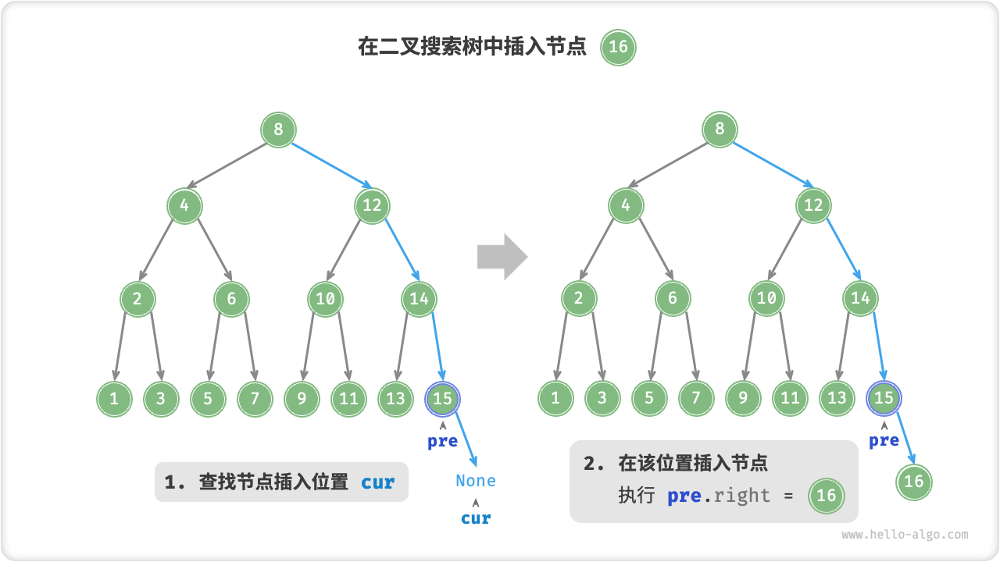
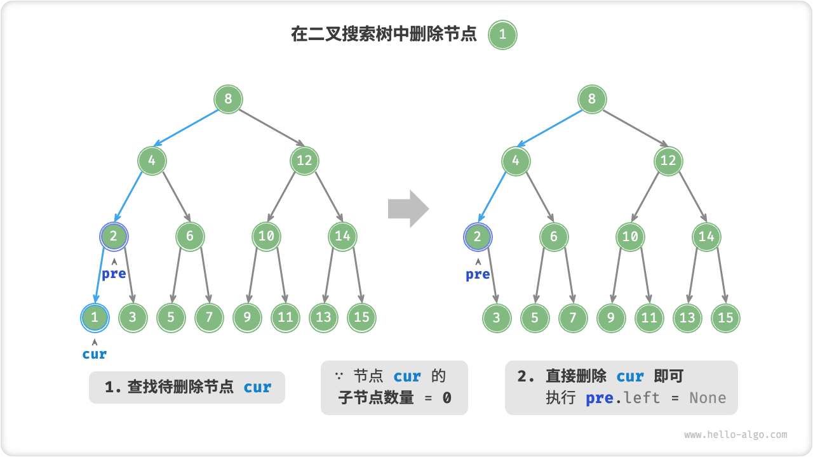
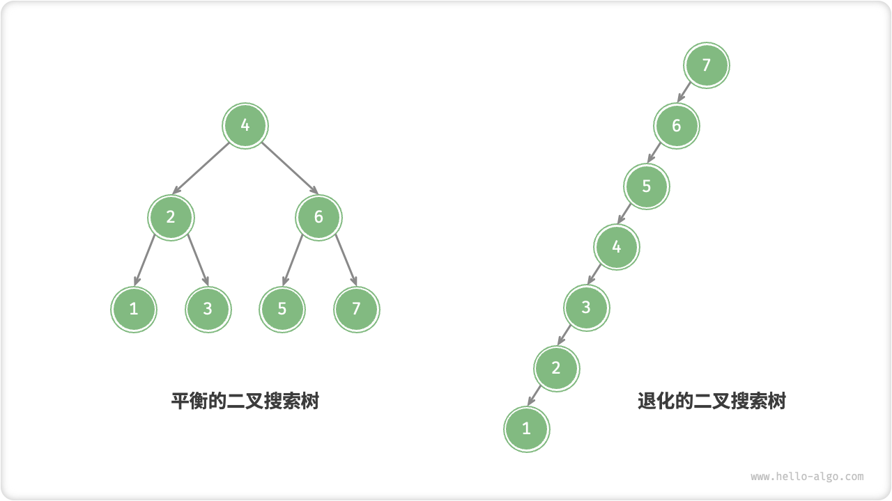

## 1、哈希表的原理

哈希表（Hash Table，也叫散列表），是根据关键码值 (Key-Value) 而直接进行访问的数据结构。也就是说，它通过把关键码值映射到表中一个位置来访问记录，以加快查找的速度。哈希表的实现主要需要解决两个问题，哈希函数和冲突解决。

### 哈希函数

```
H(keyi)=Loc(i)
```

记录存储位置与关键字之间存在的对应关系

### 冲突解决

现实中的哈希函数不是完美的，当两个不同的输入值对应一个输出值时，就会产生“冲突”，

**冲突**  不同的关键码映射到同一个散列地址，

```
key1!=key2, 但是H(key1)=H(key2)
```

在散列查找方法中，冲突是不可能避免的，只能进可能减少


常见的冲突解决方法有开放定址法，链地址法，建立公共溢出区等。实际的哈希表实现中，使用最多的是链地址法

#### 链地址法

链地址法的基本思想是，为每个 Hash 值建立一个单链表，当发生冲突时，将记录插入到链表中。


## 2、如何判断一个哈希表的优劣

判断一个哈希表的优劣可以从以下几个方面考虑：

1. 冲突率：冲突率是指哈希表中发生冲突的键值对数量与总键值对数量的比例。冲突率越低，说明哈希表的性能越好。可以通过计算实际冲突数与总插入数的比例来评估冲突率。低冲突率可以减少查找时间，提高哈希表的效率。

2. 负载因子：负载因子是指哈希表中实际存储的键值对数量与哈希表大小的比例。负载因子越低，哈希表的性能越好。当负载因子过高时，冲突的概率会增加，导致查找、插入和删除的效率下降。一般来说，负载因子的合理范围是0.7到0.8之间。

3. 哈希函数的性能：哈希函数的设计对哈希表的性能有很大影响。一个好的哈希函数应该能够将键均匀地映射到哈希表的不同位置，减少冲突的概率。同时，哈希函数的计算速度应该快，以提高哈希表的操作效率。

4. 冲突解决方法：不同的冲突解决方法对哈希表的性能有影响。常见的冲突解决方法包括链地址法、开放地址法、再哈希法等。选择合适的冲突解决方法取决于具体的应用场景和需求。

5. 存储空间利用率：好的哈希表应该能够充分利用存储空间。过大的存储空间会浪费内存资源，而过小的存储空间会导致冲突率增加。因此，需要根据实际需求选择适当的哈希表大小。

6. 插入、查找和删除操作的效率：好的哈希表应该能够在常数时间内完成插入、查找和删除操作。这要求哈希函数的计算速度快，冲突率低，冲突解决方法高效。

综合考虑以上因素，可以评估一个哈希表的优劣。在实际应用中，根据具体的数据集和操作需求，选择合适的哈希函数、冲突解决方法和哈希表大小，进行性能测试和比较，以确定最佳的哈希表实现。


## 3、哈希表的时间复杂度为什么是O（1）？

哈希表的时间复杂度为O(1)是因为它使用了一种叫做哈希函数的方法来直接计算出数据应该存储在哪个位置，而不需要逐个检查每个位置。这就像是你有一个巨大的文件柜，每个抽屉都有一个唯一的编号，你可以直接通过编号找到你需要的文件，而不需要从第一个抽屉开始逐个查找。

当你插入、删除或查找一个元素时，哈希表首先使用哈希函数计算出元素的哈希值，然后使用这个哈希值作为索引直接访问到数组中的相应位置。因此，这些操作的时间复杂度都是O(1)。


## 5、平衡二叉树结构是怎么样的？

平衡二叉树是在二叉搜索树的基础上，平衡二叉树还需要满足如下条件:

- 左右两个子树的高度差（平衡因子）的绝对值不超过1
- 左右两个子树都是一棵平衡二叉树


分析：

- 图一是一个平衡二叉树，它满足平衡二叉树的定义。
- 图二不是平衡二叉树，其原因并不是不满足平衡因子的条件，而是因为它不满足二叉搜索树的构成条件，这提醒我们平衡二叉树首先要是一棵二叉搜索树。
- 图三满足平衡二叉树的构成条件。
- 图 4 中的节点 (8) 平衡因子为 3，不满足平衡二叉树的要求。


## 8、堆是什么？

堆是一颗**完全二叉树**，这样实现的堆也被称为**二叉堆**。堆中节点的值都大于等于（或小于等于）其子节点的值，堆中如果节点的值都大于等于其子节点的值，我们把它称为**大顶堆**，如果都小于等于其子节点的值，我们将其称为**小顶堆**。

下图中，1，2 是大顶堆，3 是小顶堆， 4 不是堆（不是完全二叉树）


## 10、栈和队列，举个使用场景例子


- 栈是一种后进先出（LIFO）的数据结构，**函数的调用和返回往往使用栈来管理函数调用的顺序**。
- 队列是一种先进先出（FIFO）的数据结构，类似于排队等待的队伍，先到的人会先被服务。队列常用于需要先进先出的场景，例如：**在网络通信或磁盘读写等场景中，使用队列来管理数据的接收和发送顺序，以平衡生产者和消费者之间的速度差异**。


## 12、二叉排序树和二分查找应用场景及原理，哪个更快

### 二分查找

「二分查找 binary search」是一种基于分治策略的高效搜索算法。它利用数据的**有序性**，每轮减少一半搜索范围，直至找到目标元素或搜索区间为空为止。

```cpp
/* 二分查找（双闭区间） */
int binarySearch(vector<int> &nums, int target) {
    // 初始化双闭区间 [0, n-1] ，即 i, j 分别指向数组首元素、尾元素
    int i = 0, j = nums.size() - 1;
    // 循环，当搜索区间为空时跳出（当 i > j 时为空）
    while (i <= j) {
        int m = i + (j - i) / 2; // 计算中点索引 m
        if (nums[m] < target)    // 此情况说明 target 在区间 [m+1, j] 中
            i = m + 1;
        else if (nums[m] > target) // 此情况说明 target 在区间 [i, m-1] 中
            j = m - 1;
        else // 找到目标元素，返回其索引
            return m;
    }
    // 未找到目标元素，返回 -1
    return -1;
}

```

**时间复杂度 $O(\log n)$** ：在二分循环中，区间每轮缩小一半，循环次数为 $\log_2 n$ 。

**空间复杂度 $O(1)$** ：指针 $i$ 和 $j$ 使用常数大小空间。


#### 适用于

- 仅适用于**有序数据、数组**


### 二叉搜索树

1. 对于根节点，左子树中所有节点的值 $<$ 根节点的值 $<$ 右子树中所有节点的值。
2. 任意节点的左、右子树也是二叉搜索树，即同样满足条件 `1.` 。


我们将二叉搜索树封装为一个类 `ArrayBinaryTree` ，并声明一个成员变量 `root` ，指向树的根节点。

#### 查找节点

给定目标节点值 `num` ，可以根据二叉搜索树的性质来查找。如图 7-17 所示，我们声明一个节点 `cur` ，从二叉树的根节点 `root` 出发，循环比较节点值 `cur.val` 和 `num` 之间的大小关系。

- 若 `cur.val < num` ，说明目标节点在 `cur` 的右子树中，因此执行 `cur = cur.right` 。
- 若 `cur.val > num` ，说明目标节点在 `cur` 的左子树中，因此执行 `cur = cur.left` 。
- 若 `cur.val = num` ，说明找到目标节点，跳出循环并返回该节点。

**二叉搜索树的查找操作与二分查找算法的工作原理一致，都是每轮排除一半情况。循环次数最多为二叉树的高度，当二叉树平衡时，使用 $O(\log n)$ 时间**。

```cpp
/* 查找节点 */
TreeNode *search(int num) {
    TreeNode *cur = root;
    // 循环查找，越过叶节点后跳出
    while (cur != nullptr) {
        // 目标节点在 cur 的右子树中
        if (cur->val < num)
            cur = cur->right;
        // 目标节点在 cur 的左子树中
        else if (cur->val > num)
            cur = cur->left;
        // 找到目标节点，跳出循环
        else
            break;
    }
    // 返回目标节点
    return cur;
}

```

#### 插入节点

给定一个待插入元素 `num` ，为了保持二叉搜索树“左子树 < 根节点 < 右子树”的性质，插入操作流程如下图所示。

1. **查找插入位置**：与查找操作相似，从根节点出发，根据当前节点值和 `num` 的大小关系循环向下搜索，直到越过叶节点（遍历至 $\text{None}$ ）时跳出循环。
2. **在该位置插入节点**：初始化节点 `num` ，将该节点置于 $\text{None}$ 的位置。



在代码实现中，需要注意以下两点。

- 二叉搜索树不允许存在重复节点，否则将违反其定义。因此，若待插入节点在树中已存在，则不执行插入，直接返回。
- 为了实现插入节点，我们需要借助节点 `pre` 保存上一轮循环的节点。这样在遍历至 $\text{None}$ 时，我们可以获取到其父节点，从而完成节点插入操作。

```cpp
/* 插入节点 */
void insert(int num) {
    // 若树为空，则初始化根节点
    if (root == nullptr) {
        root = new TreeNode(num);
        return;
    }
    TreeNode *cur = root, *pre = nullptr;
    // 循环查找，越过叶节点后跳出
    while (cur != nullptr) {
        // 找到重复节点，直接返回
        if (cur->val == num)
            return;
        pre = cur;
        // 插入位置在 cur 的右子树中
        if (cur->val < num)
            cur = cur->right;
        // 插入位置在 cur 的左子树中
        else
            cur = cur->left;
    }
    // 插入节点
    TreeNode *node = new TreeNode(num);
    if (pre->val < num)
        pre->right = node;
    else
        pre->left = node;
}

```

与查找节点相同，插入节点使用 $O(\log n)$ 时间。


#### 删除节点

先在二叉树中查找到目标节点，再将其从二叉树中删除。

与插入节点类似，我们需要保证在删除操作完成后，二叉搜索树的“左子树 < 根节点 < 右子树”的性质仍然满足。

因此，我们需要根据目标节点的子节点数量，共分为 0、1 和 2 这三种情况，执行对应的删除节点操作。

如下图所示，当待删除节点的度为 $0$ 时，表示该节点是叶节点，可以直接删除。



如下图所示，当待删除节点的度为 $1$ 时，将待删除节点替换为其子节点即可。


当待删除节点的度为 $2$ 时，我们无法直接删除它，而需要使用一个节点替换该节点。由于要保持二叉搜索树“左 $<$ 根 $<$ 右”的性质，**因此这个节点可以是右子树的最小节点或左子树的最大节点**。

假设我们选择右子树的最小节点（即中序遍历的下一个节点），则删除操作流程如下图所示。

1. 找到待删除节点在“中序遍历序列”中的下一个节点，记为 `tmp` 。
2. 将 `tmp` 的值覆盖待删除节点的值，并在树中递归删除节点 `tmp` 。

删除节点操作同样使用 $O(\log n)$ 时间，其中查找待删除节点需要 $O(\log n)$ 时间，获取中序遍历后继节点需要 $O(\log n)$ 时间。

```cpp
/* 删除节点 */
void remove(int num) {
    // 若树为空，直接提前返回
    if (root == nullptr)
        return;
    TreeNode *cur = root, *pre = nullptr;
    // 循环查找，越过叶节点后跳出
    while (cur != nullptr) {
        // 找到待删除节点，跳出循环
        if (cur->val == num)
            break;
        pre = cur;
        // 待删除节点在 cur 的右子树中
        if (cur->val < num)
            cur = cur->right;
        // 待删除节点在 cur 的左子树中
        else
            cur = cur->left;
    }
    // 若无待删除节点，则直接返回
    if (cur == nullptr)
        return;
    // 子节点数量 = 0 or 1
    if (cur->left == nullptr || cur->right == nullptr) {
        // 当子节点数量 = 0 / 1 时， child = nullptr / 该子节点
        TreeNode *child = cur->left != nullptr ? cur->left : cur->right;
        // 删除节点 cur
        if (cur != root) {
            if (pre->left == cur)
                pre->left = child;
            else
                pre->right = child;
        } else {
            // 若删除节点为根节点，则重新指定根节点
            root = child;
        }
        // 释放内存
        delete cur;
    }
    // 子节点数量 = 2
    else {
        // 获取中序遍历中 cur 的下一个节点
        TreeNode *tmp = cur->right;
        while (tmp->left != nullptr) {
            tmp = tmp->left;
        }
        int tmpVal = tmp->val;
        // 递归删除节点 tmp
        remove(tmp->val);
        // 用 tmp 覆盖 cur
        cur->val = tmpVal;
    }
}

```

#### 中序遍历有序

如下图所示，二叉树的中序遍历遵循“左 $\rightarrow$ 根 $\rightarrow$ 右”的遍历顺序，而二叉搜索树满足“左子节点 $<$ 根节点 $<$ 右子节点”的大小关系。

这意味着在二叉搜索树中进行中序遍历时，总是会优先遍历下一个最小节点，从而得出一个重要性质：**二叉搜索树的中序遍历序列是升序的**。

利用中序遍历升序的性质，我们在**二叉搜索树中获取有序数据仅需 $O(n)$ 时间**，无须进行额外的排序操作，非常高效。


#### 二叉搜索树的效率

给定一组数据，我们考虑使用数组或二叉搜索树存储。观察表 7-2 ，二叉搜索树的各项操作的时间复杂度都是对数阶，具有稳定且高效的性能表现。只有在高频添加、低频查找删除的数据适用场景下，数组比二叉搜索树的效率更高。

(无序数组插入时：1.空间足够：直接添加在后面，时间复杂度为O(1)  2.空间不足：整个数组移到另一个空间，再添加元素。总的时间复杂度：O(1)+O(n)=O(n))


在理想情况下，二叉搜索树是“平衡”的，这样就可以在 log⁡n 轮循环内查找任意节点。

然而，如果我们在二叉搜索树中不断地插入和删除节点，可能导致二叉树退化为图 7-23 所示的链表，这时各种操作的时间复杂度也会退化为 O(n) 。



#### 二叉搜索树常见应用

- 用作系统中的多级索引，实现高效的查找、插入、删除操作。
- 作为某些搜索算法的底层数据结构。
- 用于存储数据流，以保持其有序状态。


### 适用场景

- 如果你需要频繁地插入和删除元素，并且需要动态维护一个有序数据集合，BST 是更好的选择，因为它支持高效的插入和删除操作。但要注意，BST 的性能在最坏情况下可能会下降，需要额外的平衡机制来保持性能。
- 如果你只需要查找已排序数据集合中的元素，二分查找通常更快，因为它具有 O(log n) 的时间复杂度，而不受最坏情况的影响。但它不支持插入和删除操作，适用于静态数据集合。


