# MySQL

## 1、说一说你对数据库事务的了解 

事务可由一条非常简单的SQL语句组成，也可以由一组复杂的SQL语句组成。在事务中的操作，**要么都**
**执行修改，要么都不执行，这就是事务的目的**，也是事务模型区别于文件系统的重要特征之一。


## 1、事务四大特性（ACID）原子性、一致性、隔离性、持久性？

事务指的是满足 ACID 特性的一组操作，可以通过 Commit 提交一个事务，也可以使用 Rollback 进行回滚

### 第一种回答

**原子性**：一个事务（transaction）中的所有操作，要么全部完成，要么全部不完成，不会结束在中间某个环节。
。事务在执行过程中发生错误，会被恢复（Rollback）到事务开始前的状态，就像这个事务从来没有执行过一样。

**一致性**：在事务开始之前和事务结束以后，数据库的完整性没有被破坏。这表示写入的资料必须完全符合所有的预设规则，这包含资料的精确度、串联性以及后续数据库可以自发性地完成预定的工作。

**隔离性**：数据库允许多个并发事务同时对其数据进行读写和修改的能力，隔离性可以防止多个事务并发执行时由于交叉执行而导致数据的不一致。事务隔离分为不同级别，包括读未提交（Read uncommitted）、读提交（read committed）、可重复读（repeatable read）和串行化（Serializable）。

**持久性**：事务处理结束后，对数据的修改就是永久的，即便系统故障也不会丢失。

### **第二种回答**

原子性（Atomicity）

- **原子性是指事务包含的所有操作要么全部成功，要么全部失败回滚，要么全部不完成，不会结束在中间某个环节**。因此事务的操作如果成功就必须要完全应用到数据库，如果操作失败则不能对数据库有任何影响。

一致性（Consistency）

- **事务开始前和结束后，数据库的完整性约束没有被破坏**。比如A向B转账，不可能A扣了钱，B却没收到。

隔离性（Isolation）

- **隔离性是当多个用户并发访问数据库时，比如操作同一张表时，数据库为每一个用户开启的事务，不能被其他事务的操作所干扰，多个并发事务之间要相互隔离**。

同一时间，只允许一个事务请求同一数据，不同的事务之间彼此没有任何干扰。比如A正在从一张银行卡中取钱，在A取钱的过程结束前，B不能向这张卡转账。
关于事务的隔离性数据库提供了多种隔离级别，稍后会介绍到。  

 持久性（Durability）

- **持久性是指一个事务一旦被提交了，那么对数据库中的数据的改变就是永久性的，即便是在数据库系统遇到故障的情况下也不会丢失提交事务的操作**。

### 其他

- **原子性（Atomicity）**：一个事务中的所有操作，要么全部完成，要么全部不完成，不会结束在中间某个环节，而且事务在执行过程中发生错误，会被回滚到事务开始前的状态，就像这个事务从来没有执行过一样，就好比买一件商品，购买成功时，则给商家付了钱，商品到手；购买失败时，则商品在商家手中，消费者的钱也没花出去。
- **一致性（Consistency）**：是指事务操作前和操作后，数据满足完整性约束，数据库保持一致性状态。比如，用户 A 和用户 B 在银行分别有 800 元和 600 元，总共 1400 元，用户 A 给用户 B 转账 200 元，分为两个步骤，从 A 的账户扣除 200 元和对 B 的账户增加 200 元。一致性就是要求上述步骤操作后，最后的结果是用户 A 还有 600 元，用户 B 有 800 元，总共 1400 元，而不会出现用户 A 扣除了 200 元，但用户 B 未增加的情况（该情况，用户 A 和 B 均为 600 元，总共 1200 元）。
- **隔离性（Isolation）**：数据库允许多个并发事务同时对其数据进行读写和修改的能力，隔离性可以防止多个事务并发执行时由于交叉执行而导致数据的不一致，因为多个事务同时使用相同的数据时，不会相互干扰，每个事务都有一个完整的数据空间，对其他并发事务是隔离的。也就是说，消费者购买商品这个事务，是不影响其他消费者购买的。
- **持久性（Durability）**：事务处理结束后，对数据的修改就是永久的，即便系统故障也不会丢失。


## 2、并发事务会引发哪些问题？如何解决

- [并发一致性问题](#3、数据库并发事务会带来哪些问题？/脏读、幻读、丢弃更改、不可重复读的区别？)：会产生脏读（读到还没有提交的数据）、不可重复读（两次读取数据不一致）、幻影读、丢失修改
- 解决：[隔离级别](#2、事务的数据库隔离级别有哪些？)


## 2、事务的数据库隔离级别有哪些？

### **未提交读**

**事务中发生了修改，即使没有提交，其他事务也是可见的**，比如对于一个数A原来50修改为100，但是我还没有提交修改，另一个事务看到这个修改，而这个时候原事务发生了回滚，这时候A还是50，但是另一个事务看到的A是100.**可能会导致脏读、幻读或不可重复读**

### **提交读**

**对于一个事务从开始直到提交之前，所做的任何修改是其他事务不可见的**，举例就是对于一个数A原来是50，然后提交修改成100，这个时候另一个事务在A提交修改之前，读取的A是50，刚读取完，A就被修改成100，这个时候另一个事务再进行读取发现A就突然变成100了；**可以阻止脏读，但是幻读或不可重复读仍有可能发生**

### **重复读**

**就是对一个记录读取多次的记录是相同的**，比如对于一个数A读取的话一直是A，前后两次读取的A是一致的；**可以阻止脏读和不可重复读，但幻读仍有可能发生**

- **可串行化读**，在并发情况下，和串行化的读取的结果是一致的，没有什么不同，比如不会发生脏读和幻读；**该级别可以防止脏读、不可重复读以及幻读** （强制事务串行执行，这样多个事务互不干扰，**不会出现并发一致性问题**。该隔离级别需要加锁实现，因为**要使用加锁机制保证同一时间只有一个事务执行**，也就是保证事务串行执行。）

| 隔离级别                  | 脏读 | 不可重复读 | 幻影读 |
| ------------------------- | ---- | ---------- | ------ |
| READ-UNCOMMITTED 未提交读 | √    | √          | √      |
| READ-COMMITTED 提交读     | ×    | √          | √      |
| REPEATABLE-READ 重复读    | ×    | ×          | √      |
| SERIALIZABLE 可串行化读   | ×    | ×          | ×      |

> 这四大等级从上到下，隔离的效果是逐渐增强，但是性能却是越来越差。

MySQL InnoDB 存储引擎的默认支持的隔离级别是 **REPEATABLE-READ**（可重读）

**这里需要注意的是**：与 SQL 标准不同的地方在于InnoDB 存储引擎在 REPEATABLE-READ（可重读）事务隔离级别 下使用的是**Next-Key Lock 锁**算法，因此可以避免幻读的产生，这与其他数据库系统(如 SQL Server)是不同的。**所以 说InnoDB 存储引擎的默认支持的隔离级别是 REPEATABLE-READ（可重读） 已经可以完全保证事务的隔离性要求，即达到了 SQL标准的SERIALIZABLE(可串行化)隔离级别**。

因为隔**离级别越低，事务请求的锁越少**，所以大部分数据库系统的隔离级别都是READ-COMMITTED(读取提交内 容):，但是你要知道的是InnoDB 存储引擎默认使用 **REPEATABLE-READ（可重读）并不会有任何性能损失**。

InnoDB 存储引擎在**分布式**事务 的情况下一**般会用到SERIALIZABLE(可串行化)隔离级别**。


## 2、MySQL的事务隔离级别是怎么实现的？ 

这四种隔离级别的实现机制如下：
1. READ UNCOMMITTED & READ COMMITTED：
**通过Record Lock算法实现了行锁**，但READ UNCOMMITTED允许读取未提交数据，所以存在脏读
问题。而READ COMMITTED允许读取提交数据，所以不存在脏读问题，但存在不可重复读问题。
2. REPEATABLE READ：
**使用Next-Key Lock算法实现了行锁，并且不允许读取已提交的数据，所以解决了不可重复读的问**
**题**。另外，**该算法包含了间隙锁，会锁定一个范围，因此也解决了幻读的问题**。
3. SERIALIZABLE：
**对每个SELECT语句后自动加上LOCK IN SHARE MODE，即为每个读取操作加一个共享锁。因此在**
**这个事务隔离级别下，读占用了锁，对一致性的非锁定读不再予以支持**。


## 3、数据库并发事务会带来哪些问题？/脏读、不可重复读、幻读、丢弃更改的区别？

这里有一个关键字，**并发一致性**

数据库并发会带来脏读、幻读、丢弃更改、不可重复读这四个常见问题，其中：

**脏读**：**当前事务(A)中可以读到其他事务(B)未提交的数据（脏数据），这种现象是脏读**
在第一个修改事务和读取事务进行的时候，读取事务读到的数据为100，这是修改之后的数据，但是之后该事务满足一致性等特性而做了回滚操作，那么读取事务得到的结果就是脏数据了。（读脏数据就是读取本来要回滚的数据）

**不可重复读**：**在事务A中先后两次读取同一个数据，两次读取的结果不一样，这种现象称为不可重复读。脏读与不可重复读的区别在于：前者读到的是其他事务未提交的数据，后者读到的是其他事务已提交的数据**
T2 读取一个数据，然后T1 对该数据做了修改。如果 T2 再次读取这个数据，此时读取的结果和第一次读取的结果不同。（不可重复读就是由于第二次读取别的事务写之后的数据，而导致两次读取到不同数据）

**幻读**：**在事务A中按照某个条件先后两次查询数据库，两次查询结果的条数不同，这种现象称为幻读。不可重复读与幻读的区别可以通俗的理解为：前者是数据变了，后者是数据的行数变了。**
一般是T1在某个范围内进行修改操作（增加或者删除），而T2读取该范围导致读到的数据是修改之间的了，强调范围。（幻读的本质就是不可重复读）

**丢弃修改**：两个写事务T1 T2同时对A=0进行递增操作，结果T2覆盖T1，导致最终结果是1 而不是2，事务被覆盖（丢失修改就是写覆盖）


### **脏读**

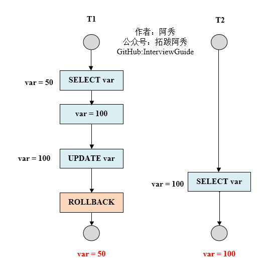

第一个事务首先读取var变量为50，接着准备更新为100的时，并未提交，第二个事务已经读取var为100，此时第一个事务做了回滚。最终第二个事务读取的var和数据库的var不一样。

### **不可重复读**

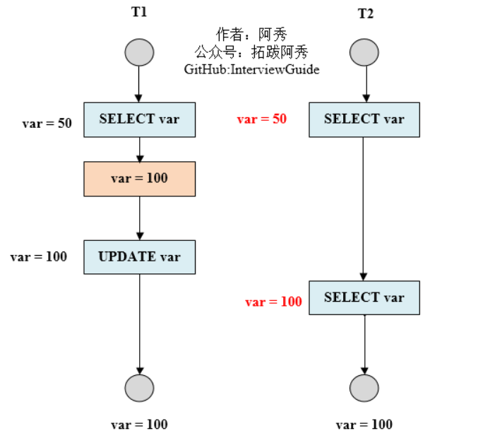

T2 读取一个数据，T1 对该数据做了修改。如果 T2 再次读取这个数据，此时读取的结果和第一次读取的结果不同。

### **幻读（幻影读）**

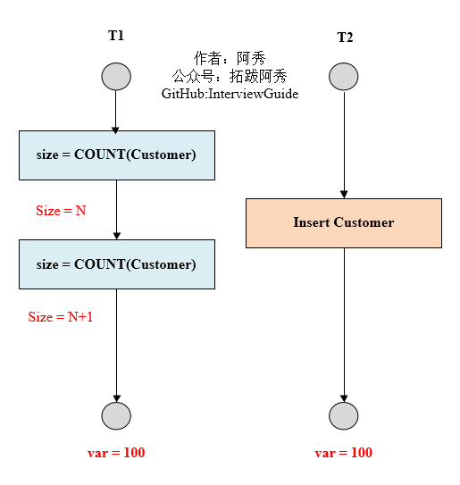

T1 读取某个范围的数据，T2 在这个范围内插入新的数据，T1 再次读取这个范围的数据，此时读取的结果和和第一次读取的结果不同。

### **丢弃修改**

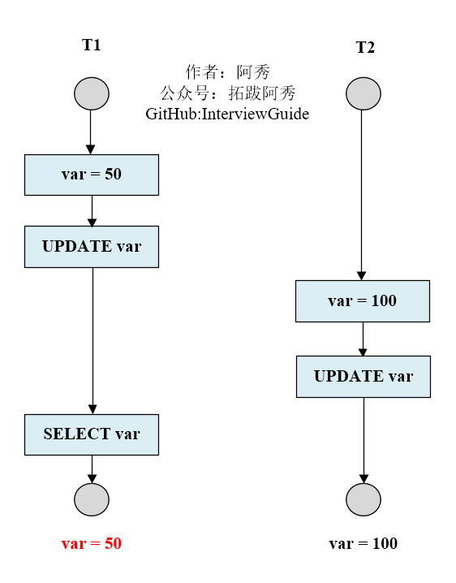

T1 和 T2 两个事务都对一个数据进行修改，T1 先修改，T2 随后修改，T2 的修改覆盖了 T1 的修改。例如：事务1读取某表中的数据A=50，事务2也读取A=50，事务1修改A=A+50，事务2也修改A=A+50，最终结果A=100，事务1的修改被丢失。


## 4、数据库引擎InnoDB与MyISAM的区别

**MySQL提供了多个不同的存储引擎**，包括处理事务安全表的引擎和处理非事务安全表的引擎。在
MySQL中，**不需要在整个服务器中使用同一种存储引擎，针对具体的要求，可以对每一个表使用不同的**
**存储引擎**。MySQL 8.0支持的存储引擎有InnoDB、MyISAM、Memory、Merge、Archive、
Federated、CSV、BLACKHOLE等。其中，最常用的引擎是InnoDB和MyISAM。

### **InnoDB**

- **是 MySQL 默认的事务型存储引擎，只有在需要它不支持的特性时，才考虑使用其它存储引擎**。
- 实现了四个标准的隔离级别，默认级别是可重复读(REPEATABLE READ)。在可重复读隔离级别下，通过多版本并发控制(MVCC)+ 间隙锁(Next-Key Locking)防止幻影读。
- **主索引是聚簇索引，在索引中保存了数据，从而避免直接读取磁盘，因此对查询性能有很大的提升**。
- 内部做了很多优化，包括从磁盘读取数据时采用的可预测性读、能够加快读操作并且自动创建的自适应哈希索引、能够加速插入操作的插入缓冲区等。
- 支持真正的在线热备份。其它存储引擎不支持在线热备份，要获取一致性视图需要停止对所有表的写入，而在读写混合场景中，停止写入可能也意味着停止读取。

### **MyISAM**

- **设计简单，数据以紧密格式存储。对于只读数据，或者表比较小、可以容忍修复操作，则依然可以使用它**。
- 提供了大量的特性，包括压缩表、空间数据索引等。
- **不支持事务**。
- **不支持行级锁，只能对整张表加锁**，**读取时会对需要读到的所有表加共享锁，写入时则对表加排它锁。但在表有读取操作的同时，也可以往表中插入新的记录，这被称为并发插入(CONCURRENT INSERT)**。

### **总结**

- 事务: InnoDB 是事务型的，可以使用 `Commit` 和 `Rollback` 语句。
- 并发: MyISAM 只支持表级锁，而 InnoDB 还支持行级锁。
- 外键: InnoDB 支持外键。
- 备份: InnoDB 支持在线热备份。
- 崩溃恢复: MyISAM 崩溃后发生损坏的概率比 InnoDB 高很多，而且恢复的速度也更慢。
- 其它特性: MyISAM 支持压缩表和空间数据索引。


### 4、MySQL为什么InnoDB是默认引擎？

InnoDB引擎在事务支持、并发性能、崩溃恢复等方面具有优势，因此被MySQL选择为默认的存储引擎。

- **事务支持**：InnoDB引擎提供了对事务的支持，可以进行ACID（原子性、一致性、隔离性、持久性）属性的操作。Myisam存储引擎是不支持事务的。
- **并发性能**：InnoDB引擎采用了行级锁定的机制，可以提供更好的并发性能，Myisam存储引擎只支持表锁，锁的粒度比较大。
- **崩溃恢复**：InnoDB引引擎通过 **redolog 日志实现了崩溃恢复**，可以在数据库发生异常情况（如断电）时，通过**日志文件进行恢复，保证数据的持久性和一致性**。Myisam是不支持崩溃恢复的。


## 5、为什么MySQL索引要使用B+树，而不是B树或者红黑树？

我们在MySQL中的数据一般是放在磁盘中的，读取数据的时候肯定会有访问磁盘的操作，磁盘中有两个机械运动的部分，分别是盘片旋转和磁臂移动。

盘片旋转就是我们市面上所提到的多少转每分钟，而磁盘移动则是在盘片旋转到指定位置以后，移动磁臂后开始进行数据的读写。

那么这就存在一个定位到磁盘中的块的过程，而定位是磁盘的存取中花费时间比较大的一块，毕竟机械运动花费的时候要远远大于电子运动的时间。

当大规模数据存储到磁盘中的时候，显然定位是一个非常花费时间的过程，但是我们可以通过B树进行优化，提高磁盘读取时定位的效率。

### 为什么B类树可以进行优化呢？

我们可以根据B类树的特点，构造一个多阶的B类树，然后在**尽量多的在结点上存储相关的信息**，**保证层数（树的高度）尽量的少**，以便后面我们可以**更快的找到**信息，**磁盘的I/O操作也少一些**，而且**B类树是平衡树，每个结点到叶子结点的高度都是相同，这也保证了每个查询是稳定的**。

特别地：**只有B-树和B+树，这里的B-树是叫B树，不是B减树，没有B减树的说法。**


### 第二种

**AVL树**（平衡二叉树、Adelson-Velsky and Landis Tree），**适合用于插入删除次数比较少，但查找多的情况**。所以**对于搜索、插入、删除操作多的情况下，我们就用红黑树**。

稳定、更快（树的高度小）

- **B+树的磁盘读写代价更低**：B树的每个节点都存储了key和data，而B+树的data存储在叶子节点上。B+树非叶子节点仅存储key不存储data，这样一个节点就可以存储更多的key。可以使得B+树相对B树来说更矮（IO次数就是树的高度），所以与磁盘交换的IO操作次数更少。
- **B+树的查询效率更加稳定**：由于非终结点并不是最终指向文件内容的结点，而只是叶子结点中关键字的索引。所以任何关键字的查找必须走一条从根结点到叶子结点的路。所有关键字查询的路径长度相同，导致每一个数据的查询效率相当。

> 参考：<https://blog.csdn.net/qq_37102984/article/details/119646611>


### 小林解析

二分查找树虽然是一个天然的二分结构，能很好的利用二分查找快速定位数据，但是它存在一种极端的情况，每当插入的元素都是树内最大的元素，就会导致二分查找树退化成一个链表，此时查询复杂度就会从 O(logn)降低为 O(n)。

为了解决二分查找树退化成链表的问题，就出现了自平衡二叉树，保证了查询操作的时间复杂度就会一直维持在 O(logn) 。但是它本质上还是一个二叉树，每个节点只能有 2 个子节点，随着元素的增多，树的高度会越来越高。

而树的高度决定于磁盘 I/O 操作的次数，因为树是存储在磁盘中的，访问每个节点，都对应一次磁盘 I/O 操作，也就是说树的高度就等于每次查询数据时磁盘 IO 操作的次数，所以树的高度越高，就会影响查询性能。


B 树和 B+ 都是通过多叉树的方式，会将树的高度变矮，所以这两个数据结构非常适合检索存于磁盘中的数据。

但是 MySQL 默认的存储引擎 InnoDB 采用的是 B+ 作为索引的数据结构。原因有：

- **B+ 树的非叶子节点不存放实际的记录数据，仅存放索引**，因此数据量相同的情况下，相比存储即存索引又存记录的 B 树，**B+树的非叶子节点可以存放更多的索引**，因此 B+ 树可以**比 B 树更「矮胖」，查询底层节点的磁盘 I/O次数会更少**。
- **B+ 树有大量的冗余节点（所有非叶子节点都是冗余索引）** ，这些**冗余索引让 B+ 树在插入、删除的效率都更高，比如删除根节点的时候，不会像 B 树那样会发生复杂的树的变化**；
- **B+ 树叶子节点之间用链表连接了起来，有利于范围查询**，而 B 树要实现范围查询，因此**只能通过树的遍历**来完成范围查询，这会涉及**多个节点的磁盘 I/O 操作，范围查询效率不如 B+ 树**。


## 5、B+树的叶子节点链表是单向还是双向？

双向的，为了实现倒序遍历或者排序。

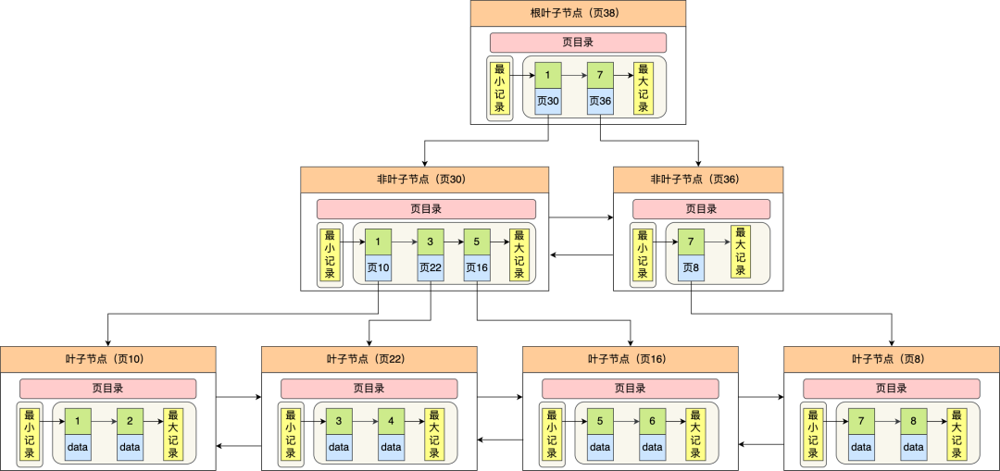

Innodb 使用的 B+ 树有一些特别的点，比如：

- B+ 树的叶子节点之间是用「双向链表」进行连接，这样的好处是既能向右遍历，也能向左遍历。
- B+ 树点节点内容是数据页，数据页里存放了用户的记录以及各种信息，每个数据页默认大小是 16 KB。

Innodb 根据索引类型不同，分为聚集和二级索引。他们区别在于，**聚集索引的叶子节点存放的是实际数据，所有完整的用户记录都存放在聚集索引的叶子节点，而二级索引的叶子节点存放的是主键值，而不是实际数据**。

因为**表的数据都是存放在聚集索引的叶子节点里**，所以 **InnoDB 存储引擎一定会为表创建一个聚集索引**，且由于数据在**物理上只会保存一份，所以聚簇索引只能有一个，而二级索引可以创建多个**。


## 6、MySQL中有哪些索引？有什么特点？

- **普通索引**：仅加速查询
- **唯一索引**：加速查询 + 列值唯一（可以有null）
- **主键索引**：加速查询 + 列值唯一（不可以有null）+ 表中只有一个
- **组合索引**：多列值组成一个索引，专门用于组合搜索，其效率大于索引合并
- **全文索引**：对文本的内容进行分词，进行搜索
- **索引合并**：使用多个单列索引组合搜索
- **覆盖索引**：select的数据列只用从索引中就能够取得，不必读取数据行，换句话说查询列要被所建的索引覆盖
- **聚簇索引**：表数据是和主键一起存储的，主键索引的叶结点存储行数据(包含了主键值)，二级索引的叶结点存储行的主键值。使用的是B+树作为索引的存储结构，非叶子节点都是索引关键字，但非叶子节点中的关键字中不存储对应记录的具体内容或内容地址。叶子节点上的数据是主键与具体记录(数据内容)


## 7、数据库有哪些常见索引？数据库设计的范式是什么？

- 密集索引和稀疏索引：MyISAM全是稀疏索引，InnoDB有且只有一个密集索引
- 聚集索引和非聚集索引
  - 聚集索引：数据行的物理顺序与列值（一般是主键的那一列）的逻辑顺序相同，一个表中只能拥有一个聚集索引。**索引的叶子节点就是对应的数据节点**
  - 非聚集索引：该索引中索引的逻辑顺序与磁盘上行的物理存储顺序不同，一个表中可以拥有多个非聚集索引。[涉及到二次查询](https://www.cnblogs.com/s-b-b/p/8334593.html)：**非聚集索引叶节点仍然是索引节点，只是有一个指针指向对应的数据块，如果使用非聚集索引查询，而查询列中包含了其他该索引没有覆盖的列，那么他还要进行第二次的查询，查询节点上对应的数据行的数据**

 

## 7、MySQL的行级锁有哪些？

主要有三种，记录锁、间隙锁、临建锁。

- 记录锁：**锁住的是一条记录，记录锁分为排他锁和共享锁**。
- 间隙锁：**只存在于可重复读隔离级别，目的是为了解决可重复读隔离级别下幻读的现象**。
- 临键锁：是 **Record Lock + Gap Lock 的组合，锁定一个范围，并且锁定记录本身**。**next-key lock 即能保护该记录，又能阻止其他事务将新纪录插入到被保护记录前面的间隙中**。


## 8、MySQL常见的存储引擎InnoDB、MyISAM的适用场景分别是？

区别

1）事务：MyISAM不支持，InnoDB支持
2）锁级别： MyISAM 表级锁，InnoDB 行级锁及外键约束
3）MyISAM存储表的总行数；InnoDB不存储总行数；
4）MyISAM采用非聚集索引，B+树叶子存储指向数据文件的指针。InnoDB主键索引采用聚集索引，B+树叶子存储数据

### **适用场景**

MyISAM适合： 插入不频繁，查询非常频繁，如果执行大量的SELECT，MyISAM是更好的选择， 没有事务。
InnoDB适合： 可靠性要求比较高，或者要求事务； 表更新和查询都相当的频繁， 大量的INSERT或UPDATE


## 9、读可重复读和读提交有什么区别

对于可重复读来说，就是在 a 进入这个事务以后，那个他的这个数据在他的视图来说就是已经是固定了，如果说在 a 这个事务提交之前 B 的这个事务修改了那个数据，在 A 是看不到的
于读提交的情况来说，就是说还是 a b 两个事务，b 事务修改一个数据然后并且提交以后，但 a 还没有提交，然后 a 这个时候去读那个数据，就会读到 b 已经修改的数据。

### 补充

读提交，指一个事务提交之后，它做的变更才能被其他事务看到。
可重复读，指一个事务执行过程中看到的数据，一直跟这个事务启动时看到的数据是一致的，MySQL InnoDB 引擎的默认隔离级别。

对于「读提交」和「可重复读」隔离级别的事务来说，它们是通过 MVCC 来实现的，它们的区别在于创建 Read View 的时机不同，大家可以把 Read View 理解成一个数据快照，就像相机拍照那样，定格某一时刻的风景。
**「读提交」隔离级别是在「每个语句执行前」都会重新生成一个 Read View，而「可重复读」隔离级别是「启动事务时」生成一个 Read View，然后整个事务期间都在用这个 Read View**。


## 10、说一下你理解的分库分表？


当数据量过大造成事务执行缓慢时，就要考虑分表，因为减少每次查询数据总量是解决数据查询缓慢的主要原因。你可能会问：“查询可以通过主从分离或缓存来解决，为什么还要分表？”但这里的查询是指事务中的查询和更新操作。

为了应对高并发，一个数据库实例撑不住，即单库的性能无法满足高并发的要求，就把并发请求分散到多个实例中去，这种就是分库。

总的来说，分库分表使用的场景不一样： 分表是因为数据量比较大，导致事务执行缓慢；分库是因为单库的性能无法满足要求。


## 11、谈一下你理解的binlog？

binlog是二进制日志文件。他主要用来做主从同步。他有statement格式和row格式。

statement记录了执行的SQL语句，Row 格式保存哪条记录被修改。

binlog事务提交的时候才写入的。也可以用来做归档。

### 补充

binlog日志是**MySQL数据库的一种日志记录机制**，用于**记录数据库的修改操作（如插入、更新、删除等），以便在需要时进行数据恢复、数据复制和数据同步等操作**。

binlog日志的实现以下功能：

- 数据恢复：binlog日志可以用于**回滚**到之前的某个时间点，从而恢复数据。
- 数据复制：binlog日志可以用于在**主从数据库之间复制**数据，从而实现**数据的高可用和负载均衡**等功能。
  MySQL的binlog日志有三种格式，分别是Statement格式、Row格式和Mixed格式。它们之间的区别如下：
- STATEMENT：**每一条修改数据的 SQL 都会被记录到 binlog 中**（相当于记录了逻辑操作，所以针对这种格式， binlog 可以称为**逻辑**日志），**主从复制中 slave 端再根据 SQL 语句重现**。但 STATEMENT 有动态函数的问题，比如你用了 uuid 或者 now 这些函数，你在主库上执行的结果并不是你在从库执行的结果，这种随时在变的函数会导致复制的数据不一致；
- ROW：**记录行数据最终被修改成什么样了**（这种格式的日志，就不能称为逻辑日志了），不会出现 STATEMENT 下动态函数的问题。**但 ROW 的缺点是每行数据的变化结果都会被记录**，比如执行批量 update 语句，更新多少行数据就会产生多少条记录，使 binlog 文件过大，而在 STATEMENT 格式下只会记录一个 update 语句而已；
- MIXED：包含了 STATEMENT 和 ROW 模式，它会根据不同的情况自动使用 ROW 模式和 STATEMENT 模式；


## 12、说一下你理解的外键约束？

举例来说，某**一个字段是表b的主键，但是它也是表a中的字段，表a中该字段的使用范围取决于表b**。外键约束主要是用来维护两个表的一致性。

### 补充

**外键约束的作用是维护表与表之间的关系，确保数据的完整性和一致性**。让我们举一个简单的例子：

假设你有两个表，一个是学生表，另一个是课程表，这两个表之间有一个关系，即一个学生可以选修多门课程，而一门课程也可以被多个学生选修。在这种情况下，我们可以在学生表中定义一个指向课程表的外键，如下所示：

```sql
CREATE TABLE students (
  id INT PRIMARY KEY,
  name VARCHAR(50),
  course_id INT,
  FOREIGN KEY (course_id) REFERENCES courses(id)
);
```

这里，students表中的course_id字段是一个外键，它指向courses表中的id字段。这个外键约束确保了每个学生所选的课程在courses表中都存在，从而维护了数据的完整性和一致性。

如果没有定义外键约束，那么**就有可能出现学生选了不存在的课程或者删除了一个课程而忘记从学生表中删除选修该课程的学生的情况**，这会破坏数据的完整性和一致性。因此，使用外键约束可以帮助我们避免这些问题。


## 13、char和varchar的区别？

char是固定长度的字符串类型，varchar是可变长度的字符串类型。

拿char(128)和varchar(128)举例来说。char(128)是无论字符串大小，都会在磁盘上分配128个字符的内存空间。而varchar(128)会根据字符本身的长短来分配内存空间。

### 补充

在MySQL中，CHAR和VARCHAR都是用于存储字符类型数据的数据类型，它们的区别在于存储方式和使用场景。

CHAR类型用于存储固定长度的字符串，其**长度在定义表时就已经固定，且最大长度为255个字符**。当存储的字符串长度小于定义的长度时，MySQL会在其后面补充空格使其长度达到定义的长度。由于存储的长度是固定的，因此**CHAR类型的读取速度比VARCHAR类型更快**。

VARCHAR类型则用于**存储可变长度的字符串，其长度可以在存储数据时动态地改变**，但最大长度也为255个字符。当**存储的字符串长度小于定义的长度时，MySQL不会在其后面补充空格**。由于存储的长度是可变的，因此VARCHAR类型的存储空间相对更小，但读取速度比CHAR类型稍微慢一些。

### 那与varchar相比，char字段是不是一无是处呢？

大部分情况，是的，最好使用varchar。不过考虑一个极端的场景：某个字段的最大长度是100字节，但是会频繁修改。如果使用char(100)，则插入记录后就分配了100个字节，后续修改**不会造成页分裂、页空隙等问题**，而varchar(100)由于**没有提前分配存储空间，后续修改时可能出现页分裂，进而导致性能下降**。


## 14、数据库delete和trancate区别

delete和truncate都是用来删除数据或表的命令，但是它们之间有一些区别。

- delete属于数据库DML操作语言，只删除数据不删除表的结构，会走事务，执行时会触发trigger;
- 在InnoDB中，DELETE其实并不会真的把数据删除，mysql实际上只是给删除的数据打了个标记为已删除，因此delete删除表中的数据时，表文件在磁盘上所占空间不会变小，存储空间不会被释放，只是把删除的数据行设置为不可见。虽然未释放磁盘空间，但是下次插入数据的时候，仍然可以重用这部分空间(重用→覆盖);
- DELETE执行时，会先将所删除数据缓存到rollback segement中，事务commit之后生效；
- delete from table_name删除表的全部数据，对于MyISAM会 立刻释放磁盘空间，InnoDB不会释放磁盘空间；
  delete用于删除表中的所有数据，但是保留表的结构。使用truncate命令后，表的结构和数据都会被删除，无法恢复 。


## 15、mysql查询优化，从哪些点进行考虑

- 为搜索字段创建索引
- 避免使用 Select *，列出需要查询的字段
- 垂直分割分表
- 选择正确的存储引擎

### chatgpt：

在对 MySQL 查询进行优化时，可以从以下几个方面进行考虑：

1. 使用合适的索引：通过创建和使用适当的索引，可以提高查询的性能。分析查询语句中的 WHERE、JOIN 或 ORDER BY 子句，并为相关列创建索引，以加快数据的查找和过滤。

2. 优化查询语句：审查查询语句的逻辑结构和语义，确保它们是有效且高效的。避免不必要的连接、子查询和函数调用，简化查询条件和排序规则，减少查询的数据量和复杂度。

3. 避免全表扫描：尽量避免对整个表进行全表扫描，特别是在大型表上执行这样的操作会导致性能下降。通过合理使用索引或添加合适的条件来缩小扫描范围。

4. 适当分解复杂查询：将复杂的查询拆分为多个简单的查询，根据需求进行合理的组合。这样可以减少查询的数据量和计算量，提高查询的效率。

5. 使用合理的数据类型：选择合适的数据类型来存储数据，避免浪费存储空间和计算资源。例如，使用适当大小的整数类型、字符类型和日期时间类型等。

6. 调整系统参数和缓冲区配置：根据数据库的工作负载和硬件资源，调整 MySQL 的系统参数和缓冲区配置。优化数据库的内存使用、磁盘 IO 和并发连接等方面的设置，以提高查询性能。

7. 定期收集统计信息：通过定期收集表和索引的统计信息，MySQL 可以更好地优化查询计划，选择最佳的执行路径。使用 ANALYZE TABLE 或 OPTIMIZE TABLE 命令更新统计信息。

8. 确保数据库设计良好：合理的数据库设计可以减少冗余数据、避免复杂的关联和联接操作，并确保表结构符合范式要求。这有助于提高查询效率和数据一致性。

综上所述，通过对索引、查询语句、扫描方式、查询拆分、数据类型、系统配置、统计信息和数据库设计等方面进行优化，可以提升 MySQL 数据库查询的性能和响应速度。


## 16、MySQL建索引怎么建

### chatgpt：

在 MySQL 中建立索引可以通过以下几个步骤进行：

1. 分析查询语句：首先，分析需要优化的查询语句，确定需要添加索引的列。观察 WHERE、JOIN 或 ORDER BY 子句中经常用于过滤和排序的列。

2. 选择合适的索引类型：MySQL 支持多种索引类型，包括普通索引、唯一索引、全文索引等。根据需求选择合适的索引类型。

3. 创建索引：使用 `CREATE INDEX` 语句来创建索引。语法如下：
   ```sql
   CREATE [UNIQUE] INDEX index_name ON table_name (column1, column2, ...);
   ```

   - `index_name` 是索引的名称，可根据实际命名规范自定义。
   - `table_name` 是要为其创建索引的表名。
   - `(column1, column2, ...)` 是需要添加索引的列名，可以包含一个或多个列。

4. 考虑索引的顺序：对于复合索引（包含多个列的索引），应该根据查询的特点和频率来确定列的顺序。将经常使用的列放在前面，以提高查询效率。

5. 避免过多的索引：避免在一个表上创建过多的索引，因为每个索引都会占用存储空间，增加维护成本，并可能导致性能下降。只为常用的查询添加索引，并根据实际需求进行权衡。

6. 更新索引统计信息：创建索引后，可以使用 `ANALYZE TABLE` 或 `OPTIMIZE TABLE` 命令来更新表和索引的统计信息，以帮助 MySQL 优化查询计划。

7. 监控索引效果：在建立索引后，观察查询性能的变化，通过 EXPLAIN 或其他性能监控工具来评估索引的效果，如果需要进一步优化，可以调整索引策略或添加更合适的索引。

需要注意的是，索引的选择和创建需要根据实际情况进行，包括数据量、查询频率、数据更新频率等因素。过多、不必要或错误的索引可能会导致性能问题。因此，在进行索引设计时，请在真实环境中进行测试，并综合考虑各种因素进行权衡和优化。


## 17、可重复读的优势

可重复读（REPEATABLE READ）是 MySQL 数据库中的一个事务隔离级别，具有以下几个优势：

1. 保证数据一致性：在可重复读隔离级别下，同一个事务在执行期间看到的数据是一致的。即使其他事务对数据进行了修改或删除，当前事务仍然可以看到最初读取的数据。这样确保了数据的一致性和稳定性。

2. 避免脏读：可重复读隔离级别避免了脏读问题。脏读指的是一个事务读取到了另一个事务未提交的数据，可能导致不正确的结果。可重复读级别下，读取的数据只能是已经提交的数据，不会读取到未提交的临时数据。

3. 避免不可重复读：可重复读隔离级别还避免了不可重复读问题。不可重复读指的是在同一个事务中，多次读取同一行数据时，由于其他事务的更新操作，每次读取的数据可能不一致。可重复读级别下，事务读取的数据不会受到其他事务的更新操作影响，保证了读取的一致性。

4. 提供数据一致性快照：在可重复读隔离级别下，事务在开始时会创建一个数据快照，这个快照将保持事务执行期间的一致状态。即使其他事务对数据进行了修改，当前事务仍然可以访问它开始时快照中的数据，而不会受到其他事务的影响。

5. 并发性和性能优化：可重复读隔离级别可以提供高度的并发性，在同一时间内允许多个事务同时读取相同的数据，而不会出现争用和冲突。这有助于提高数据库的并发性能，减少锁竞争和资源等待。

总结：可重复读隔离级别通过保证数据的一致性、避免脏读和不可重复读、提供快照以及提高并发性能等方面的优势，确保事务在高并发环境下的正确性和稳定性。但也需要注意，可重复读隔离级别可能导致幻读问题，即一个事务在同一查询条件下两次查询返回不同的行数。对于特定的场景和需求，需要根据实际情况选择合适的隔离级别。


## 18、如果不是可重复读，但是部分业务需要可重复读，业务怎么处理呢

如果某些业务需要可重复读隔离级别，但是数据库的默认隔离级别不是可重复读，可以考虑以下几种处理方法：

1. 修改隔离级别：可以将数据库的默认隔离级别修改为可重复读。在 MySQL 中，可以使用 `SET TRANSACTION ISOLATION LEVEL REPEATABLE READ;` 命令来设置当前会话的隔离级别为可重复读。请注意，该设置只对当前会话有效，其他会话仍然使用默认的隔离级别。

2. 单独设置事务隔离级别：对于需要可重复读的业务，可以在每个涉及到这些业务的事务中手动设置隔离级别为可重复读，例如使用 `SET TRANSACTION ISOLATION LEVEL REPEATABLE READ;` 命令。

3. 使用快照读或历史表：对于只读取数据而不做修改的业务，可以考虑使用快照读或历史表的方式来实现可重复读。快照读是指在某个时间点对数据进行读取，保持一致性，而不受后续修改的影响。历史表则是将每次数据变动的记录保存下来，以便查询历史数据。

4. 增加业务逻辑处理：如果不能直接修改隔离级别，并且无法使用快照读或历史表的方式，可以通过增加业务逻辑来处理可重复读的需求。例如，在读取数据后将其缓存起来，然后在事务期间内使用缓存数据而不是再次查询数据库。

需要根据具体业务需求和系统环境来选择适合的处理方法。同时，应该权衡可重复读带来的性能开销和数据一致性的要求，确保业务和系统的稳定性和可扩展性。


## 19、索引优化详细讲讲

常见优化索引的方法：

- 前缀索引优化：使用前缀索引是为了减小索引字段大小，可以增加一个索引页中存储的索引值，有效提高索引的查询速度。在一些大字符串的字段作为索引时，使用前缀索引可以帮助我们减小索引项的大小。

- 覆盖索引优化：覆盖索引是指 SQL 中 query 的所有字段，在索引 B+Tree 的叶子节点上都能找得到的那些索引，从二级索引中查询得到记录，而不需要通过聚簇索引查询获得，可以避免回表的操作。

- 主键索引最好是自增的：

- - 如果我们使用自增主键，那么每次插入的新数据就会按顺序添加到当前索引节点的位置，不需要移动已有的数据，当页面写满，就会自动开辟一个新页面。因为每次**插入一条新记录，都是追加操作，不需要重新移动数据**，因此这种插入数据的方法效率非常高。
  - 如果我们使用非自增主键，由于每次插入主键的索引值都是随机的，因此每次插入新的数据时，就可能会插入到现有数据页中间的某个位置，这将不得不移动其它数据来满足新数据的插入，甚至需要从一个页面复制数据到另外一个页面，我们通常将这种情况称为**页分裂**。页分裂还有可能会造成大量的内存碎片，导致索引结构不紧凑，从而影响查询效率。

- 防止索引失效：

- - 当我们使用左或者左右模糊匹配的时候，也就是 `like %xx` 或者 `like %xx%`这两种方式都会造成索引失效；
  - 当我们在查询条件中对索引列做了计算、函数、类型转换操作，这些情况下都会造成索引失效；
  - 联合索引要能正确使用需要遵循最左匹配原则，也就是按照最左优先的方式进行索引的匹配，否则就会导致索引失效。
  - 在 WHERE 子句中，如果在 OR 前的条件列是索引列，而在 OR 后的条件列不是索引列，那么索引会失效。


## 20、主键索引和非主键索引有什么区别？

主键索引和非主键索引的主要区别在于：

1. 主键索引：主键是一种特殊的唯一索引，不允许有空值。每个表只能有一个主键。主键的主要作用是提供一种快速访问表中特定信息的方式。
2. 非主键索引：非主键索引，也称为二级索引或辅助索引，可以有多个。非主键索引允许有空值，也允许有重复的值。

当我们进行索引覆盖查询的时候，在二级索引上查询就可以了，就可以不需要回表，


## 21、mysql 有哪些索引，分别说一下？

可以按照四个角度来分类索引。

- 按「数据结构」分类：**B+tree索引、Hash索引、Full-text索引**。
- 按「物理存储」分类：**聚簇索引（主键索引）、二级索引（辅助索引）**。
- 按「字段特性」分类：**主键索引、唯一索引、普通索引、前缀索引**。
- 按「字段个数」分类：**单列索引、联合索引**。

为了让大家理解 B+Tree 索引的存储和查询的过程，接下来我通过一个简单例子，说明一下 B+Tree 索引在存储数据中的具体实现。

先创建一张商品表，id 为主键，如下：

```sql
CREATE TABLE `product`  (
  `id` int(11) NOT NULL,
  `product_no` varchar(20)  DEFAULT NULL,
  `name` varchar(255) DEFAULT NULL,
  `price` decimal(10, 2) DEFAULT NULL,
  PRIMARY KEY (`id`) USING BTREE
) CHARACTER SET = utf8 COLLATE = utf8_general_ci ROW_FORMAT = Dynamic;
```

商品表里，有这些行数据：

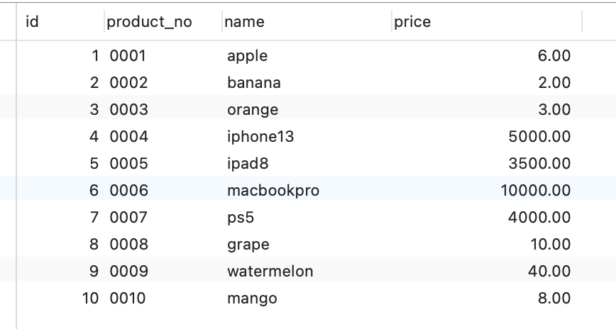

这些行数据，存储在 B+Tree 索引时是长什么样子的？

B+Tree 是一种多叉树，叶子节点才存放数据，非叶子节点只存放索引，而且每个节点里的数据是**按主键顺序存放**的。每一层父节点的索引值都会出现在下层子节点的索引值中，因此在叶子节点中，包括了所有的索引值信息，并且每一个叶子节点都有两个指针，分别指向下一个叶子节点和上一个叶子节点，形成一个双向链表。

主键索引的 B+Tree 如图所示（图中叶子节点之间我画了单向链表，但是实际上是双向链表，原图我找不到了，修改不了，偷个懒我不重画了，大家脑补成双向链表就行）：

主键索引 B+Tree

> 通过主键查询商品数据的过程

比如，我们执行了下面这条查询语句：

```sql
select * from product where id= 5;
```

这条语句使用了主键索引查询 id 号为 5 的商品。查询过程是这样的，B+Tree 会自顶向下逐层进行查找：

- 将 5 与根节点的索引数据 (1，10，20) 比较，5 在 1 和 10 之间，所以根据 B+Tree的搜索逻辑，找到第二层的索引数据 (1，4，7)；
- 在第二层的索引数据 (1，4，7)中进行查找，因为 5 在 4 和 7 之间，所以找到第三层的索引数据（4，5，6）；
- 在叶子节点的索引数据（4，5，6）中进行查找，然后我们找到了索引值为 5 的行数据。

数据库的索引和数据都是存储在硬盘的，我们可以把读取一个节点当作一次磁盘 I/O 操作。那么上面的整个查询过程一共经历了 3 个节点，也就是进行了 3 次 I/O 操作。

B+Tree 存储千万级的数据只需要 3-4 层高度就可以满足，这意味着从千万级的表查询目标数据最多需要 3-4 次磁盘 I/O，所以**B+Tree 相比于 B 树和二叉树来说，最大的优势在于查询效率很高，因为即使在数据量很大的情况，查询一个数据的磁盘 I/O 依然维持在 3-4次。**

> 通过二级索引查询商品数据的过程

主键索引的 B+Tree 和二级索引的 B+Tree 区别如下：

- **主键索引的 B+Tree 的叶子节点存放的是实际数据**，所有完整的用户记录都存放在主键索引的 B+Tree 的叶子节点里；
- **二级索引的 B+Tree 的叶子节点存放的是主键值**，而不是实际数据。

我这里将前面的商品表中的 product_no （商品编码）字段设置为二级索引，那么二级索引的 B+Tree 如下图（图中叶子节点之间我画了单向链表，但是实际上是双向链表，原图我找不到了，修改不了，偷个懒我不重画了，大家脑补成双向链表就行）。

二级索引 B+Tree

其中非叶子的 key 值是 product_no（图中橙色部分），叶子节点存储的数据是主键值（图中绿色部分）。

如果我**用 product_no 二级索引查询商品**，如下查询语句：

```sql
select * from product where product_no = '0002';
```

会**先检二级索引**中的 B+Tree 的索引值（商品编码，product_no），找到对应的叶子节点，然后获取主键值，然后**再通过主键索引**中的 B+Tree 树查询到对应的叶子节点，然后获取整行数据。**这个过程叫「回表」，也就是说要查两个 B+Tree 才能查到数据**。如下图（图中叶子节点之间我画了单向链表，但是实际上是双向链表，原图我找不到了，修改不了，偷个懒我不重画了，大家脑补成双向链表就行）：

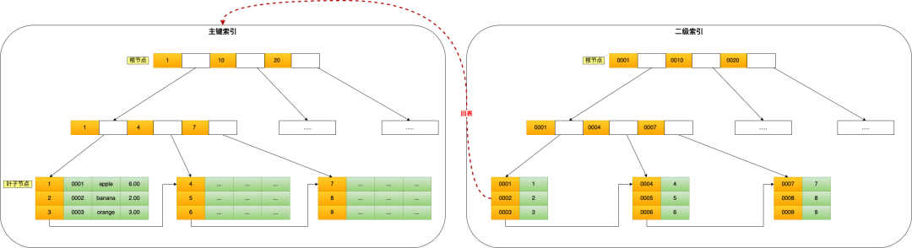回表

不过，当**查询的数据是能在二级索引的 B+Tree 的叶子节点里查询到，这时就不用再查主键索引查**，比如下面这条查询语句：

```
select id from product where product_no = '0002';
```

**这种在二级索引的 B+Tree 就能查询到结果的过程就叫作「覆盖索引」，也就是只需要查一个 B+Tree 就能找到数据**。

> 联合索引

通过将多个字段组合成一个索引，该索引就被称为联合索引。

比如，将商品表中的 product_no 和 name 字段组合成联合索引`(product_no, name)`，创建联合索引的方式如下：

```sql
CREATE INDEX index_product_no_name ON product(product_no, name);
```

联合索引`(product_no, name)` 的 B+Tree 示意图如下（图中叶子节点之间我画了单向链表，但是实际上是双向链表，原图我找不到了，修改不了，偷个懒我不重画了，大家脑补成双向链表就行）。

联合索引

可以看到，联合索引的非叶子节点用两个字段的值作为 B+Tree 的 key 值。当在联合索引查询数据时，先按 product_no 字段比较，在 product_no 相同的情况下再按 name 字段比较。

也就是说，联合索引查询的 B+Tree 是先按 product_no 进行排序，然后再 product_no 相同的情况再按 name 字段排序。

因此，使用联合索引时，存在**最左匹配原则**，也就是按照最左优先的方式进行索引的匹配。在**使用联合索引进行查询的时候，如果不遵循「最左匹配原则」，联合索引会失效，这样就无法利用到索引快速查询的特性了**。

比如，如果创建了一个 `(a, b, c)` 联合索引，如果查询条件是以下这几种，就可以匹配上联合索引：

- where a=1；
- where a=1 and b=2 and c=3；
- where a=1 and b=2；

需要注意的是，因为有查询优化器，所以 a 字段在 where 子句的顺序并不重要。

但是，如果查询条件是以下这几种，因为不符合最左匹配原则，所以就无法匹配上联合索引，联合索引就会失效:

- where b=2；
- where c=3；
- where b=2 and c=3；

上面这些查询条件之所以会失效，是因为`(a, b, c)` 联合索引，是先按 a 排序，在 a 相同的情况再按 b 排序，在 b 相同的情况再按 c 排序。所以，**b 和 c 是全局无序，局部相对有序的**，这样在没有遵循最左匹配原则的情况下，是无法利用到索引的。

我这里举联合索引（a，b）的例子，该联合索引的 B+ Tree 如下（图中叶子节点之间我画了单向链表，但是实际上是双向链表，原图我找不到了，修改不了，偷个懒我不重画了，大家脑补成双向链表就行）。

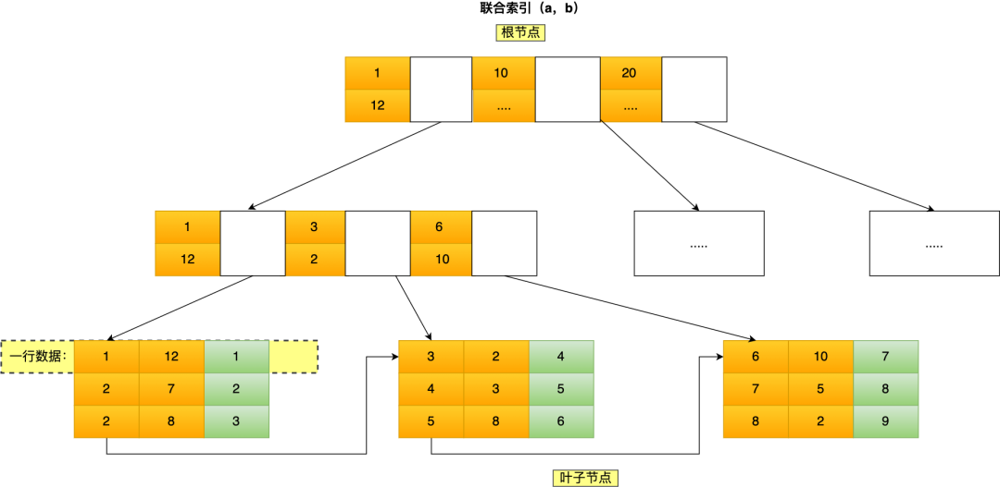img

可以看到，a 是全局有序的（1, 2, 2, 3, 4, 5, 6, 7 ,8），而 b 是全局是无序的（12，7，8，2，3，8，10，5，2）。因此，直接执行`where b = 2`这种查询条件没有办法利用联合索引的，**利用索引的前提是索引里的 key 是有序的**。

只有在 a 相同的情况才，b 才是有序的，比如 a 等于 2 的时候，b 的值为（7，8），这时就是有序的，这个有序状态是局部的，因此，执行`where a = 2 and b = 7`是 a 和 b 字段能用到联合索引的，也就是联合索引生效了。


## 25、事务的原子性是怎么实现的

MySQL的事务原子性主要通过Undo Log（撤销日志）来实现的。

当进行一次事务操作时，MySQL会首先在Undo Log中记录下事务操作前的数据状态。如果事务成功执行并提交，Undo Log中的记录就可以被删除。但如果在事务执行过程中出现错误，或者用户执行了ROLLBACK操作，MySQL就会利用Undo Log中的信息将数据恢复到事务开始前的状态，从而实现事务的原子性。

这就意味着，事务要么全部执行成功，要么如果部分执行失败，那么已经执行的部分也会被撤销，保证数据的一致性。


### 小林

事务的原⼦性是通过 undo log 实现的。
**undo log 是⼀种⽤于撤销回退的⽇志**。在**事务没提交之前**，MySQL 会**先记录更新前的数据到 undo log** 
**⽇志⽂件⾥⾯，当事务回滚时，可以利⽤ undo log 来进⾏回滚**。如下图：

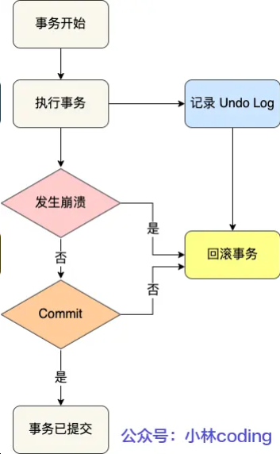

每当 InnoDB 引擎对⼀条记录进⾏操作（修改、删除、新增）时，要把回滚时需要的信息都记录到 
undo log ⾥，⽐如：

- 在**插⼊**⼀条记录时，要把**这条记录的主键值记下来，这样之后回滚时只需要把这个主键值对应的记**
  **录删掉就好了**；
- 在**删除**⼀条记录时，要把**这条记录中的内容都记下来，这样之后回滚时再把由这些内容组成的记录**
  **插⼊到表中就好了**；
- 在**更新**⼀条记录时，要把被更新的列的旧值记下来，这样之后回滚时再把这些列更新为旧值就好
  了。

**在发⽣回滚时，就读取 undo log ⾥的数据，然后做原先相反操作**。⽐如当 delete ⼀条记录时，undo 
log 中会把记录中的内容都记下来，然后执⾏回滚操作的时候，就读取 undo log ⾥的数据，然后进⾏ 
insert 操作。
不同的操作，需要记录的内容也是不同的，所以不同类型的操作（修改、删除、新增）产⽣的 undo log 
的格式也是不同的，具体的每⼀个操作的 undo log 的格式我就不详细介绍了，感兴趣的可以⾃⼰去查
查。


## 26、事务的隔离性怎么实现的？

MySQL的事务隔离性主要通过锁机制和多版本并发控制（MVCC）来实现。

1. 锁机制：包括行锁和表锁。行锁可以精确到数据库表中的某一行，而表锁则会锁定整个数据表。**当一个事务在操作某个数据项时，会对其加锁，阻止其他事务对同一数据项的并发操作，从而实现隔离性**。
2. 多版本并发控制（MVCC）：这是InnoDB存储引擎特有的一种机制，它可以在不加锁的情况下创建数据在某一时间点的快照。在**读取数据时，MVCC会返回该时间点的数据版本，即使该数据后来被其他事务修改**。这样，**每个事务都有自己的数据视图，彼此之间不会互相影响，实现了隔离性**。

此外，MySQL还提供了四种隔离级别（读未提交、读已提交、可重复读、串行化），可以根据需要选择不同的隔离级别，以在并发性和数据一致性之间取得平衡。


## 26、MySQL-持久性是怎么实现的

事务的持久性是通过  redo log  实现的。

我们**修改某条记录**，其实该记录并不是⻢上刷⼊磁盘的，⽽是**将 Innodb 的 Buffer Pool  标记为脏⻚**，
**等待后续的异步刷盘**。

Buffer Pool 是提⾼了读写效率没错，但是问题来了，Buffer Pool 是基于内存的，⽽内存总是不可靠，
万⼀断电重启，还没来得及落盘的脏⻚数据就会丢失。

为了防⽌断电导致数据丢失的问题，**当有⼀条记录需要更新的时候**，**InnoDB 引擎就会先更新内存（同**
**时标记为脏⻚），然后将本次对这个⻚的修改以 redo log 的形式记录下来**，这个时候更新就算完成了。

后续，InnoDB 引擎会在适当的时候，由后台线程将缓存在 Buffer Pool 的脏⻚刷新到磁盘⾥，这就是 
WAL （Write-Ahead Logging）技术。
WAL 技术指的是， MySQL 的写操作**并不是⽴刻写到磁盘上，⽽是先写⽇志，然后在合适的时间再写到**
**磁盘上**。

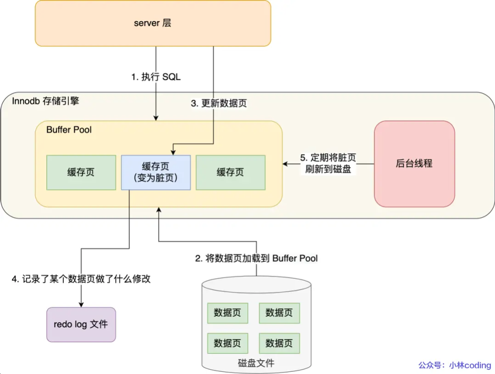

redo log 是物理⽇志，记录了某个数据⻚做了什么修改，⽐如对 **XXX 表空间中的 YYY 数据⻚ ZZZ 偏移**
**量的地⽅做了AAA 更新**，每当执⾏⼀个事务就会产⽣这样的⼀条或者多条物理⽇志。

在**事务提交时**，**只要先将 redo log 持久化到磁盘即可**，可以**不需要等到将缓存在 Buffer Pool ⾥的脏⻚**
**数据持久化到磁盘**。

当系统崩溃时，虽然脏⻚数据没有持久化，但是 redo log 已经持久化，接着 MySQL 重启后，可以根据 
redo log 的内容，将所有数据恢复到最新的状态。


## 26、事务一致性怎么实现的？

MySQL实现事务一致性主要依赖于其InnoDB存储引擎的ACID属性，其中C代表一致性(Consistency)。具体来说，以下是MySQL如何实现事务一致性的一些方式：

1. **使用锁机制**：InnoDB存储引擎支持行级锁和表级锁，通过锁机制来控制并发事务的访问冲突，确保每个事务都在一致性的状态下执行。
2. **使用MVCC**：InnoDB存储引擎通过MVCC来实现读已提交和可重复读两个隔离级别，保证了事务的一致性视图，即**在事务开始时生成一个快照，事务在执行过程中看到的数据都是这个快照中的数据**。
3. **使用Undo日志**：InnoDB存储引擎在修改数据前，会先将原始数据保存在Undo日志中，如果事务失败或者需要回滚，就可以**利用Undo日志将数据恢复到原始状态，从而保证了数据的一致性**。
4. **使用Redo日志**：Redo日志用于保证事务的持久性，但也间接保证了一致性。因为在系统崩溃恢复时，**可以通过Redo日志来重做已提交的事务，保证这些事务的修改能够持久保存**。

以上四点结合起来，就能保证MySQL事务的一致性。


## 26、多版本并发控制MVCC 

Multi-Version Concurrency Control（MVCC）是 `MySQL` 的 `InnoDB `存储引擎实现隔离级别的一种具体方式，**用于实现提交读和可重复读这两种隔离级别。而未提交读隔离级别总是读取最新的数据行，要求很低，无需使用 MVCC**。**可串行化隔离级别需要对所有读取的行都加锁，单纯使用 MVCC 无法实现**。

> ##### 版本号
>
> - 系统版本号 **SYS_ID**：是一个递增的数字，每开始一个新的事务，系统版本号就会自动递增。
> - 事务版本号 **TRX_ID** ：事务开始时的系统版本号。
>
> Undo日志
>
> ReadView…

### 小林

我们需要了解两个知识：

- Read View 中四个字段作⽤；
- 聚簇索引记录中两个跟事务有关的隐藏列；

那 Read View 到底是个什么东⻄？

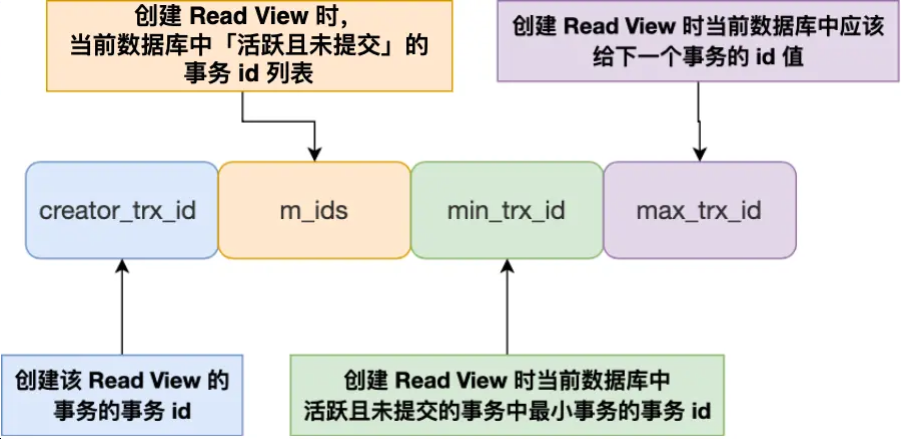

Read View 有四个重要的字段：

- m_ids ：指的是在创建 Read View 时，当前数据库中「活跃事务」的事务 id 列表，注意是⼀个列
  表，**“活跃事务”指的就是，启动了但还没提交的事务**。
- min_trx_id ：指的是在创建 Read View 时，当前数据库中**「活跃事务」中事务 id 最⼩的事务**，也
  就是 m_ids 的最⼩值。
- max_trx_id ：这个并不是 m_ids 的最⼤值，⽽是**创建 Read View 时当前数据库中应该给下⼀个事**
  **务的 id 值，也就是全局事务中最⼤的事务 id 值 + 1**；
- creator_trx_id ：指的是**创建该 Read View 的事务的事务 id**。

知道了 Read View 的字段，我们还需要了解聚簇索引记录中的两个隐藏列。
假设在账户余额表插⼊⼀条⼩林余额为 100 万的记录，然后我把这两个隐藏列也画出来，该记录的整个
示意图如下：

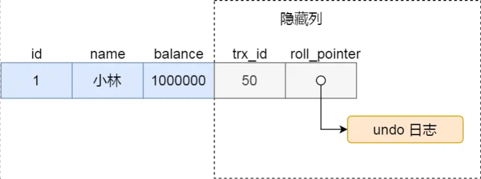

对于使⽤ InnoDB 存储引擎的数据库表，它的聚簇索引记录中都包含下⾯两个隐藏列：

- trx_id，当⼀个事务**对某条聚簇索引记录进⾏改动时，就会把该事务的事务 id 记录在 trx_id 隐藏**
  **列⾥**；
- roll_pointer，**每次对某条聚簇索引记录进⾏改动时，都会把旧版本的记录写⼊到 undo ⽇志中**，然
  后这个**隐藏列是个指针，指向每⼀个旧版本记录，于是就可以通过它找到修改前的记录**。

在创建 Read View 后，我们可以将记录中的 trx_id 划分这三种情况：

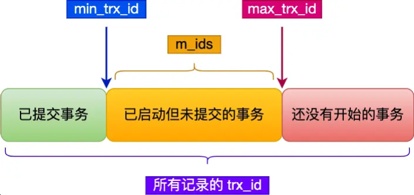

⼀个事务去访问记录的时候，除了⾃⼰的更新记录总是可⻅之外，还有这⼏种情况：

- 如果记录的 trx_id 值⼩于 Read View 中的 min_trx_id 值，表示这个版本的记录是在创建 Read 
  View 前已经提交的事务⽣成的，所以**该版本的记录对当前事务可⻅**。
- 如果记录的 trx_id 值⼤于等于 Read View 中的 max_trx_id 值，表示这个版本的记录是在创建 
  Read View 后才启动的事务⽣成的，所以**该版本的记录对当前事务不可⻅**。
- 如果记录的 trx_id 值在 Read View 的 min_trx_id 和 max_trx_id 之间，需要判断 trx_id 是否在 
  m_ids 列表中：
  - 如果记录的 trx_id **在** m_ids 列表中，表示⽣成该版本记录的活跃事务依然活跃着（还没提交
    事务），所以该版本的记录对当前事务**不可⻅**。
  - 如果记录的 trx_id **不在** m_ids列表中，表示⽣成该版本记录的活跃事务已经被提交，所以该
    版本的记录**对当前事务可⻅**。

**这种通过「版本链」来控制并发事务访问同⼀个记录时的⾏为就叫 MVCC（多版本并发控制）** 。


## 27、谈谈你对MVCC的了解 

InnoDB默认的隔离级别是RR（REPEATABLE READ），RR解决脏读、不可重复读、幻读等问题，使用
的是MVCC。**MVCC全称Multi-Version Concurrency Control，即多版本的并发控制协议。它最大的优**
**点是读不加锁，因此读写不冲突，并发性能好**。InnoDB实现MVCC，多个版本的数据可以共存，主要基
于以下技术及数据结构：

1. **隐藏列：InnoDB中每行数据都有隐藏列，隐藏列中包含了本行数据的事务id、指向undo log的指**
   **针等**。
2. **基于undo log的版本链：每行数据的隐藏列中包含了指向undo log的指针，而每条undo log也会**
   **指向更早版本的undo log，从而形成一条版本链**。
3. **ReadView：通过隐藏列和版本链，MySQL可以将数据恢复到指定版本**。但是具体要恢复到哪个版
   本，则需要根据ReadView来确定。所谓ReadView，是**指事务（记做事务A）在某一时刻给整个事**
   **务系统（trx_sys）打快照**，**之后再进行读操作时**，**会将读取到的数据中的事务id与trx_sys快照比**
   **较**，**从而判断数据对该ReadView是否可见，即对事务A是否可见**。


## 26、Next-Key Locks

Next-Key Locks 是 MySQL 的 InnoDB 存储引擎的一种锁实现。

MVCC 不能解决幻影读问题，Next-Key Locks 就是为了解决这个问题而存在的。在可重复读（REPEATABLE READ）隔离级别下，使用 MVCC + Next-Key Locks 可以解决幻读问题。

参考：<https://juejin.cn/post/7018137095315128328>


## 28、数据库的三大范式介绍一下？可以反范式吗？

数据库的三大范式是数据库设计的基本原则，主要包括：

1. **第一范式（1NF）**：数据表中的每一列都是不可分割的最小单元，也就是属性值是原子性的。
2. **第二范式（2NF）**：在**第一范式的基础上，要求数据表中的每一列都与主键相关**，也就是说非主键列必须完全依赖于主键，不能只依赖主键的一部分（针对联合主键）。
3. **第三范式（3NF）**：在第二范式的基础上，要求**一个数据表中不包含已在其他表中已包含的非主键信息，也就是说，非主键列必须直接依赖于主键，不能存在传递依赖**。
   在2NF基础上，**任何非主属性不依赖于其它非主属性（在2NF基础上消除传递依赖）**。

关于反范式，是的，数据库设计可以反范式。反范式设计是为了**优化数据库性能，通过增加冗余数据或者组合数据，减少复杂的数据查询，提高数据读取性能**。


### 面试宝典

目前关系数据库有六种范式，一般来说，数据库只需满足第三范式(3NF）就行了。

**第一范式（1NF）**：
是指在关系模型中，对于添加的一个规范要求，所有的域都应该是原子性的，即**数据库表的每一列都是**
**不可分割的原子数据项，而不能是集合，数组，记录等非原子数据项**。

即**实体中的某个属性有多个值时，必须拆分为不同的属性**。在符合第一范式表中的每个域值只能是实体
的一个属性或一个属性的一部分。简而言之，第一范式就是无重复的域。

**第二范式（2NF）**：
在1NF的基础上，非码属性必须完全依赖于候选码（在1NF基础上消除非主属性对主码的部分函数依
赖）。

第二范式是在第一范式的基础上建立起来的，即**满足第二范式必须先满足第一范式**。第二范式要求数据
库表中的每个实例或记录必须可以被唯一地区分。选取一个能区分每个实体的属性或属性组，作为实体
的唯一标识。

例如在员工表中的身份证号码即可实现每个一员工的区分，该**身份证号码即为候选键**，任何一个候选键
都可以被选作主键。在找不到候选键时，可额外增加属性以实现区分，**如果在员工关系中，没有对其身**
**份证号进行存储，而姓名可能会在数据库运行的某个时间重复，无法区分出实体时，设计辟如ID等不重**
**复的编号以实现区分，被添加的编号或ID选作主键**。

**第三范式（3NF）**：
在2NF基础上，**任何非主属性不依赖于其它非主属性（在2NF基础上消除传递依赖）**。

第三范式是第二范式的一个子集，即满足第三范式必须满足第二范式。简而言之，第三范式要求一个关
系中不包含已在其它关系已包含的非主关键字信息。

例如，存在一个部门信息表，其中**每个部门有部门编号（dept_id）、部门名称、部门简介等信息。那**
**么在员工信息表中列出部门编号后就不能再将部门名称、部门简介等与部门有关的信息再加入员工信息**
**表中**。如果不存在部门信息表，则根据第三范式（3NF）也应该构建它，否则就会有大量的数据冗余。


## 30、关系型数据库设计理论 && ER图

- 函数依赖：A --> B，A 决定 B，B 依赖于 A
- 异常：冗余、修改异常、删除异常、插入异常
- 范式：第一范式（属性不可分）、第二范式（每个非主属性完全函数依赖于键码）、第三范式（非主属性不传递函数依赖于键码）

参考：<https://www.cnblogs.com/caiyishuai/p/10975736.html>


## 31、MySQL基本

- 查询性能优化：使用`explain`分析

  - 优化数据访问：**减少请求的数据量、减少服务端扫描行数**
  - 重构查询方式：切分大查询，分解大连接查询

- 存储引擎

  - InnoDB：事务型，支持外键和在线热备份
  - MyISAM：崩溃损坏频率高，恢复速度慢

  > [MyISAM与InnoDB 的区别（9个不同点）](https://blog.csdn.net/qq_35642036/article/details/82820178)

- 切分

  - 水平切分：将同一个表中的记录拆分到多个结构相同的表中，缓存单个数据库的压力
  - 垂直区分：将一张表按列切分成多个表，通常是按照列的关系密集程度进行切分，也可以利用垂直切分将经常被使用的列和不经常被使用的列切分到不同的表中

- 主从复制

  - **binlog线程**：将主服务器数据更改写入二进制日志`Binary log`
  - **I/O线程**：从主服务器上读取二进制日志，写入从服务器的中继日志
  - **SQL 线程** ：读取中继日志，解析出主服务器已经执行的数据更改并在从服务器中重放

- 读写分离

  - **主服务器处理写操作以及实时性比较高的读操作，而从服务器处理读操作**
  - 提高性能原因如下：
    - 主从服务器负责各自的读和写，**极大程度缓解了锁的争用**
    - **从服务器可以使用 MyISAM，提升查询性能以及节约系统开销**
    - 增加冗余，提高可用性


## 34、主键和外键

- **主键：能确定一条记录的唯一标识**，比如，一条记录包括身份正号，姓名，年龄。身份证号是唯一能确定你这个人的，其他都可能有重复，所以，身份证号是主键
- **外键：用于与另一张表的关联。是能确定另一张表记录的字段，用于保持数据的一致性**。比如，A表中的一个字段，是B表的主键，那他就可以是A表的外键

> 参考：<https://blog.csdn.net/fengzongfu/article/details/78820485>


## 37、什么情况下会发生死锁，如何解决死锁

如果线程A锁住了记录1并等待记录2，而线程B锁住了记录2并等待记录1，这样两个线程就发生了死锁现象

- **主要原因**：系统资源不足； 进程运行推进的顺序不合适；资源分配不当等。
- **避免死锁**：破坏出现死锁的4个必要条件中的某一个：不让线程循环等待


## 40、MySQL 中 join 与 left join 的区别是什么

<https://zhuanlan.zhihu.com/p/45338392>

1. left join(左联接) 返回包括**左表中的所有记录和右表中联结字段相等的记录**，如果右表中的没有对应数据，按null补充。
2. right join(右联接) 返回包括**右表中的所有记录和左表中联结字段相等的记录**，如果左表中的没有对应数据，按null补充。
3. inner join(等值连接) 只返**回两个表中联结字段相等的行**，都不是null才返回


## 43、MySQL三大日志以及使用场景

- **binlog**：`binlog`用于记录数据库执行的写入性操作(不包括查询)信息，以二进制的形式保存在磁盘中。`binlog`是`mysql`的逻辑日志，并且由`Server`层进行记录，使用任何存储引擎的`mysql`数据库都会记录`binlog`日志

  > 在实际应用中，`binlog`的主要使用场景有两个，分别是**主从复制**和**数据恢复**。

- **Redo log**：具体来说就是只记录事务对数据页做了哪些修改，可以实现「持久性」

- **Undo log**：「原子性」底层就是通过 `undo log` 实现的。`undo log`主要记录了数据的逻辑变化，比如一条 `INSERT` 语句，对应一条`DELETE` 的 `undo log` ，对于每个 `UPDATE` 语句，对应一条相反的 `UPDATE` 的 `undo log` ，这样在发生错误时，就能回滚到事务之前的数据状态。


## 46、主从复制和读写分离

主从复制涉及的三个线程：binlog 线程、I/O 线程 和 SQL 线程

- binlog 线程：负责将主服务器上的数据更改写入二进制日志（Binary log）中
- I/O 线程：负责从主服务器上读取二进制日志，并写入从服务器的中继日志（Relay log）
- SQL 线程：负责读取中继日志，解析出主服务器已经执行的数据更改并在服务器中重放（Replay）


读写分离：主服务器**处理写操作以及实时性要求比较高的读操作**，而**从服务器处理读操作**，读写分离能提高性能的原因在于：

- 主从服务器负责负责**各自的读和写**，**极大程度缓解了锁的争用**
- **从服务器可以使用 MyISAM 引擎，提升查询性能以及节约系统开销**
- **增加冗余，提高可用性**

 


## 49、介绍一下数据库分页 

### **MySQL的分页语法**：

在MySQL中，**SELECT语句默认返回所有匹配的行，它们可能是指定表中的每个行**。为了返回第一行或
前几行，可使用LIMIT子句，以实现分页查询。LIMIT子句的语法如下：

```sql
-- 在所有的查询结果中，返回前5行记录。
SELECT prod_name FROM products LIMIT 5;
-- 在所有的查询结果中，从第5行开始，返回5行记录。
SELECT prod_name FROM products LIMIT 5,5;
```

总之，带一个值的LIMIT总是从第一行开始，给出的数为返回的行数。带两个值的LIMIT可以指定从行号
为第一个值的位置开始。

### 优化LIMIT分页：

在偏移量非常大的时候，例如 LIMIT 10000,20 这样的查询，这时**MySQL需要查询10020条记录然后**
**只返回最后20条**，**前面的10000条记录都将被抛弃**，这样的代价是非常高的。如果所有的页面被访问的
频率都相同，那么这样的查询平均需要访问半个表的数据。要优化这种查询，要么是在页面中限制分页
的数量，要么是优化大偏移量的性能。

优化此类分页查询的一个最简单的办法就是**尽可能地使用索引覆盖扫描**，**而不是查询所有的列**，然后**根**
**据需要做一次关联操作再返回所需的列**。对于偏移量很大的时候，这样做的效率会提升非常大。考虑下
面的查询：

```sql
SELECT film_id,description FROM sakila.film ORDER BY title LIMIT 50,5;
```

如果这个表非常大，那么这个查询最好改写成下面的样子：

```sql
SELECT film.film_id,film.description 
FROM sakila.film
INNER JOIN (
    SELECT film_id FROM sakila.film ORDER BY title LIMIT 50,5
) AS film USING(film_id);
```

这里**的“延迟关联”**将大大提升查询效率，它让**MySQL扫描尽可能少的页面，获取需要访问的记录后再根**
**据关联列回原表查询需要的所有列**。这个技术也可以用于优化关联查询中的LIMIT子句。

有时候也可以将**LIMIT查询转换为已知位置的查询，让MySQL通过范围扫描获得对应的结果**。例如，如
果在一个位置列上有索引，并且预先计算出了边界值，上面的查询就可以改写为：

```sql
SELECT film_id,description FROM skila.film
WHERE position BETWEEN 50 AND 54 ORDER BY position;
```

对数据进行排名的问题也与此类似，但往往还会同时和GROUP BY混合使用，在这种情况下通常都需要
预先计算并存储排名信息。

LIMIT和OFFSET的问题，其实是**OFFSET的问题，它会导致MySQL扫描大量不需要的行然后再抛弃掉**。
如果可以使用书签记录上次取数的位置，那么下次就可以直接从该书签记录的位置开始扫描，这样就可
以避免使用OFFSET。例如，**若需要按照租赁记录做翻页，那么可以根据最新一条租赁记录向后追溯**，
这种做法可行是因为租赁记录的主键是单调增长的。首先使用下面的查询获得第一组结果：

```sql
SELECT * FROM sakila.rental ORDER BY rental_id DESC LIMIT 20;
```

假设上面的查询返回的是主键16049到16030的租赁记录，那么下一页查询就可以从16030这个点开
始：

```sql
SELECT * FROM sakila.rental 
WHERE rental_id < 16030 ORDER BY rental_id DESC LIMIT 20;
```

该技术的好处是无论翻页到多么后面，其性能都会很好。


## 52、介绍一下SQL中的聚合函数 

常用的聚合函数有COUNT()、AVG()、SUM()、MAX()、MIN()，下面以MySQL为例，说明这些函数的作
用。

**COUNT()函数**：
COUNT()函数**统计数据表中包含的记录行的总数**，或者根据查询结果返回列中包含的数据行数，它有两
种用法：

- COUNT(*)计算表中总的行数，不管某列是否有数值或者为空值。
- COUNT(字段名)计算指定列下总的行数，计算时将忽略空值的行。

COUNT()函数可以与GROUP BY一起使用来计算每个分组的总和。

**AVG()函数**：
AVG()函数通过计算返回的行数和每一行数据的和，求得指定列数据的平均值。
AVG()函数可以与GROUP BY一起使用，来计算每个分组的平均值。

**SUM()函数**：
SUM()是一个求总和的函数，返回指定列值的总和。
SUM()可以与GROUP BY一起使用，来计算每个分组的总和。

**MAX()函数**：
MAX()返回指定列中的最大值。
MAX()也可以和GROUP BY关键字一起使用，求每个分组中的最大值。
MAX()函数不仅适用于查找数值类型，也可应用于字符类型。

**MIN()函数**：
MIN()返回查询列中的最小值。
MIN()也可以和GROUP BY关键字一起使用，求出每个分组中的最小值。
MIN()函数与MAX()函数类似，不仅适用于查找数值类型，也可应用于字符类型。


## 55、表跟表是怎么关联的？ 

表与表之间常用的关联方式有两种：内连接、外连接，下面以MySQL为例来说明这两种连接方式。

**内连接**：

内连接通过INNER JOIN来实现，它将返回**两张表中满足连接条件的数据**，不满足条件的数据不会查询出来。


**外连接**：

外连接通过OUTER JOIN来实现，它会返回两张表中满足连接条件的数据，同时返回不满足连接条件的数据。外连接有两种形式：左外连接（LEFT OUTER JOIN）、右外连接（RIGHT OUTER JOIN）。

- 左外连接：可以简称为左连接（LEFT JOIN），它会返回**左表中的所有记录和右表中满足连接条件的记录**。
- 右外连接：可以简称为右连接（RIGHT JOIN），它会返回**右表中的所有记录和左表中满足连接条件的记录**。

除此之外，还有一种常见的连接方式：**等值连接**。这种连接是**通过WHERE子句中的条件，将两张表连接在一起，它的实际效果等同于内连接**。出于语义清晰的考虑，一般更建议使用内连接，而不是等值连接。


以上是从语法上来说明表与表之间关联的实现方式，而从表的关系上来说，比较常见的关联关系有：一对多关联、多对多关联、自关联。

- 一对多关联：这种关联形式最为常见，一般是**两张表具有主从关系**，并且以**主表的主键关联从表的外键**来实现这种关联关系。另外，以从表的角度来看，它们是具有多对一关系的，所以不再赘述多对一关联了。
- 多对多关联：这种关联关系比较复杂，如果两张表具有多对多的关系，那么它们之间需要有一张中间表来作为衔接，以实现这种关联关系。**这个中间表要设计两列，分别存储那两张表的主键**。因此，**这两张表中的任何一方，都与中间表形成了一对多关系，从而在这个中间表上建立起了多对多关系**。
- 自关联：自关联就是一张表自己与自己相关联，为了避免表名的冲突，**需要在关联时通过别名将它们当做两张表来看待**。**一般在表中数据具有层级（树状）时，可以采用自关联一次性查询出多层级的数据**。


## 58、 SQL中怎么将行转成列？ 

我们以MySQL数据库为例，来说明行转列的实现方式。
首先，假设我们有一张分数表（tb_score），表中的数据如下图：

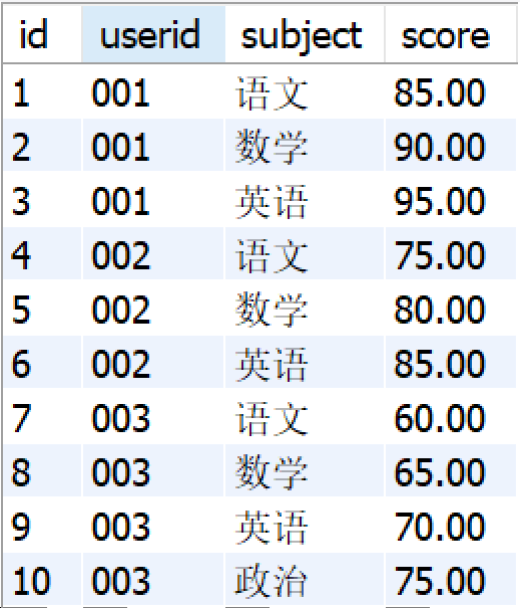

然后，我们再来看一下转换之后需要得到的结果，如下图：

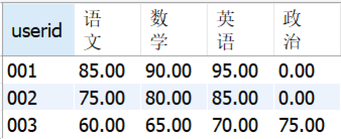

可以看出，**这里行转列是将原来的subject字段的多行内容选出来，作为结果集中的不同列，并根据**
**userid进行分组显示对应的score**。通常，我们有两种方式来实现这种转换。

1. 使用 CASE...WHEN...THEN 语句实现行转列，参考如下代码：

   ```sql
   SELECT userid,
   SUM(CASE `subject` WHEN '语文' THEN score ELSE 0 END) as '语文',
   SUM(CASE `subject` WHEN '数学' THEN score ELSE 0 END) as '数学',
   SUM(CASE `subject` WHEN '英语' THEN score ELSE 0 END) as '英语',
   SUM(CASE `subject` WHEN '政治' THEN score ELSE 0 END) as '政治' 
   FROM tb_score 
   GROUP BY userid
   ```

   注意，SUM() 是为了能够使用GROUP BY根据userid进行分组，因为**每一个userid对应的subject="语文"的记录只有一条，所以SUM() 的值就等于对应那一条记录的score的值**。
   假如userid ='001' and subject='语文' 的记录有两条，则此时SUM() 的值将会是这两条记录的和，同理，使用Max()的值将会是这两条记录里面值最大的一个。
   但是正常情况下，一个user对应一个
   subject只有一个分数，因此可以使用SUM()、MAX()、MIN()、AVG()等聚合函数都可以达到行转列的效果。


## 61、谈谈你对SQL注入的理解 

SQL注入的原理是**将SQL代码伪装到输入参数中，传递到服务器解析并执行的一种攻击手法**。也就是说，在一些对SERVER端发起的请求参数中植入一些SQL代码，**SERVER端在执行SQL操作时，会拼接对应参数，同时也将一些SQL注入攻击的“SQL”拼接起来，导致会执行一些预期之外的操作**。

**举个例子**：
比如我们的登录功能，其登录界面包括用户名和密码输入框以及提交按钮，登录时需要输入用户名和密
码，然后提交。此时调用接口/user/login/ 加上参数username、password，首先连接数据库，然后后
台对请求参数中携带的用户名、密码进行参数校验，即SQL的查询过程。**假设正确的用户名和密码为ls**
**和123456，输入正确的用户名和密码、提交，相当于调用了以下的SQL语句**。

```sql
SELECT * FROM user WHERE username = 'ls' AND password = '123456'
```

SQL中会将#及--以后的字符串当做注释处理，如果我们使用 ' or 1=1 # 作为用户名参数，那么服务
端构建的SQL语句就如下：

```sql
select * from user where username='' or 1=1 #' and password='123456'
```

而#会忽略后面的语句，而1=1属于常等型条件，**因此这个SQL将查询出所有的登录用户**。其实上面的
SQL注入只是在参数层面做了些手脚，如果是引入了一些**功能性的SQL那就更危险了**，比如上面的登录
功能，如果用户名使用这个 ' or 1=1;delete * from users; #，那么在";"之后相当于是另外一条新
的SQL，这个SQL是删除全表，是非常危险的操作，因此SQL注入这种还是需要特别注意的。

### **如何解决SQL注入**

1. **严格的参数校验**
参数校验就没得说了，在**一些不该有特殊字符的参数中提前进行特殊字符校验即可**。
2. **SQL预编译**

在知道了SQL注入的原理之后，我们同样也了解到MySQL有预编译的功能，指的是在服务器启动
时，MySQL Client把SQL语句的模板（变量采用占位符进行占位）发送给MySQL服务器，**MySQL**
**服务器对SQL语句的模板进行编译**，编译之后根据语句的优化分析对相应的索引进行优化，在**最终**
**绑定参数时把相应的参数传送给MySQL服务器，直接进行执行，节省了SQL查询时间**，以及
MySQL服务器的资源，**达到一次编译、多次执行的目的**，除此之外，还可以防止SQL注入。

具体是怎样防止SQL注入的呢？实际上当**将绑定的参数传到MySQL服务器，MySQL服务器对参数**
**进行编译，即填充到相应的占位符的过程中，做了转义操作**。我们常用的JDBC就有预编译功能，
不仅提升性能，而且**防止SQL注入**。


## 64、将一张表的部分数据更新到另一张表，该如何操作呢？

可以采用**关联更新**的方式，**将一张表的部分数据，更新到另一张表内**。参考如下代码：

```sql
update b set b.col=a.col from a,b where a.id=b.id;
update b set col=a.col from b inner join a on a.id=b.id;
update b set b.col=a.col from b left Join a on b.id = a.id;
```


## 67、WHERE和HAVING有什么区别？ 

WHERE是一个约束声明，**使用WHERE约束来自数据库的数据，WHERE是在结果返回之前起作用的，WHERE中不能使用聚合函数**。

**HAVING是一个过滤声明，是在查询返回结果集以后对查询结果进行的过滤操作，在HAVING中可以使用聚合函数**。另一方面，**HAVING子句中不能使用除了分组字段和聚合函数之外的其他字段**。

从性能的角度来说，HAVING子句中如果使用了分组字段作为过滤条件，应该替换成WHERE子句。因为**WHERE可以在执行分组操作和计算聚合函数之前过滤掉不需要的数据，性能会更好**。


## 70、说一说你对MySQL索引的理解 

索引是**一个单独的、存储在磁盘上的数据库结构，包含着对数据表里所有记录的引用指针**。使用**索引可**
**以快速找出在某个或多个列中有一特定值的行**，所有MySQL列类型都可以被索引，对相关列使用索引是
提高查询操作速度的最佳途径。

**索引是在存储引擎中实现的**，因此，每种存储引擎的索引都不一定完全相同，并且每种存储引擎也不一
定支持所有索引类型。MySQL中索引的存储类型有两种，即BTREE和HASH，具体和表的存储引擎相
关。**MyISAM和InnoDB存储引擎只支持BTREE索引**；MEMORY/HEAP存储引擎可以支持HASH和BTREE
索引。

**索引的优点主要有以下几条**：

1. 通过创建唯一索引，可以保证数据库表中每一行数据的**唯一性**。
2. 可以大大**加快数据的查询速度**，这也是创建索引的主要原因。
3. 在实现数据的参考完整性方面，可以**加速表和表之间的连接**。
4. 在使用分组和排序子句进行数据查询时，也可以**显著减少查询中分组和排序的时间**。

**增加索引也有许多不利的方面，主要表现在如下几个方面**：

1. **创建索引和维护索引要耗费时间**，并且随着数据量的增加所耗费的时间也会增加。
2. **索引需要占磁盘空间**，除了数据表占数据空间之外，每一个索引还要占一定的物理空间，如果有大
量的索引，索引文件可能比数据文件更快达到最大文件尺寸。
3. **当对表中的数据进行增加、删除和修改的时候，索引也要动态地维护，这样就降低了数据的维护速**
**度**。


## 73、索引有哪几种？ 

MySQL的索引可以分为以下几类：

1. 普通索引和唯一索引
普通索引是MySQL中的基本索引类型，允许在定义索引的列中插入重复值和空值。
唯一索引要求索引列的值必须唯一，但允许有空值。**如果是组合索引，则列值的组合必须唯一**。
**主键索引是一种特殊的唯一索引，不允许有空值**。
2. 单列索引和组合索引
单列索引即一个索引**只包含单个列**，**一个表可以有多个单列索引**。
组合索引是指**在表的多个字段组合上创建的索引**，只有在查询条件中使用了这些字段的左边字段
时，索引才会被使用。**使用组合索引时遵循最左前缀集合**。
3. 全文索引
**全文索引类型为FULLTEXT，在定义索引的列上支持值的全文查找，允许在这些索引列中插入重复**
**值和空值**。全文索引可以在CHAR、VARCHAR或者TEXT类型的列上创建。
4. 空间索引
**空间索引是对空间数据类型的字段建立的索引**，MySQL中的空间数据类型有4种，分别是
GEOMETRY、POINT、LINESTRING和POLYGON。MySQL使用SPATIAL关键字进行扩展，使得能
够用创建正规索引类似的语法创建空间索引。创建空间索引的列，必须将其声明为NOT NULL，空
间索引只能在存储引擎为MyISAM的表中创建。


## 76、如何创建及保存MySQL的索引？ 

MySQL支持多种方法在单个或多个列上创建索引：

**在创建表的时候创建索引**：

使用CREATE TABLE创建表时，除了可以**定义列的数据类型**，还可以**定义主键约束、外键约束或者唯一**
**性约束，而不论创建哪种约束，在定义约束的同时相当于在指定列上创建了一个索引**。创建表时创建索
引的基本语法如下：

```sql
CREATE TABLE table_name [col_name data_type]
[UNIQUE|FULLTEXT|SPATIAL] [INDEX|KEY] [index_name] (col_name [length]) 
[ASC|DESC]
```

其中，UNIQUE、FULLTEXT和SPATIAL为可选参数，分别表示唯一索引、全文索引和空间索引；INDEX
与KEY为同义词，两者作用相同，用来指定创建索引。
例如，可以按照如下方式，在id字段上使用UNIQUE关键字创建唯一索引：

```sql
CREATE TABLE t1 (
    id INT NOT NULL,
    name CHAR(30) NOT NULL,
    UNIQUE INDEX UniqIdx(id)
);
```

**在已存在的表上创建索引**：
在已经存在的表中创建索引，可以使用**ALTER TABLE**语句或者**CREATEINDEX**语句。
ALTER TABLE创建索引的基本语法如下：

```sql
ALTER TABLE table_name ADD 
[UNIQUE|FULLTEXT|SPATIAL] [INDEX|KEY] [index_name] (col_name[length],...) 
[ASC|DESC]
```

例如，可以按照如下方式，在bookId字段上建立名称为UniqidIdx的唯一索引：

```sql
ALTER TABLE book ADD UNIQUE INDEX UniqidIdx (bookId);
```

CREATE INDEX创建索引的基本语法如下：

```sql
CREATE [UNIQUE|FULLTEXT|SPATIAL] INDEX index_name 
ON table_name (col_name [length],...) [ASC|DESC]
```

例如，可以按照如下方式，在bookId字段上建立名称为UniqidIdx的唯一索引：

```sql
CREATE UNIQUE INDEX UniqidIdx ON book (bookId);
```


## 79、MySQL怎么判断要不要加索引？ 

建议按照如下的原则来创建索引：

1. 当**唯一性**是某种数据本身的特征时，指定唯一索引。使用唯一索引需能确保定义的列的数据完整
性，以提高查询速度。
2. **在频繁进行排序或分组（即进行group by或order by操作）的列上建立索引，如果待排序的列有**
**多个，可以在这些列上建立组合索引**。


## 82、只要创建了索引，就一定会走索引吗？ 

不一定。
比如，在使用**组合索引**的时候，如果没有**遵从“最左前缀”的原则进行搜索，则索引是不起作用的**。

举例，假设在id、name、age字段上已经成功建立了一个名为MultiIdx的组合索引。索引行中按id、
name、age的**顺序存放**，索引可以搜索id、（id,name）、（id, name, age）字段组合。如果**列不构成**
**索引最左面的前缀**，那么MySQL不能使用局部索引，如（age）或者（name,age）组合则不能使用该
索引查询。


## 85、如何判断数据库的索引有没有生效？

可以使用EXPLAIN语句查看索引是否正在使用。
举例，假设已经创建了book表，并已经在其year_publication字段上建立了普通索引。执行如下语句：

```sql
EXPLAIN SELECT * FROM book WHERE year_publication=1990;
```

EXPLAIN语句将为我们输出详细的SQL执行信息，其中：

- possible_keys行给出了MySQL在搜索数据记录时可选用的各个索引。
- key行是MySQL实际选用的索引。

如果possible_keys行和key行都包含year_publication字段，则说明在查询时使用了该索引。


##  88、如何评估一个索引创建的是否合理？

建议按照如下的原则来设计索引：
1. **避免对经常更新的表进行过多的索引，并且索引中的列要尽可能少**。应该**经常用于查询的字段创建**
**索引**，但要避免添加不必要的字段。
2. **数据量小的表**最好不要使用索引，由于数据较少，**查询花费的时间可能比遍历索引的时间还要短**，
索引可能不会产生优化效果。
3. **在条件表达式中经常用到的不同值较多的列上建立索引，在不同值很少的列上不要建立索引**。比如
在学生表的“性别”字段上只有“男”与“女”两个不同值，因此就无须建立索引，如果建立索引不但不
会提高查询效率，反而会严重降低数据更新速度。
4. **当唯一性是某种数据本身的特征时，指定唯一索引**。使用唯一索引需能确保定义的列的数据完整
性，以提高查询速度。
5. **在频繁进行排序或分组（即进行group by或order by操作）的列上建立索引，如果待排序的列有**
**多个，可以在这些列上建立组合索引**。


## 91、索引是越多越好吗？ 

索引并非越多越好，一个表中如有大量的索引，不仅占用磁盘空间，还会影响INSERT、DELETE、
UPDATE等语句的性能，因为在表中的数据更改时，索引也会进行调整和更新。


## 94、数据库索引失效了怎么办？ 

可以采用以下几种方式，来避免索引失效：

1. **使用组合索引时，需要遵循“最左前缀”原则**；
2. **不在索引列上做任何操作，例如计算、函数、类型转换，会导致索引失效而转向全表扫描**；
3. 尽量使用覆盖索引（之访问索引列的查询），减少 `select *` 覆盖索引能减少回表次数；
4. **MySQL在使用不等于（!=或者<>）的时候无法使用索引会导致全表扫描**；
5. **LIKE以通配符开头（%abc）MySQL索引会失效变成全表扫描的操作**；
6. **字符串不加单引号会导致索引失效（可能发生了索引列的隐式转换）**；
7. **少用or，用它来连接时会索引失效**。


## 97、所有的字段都适合创建索引吗？ 

不是。
下列几种情况，是不适合创建索引的：

1. **频繁更新**的字段不适合建立索引；
2. **数据比较少的表**不需要建索引；
3. **数据重复且分布比较均匀的的字段不适合建索引，例如性别、真假值**；
4. **where条件中用不到的字段不适合建立索引**；
5. **参与列计算的列不适合建索引。**


## 100、说一说索引的实现原理

**在MySQL中，索引是在存储引擎层实现的，不同存储引擎对索引的实现方式是不同的**，下面我们探讨一
下MyISAM和InnoDB两个存储引擎的索引实现方式。

**MyISAM索引实现**：
**MyISAM引擎使用B+Tree作为索引结构，叶节点的data域存放的是数据记录的地址**，MyISAM索引的原
理图如下。这里假设表一共有三列，**假设我们以Col1为主键**，则上图是一个MyISAM表的主索引
（Primary key）示意。可以看出MyISAM的**索引文件仅仅保存数据记录的地址**。**在MyISAM中**，主索引
和辅助索引（Secondary key）在结构上没有任何区别，**只是主索引要求key是唯一的，而辅助索引的**
**key可以重复**。

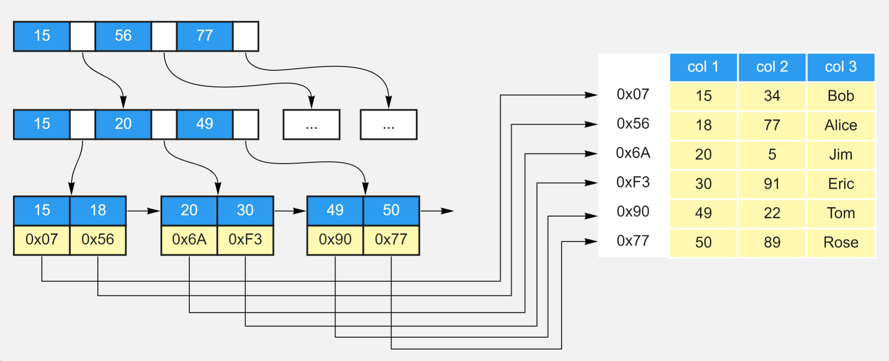

如果我们在Col2上建立一个辅助索引，则此索引的结构如下图所示。同样也是一颗B+Tree，data域保
存数据记录的地址。因此，MyISAM中索引检索的算法为首先**按照B+Tree搜索算法搜索索引**，如果指定
**的Key存在，则取出其data域的值，然后以data域的值为地址，读取相应数据记录**。

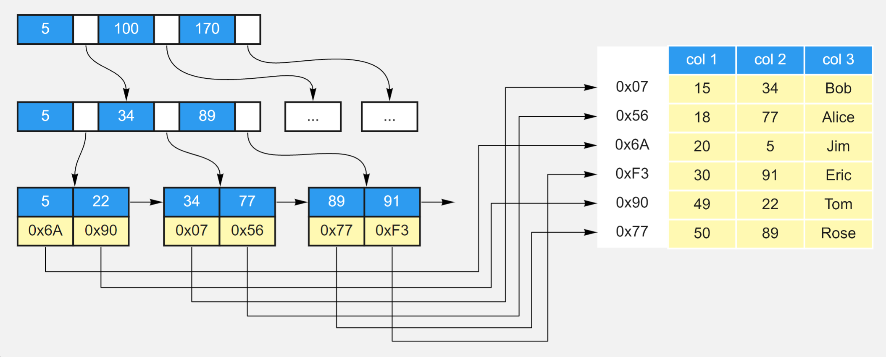


**InnoDB索引实现**：

虽然InnoDB也使用**B+Tree**作为索引结构，但具体实现方式却与MyISAM截然不同。

第一个重大区别是**InnoDB的数据文件本身就是索引文件**。从上文知道，MyISAM索引文件和数据文件是
分离的，索引文件仅保存数据记录的地址。而在InnoDB中，**表数据文件本身就是按B+Tree组织的一个**
**索引结构，这棵树的叶节点data域保存了完整的数据记录。这个索引的key是数据表的主键，因此
InnoDB表数据文件本身就是主索引**。
下图是InnoDB主索引（同时也是数据文件）的示意图，可以看到叶节点包含了完整的数据记录。**这种**
**索引叫做聚集索引**。因为InnoDB的数据文件本身要**按主键聚集**，所以InnoDB要求表**必须有主键**
（MyISAM可以没有），如果没有显式指定，则MySQL系统会自动选择一个可以唯一标识数据记录的列
作为主键，如果不存在这种列，则MySQL自动为InnoDB表生成一个隐含字段作为主键，这个字段长度
为6个字节，类型为长整形。

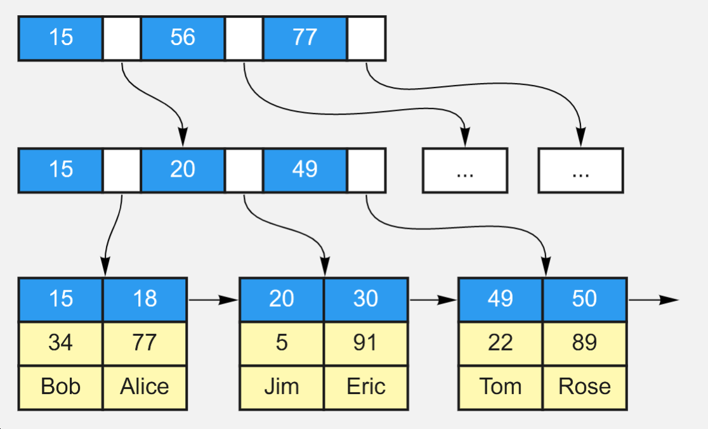


第二个与MyISAM索引的不同是**InnoDB的辅助索引data域存储相应记录主键的值而不是地址。换句话**
**说，InnoDB的所有辅助索引都引用主键作为data域**。下图为定义在Col3上的一个辅助索引。这里以英
文字符的ASCII码作为比较准则。**聚集索引这种实现方式使得按主键的搜索十分高效，但是辅助索引搜**
**索需要检索两遍索引：首先检索辅助索引获得主键，然后用主键到主索引中检索获得记录**。

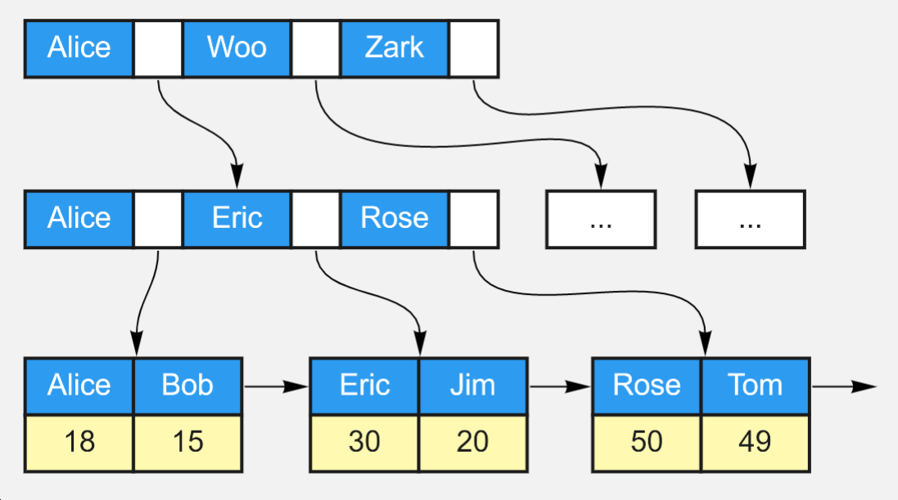

了解不同存储引擎的索引实现方式对于正确使用和优化索引都非常有帮助，例如知道了InnoDB的索引
实现后，就很容易明白为什么不建议使用过长的字段作为主键，因为**所有辅助索引都引用主索引，过长**
**的主索引会令辅助索引变得过大**。再例如，用非单调的字段作为主键在InnoDB中不是个好主意，因为
**InnoDB数据文件本身是一颗B+Tree，非单调的主键会造成在插入新记录时数据文件为了维持B+Tree的**
**特性而频繁的分裂调整**，十分低效，而使用自增字段作为主键则是一个很好的选择。


## 103、MySQL的索引为什么用B+树？ 

**B+树由B树和索引顺序访问方法演化而来，它是为磁盘或其他直接存取辅助设备设计的一种平衡查找**
**树**，在B+树中，**所有记录节点都是按键值的大小顺序存放在同一层的叶子节点，各叶子节点通过指针进**
**行链接**。如下图：

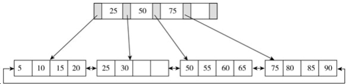

B+树索引在数据库中的一个特点就是**高扇出性**，例如在InnoDB存储引擎中，每个页的大小为16KB。**在**
**数据库中**，**B+树的高度一般都在2～4层，这意味着查找某一键值最多只需要2到4次IO操作**，这还不
错。因为现在一般的磁盘每秒至少可以做100次IO操作，2～4次的IO操作意味着查询时间只需0.02～
0.04秒。


## 106、什么是联合索引？联合索引的存储结构是什么，它的有效方式是什么？

联合索引是指**对表上的多个列进行索引**，联合索引的创建方法与单个索引创建的方法一样，不同之处仅
在于有多个索引列。

从本质上来说，联合索引还是一棵B+树，不同的是联合索引的键值数量不是1，而是大于等于2，参考
下图。另外，**只有在查询条件中使用了这些字段的左边字段时，索引才会被使用，所以使用联合索引时**
**遵循最左前缀集合**。

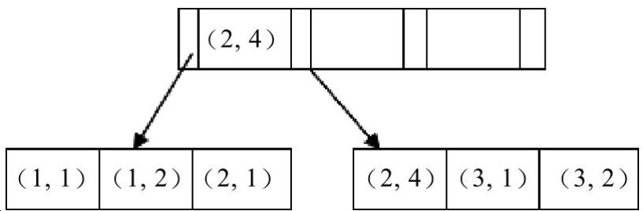


## 109、MySQL的Hash索引和B树索引有什么区别？ 

hash索引底层就是hash表，进行查找时，**调用一次hash函数就可以获取到相应的键值，之后进行回表查询获得实际数据**。

B+树底层实现是多路平衡查找树，**对于每一次的查询都是从根节点出发，查找到叶子节点方可以获得所查键值，然后根据查询判断是否需要回表查询数据**。

它们有以下的不同：

- hash索引进行等值查询更快(一般情况下)，**但是却无法进行范围查询。因为在hash索引中经过**
  **hash函数建立索引之后，索引的顺序与原顺序无法保持一致，不能支持范围查询。而B+树的的所**
  **有节点皆遵循(左节点小于父节点，右节点大于父节点，多叉树也类似)，天然支持范围**。
- hash索引不支持使用索引进行排序，原理同上。
- hash索引不支持**模糊查询以及多列索引的最左前缀匹配**，原理也是因为hash函数的不可预测。
  hash索引任何时候都**避免不了回表查询数据**，而B+树在符合某些条件(**聚簇索引，覆盖索引**等)的
  时候可以只通过索引完成查询。
- hash索引虽然在等值查询上较快，但是**不稳定，性能不可预测**，当**某个键值存在大量重复**的时
  候，发生hash碰撞，此时效率可能极差。**而B+树的查询效率比较稳定，对于所有的查询都是从根**
  **节点到叶子节点，且树的高度较低。**

因此，在大多数情况下，直接选择B+树索引可以获得稳定且较好的查询速度。而不需要使用hash索
引。


## 112、聚簇索引和非聚簇索引有什么区别？ 

在InnoDB存储引擎中，可以将B+树索引分为聚簇索引和辅助索引（非聚簇索引）。无论是何种索引，
**每个页的大小都为16KB**，且不能更改。

聚簇索引是根据主键创建的一棵B+树，聚簇索引的**叶子节点存放了表中的所有记录**。

辅助索引是根据索引键创建的一棵B+树，与聚簇索引不同的是，其叶子节点仅存放**索引键值，以及该索引键值指向的主键**。也就是说，如果**通过辅助索引来查找数据，那么当找到辅助索引的叶子节点后，很有可能还需要根**
**据主键值查找聚簇索引来得到数据**，这种查找方式又被称为书签查找。因为**辅助索引不包含行记录的所**
**有数据，这就意味着每页可以存放更多的键值，因此其高度一般都要小于聚簇索引**。


## 115、select in语句中如何使用索引？ 

索引是否起作用，主要取决于字段类型：

- 如果字段类型为字符串，需要**给in查询中的数值与字符串值都需要添加引号，索引才能起作用**。
- 如果字段类型为int，则in查询中的值不需要添加引号，索引也会起作用。

IN的字段，在联合索引中，按以上方法，也会起作用。

 


## 118、模糊查询语句中如何使用索引？ 

在MySQL中模糊查询 mobile like ‘%8765’，这种情况是不能使用 mobile 上的索引的，那么如果需要根据手机号码后四位进行模糊查询，可以用一下方法进行改造。

**我们可以加入冗余列**（MySQL5.7之后加入了虚拟列，使用虚拟列更合适，思路相同），比如 
mobile_reverse，内部存储为 mobile 的倒叙文本，如 mobile为17312345678，那么 **mobile_reverse** 
存储 87654321371，为 mobile_reverse 列建立索引，**查询中使用语句 mobile_reverse like** 
**reverse(’%5678’) 即可**。

**reverse 是 MySQL 中的反转函数**，这条语句相当于 mobile_reverse like ‘8765%’ ，这种语句是可以使
用索引的。


## 121、事务有哪几种类型，它们之间有什么区别？

事务可以分为以下几种类型：

**扁平事务**：是事务类型中最简单的一种，而在实际生产环境中，这可能是使用最为频繁的事务。在
扁平事务中，所有操作都处于同一层次，其由BEGIN WORK开始，由COMMIT WORK或
ROLLBACK WORK结束。**处于之间的操作是原子的，要么都执行，要么都回滚**。

**带有保存点的扁平事务**：除了支持扁平事务支持的操作外，允许在事务执行过程中回滚到同一事务
中较早的一个状态，**这是因为可能某些事务在执行过程中出现的错误并不会对所有的操作都无效，**
**放弃整个事务不合乎要求，开销也太大**。保存点（savepoint）用来通知系统应该记住事务当前的
状态，以便以后发生错误时，事务能回到该状态。

**链事务**：可视为保存点模式的一个变种。链事务的思想是：**在提交一个事务时，释放不需要的数据**
**对象，将必要的处理上下文隐式地传给下一个要开始的事务**。注意，提交事务操作和开始下一个事
务操作将合并为一个原子操作。**这意味着下一个事务将看到上一个事务的结果，就好像在一个事务**
**中进行的**。

**嵌套事务**：是一个层次结构框架。有一个顶层事务（top-level transaction）控制着各个层次的事
务。顶层事务之下嵌套的事务被称为子事务（subtransaction），其控制每一个局部的变换。

**分布式事务**：通常是一个在分布式环境下运行的扁平事务，因此**需要根据数据所在位置访问网络中**
**的不同节点**。对于分布式事务，同样需要满足ACID特性，要么都发生，要么都失效。

对于MySQL的InnoDB存储引擎来说，它支持扁平事务、带有保存点的扁平事务、链事务、分布式事
务。对于嵌套事务，MySQL数据库并不是原生的，因此对于有并行事务需求的用户来说MySQL就无能
为力了，但是用户可以通过带有保存点的事务来模拟串行的嵌套事务。


## 124、事务可以嵌套吗？ 

可以，因为嵌套事务也是众多事务分类中的一种，它是一个层次结构框架。

有一个顶层事务控制着各个层次的事务，顶层事务之下嵌套的事务被称为子事务，它控制每一个局部的变换。

需要注意的是，MySQL数据库不支持嵌套事务。


## 127、如何实现可重复读？ 

MySQL的InnoDB引擎，在默认的REPEATABLE READ的隔离级别下，实现了可重复读，同时也解决了幻
读问题。它使用Next-Key Lock算法实现了行锁，并且不允许读取已提交的数据，所以解决了不可重复
读的问题。另外，该算法包含了间隙锁，会锁定一个范围，因此也解决了幻读的问题。

 

## 129、如何解决幻读问题？ 

MySQL的InnoDB引擎，在默认的REPEATABLE READ的隔离级别下，实现了可重复读，同时也解决了幻
读问题。它使用Next-Key Lock算法实现了行锁，并且不允许读取已提交的数据，所以解决了不可重复
读的问题。另外，该算法包含了间隙锁，会锁定一个范围，因此也解决了幻读的问题。


## 132、MySQL事务如何回滚？ 

在MySQL默认的配置下，事务都是**自动提交和回滚的**。当显示地开启一个事务时，可以使用**ROLLBACK语句**进行回滚。

该语句有两种用法：

- **ROLLBACK**：要使用这个语句的最简形式，**只需发出ROLLBACK**。同样地，也可以写为ROLLBACK 
  WORK，但是二者几乎是等价的。**回滚会结束用户的事务，并撤销正在进行的所有未提交的修改**。
- **ROLLBACK TO [SAVEPOINT] identifier** ：这个语句与SAVEPOINT命令一起使用。可以把**事务回滚**
  **到标记点，而不回滚在此标记点之前的任何工作**。


## 133、了解数据库的锁吗？ 

**锁是数据库系统区别于文件系统的一个关键特性，锁机制用于管理对共享资源的并发访问**。下面我们以
MySQL数据库的InnoDB引擎为例，来说明锁的一些特点。

**锁的类型**：
InnoDB存储引擎实现了如下两种标准的行级锁：

- 共享锁（S Lock），允许事务读一行数据。
- 排他锁（X Lock），允许事务删除或更新一行数据。

如果一个**事务T1已经获得了行r的共享锁，那么另外的事务T2可以立即获得行r的共享锁，因为读取并没**
**有改变行r的数据，称这种情况为锁兼容**。但若有其他的事务T3**想获得行r的排他锁**，则其必须等待事务
T1、T2释放行r上的共享锁，这种情况称为**锁不兼容**。下图显示了共享锁和排他锁的兼容性，可以发现X
锁与任何的锁都不兼容，而**S锁仅和S锁兼容**。需要特别注意的是，S和X锁都是行锁，兼容是指对同一记
录（row）锁的兼容性情况。


**锁的粒度**：

InnoDB存储引擎支持**多粒度锁定，这种锁定允许事务在行级上的锁和表级上的锁同时存在**。为了支持
在不同粒度上进行加锁操作，InnoDB存储引擎支持一种额外的锁方式，称之为意向锁。**意向锁是将锁**
**定的对象分为多个层次，意向锁意味着事务希望在更细粒度上进行加锁**。

InnoDB存储引擎支持意向锁设计比较简练，**其意向锁即为表级别的锁**。设计目的主要是为了在一个事
务中揭示下一行将被请求的锁类型。其支持两种意向锁：

- **意向共享锁（IS Lock），事务想要获得一张表中某几行的共享锁**。
- **意向排他锁（IX Lock），事务想要获得一张表中某几行的排他锁**。

由于InnoDB存储引擎支持的是行级别的锁，因此**意向锁其实不会阻塞除全表扫以外的任何请求**。故表
级意向锁与行级锁的兼容性如下图所示。


**锁的算法**：
InnoDB存储引擎有3种行锁的算法，其分别是：

- **Record Lock：单个行记录上的锁。**
- **Gap Lock：间隙锁，锁定一个范围，但不包含记录本身。**
- **Next-Key Lock∶Gap Lock+Record Lock，锁定一个范围，并且锁定记录本身**。

Record Lock**总是会去锁住索引记录**，如果InnoDB存储引擎表在建立的时候没有设置任何一个索引，那
么这时InnoDB存储引擎会使用隐式的主键来进行锁定。

Next-Key Lock是结合了Gap Lock和Record Lock的一种锁定算法，在Next-Key Lock算法下，InnoDB对于行的查询都是采用这种锁定算法。采用Next-Key Lock的锁定技术称为Next-Key Locking，其设计的目的是为了解决Phantom Problem（幻读）。而利用这种锁定技术，锁定的不是单个值，而是一个范围，是谓词锁（predict lock）的一种改进。


**关于死锁**：
**死锁是指两个或两个以上的事务在执行过程中，因争夺锁资源而造成的一种互相等待的现象。若无外力**
**作用，事务都将无法推进下去**。

**解决死锁问题最简单的一种方法是超时，即当两个事务互相等待时，当一个等待时间超过设置的某一阈**
**值时，其中一个事务进行回滚，另一个等待的事务就能继续进行**。

除了超时机制，当前数据库还都普遍采用wait-for graph（等待图）的方式来进行死锁检测。较之超时
的解决方案，这是一种更为主动的死锁检测方式。InnoDB存储引擎也采用的这种方式。wait-for graph
要求数据库保存以下两种信息：

- **锁的信息链表；**
- **事务等待链表；**

**通过上述链表可以构造出一张图，而在这个图中若存在回路，就代表存在死锁，因此资源间相互发生等**
**待**。这是一种较为主动的死锁检测机制，在每个事务请求锁并发生等待时都会判断是否存在回路，若存
在则有死锁，**通常来说InnoDB存储引擎选择回滚undo量最小的事务**。


**锁的升级**：
锁升级（Lock Escalation）是指将当前锁的粒度降低。举例来说，数据库可以把一个表的1000个行锁
升级为一个页锁，或者将页锁升级为表锁。
InnoDB存储引擎不存在锁升级的问题。因为其不是根据每个记录来产生行锁的，相反，其根据每个事
务访问的每个页对锁进行管理的，采用的是位图的方式。因此不管一个事务锁住页中一个记录还是多个
记录，其开销通常都是一致的


## 134、介绍一下间隙锁 

InnoDB存储引擎有3种行锁的算法，间隙锁（Gap Lock）是其中之一。**间隙锁用于锁定一个范围，但**
**不包含记录本身。它的作用是为了阻止多个事务将记录插入到同一范围内，而这会导致幻读问题的产**
**生**。


## 134、InnoDB中行级锁是怎么实现的？ 

**InnoDB行级锁是通过给索引上的索引项加锁来实现的**。只有通过索引条件检索数据，InnoDB才使用行
级锁，否则，InnoDB将使用表锁。

**当表中锁定其中的某几行时，不同的事务可以使用不同的索引锁定不同的行**。另外，不论使用主键索
引、唯一索引还是普通索引，InnoDB都会使用行锁来对数据加锁。


## 134、数据库在什么情况下会发生死锁？ 

**死锁是指两个或两个以上的事务在执行过程中，因争夺锁资源而造成的一种互相等待的现象。若无外力**
**作用，事务都将无法推进下去**。下图演示了死锁的一种经典的情况，即A等待B、B等待A，这种死锁问
题被称为AB-BA死锁。


## 134、说说数据库死锁的解决办法 

解决死锁问题最简单的一种方法是超时，即当两个事务互相等待时，**当一个等待时间超过设置的某一阈**
**值时，其中一个事务进行回滚，另一个等待的事务就能继续进行**。

除了超时机制，**当前数据库还都普遍采用wait-for graph（等待图）的方式来进行死锁检测**。较之超时
的解决方案，这是一种更为**主动的死锁检测方式**。InnoDB存储引擎也采用的这种方式。wait-for graph
要求数据库保存以下两种信息：

- 锁的信息链表；
- 事务等待链表；

**通过上述链表可以构造出一张图，而在这个图中若存在回路，就代表存在死锁**，因此资源间相互发生等
待。这是一种较为主动的死锁检测机制，**在每个事务请求锁并发生等待时都会判断是否存在回路**，**若存**
**在则有死锁，通常来说InnoDB存储引擎选择回滚undo量最小的事务**。


## 136、说一说你对数据库优化的理解（性能优化）

MySQL数据库优化是多方面的，原则是**减少系统的瓶颈，减少资源的占用，增加系统的反应速度**。

例如，通过优化文件系统，提高磁盘I\O的读写速度；通过优化操作系统调度策略，提高MySQL在高负荷
情况下的负载能力；优化表结构、索引、查询语句等使查询响应更快。

- 针对查询，我们可以通过使用索引、使用连接代替子查询的方式来提高查询速度。
- 针对慢查询，我们可以通过分析慢查询日志，来发现引起慢查询的原因，从而有针对性的进行优化。
- 针对插入，我们可以通过禁用索引、禁用检查等方式来提高插入速度，在插入之后再启用索引和检查。
- 针对数据库结构，我们可以通过将字段很多的表拆分成多张表、增加中间表、增加冗余字段等方式进行
  优化。


## 138、该如何优化MySQL的查询？ 

**使用索引**：

**如果查询时没有使用索引，查询语句将扫描表中的所有记录**。在数据量大的情况下，这样查询的速度会
很慢。**如果使用索引进行查询，查询语句可以根据索引快速定位到待查询记录**，从而减少查询的记录
数，达到提高查询速度的目的。

索引可以提高查询的速度，但并不是使用带有索引的字段查询时索引都会起作用。有几种特殊情况，在
这些情况下有可能使用带有索引的字段查询时索引并没有起作用。

1. 使用LIKE关键字的查询语句
在使用LIKE关键字进行查询的查询语句中，如果匹配字符串的第一个字符为“%”，索引不会起作
用。只有“%”不在第一个位置，索引才会起作用。
2. 使用多列索引的查询语句
   MySQL可以为多个字段创建索引。一个索引可以包括16个字段。对于多列索引，只有查询条件中
   使用了这些字段中的第1个字段时索引才会被使用。

3. 使用OR关键字的查询语句
E。否则，查询将不使用索引。


**优化子查询**：
使用子查询可以进行SELECT语句的嵌套查询，即**一个SELECT查询的结果作为另一个SELECT语句的条**
**件**。子查询可以一次性完成很多逻辑上需要多个步骤才能完成的SQL操作。

**子查询虽然可以使查询语句很灵活，但执行效率不高**。执行子查询时，M**ySQL需要为内层查询语句的查**
**询结果建立一个临时表**。**然后外层查询语句从临时表中查询记录**。**查询完毕后，再撤销这些临时表。因**
**此，子查询的速度会受到一定的影响。如果查询的数据量比较大，这种影响就会随之增大**。

在MySQL中，**可以使用连接（JOIN）查询来替代子查询。连接查询不需要建立临时表，其速度比子查**
**询要快，如果查询中使用索引，性能会更好**。


## 140、怎样插入数据才能更高效？ 

影响插入速度的主要是**索引、唯一性校验、一次插入记录条数**等。针对这些情况，可以分别进行优化。
对于MyISAM引擎的表，常见的优化方法如下：

1. 禁用索引
    **对于非空表，插入记录时，MySQL会根据表的索引对插入的记录建立索引。如果插入大量数据，**
    **建立索引会降低插入记录的速度**。为了解决这种情况，可以在插入记录之前禁用索引，数据插入完
    毕后再开启索引。对于**空表批量导入数据，则不需要进行此操作**，因为MyISAM引擎的表是在导入
    数据之后才建立索引的。

2. 禁用唯一性检查
    插入数据时，MySQL会**对插入的记录进行唯一性校验**。这种唯一性校验也会降低插入记录的速
    度。为了降低这种情况对查询速度的影响，可以在插入记录之前**禁用唯一性检查**，等到记录插入完
    毕后再开启。

3. 使用批量插入
    插入多条记录时，可以使用一条INSERT语句插入一条记录，也可以**使用一条INSERT语句插入多条**
    **记录**。使用一条INSERT语句插入多条记录的情形如下，而这种方式的插入速度更快。

  ```sql
  INSERT INTO fruits VALUES
  ('x1', '101', 'mongo2', '5.7'),
  ('x2', '101', 'mongo3', '5.7'),
  ('x3', '101', 'mongo4', '5.7');
  ```

4. 使用LOAD DATA INFILE批量导入
    当需要批量导入数据时，如果能用LOAD DATA INFILE语句，就尽量使用。因为LOAD DATA INFILE
    语句导入数据的速度比INSERT语句快。


对于InnoDB引擎的表，常见的优化方法如下：

1. 禁用唯一性检查
   插入数据之前执行`set unique_checks=0`来禁止对唯一索引的检查，数据导入完成之后再运行
   `set unique_checks=1`。这个和MyISAM引擎的使用方法一样。
2. 禁用外键检查
   插入数据之前执行禁止对外键的检查，数据插入完成之后再恢复对外键的检查。
3. 禁用自动提交
   插入数据之前禁止事务的自动提交，数据导入完成之后，执行恢复自动提交操作。


## 142、表中包含几千万条数据该怎么办？

建议按照如下顺序进行优化：
1. **优化SQL和索引**；
2. 增加缓存，如memcached、redis；
3. **读写分离，可以采用主从复制，也可以采用主主复制**；
4. **使用MySQL自带的分区表，这对应用是透明的，无需改代码，但SQL语句是要针对分区表做优化**
**的**；
5. **做垂直拆分，即根据模块的耦合度，将一个大的系统分为多个小的系统**；
6. 做水平拆分，要选择一个合理的**sharding key**，**为了有好的查询效率，表结构也要改动，做一定的**
**冗余**，**应用也要改，sql中尽量带sharding key，将数据定位到限定的表上去查，而不是扫描全部**
**的表**。


## 144、MySQL的慢查询优化有了解吗？

优化MySQL的慢查询，可以按照如下步骤进行：

**开启慢查询日志**：

MySQL中慢查询日志默认是关闭的，可以通过配置文件my.ini或者my.cnf中的log-slow-queries选项打
开，也可以在MySQL服务启动的时候使用**--log-slow-queries[=file_name]**启动慢查询日志。

启动慢查询日志时，需要在my.ini或者my.cnf文件中配置long_query_time选项**指定记录阈值**，如果某
条查询语句的查询时间超过了这个值，这个查询过程将被记录到慢查询日志文件中。

**分析慢查询日志**：

**直接分析mysql慢查询日志**，利用**explain**关键字可以模拟优化器执行SQL查询语句，来分析sql慢查询
语句。

**常见慢查询优化**：

1. 索引没起作用的情况
- 在使用LIKE关键字进行查询的查询语句中，如果匹配字符串的第一个字符为“%”，索引不会起
  作用。只有“%”不在第一个位置，索引才会起作用。
- MySQL可以为多个字段创建索引。一个索引可以包括16个字段。对于多列索引，只有查询条
  件中使用了这些字段中的第1个字段时索引才会被使用。
- 查询语句的查询条件中只有OR关键字，且OR前后的两个条件中的列都是索引时，查询中才
  使用索引。否则，查询将不使用索引。
2. 优化数据库结构
   - **对于字段比较多的表，如果有些字段的使用频率很低，可以将这些字段分离出来形成新表。**
     **因为当一个表的数据量很大时，会由于使用频率低的字段的存在而变慢**。
   - 对于**需要经常联合查询的表，可以建立中间表以提高查询效率**。通过建立中间表，**把需要经**
     **常联合查询的数据插入到中间表中**，**然后将原来的联合查询改为对中间表的查询，以此来提**
     **高查询效率**。
3. 分解关联查询
   **很多高性能的应用都会对关联查询进行分解**，就是**可以对每一个表进行一次单表查询，然后将查询**
   **结果在应用程序中进行关联**，很多场景下这样会更高效。
4. 优化LIMIT分页
   当偏移量非常大的时候，例如可能是limit 10000,20这样的查询，这是mysql需要查询10020条然
   后只返回最后20条，前面的10000条记录都将被舍弃，这样的代价很高。**优化此类查询的一个最**
   **简单的方法是尽可能的使用索引覆盖扫描，而不是查询所有的列。然后根据需要做一次关联操作再**
   **返回所需的列**。对于偏移量很大的时候这样做的效率会得到很大提升。


## 145、如何排查一条慢SQL？可以从哪些方面入手？

### 回答

如果是在项目中，可以通过SpringAOP去查询这个接口运行的时间；

如果是一个sql，可以通过**explain**的指令去查这个sql的执行计划。

如果有数据库终端的话，也可以通过**开启mysql的慢日志查询，设置好时间阈值，进行捕获**。

### 补充 

[InterviewGuide大厂面试真题](https://top.interviewguide.cn/issue/496)


## 146、说一说你对explain的了解 

MySQL中提供了EXPLAIN语句和DESCRIBE语句，用来分析查询语句，EXPLAIN语句的基本语法如下：

```sql
EXPLAIN [EXTENDED] SELECT select_options
```

使用EXTENED关键字，EXPLAIN语句将产生附加信息。**执行该语句，可以分析EXPLAIN后面SELECT语**
**句的执行情况，并且能够分析出所查询表的一些特征**。下面对查询结果进行解释：

- **id**：SELECT识别符。这是SELECT的查询序列号。
- **select_type**：表示SELECT语句的类型。
- **table**：表示查询的表。
- **type**：表示表的连接类型。
- **possible_keys**：给出了MySQL在搜索数据记录时可选用的各个索引。
- **key**：是MySQL实际选用的索引。
- **key_len**：给出索引按字节计算的长度，key_len数值越小，表示越快。
- **ref**：给出了关联关系中另一个数据表里的数据列名。
- **rows**：是MySQL在执行这个查询时**预计会从这个数据表里读出的数据行的个数**。
- Extra：提供了与关联操作有关的信息。

**扩展阅读**
DESCRIBE语句的使用方法与EXPLAIN语句是一样的，分析结果也是一样的，并且可以缩写成DESC。
DESCRIBE语句的语法形式如下：

```sql
DESCRIBE SELECT select_options
```


## 148、explain关注什么？

重点要关注如下几列：

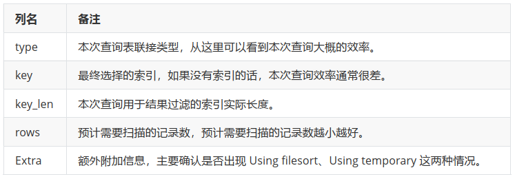

其中，type包含以下几种结果，从上之下依次是最差到最好：

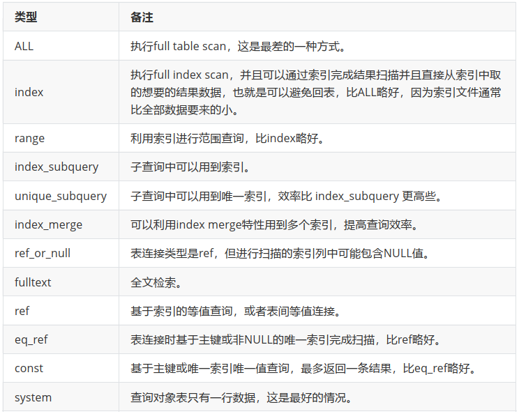

另外，Extra列需要注意以下的几种情况：

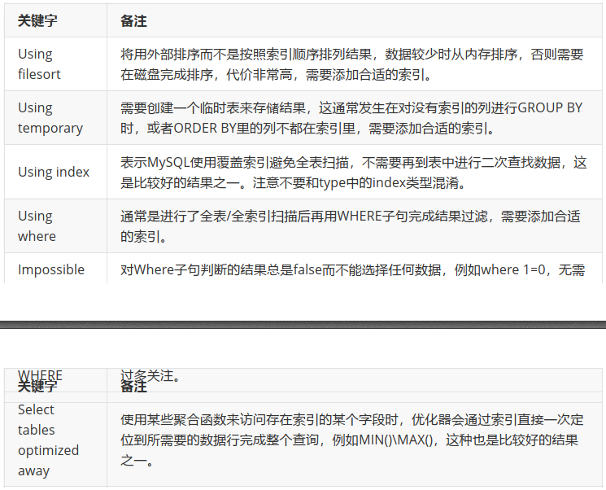


## 150、说一说你对redo log、undo log、binlog的了解 

### binlog（Binary Log）

二进制日志文件就是常说的binlog。**二进制日志记录了MySQL所有修改数据库的操作，然后以二进制的**
**形式记录在日志文件中，其中还包括每条语句所执行的时间和所消耗的资源，以及相关的事务信息**。

默认情况下，二进制日志功能是开启的，启动时可以重新配置--log-bin[=file_name]选项，修改二进
制日志存放的目录和文件名称。

### redo log：

重做日志用来实现事务的持久性，即事务ACID中的D。它由两部分组成：**一是内存中的重做日志缓冲**
**（redo log buffer），其是易失的；二是重做日志文件（redo log file），它是持久的**。

InnoDB是事务的存储引擎，**它通过Force Log at Commit机制实现事务的持久性，即当事务提交**
**（COMMIT）时，必须先将该事务的所有日志写入到重做日志文件进行持久化，待事务的COMMIT操作**
**完成才算完成**。这里的日志是指重做日志，在InnoDB存储引擎中，由两部分组成，即redo log和undo 
log。

**redo log用来保证事务的持久性，undo log用来帮助事务回滚及MVCC的功能**。redo log基本上都是**顺**
**序写**的，在数据库运行时不需要对redo log的文件进行读取操作。而**undo log是需要进行随机读写的**。


### undo log：

重做日志记录了事务的行为，可以很好地通过其对页进行“重做”操作。但是事务有时还需要进行回滚操
作，这时就需要undo。**因此在对数据库进行修改时，InnoDB存储引擎不但会产生redo，还会产生一定**
**量的undo**。这样如果用户执行的事务或语句由于某种原因**失败了，又或者用户用一条ROLLBACK语句**
**请求回滚，就可以利用这些undo信息将数据回滚到修改之前的样子**。

**redo存放在重做日志文件中**，与redo不同，**undo存放在数据库内部的一个特殊段（segment）中，这**
**个段称为undo段（undo segment），undo段位于共享表空间内**。


 


## 154、MySQL主从同步是如何实现的？ 

复制（replication）是MySQL数据库提供的一种**高可用高性能**的解决方案，一般用来建立大型的应用。
总体来说，replication的工作原理分为以下3个步骤：

1. **主服务器（master）把数据更改记录到二进制日志（binlog）中**。
2. **从服务器（slave）把主服务器的二进制日志复制到自己的中继日志（relay log）中**。
3. **从服务器重做中继日志中的日志，把更改应用到自己的数据库上，以达到数据的最终一致性**。

复制的工作原理并不复杂，其实就是一个完全备份加上二进制日志备份的还原。不同的是这个二进制日
志的还原操作基本上实时在进行中。这里特别需要注意的是，**复制不是完全实时地进行同步，而是异步**
**实时**。这中间存在主从服务器之间的**执行延时**，如果主服务器的压力很大，则可能导致主从服务器延时
较大。复制的工作原理如下图所示，其中从服务器**有2个线程，一个是I/O线程，负责读取主服务器的二**
**进制日志，并将其保存为中继日志；另一个是SQL线程，复制执行中继日志**。

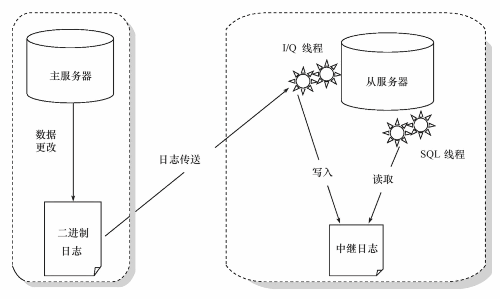


## 156、更新是如何保证一致的？

**更新属于当前读，会加X型的行级锁，是通过锁来保证一致性的**。

比如，事务 A 执行对一条 id = 1 的记录进行了更新，其他事务如果想更新或者删除这条记录的话，会发生阻塞，只有当事务 a 提交了事务才会释放锁。


## 159、可重复读下，快照是在什么时候⽣成的，是事务启动时，还是语句执行前

在 MySQL 有两种开启事务的命令，分别是：

- 第⼀种：begin/start transaction 命令；
- 第⼆种：start transaction with consistent snapshot 命令；

这两种开启事务的命令，创建 read view 的时机是不同的：

- **执⾏了 begin/start transaction 命令后，并不会创建 read view，只有在第⼀次执⾏ select 语句**
  **后， 才会创建 read view**。

- **执⾏了 start transaction with consistent snapshot 命令，就会⻢上创建 read view**。

  

### 可重复读下，执⾏两个select语句，会⽣成⼏个快照？ 

⼩林补充：只会⽣成⼀次 read view。


### 可重复读下场景题 

问题：他给的场景是 先select value where id = 1的记录此时value = 1，然后update value = 2 where 
id = 1，然后再select value where id = 1，查询的结果是什么，此时事务还未提交。

读者回答：回答了 value 是 1。

⼩林补充：value 是2，同⼀个事务的所有更新操作，都是可⻅的。**事务隔离性，隔离的是其他事务，不**
**隔离⾃⼰⼈**。


## 161、MySQL存储过程和函数的区别

**存储过程是事先经过编译并存储在数据库中的一段 SQL 语句的集合**，调用存储过程可以简化应用开发人员的很多工作，减少数据在数据库和应用服务器之间的传输，对于提高数据处理的效率是有好处的。

存储过程思想上很简单，就是数据库 SQL 语言层面的代码封装与重用。

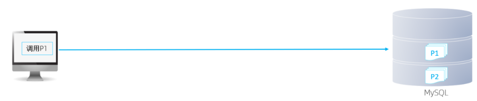

**特点：**

- 封装，复用 -----------------------> 可以把某一业务SQL封装在存储过程中，需要用到的时候直接调用即可。
- 可以接收参数，也可以返回数据 --------> 再存储过程中，可以传递参数，也可以接收返回值。
- 减少网络交互，效率提升 -------------> 如果涉及到多条SQL，每执行一次都是一次网络传输。 而如果封装在存储过程中，我们只需要网络交互一次可能就可以了。

