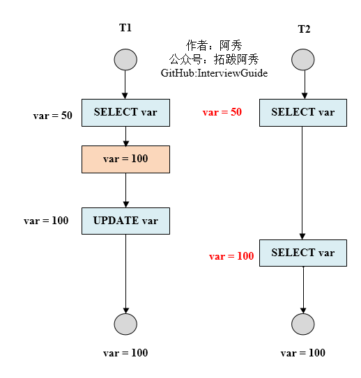

# MySQL

## 1、事务四大特性（ACID）原子性、一致性、隔离性、持久性？

事务指的是满足 ACID 特性的一组操作，可以通过 Commit 提交一个事务，也可以使用 Rollback 进行回滚

### 第一种回答

**原子性**：一个事务（transaction）中的所有操作，要么全部完成，要么全部不完成，不会结束在中间某个环节。
。事务在执行过程中发生错误，会被恢复（Rollback）到事务开始前的状态，就像这个事务从来没有执行过一样。

**一致性**：在事务开始之前和事务结束以后，数据库的完整性没有被破坏。这表示写入的资料必须完全符合所有的预设规则，这包含资料的精确度、串联性以及后续数据库可以自发性地完成预定的工作。

**隔离性**：数据库允许多个并发事务同时对其数据进行读写和修改的能力，隔离性可以防止多个事务并发执行时由于交叉执行而导致数据的不一致。事务隔离分为不同级别，包括读未提交（Read uncommitted）、读提交（read committed）、可重复读（repeatable read）和串行化（Serializable）。

**持久性**：事务处理结束后，对数据的修改就是永久的，即便系统故障也不会丢失。

### **第二种回答**

原子性（Atomicity）

- 原子性是指事务包含的所有操作要么全部成功，要么全部失败回滚，因此事务的操作如果成功就必须要完全应用到数据库，如果操作失败则不能对数据库有任何影响。

一致性（Consistency）

- 事务开始前和结束后，数据库的完整性约束没有被破坏。比如A向B转账，不可能A扣了钱，B却没收到。

隔离性（Isolation）

- 隔离性是当多个用户并发访问数据库时，比如操作同一张表时，数据库为每一个用户开启的事务，不能被其他事务的操作所干扰，多个并发事务之间要相互隔离。

同一时间，只允许一个事务请求同一数据，不同的事务之间彼此没有任何干扰。比如A正在从一张银行卡中取钱，在A取钱的过程结束前，B不能向这张卡转账。
关于事务的隔离性数据库提供了多种隔离级别，稍后会介绍到。  

 持久性（Durability）

- 持久性是指一个事务一旦被提交了，那么对数据库中的数据的改变就是永久性的，即便是在数据库系统遇到故障的情况下也不会丢失提交事务的操作。

### 其他

- **原子性（Atomicity）**：一个事务中的所有操作，要么全部完成，要么全部不完成，不会结束在中间某个环节，而且事务在执行过程中发生错误，会被回滚到事务开始前的状态，就像这个事务从来没有执行过一样，就好比买一件商品，购买成功时，则给商家付了钱，商品到手；购买失败时，则商品在商家手中，消费者的钱也没花出去。
- **一致性（Consistency）**：是指事务操作前和操作后，数据满足完整性约束，数据库保持一致性状态。比如，用户 A 和用户 B 在银行分别有 800 元和 600 元，总共 1400 元，用户 A 给用户 B 转账 200 元，分为两个步骤，从 A 的账户扣除 200 元和对 B 的账户增加 200 元。一致性就是要求上述步骤操作后，最后的结果是用户 A 还有 600 元，用户 B 有 800 元，总共 1400 元，而不会出现用户 A 扣除了 200 元，但用户 B 未增加的情况（该情况，用户 A 和 B 均为 600 元，总共 1200 元）。
- **隔离性（Isolation）**：数据库允许多个并发事务同时对其数据进行读写和修改的能力，隔离性可以防止多个事务并发执行时由于交叉执行而导致数据的不一致，因为多个事务同时使用相同的数据时，不会相互干扰，每个事务都有一个完整的数据空间，对其他并发事务是隔离的。也就是说，消费者购买商品这个事务，是不影响其他消费者购买的。
- **持久性（Durability）**：事务处理结束后，对数据的修改就是永久的，即便系统故障也不会丢失。


## 2、并发事务会引发哪些问题？如何解决

- [并发一致性问题](#3、数据库并发事务会带来哪些问题？/脏读、幻读、丢弃更改、不可重复读的区别？)：会产生脏读（读到还没有提交的数据）、不可重复读（两次读取数据不一致）、幻影读、丢失修改
- 解决：[隔离级别](#2、事务的数据库隔离级别有哪些？)


## 2、事务的数据库隔离级别有哪些？

### **未提交读**

事务中发生了修改，即使没有提交，其他事务也是可见的，比如对于一个数A原来50修改为100，但是我还没有提交修改，另一个事务看到这个修改，而这个时候原事务发生了回滚，这时候A还是50，但是另一个事务看到的A是100.**可能会导致脏读、幻读或不可重复读**

### **提交读**

对于一个事务从开始直到提交之前，所做的任何修改是其他事务不可见的，举例就是对于一个数A原来是50，然后提交修改成100，这个时候另一个事务在A提交修改之前，读取的A是50，刚读取完，A就被修改成100，这个时候另一个事务再进行读取发现A就突然变成100了；**可以阻止脏读，但是幻读或不可重复读仍有可能发生**

### **重复读**

就是对一个记录读取多次的记录是相同的，比如对于一个数A读取的话一直是A，前后两次读取的A是一致的；**可以阻止脏读和不可重复读，但幻读仍有可能发生**

- **可串行化读**，在并发情况下，和串行化的读取的结果是一致的，没有什么不同，比如不会发生脏读和幻读；**该级别可以防止脏读、不可重复读以及幻读** （强制事务串行执行，这样多个事务互不干扰，**不会出现并发一致性问题**。该隔离级别需要加锁实现，因为要使用加锁机制保证同一时间只有一个事务执行，也就是保证事务串行执行。）

| 隔离级别                  | 脏读 | 不可重复读 | 幻影读 |
| ------------------------- | ---- | ---------- | ------ |
| READ-UNCOMMITTED 未提交读 | √    | √          | √      |
| READ-COMMITTED 提交读     | ×    | √          | √      |
| REPEATABLE-READ 重复读    | ×    | ×          | √      |
| SERIALIZABLE 可串行化读   | ×    | ×          | ×      |

> 这四大等级从上到下，隔离的效果是逐渐增强，但是性能却是越来越差。

MySQL InnoDB 存储引擎的默认支持的隔离级别是 **REPEATABLE-READ**（可重读）

**这里需要注意的是**：与 SQL 标准不同的地方在于InnoDB 存储引擎在 REPEATABLE-READ（可重读）事务隔离级别 下使用的是**Next-Key Lock 锁**算法，因此可以避免幻读的产生，这与其他数据库系统(如 SQL Server)是不同的。所以 说InnoDB 存储引擎的默认支持的隔离级别是 REPEATABLE-READ（可重读） 已经可以完全保证事务的隔离性要求，即达到了 SQL标准的SERIALIZABLE(可串行化)隔离级别。

因为隔离级别越低，事务请求的锁越少，所以大部分数据库系统的隔离级别都是READ-COMMITTED(读取提交内 容):，但是你要知道的是InnoDB 存储引擎默认使用 **REPEATABLE-READ（可重读）并不会有任何性能损失**。

InnoDB 存储引擎在分布式事务 的情况下一般会用到SERIALIZABLE(可串行化)隔离级别。


## 3、数据库并发事务会带来哪些问题？/脏读、幻读、丢弃更改、不可重复读的区别？

这里有一个关键字，**并发一致性**

数据库并发会带来脏读、幻读、丢弃更改、不可重复读这四个常见问题，其中：

**脏读**：在第一个修改事务和读取事务进行的时候，读取事务读到的数据为100，这是修改之后的数据，但是之后该事务满足一致性等特性而做了回滚操作，那么读取事务得到的结果就是脏数据了。（读脏数据就是读取本来要回滚的数据）

**幻读**：一般是T1在某个范围内进行修改操作（增加或者删除），而T2读取该范围导致读到的数据是修改之间的了，强调范围。（幻读的本质就是不可重复读）

**丢弃修改**：两个写事务T1 T2同时对A=0进行递增操作，结果T2覆盖T1，导致最终结果是1 而不是2，事务被覆盖（丢失修改就是写覆盖）

**不可重复读**：T2 读取一个数据，然后T1 对该数据做了修改。如果 T2 再次读取这个数据，此时读取的结果和第一次读取的结果不同。（不可重复读就是由于第二次读取别的事务写之后的数据，而导致两次读取到不同数据）

### **脏读**


第一个事务首先读取var变量为50，接着准备更新为100的时，并未提交，第二个事务已经读取var为100，此时第一个事务做了回滚。最终第二个事务读取的var和数据库的var不一样。

### **幻读（幻影读）**


T1 读取某个范围的数据，T2 在这个范围内插入新的数据，T1 再次读取这个范围的数据，此时读取的结果和和第一次读取的结果不同。

### **丢弃修改**


T1 和 T2 两个事务都对一个数据进行修改，T1 先修改，T2 随后修改，T2 的修改覆盖了 T1 的修改。例如：事务1读取某表中的数据A=50，事务2也读取A=50，事务1修改A=A+50，事务2也修改A=A+50，最终结果A=100，事务1的修改被丢失。

### **不可重复读**



T2 读取一个数据，T1 对该数据做了修改。如果 T2 再次读取这个数据，此时读取的结果和第一次读取的结果不同。


## 4、数据库引擎InnoDB与MyISAM的区别

### **InnoDB**

- 是 MySQL 默认的事务型存储引擎，只有在需要它不支持的特性时，才考虑使用其它存储引擎。
- 实现了四个标准的隔离级别，默认级别是可重复读(REPEATABLE READ)。在可重复读隔离级别下，通过多版本并发控制(MVCC)+ 间隙锁(Next-Key Locking)防止幻影读。
- 主索引是聚簇索引，在索引中保存了数据，从而避免直接读取磁盘，因此对查询性能有很大的提升。
- 内部做了很多优化，包括从磁盘读取数据时采用的可预测性读、能够加快读操作并且自动创建的自适应哈希索引、能够加速插入操作的插入缓冲区等。
- 支持真正的在线热备份。其它存储引擎不支持在线热备份，要获取一致性视图需要停止对所有表的写入，而在读写混合场景中，停止写入可能也意味着停止读取。

### **MyISAM**

- 设计简单，数据以紧密格式存储。对于只读数据，或者表比较小、可以容忍修复操作，则依然可以使用它。
- 提供了大量的特性，包括压缩表、空间数据索引等。
- 不支持事务。
- 不支持行级锁，只能对整张表加锁，读取时会对需要读到的所有表加共享锁，写入时则对表加排它锁。但在表有读取操作的同时，也可以往表中插入新的记录，这被称为并发插入(CONCURRENT INSERT)。

### **总结**

- 事务: InnoDB 是事务型的，可以使用 `Commit` 和 `Rollback` 语句。
- 并发: MyISAM 只支持表级锁，而 InnoDB 还支持行级锁。
- 外键: InnoDB 支持外键。
- 备份: InnoDB 支持在线热备份。
- 崩溃恢复: MyISAM 崩溃后发生损坏的概率比 InnoDB 高很多，而且恢复的速度也更慢。
- 其它特性: MyISAM 支持压缩表和空间数据索引。


## 5、为什么MySQL索引要使用B+树，而不是B树或者红黑树？

我们在MySQL中的数据一般是放在磁盘中的，读取数据的时候肯定会有访问磁盘的操作，磁盘中有两个机械运动的部分，分别是盘片旋转和磁臂移动。

盘片旋转就是我们市面上所提到的多少转每分钟，而磁盘移动则是在盘片旋转到指定位置以后，移动磁臂后开始进行数据的读写。

那么这就存在一个定位到磁盘中的块的过程，而定位是磁盘的存取中花费时间比较大的一块，毕竟机械运动花费的时候要远远大于电子运动的时间。

当大规模数据存储到磁盘中的时候，显然定位是一个非常花费时间的过程，但是我们可以通过B树进行优化，提高磁盘读取时定位的效率。

### 为什么B类树可以进行优化呢？

我们可以根据B类树的特点，构造一个多阶的B类树，然后在尽量多的在结点上存储相关的信息，**保证层数（树的高度）尽量的少**，以便后面我们可以更快的找到信息，**磁盘的I/O操作也少一些**，而且B类树是平衡树，每个结点到叶子结点的高度都是相同，这也保证了每个查询是稳定的。

特别地：**只有B-树和B+树，这里的B-树是叫B树，不是B减树，没有B减树的说法。**


## 第二种

AVL树（平衡二叉树、Adelson-Velsky and Landis Tree），适合用于插入删除次数比较少，但查找多的情况。所以对于搜索、插入、删除操作多的情况下，我们就用红黑树。

稳定、更快（树的高度小）

- **B+树的磁盘读写代价更低**：B树的每个节点都存储了key和data，而B+树的data存储在叶子节点上。B+树非叶子节点仅存储key不存储data，这样一个节点就可以存储更多的key。可以使得B+树相对B树来说更矮（IO次数就是树的高度），所以与磁盘交换的IO操作次数更少。
- **B+树的查询效率更加稳定**：由于非终结点并不是最终指向文件内容的结点，而只是叶子结点中关键字的索引。所以任何关键字的查找必须走一条从根结点到叶子结点的路。所有关键字查询的路径长度相同，导致每一个数据的查询效率相当。

> 参考：<https://blog.csdn.net/qq_37102984/article/details/119646611>


## 6、MySQL中有哪些索引？有什么特点？

- **普通索引**：仅加速查询
- **唯一索引**：加速查询 + 列值唯一（可以有null）
- **主键索引**：加速查询 + 列值唯一（不可以有null）+ 表中只有一个
- **组合索引**：多列值组成一个索引，专门用于组合搜索，其效率大于索引合并
- **全文索引**：对文本的内容进行分词，进行搜索
- **索引合并**：使用多个单列索引组合搜索
- **覆盖索引**：select的数据列只用从索引中就能够取得，不必读取数据行，换句话说查询列要被所建的索引覆盖
- **聚簇索引**：表数据是和主键一起存储的，主键索引的叶结点存储行数据(包含了主键值)，二级索引的叶结点存储行的主键值。使用的是B+树作为索引的存储结构，非叶子节点都是索引关键字，但非叶子节点中的关键字中不存储对应记录的具体内容或内容地址。叶子节点上的数据是主键与具体记录(数据内容)


###  数据库有哪些常见索引？数据库设计的范式是什么？

- 密集索引和稀疏索引：MyISAM全是稀疏索引，InnoDB有且只有一个密集索引
- 聚集索引和非聚集索引
  - 聚集索引：数据行的物理顺序与列值（一般是主键的那一列）的逻辑顺序相同，一个表中只能拥有一个聚集索引。**索引的叶子节点就是对应的数据节点**
  - 非聚集索引：该索引中索引的逻辑顺序与磁盘上行的物理存储顺序不同，一个表中可以拥有多个非聚集索引。[涉及到二次查询](https://www.cnblogs.com/s-b-b/p/8334593.html)：**非聚集索引叶节点仍然是索引节点，只是有一个指针指向对应的数据块，此如果使用非聚集索引查询，而查询列中包含了其他该索引没有覆盖的列，那么他还要进行第二次的查询，查询节点上对应的数据行的数据**


## 7、MySQL的行级锁有哪些？

主要有三种，记录锁、间隙锁、临建锁。

- 记录锁：锁住的是一条记录，记录锁分为排他锁和共享锁。
- 间隙锁：只存在于可重复读隔离级别，目的是为了解决可重复读隔离级别下幻读的现象。
- 临键锁：是 Record Lock + Gap Lock 的组合，锁定一个范围，并且锁定记录本身。next-key lock 即能保护该记录，又能阻止其他事务将新纪录插入到被保护记录前面的间隙中。


## 8、MySQL常见的存储引擎InnoDB、MyISAM的适用场景分别是？

区别

1）事务：MyISAM不支持，InnoDB支持
2）锁级别： MyISAM 表级锁，InnoDB 行级锁及外键约束
3）MyISAM存储表的总行数；InnoDB不存储总行数；
4）MyISAM采用非聚集索引，B+树叶子存储指向数据文件的指针。InnoDB主键索引采用聚集索引，B+树叶子存储数据

### **适用场景**

MyISAM适合： 插入不频繁，查询非常频繁，如果执行大量的SELECT，MyISAM是更好的选择， 没有事务。
InnoDB适合： 可靠性要求比较高，或者要求事务； 表更新和查询都相当的频繁， 大量的INSERT或UPDATE


## 9、读可重复读和读提交有什么区别

对于可重复读来说，就是在 a 进入这个事务以后，那个他的这个数据在他的视图来说就是已经是固定了，如果说在 a 这个事务提交之前 B 的这个事务修改了那个数据，在 A 是看不到的
于读提交的情况来说，就是说还是 a b 两个事务，b 事务修改一个数据然后并且提交以后，但 a a 还没有提交，然后 a 这个时候去读那个数据，就会读到 b 已经修改的数据。

### 补充

读提交，指一个事务提交之后，它做的变更才能被其他事务看到。
可重复读，指一个事务执行过程中看到的数据，一直跟这个事务启动时看到的数据是一致的，MySQL InnoDB 引擎的默认隔离级别。
对于「读提交」和「可重复读」隔离级别的事务来说，它们是通过 MVCC 来实现的，它们的区别在于创建 Read View 的时机不同，大家可以把 Read View 理解成一个数据快照，就像相机拍照那样，定格某一时刻的风景。
「读提交」隔离级别是在「每个语句执行前」都会重新生成一个 Read View，而「可重复读」隔离级别是「启动事务时」生成一个 Read View，然后整个事务期间都在用这个 Read View。


## 10、说一下你理解的分库分表？

根据业务字段的hash值来确定分片的，比如user_id不同的用户信息就会存储到不同分片当中，他是多个分片同时提供服务。

### 补充

当数据量过大造成事务执行缓慢时，就要考虑分表，因为减少每次查询数据总量是解决数据查询缓慢的主要原因。你可能会问：“查询可以通过主从分离或缓存来解决，为什么还要分表？”但这里的查询是指事务中的查询和更新操作。

为了应对高并发，一个数据库实例撑不住，即单库的性能无法满足高并发的要求，就把并发请求分散到多个实例中去，这种就是分库。

总的来说，分库分表使用的场景不一样： 分表是因为数据量比较大，导致事务执行缓慢；分库是因为单库的性能无法满足要求。


## 11、谈一下你理解的binlog？

binlog是二进制日志文件。他主要用来做主从同步。他有statement格式和row格式。

statement记录了执行的SQL语句，Row 格式保存哪条记录被修改。

binlog事务提交的时候才写入的。也可以用来做归档。

### 补充

binlog日志是MySQL数据库的一种日志记录机制，用于记录数据库的修改操作（如插入、更新、删除等），以便在需要时进行数据恢复、数据复制和数据同步等操作。

binlog日志的实现以下功能：

- 数据恢复：binlog日志可以用于回滚到之前的某个时间点，从而恢复数据。
- 数据复制：binlog日志可以用于在主从数据库之间复制数据，从而实现数据的高可用和负载均衡等功能。
  MySQL的binlog日志有三种格式，分别是Statement格式、Row格式和Mixed格式。它们之间的区别如下：
- STATEMENT：每一条修改数据的 SQL 都会被记录到 binlog 中（相当于记录了逻辑操作，所以针对这种格式， binlog 可以称为逻辑日志），主从复制中 slave 端再根据 SQL 语句重现。但 STATEMENT 有动态函数的问题，比如你用了 uuid 或者 now 这些函数，你在主库上执行的结果并不是你在从库执行的结果，这种随时在变的函数会导致复制的数据不一致；
- ROW：记录行数据最终被修改成什么样了（这种格式的日志，就不能称为逻辑日志了），不会出现 STATEMENT 下动态函数的问题。但 ROW 的缺点是每行数据的变化结果都会被记录，比如执行批量 update 语句，更新多少行数据就会产生多少条记录，使 binlog 文件过大，而在 STATEMENT 格式下只会记录一个 update 语句而已；
- MIXED：包含了 STATEMENT 和 ROW 模式，它会根据不同的情况自动使用 ROW 模式和 STATEMENT 模式；


## 12、说一下你理解的外键约束？

举例来说，某一个字段是表b的主键，但是它也是表a中的字段，表a中该字段的使用范围取决于表b。外键约束主要是用来维护两个表的一致性。

### 补充

外键约束的作用是维护表与表之间的关系，确保数据的完整性和一致性。让我们举一个简单的例子：

假设你有两个表，一个是学生表，另一个是课程表，这两个表之间有一个关系，即一个学生可以选修多门课程，而一门课程也可以被多个学生选修。在这种情况下，我们可以在学生表中定义一个指向课程表的外键，如下所示：

```sql
CREATE TABLE students (
  id INT PRIMARY KEY,
  name VARCHAR(50),
  course_id INT,
  FOREIGN KEY (course_id) REFERENCES courses(id)
);
```

这里，students表中的course_id字段是一个外键，它指向courses表中的id字段。这个外键约束确保了每个学生所选的课程在courses表中都存在，从而维护了数据的完整性和一致性。

如果没有定义外键约束，那么就有可能出现学生选了不存在的课程或者删除了一个课程而忘记从学生表中删除选修该课程的学生的情况，这会破坏数据的完整性和一致性。因此，使用外键约束可以帮助我们避免这些问题。


## 13、char和varchar的区别？

char是固定长度的字符串类型，varchar是可变长度的字符串类型。

拿char(128)和varchar(128)举例来说。char(128)是无论字符串大小，都会在磁盘上分配128个字符的内存空间。而varchar(128)会根据字符本身的长短来分配内存空间。

### 补充

在MySQL中，CHAR和VARCHAR都是用于存储字符类型数据的数据类型，它们的区别在于存储方式和使用场景。

CHAR类型用于存储固定长度的字符串，其长度在定义表时就已经固定，且最大长度为255个字符。当存储的字符串长度小于定义的长度时，MySQL会在其后面补充空格使其长度达到定义的长度。由于存储的长度是固定的，因此CHAR类型的读取速度比VARCHAR类型更快。

VARCHAR类型则用于存储可变长度的字符串，其长度可以在存储数据时动态地改变，但最大长度也为255个字符。当存储的字符串长度小于定义的长度时，MySQL不会在其后面补充空格。由于存储的长度是可变的，因此VARCHAR类型的存储空间相对更小，但读取速度比CHAR类型稍微慢一些。

### 那与varchar相比，char字段是不是一无是处呢？

大部分情况，是的，最好使用varchar。不过考虑一个极端的场景：某个字段的最大长度是100字节，但是会频繁修改。如果使用char(100)，则插入记录后就分配了100个字节，后续修改不会造成页分裂、页空隙等问题，而varchar(100)由于没有提前分配存储空间，后续修改时可能出现页分裂，进而导致性能下降。


## 14、数据库delete和trancate区别

delete和truncate都是用来删除数据或表的命令，但是它们之间有一些区别。

- delete属于数据库DML操作语言，只删除数据不删除表的结构，会走事务，执行时会触发trigger;
- 在InnoDB中，DELETE其实并不会真的把数据删除，mysql实际上只是给删除的数据打了个标记为已删除，因此delete删除表中的数据时，表文件在磁盘上所占空间不会变小，存储空间不会被释放，只是把删除的数据行设置为不可见。虽然未释放磁盘空间，但是下次插入数据的时候，仍然可以重用这部分空间(重用→覆盖);
- DELETE执行时，会先将所删除数据缓存到rollback segement中，事务commit之后生效；
- delete from table_name删除表的全部数据，对于MyISAM会立刻释放磁盘空间，InnoDB不会释放磁盘空间；
  delete用于删除表中的所有数据，但是保留表的结构。使用truncate命令后，表的结构和数据都会被删除，无法恢复 。

### chatgpt:

数据库中的 DELETE 和 TRUNCATE 是两个常用的数据删除操作，它们之间有以下几个区别：

1. 删除方式：DELETE 是逐条删除满足条件的数据，而 TRUNCATE 是一次性删除整个表中的所有数据。

2. 操作类型：DELETE 是 DML（Data Manipulation Language）操作，用于对数据进行修改。TRUNCATE 是 DDL（Data Definition Language）操作，用于对表的结构进行更改。

3. 事务和回滚：DELETE 可以在事务中使用，并且可以回滚操作，即可以撤销已执行的删除操作。而 TRUNCATE 不能在事务中使用，并且无法回滚操作，一旦执行 TRUNCATE，数据就无法恢复。

4. 存储空间：DELETE 操作会保留已删除数据的空间，被标记为已删除但并未释放。而 TRUNCATE 操作则会释放表占用的存储空间。

5. 触发器：DELETE 操作在执行时会触发与表关联的触发器（如果有定义）。而 TRUNCATE 操作不会触发触发器。

6. 权限：DELETE 需要对表具有 DELETE 权限，而 TRUNCATE 需要对表具有 ALTER 权限。

7. 外键约束：DELETE 操作在删除数据时可能会遇到外键约束的问题，需要先删除与其相关的外键数据，否则会报错。而 TRUNCATE 操作会自动删除与其相关的外键约束。

总结：
DELETE 和 TRUNCATE 是数据库中常用的数据删除操作，它们的主要区别在于删除方式、操作类型、事务和回滚、存储空间、触发器、权限以及外键约束的处理。根据具体的需求和场景选择适当的操作方法。


## 15、mysql查询优化，从哪些点进行考虑

- 为搜索字段创建索引
- 避免使用 Select *，列出需要查询的字段
- 垂直分割分表
- 选择正确的存储引擎

### chatgpt：

在对 MySQL 查询进行优化时，可以从以下几个方面进行考虑：

1. 使用合适的索引：通过创建和使用适当的索引，可以提高查询的性能。分析查询语句中的 WHERE、JOIN 或 ORDER BY 子句，并为相关列创建索引，以加快数据的查找和过滤。

2. 优化查询语句：审查查询语句的逻辑结构和语义，确保它们是有效且高效的。避免不必要的连接、子查询和函数调用，简化查询条件和排序规则，减少查询的数据量和复杂度。

3. 避免全表扫描：尽量避免对整个表进行全表扫描，特别是在大型表上执行这样的操作会导致性能下降。通过合理使用索引或添加合适的条件来缩小扫描范围。

4. 适当分解复杂查询：将复杂的查询拆分为多个简单的查询，根据需求进行合理的组合。这样可以减少查询的数据量和计算量，提高查询的效率。

5. 使用合理的数据类型：选择合适的数据类型来存储数据，避免浪费存储空间和计算资源。例如，使用适当大小的整数类型、字符类型和日期时间类型等。

6. 调整系统参数和缓冲区配置：根据数据库的工作负载和硬件资源，调整 MySQL 的系统参数和缓冲区配置。优化数据库的内存使用、磁盘 IO 和并发连接等方面的设置，以提高查询性能。

7. 定期收集统计信息：通过定期收集表和索引的统计信息，MySQL 可以更好地优化查询计划，选择最佳的执行路径。使用 ANALYZE TABLE 或 OPTIMIZE TABLE 命令更新统计信息。

8. 确保数据库设计良好：合理的数据库设计可以减少冗余数据、避免复杂的关联和联接操作，并确保表结构符合范式要求。这有助于提高查询效率和数据一致性。

综上所述，通过对索引、查询语句、扫描方式、查询拆分、数据类型、系统配置、统计信息和数据库设计等方面进行优化，可以提升 MySQL 数据库查询的性能和响应速度。


## 16、MySQL建索引怎么建

### chatgpt：

在 MySQL 中建立索引可以通过以下几个步骤进行：

1. 分析查询语句：首先，分析需要优化的查询语句，确定需要添加索引的列。观察 WHERE、JOIN 或 ORDER BY 子句中经常用于过滤和排序的列。

2. 选择合适的索引类型：MySQL 支持多种索引类型，包括普通索引、唯一索引、全文索引等。根据需求选择合适的索引类型。

3. 创建索引：使用 `CREATE INDEX` 语句来创建索引。语法如下：
   ```sql
   CREATE [UNIQUE] INDEX index_name ON table_name (column1, column2, ...);
   ```

   - `index_name` 是索引的名称，可根据实际命名规范自定义。
   - `table_name` 是要为其创建索引的表名。
   - `(column1, column2, ...)` 是需要添加索引的列名，可以包含一个或多个列。

4. 考虑索引的顺序：对于复合索引（包含多个列的索引），应该根据查询的特点和频率来确定列的顺序。将经常使用的列放在前面，以提高查询效率。

5. 避免过多的索引：避免在一个表上创建过多的索引，因为每个索引都会占用存储空间，增加维护成本，并可能导致性能下降。只为常用的查询添加索引，并根据实际需求进行权衡。

6. 更新索引统计信息：创建索引后，可以使用 `ANALYZE TABLE` 或 `OPTIMIZE TABLE` 命令来更新表和索引的统计信息，以帮助 MySQL 优化查询计划。

7. 监控索引效果：在建立索引后，观察查询性能的变化，通过 EXPLAIN 或其他性能监控工具来评估索引的效果，如果需要进一步优化，可以调整索引策略或添加更合适的索引。

需要注意的是，索引的选择和创建需要根据实际情况进行，包括数据量、查询频率、数据更新频率等因素。过多、不必要或错误的索引可能会导致性能问题。因此，在进行索引设计时，请在真实环境中进行测试，并综合考虑各种因素进行权衡和优化。


## 17、可重复读的优势

可重复读（REPEATABLE READ）是 MySQL 数据库中的一个事务隔离级别，具有以下几个优势：

1. 保证数据一致性：在可重复读隔离级别下，同一个事务在执行期间看到的数据是一致的。即使其他事务对数据进行了修改或删除，当前事务仍然可以看到最初读取的数据。这样确保了数据的一致性和稳定性。

2. 避免脏读：可重复读隔离级别避免了脏读问题。脏读指的是一个事务读取到了另一个事务未提交的数据，可能导致不正确的结果。可重复读级别下，读取的数据只能是已经提交的数据，不会读取到未提交的临时数据。

3. 避免不可重复读：可重复读隔离级别还避免了不可重复读问题。不可重复读指的是在同一个事务中，多次读取同一行数据时，由于其他事务的更新操作，每次读取的数据可能不一致。可重复读级别下，事务读取的数据不会受到其他事务的更新操作影响，保证了读取的一致性。

4. 提供数据一致性快照：在可重复读隔离级别下，事务在开始时会创建一个数据快照，这个快照将保持事务执行期间的一致状态。即使其他事务对数据进行了修改，当前事务仍然可以访问它开始时快照中的数据，而不会受到其他事务的影响。

5. 并发性和性能优化：可重复读隔离级别可以提供高度的并发性，在同一时间内允许多个事务同时读取相同的数据，而不会出现争用和冲突。这有助于提高数据库的并发性能，减少锁竞争和资源等待。

总结：可重复读隔离级别通过保证数据的一致性、避免脏读和不可重复读、提供快照以及提高并发性能等方面的优势，确保事务在高并发环境下的正确性和稳定性。但也需要注意，可重复读隔离级别可能导致幻读问题，即一个事务在同一查询条件下两次查询返回不同的行数。对于特定的场景和需求，需要根据实际情况选择合适的隔离级别。


## 18、如果不是可重复读，但是部分业务需要可重复读，业务怎么处理呢

如果某些业务需要可重复读隔离级别，但是数据库的默认隔离级别不是可重复读，可以考虑以下几种处理方法：

1. 修改隔离级别：可以将数据库的默认隔离级别修改为可重复读。在 MySQL 中，可以使用 `SET TRANSACTION ISOLATION LEVEL REPEATABLE READ;` 命令来设置当前会话的隔离级别为可重复读。请注意，该设置只对当前会话有效，其他会话仍然使用默认的隔离级别。

2. 单独设置事务隔离级别：对于需要可重复读的业务，可以在每个涉及到这些业务的事务中手动设置隔离级别为可重复读，例如使用 `SET TRANSACTION ISOLATION LEVEL REPEATABLE READ;` 命令。

3. 使用快照读或历史表：对于只读取数据而不做修改的业务，可以考虑使用快照读或历史表的方式来实现可重复读。快照读是指在某个时间点对数据进行读取，保持一致性，而不受后续修改的影响。历史表则是将每次数据变动的记录保存下来，以便查询历史数据。

4. 增加业务逻辑处理：如果不能直接修改隔离级别，并且无法使用快照读或历史表的方式，可以通过增加业务逻辑来处理可重复读的需求。例如，在读取数据后将其缓存起来，然后在事务期间内使用缓存数据而不是再次查询数据库。

需要根据具体业务需求和系统环境来选择适合的处理方法。同时，应该权衡可重复读带来的性能开销和数据一致性的要求，确保业务和系统的稳定性和可扩展性。


## 19、索引优化详细讲讲

常见优化索引的方法：

- 前缀索引优化：使用前缀索引是为了减小索引字段大小，可以增加一个索引页中存储的索引值，有效提高索引的查询速度。在一些大字符串的字段作为索引时，使用前缀索引可以帮助我们减小索引项的大小。

- 覆盖索引优化：覆盖索引是指 SQL 中 query 的所有字段，在索引 B+Tree 的叶子节点上都能找得到的那些索引，从二级索引中查询得到记录，而不需要通过聚簇索引查询获得，可以避免回表的操作。

- 主键索引最好是自增的：

- - 如果我们使用自增主键，那么每次插入的新数据就会按顺序添加到当前索引节点的位置，不需要移动已有的数据，当页面写满，就会自动开辟一个新页面。因为每次**插入一条新记录，都是追加操作，不需要重新移动数据**，因此这种插入数据的方法效率非常高。
  - 如果我们使用非自增主键，由于每次插入主键的索引值都是随机的，因此每次插入新的数据时，就可能会插入到现有数据页中间的某个位置，这将不得不移动其它数据来满足新数据的插入，甚至需要从一个页面复制数据到另外一个页面，我们通常将这种情况称为**页分裂**。页分裂还有可能会造成大量的内存碎片，导致索引结构不紧凑，从而影响查询效率。

- 防止索引失效：

- - 当我们使用左或者左右模糊匹配的时候，也就是 `like %xx` 或者 `like %xx%`这两种方式都会造成索引失效；
  - 当我们在查询条件中对索引列做了计算、函数、类型转换操作，这些情况下都会造成索引失效；
  - 联合索引要能正确使用需要遵循最左匹配原则，也就是按照最左优先的方式进行索引的匹配，否则就会导致索引失效。
  - 在 WHERE 子句中，如果在 OR 前的条件列是索引列，而在 OR 后的条件列不是索引列，那么索引会失效。


## 20、主键索引和非主键索引有什么区别？

主键索引和非主键索引的主要区别在于：

1. 主键索引：主键是一种特殊的唯一索引，不允许有空值。每个表只能有一个主键。主键的主要作用是提供一种快速访问表中特定信息的方式。
2. 非主键索引：非主键索引，也称为二级索引或辅助索引，可以有多个。非主键索引允许有空值，也允许有重复的值。

当我们进行索引覆盖查询的时候，在二级索引上查询就可以了，就可以不需要回表，


## 21、mysql 有哪些索引，分别说一下？

可以按照四个角度来分类索引。

- 按「数据结构」分类：**B+tree索引、Hash索引、Full-text索引**。
- 按「物理存储」分类：**聚簇索引（主键索引）、二级索引（辅助索引）**。
- 按「字段特性」分类：**主键索引、唯一索引、普通索引、前缀索引**。
- 按「字段个数」分类：**单列索引、联合索引**。

为了让大家理解 B+Tree 索引的存储和查询的过程，接下来我通过一个简单例子，说明一下 B+Tree 索引在存储数据中的具体实现。

先创建一张商品表，id 为主键，如下：

```sql
CREATE TABLE `product`  (
  `id` int(11) NOT NULL,
  `product_no` varchar(20)  DEFAULT NULL,
  `name` varchar(255) DEFAULT NULL,
  `price` decimal(10, 2) DEFAULT NULL,
  PRIMARY KEY (`id`) USING BTREE
) CHARACTER SET = utf8 COLLATE = utf8_general_ci ROW_FORMAT = Dynamic;
```

商品表里，有这些行数据：


这些行数据，存储在 B+Tree 索引时是长什么样子的？

B+Tree 是一种多叉树，叶子节点才存放数据，非叶子节点只存放索引，而且每个节点里的数据是**按主键顺序存放**的。每一层父节点的索引值都会出现在下层子节点的索引值中，因此在叶子节点中，包括了所有的索引值信息，并且每一个叶子节点都有两个指针，分别指向下一个叶子节点和上一个叶子节点，形成一个双向链表。

主键索引的 B+Tree 如图所示（图中叶子节点之间我画了单向链表，但是实际上是双向链表，原图我找不到了，修改不了，偷个懒我不重画了，大家脑补成双向链表就行）：

主键索引 B+Tree

> 通过主键查询商品数据的过程

比如，我们执行了下面这条查询语句：

```sql
select * from product where id= 5;
```

这条语句使用了主键索引查询 id 号为 5 的商品。查询过程是这样的，B+Tree 会自顶向下逐层进行查找：

- 将 5 与根节点的索引数据 (1，10，20) 比较，5 在 1 和 10 之间，所以根据 B+Tree的搜索逻辑，找到第二层的索引数据 (1，4，7)；
- 在第二层的索引数据 (1，4，7)中进行查找，因为 5 在 4 和 7 之间，所以找到第三层的索引数据（4，5，6）；
- 在叶子节点的索引数据（4，5，6）中进行查找，然后我们找到了索引值为 5 的行数据。

数据库的索引和数据都是存储在硬盘的，我们可以把读取一个节点当作一次磁盘 I/O 操作。那么上面的整个查询过程一共经历了 3 个节点，也就是进行了 3 次 I/O 操作。

B+Tree 存储千万级的数据只需要 3-4 层高度就可以满足，这意味着从千万级的表查询目标数据最多需要 3-4 次磁盘 I/O，所以**B+Tree 相比于 B 树和二叉树来说，最大的优势在于查询效率很高，因为即使在数据量很大的情况，查询一个数据的磁盘 I/O 依然维持在 3-4次。**

> 通过二级索引查询商品数据的过程

主键索引的 B+Tree 和二级索引的 B+Tree 区别如下：

- 主键索引的 B+Tree 的叶子节点存放的是实际数据，所有完整的用户记录都存放在主键索引的 B+Tree 的叶子节点里；
- 二级索引的 B+Tree 的叶子节点存放的是主键值，而不是实际数据。

我这里将前面的商品表中的 product_no （商品编码）字段设置为二级索引，那么二级索引的 B+Tree 如下图（图中叶子节点之间我画了单向链表，但是实际上是双向链表，原图我找不到了，修改不了，偷个懒我不重画了，大家脑补成双向链表就行）。

二级索引 B+Tree

其中非叶子的 key 值是 product_no（图中橙色部分），叶子节点存储的数据是主键值（图中绿色部分）。

如果我用 product_no 二级索引查询商品，如下查询语句：

```
select * from product where product_no = '0002';
```

会先检二级索引中的 B+Tree 的索引值（商品编码，product_no），找到对应的叶子节点，然后获取主键值，然后再通过主键索引中的 B+Tree 树查询到对应的叶子节点，然后获取整行数据。**这个过程叫「回表」，也就是说要查两个 B+Tree 才能查到数据**。如下图（图中叶子节点之间我画了单向链表，但是实际上是双向链表，原图我找不到了，修改不了，偷个懒我不重画了，大家脑补成双向链表就行）：

回表

不过，当查询的数据是能在二级索引的 B+Tree 的叶子节点里查询到，这时就不用再查主键索引查，比如下面这条查询语句：

```
select id from product where product_no = '0002';
```

**这种在二级索引的 B+Tree 就能查询到结果的过程就叫作「覆盖索引」，也就是只需要查一个 B+Tree 就能找到数据**。

> 联合索引

通过将多个字段组合成一个索引，该索引就被称为联合索引。

比如，将商品表中的 product_no 和 name 字段组合成联合索引`(product_no, name)`，创建联合索引的方式如下：

```
CREATE INDEX index_product_no_name ON product(product_no, name);
```

联合索引`(product_no, name)` 的 B+Tree 示意图如下（图中叶子节点之间我画了单向链表，但是实际上是双向链表，原图我找不到了，修改不了，偷个懒我不重画了，大家脑补成双向链表就行）。

联合索引

可以看到，联合索引的非叶子节点用两个字段的值作为 B+Tree 的 key 值。当在联合索引查询数据时，先按 product_no 字段比较，在 product_no 相同的情况下再按 name 字段比较。

也就是说，联合索引查询的 B+Tree 是先按 product_no 进行排序，然后再 product_no 相同的情况再按 name 字段排序。

因此，使用联合索引时，存在**最左匹配原则**，也就是按照最左优先的方式进行索引的匹配。在使用联合索引进行查询的时候，如果不遵循「最左匹配原则」，联合索引会失效，这样就无法利用到索引快速查询的特性了。

比如，如果创建了一个 `(a, b, c)` 联合索引，如果查询条件是以下这几种，就可以匹配上联合索引：

- where a=1；
- where a=1 and b=2 and c=3；
- where a=1 and b=2；

需要注意的是，因为有查询优化器，所以 a 字段在 where 子句的顺序并不重要。

但是，如果查询条件是以下这几种，因为不符合最左匹配原则，所以就无法匹配上联合索引，联合索引就会失效:

- where b=2；
- where c=3；
- where b=2 and c=3；

上面这些查询条件之所以会失效，是因为`(a, b, c)` 联合索引，是先按 a 排序，在 a 相同的情况再按 b 排序，在 b 相同的情况再按 c 排序。所以，**b 和 c 是全局无序，局部相对有序的**，这样在没有遵循最左匹配原则的情况下，是无法利用到索引的。

我这里举联合索引（a，b）的例子，该联合索引的 B+ Tree 如下（图中叶子节点之间我画了单向链表，但是实际上是双向链表，原图我找不到了，修改不了，偷个懒我不重画了，大家脑补成双向链表就行）。

img

可以看到，a 是全局有序的（1, 2, 2, 3, 4, 5, 6, 7 ,8），而 b 是全局是无序的（12，7，8，2，3，8，10，5，2）。因此，直接执行`where b = 2`这种查询条件没有办法利用联合索引的，**利用索引的前提是索引里的 key 是有序的**。

只有在 a 相同的情况才，b 才是有序的，比如 a 等于 2 的时候，b 的值为（7，8），这时就是有序的，这个有序状态是局部的，因此，执行`where a = 2 and b = 7`是 a 和 b 字段能用到联合索引的，也就是联合索引生效了。


## 25、事务的原子性是怎么实现的

MySQL的事务原子性主要通过Undo Log（撤销日志）来实现的。

当进行一次事务操作时，MySQL会首先在Undo Log中记录下事务操作前的数据状态。如果事务成功执行并提交，Undo Log中的记录就可以被删除。但如果在事务执行过程中出现错误，或者用户执行了ROLLBACK操作，MySQL就会利用Undo Log中的信息将数据恢复到事务开始前的状态，从而实现事务的原子性。

这就意味着，事务要么全部执行成功，要么如果部分执行失败，那么已经执行的部分也会被撤销，保证数据的一致性。


## 26、事务的隔离性怎么实现的？

MySQL的事务隔离性主要通过锁机制和多版本并发控制（MVCC）来实现。

1. 锁机制：包括行锁和表锁。行锁可以精确到数据库表中的某一行，而表锁则会锁定整个数据表。当一个事务在操作某个数据项时，会对其加锁，阻止其他事务对同一数据项的并发操作，从而实现隔离性。
2. 多版本并发控制（MVCC）：这是InnoDB存储引擎特有的一种机制，它可以在不加锁的情况下创建数据在某一时间点的快照。在读取数据时，MVCC会返回该时间点的数据版本，即使该数据后来被其他事务修改。这样，每个事务都有自己的数据视图，彼此之间不会互相影响，实现了隔离性。

此外，MySQL还提供了四种隔离级别（读未提交、读已提交、可重复读、串行化），可以根据需要选择不同的隔离级别，以在并发性和数据一致性之间取得平衡。


## 26、多版本并发控制

Multi-Version Concurrency Control（MVCC）是 `MySQL` 的 `InnoDB `存储引擎实现隔离级别的一种具体方式，**用于实现提交读和可重复读这两种隔离级别。而未提交读隔离级别总是读取最新的数据行，要求很低，无需使用 MVCC**。可串行化隔离级别需要对所有读取的行都加锁，单纯使用 MVCC 无法实现。

> ##### 版本号
>
> - 系统版本号 SYS_ID：是一个递增的数字，每开始一个新的事务，系统版本号就会自动递增。
> - 事务版本号 TRX_ID ：事务开始时的系统版本号。
>
> Undo日志
>
> ReadView…

## 26、Next-Key Locks

Next-Key Locks 是 MySQL 的 InnoDB 存储引擎的一种锁实现。

MVCC 不能解决幻影读问题，Next-Key Locks 就是为了解决这个问题而存在的。在可重复读（REPEATABLE READ）隔离级别下，使用 MVCC + Next-Key Locks 可以解决幻读问题。

参考：<https://juejin.cn/post/7018137095315128328>


## 27、事务一致性怎么实现的？

MySQL实现事务一致性主要依赖于其InnoDB存储引擎的ACID属性，其中C代表一致性(Consistency)。具体来说，以下是MySQL如何实现事务一致性的一些方式：

1. **使用锁机制**：InnoDB存储引擎支持行级锁和表级锁，通过锁机制来控制并发事务的访问冲突，确保每个事务都在一致性的状态下执行。
2. **使用MVCC**：InnoDB存储引擎通过MVCC来实现读已提交和可重复读两个隔离级别，保证了事务的一致性视图，即在事务开始时生成一个快照，事务在执行过程中看到的数据都是这个快照中的数据。
3. **使用Undo日志**：InnoDB存储引擎在修改数据前，会先将原始数据保存在Undo日志中，如果事务失败或者需要回滚，就可以利用Undo日志将数据恢复到原始状态，从而保证了数据的一致性。
4. **使用Redo日志**：Redo日志用于保证事务的持久性，但也间接保证了一致性。因为在系统崩溃恢复时，可以通过Redo日志来重做已提交的事务，保证这些事务的修改能够持久保存。

以上四点结合起来，就能保证MySQL事务的一致性。


## 28、数据库的三大范式介绍一下？可以反范式吗？

数据库的三大范式是数据库设计的基本原则，主要包括：

1. **第一范式（1NF）**：数据表中的每一列都是不可分割的最小单元，也就是属性值是原子性的。
2. **第二范式（2NF）**：在第一范式的基础上，要求数据表中的每一列都与主键相关，也就是说非主键列必须完全依赖于主键，不能只依赖主键的一部分（针对联合主键）。
3. **第三范式（3NF）**：在第二范式的基础上，要求一个数据表中不包含已在其他表中已包含的非主键信息，也就是说，非主键列必须直接依赖于主键，不能存在传递依赖。

关于反范式，是的，数据库设计可以反范式。反范式设计是为了优化数据库性能，通过增加冗余数据或者组合数据，减少复杂的数据查询，提高数据读取性能。


## 30、关系型数据库设计理论 && ER图

- 函数依赖：A --> B，A 决定 B，B 依赖于 A
- 异常：冗余、修改异常、删除异常、插入异常
- 范式：第一范式（属性不可分）、第二范式（每个非主属性完全函数依赖于键码）、第三范式（非主属性不传递函数依赖于键码）

参考：<https://www.cnblogs.com/caiyishuai/p/10975736.html>


## 31、MySQL基本

- 查询性能优化：使用`explain`分析

  - 优化数据访问：减少请求的数据量、减少服务端扫描行数
  - 重构查询方式：切分大查询，分解大连接查询

- 存储引擎

  - InnoDB：事务型，支持外键和在线热备份
  - MyISAM：崩溃损坏频率高，恢复速度慢

  > [MyISAM与InnoDB 的区别（9个不同点）](https://blog.csdn.net/qq_35642036/article/details/82820178)

- 切分

  - 水平切分：将同一个表中的记录拆分到多个结构相同的表中，缓存单个数据库的压力
  - 垂直区分：将一张表按列切分成多个表，通常是按照列的关系密集程度进行切分，也可以利用垂直切分将经常被使用的列和不经常被使用的列切分到不同的表中

- 主从复制

  - **binlog线程**：将主服务器数据更改写入二进制日志`Binary log`
  - **I/O线程**：从主服务器上读取二进制日志，写入从服务器的中继日志
  - **SQL 线程** ：读取中继日志，解析出主服务器已经执行的数据更改并在从服务器中重放

- 读写分离

  - 主服务器处理写操作以及实时性比较高的读操作，而从服务器处理读操作
  - 提高性能原因如下：
    - 主从服务器负责各自的读和写，极大程度缓解了锁的争用
    - 从服务器可以使用 MyISAM，提升查询性能以及节约系统开销
    - 增加冗余，提高可用性


## 34、主键和外键

- 主键：能确定一条记录的唯一标识，比如，一条记录包括身份正号，姓名，年龄。身份证号是唯一能确定你这个人的，其他都可能有重复，所以，身份证号是主键
- 外键：用于与另一张表的关联。是能确定另一张表记录的字段，用于保持数据的一致性。比如，A表中的一个字段，是B表的主键，那他就可以是A表的外键

> 参考：<https://blog.csdn.net/fengzongfu/article/details/78820485>


## 37、什么情况下会发生死锁，如何解决死锁

如果线程A锁住了记录1并等待记录2，而线程B锁住了记录2并等待记录1，这样两个线程就发生了死锁现象

- **主要原因**：系统资源不足； 进程运行推进的顺序不合适；资源分配不当等。
- **避免死锁**：破坏出现死锁的4个必要条件中的某一个：不让线程循环等待


## 40、MySQL 中 join 与 left join 的区别是什么

<https://zhuanlan.zhihu.com/p/45338392>

1. left join(左联接) 返回包括左表中的所有记录和右表中联结字段相等的记录，如果右表中的没有对应数据，按null补充。
2. right join(右联接) 返回包括右表中的所有记录和左表中联结字段相等的记录，如果左表中的没有对应数据，按null补充。
3. inner join(等值连接) 只返回两个表中联结字段相等的行，都不是null才返回


## 43、MySQL三大日志以及使用场景

- **binlog**：`binlog`用于记录数据库执行的写入性操作(不包括查询)信息，以二进制的形式保存在磁盘中。`binlog`是`mysql`的逻辑日志，并且由`Server`层进行记录，使用任何存储引擎的`mysql`数据库都会记录`binlog`日志

  > 在实际应用中，`binlog`的主要使用场景有两个，分别是**主从复制**和**数据恢复**。

- **Redo log**：具体来说就是只记录事务对数据页做了哪些修改，可以实现「持久性」

- **Undo log**：「原子性」底层就是通过 `undo log` 实现的。`undo log`主要记录了数据的逻辑变化，比如一条 `INSERT` 语句，对应一条`DELETE` 的 `undo log` ，对于每个 `UPDATE` 语句，对应一条相反的 `UPDATE` 的 `undo log` ，这样在发生错误时，就能回滚到事务之前的数据状态。


## 46、主从复制和读写分离

主从复制涉及的三个线程：binlog 线程、I/O 线程 和 SQL 线程

- binlog 线程：负责将主服务器上的数据更改写入二进制日志（Binary log）中
- I/O 线程：负责从主服务器上读取二进制日志，并写入从服务器的中继日志（Relay log）
- SQL 线程：负责读取中继日志，解析出主服务器已经执行的数据更改并在服务器中重放（Replay）

读写分离：主服务器处理写操作以及实时性要求比较高的读操作，而从服务器处理读操作，读写分离能提高性能的原因在于：

- 主从服务器负责负责各自的读和写，极大程度缓解了锁的争用
- 从服务器可以使用 MyISAM 引擎，提升查询性能以及节约系统开销
- 增加冗余，提高可用性


## 49、介绍一下数据库分页 

MySQL的分页语法：
在MySQL中，**SELECT语句默认返回所有匹配的行，它们可能是指定表中的每个行**。为了返回第一行或
前几行，可使用LIMIT子句，以实现分页查询。LIMIT子句的语法如下：

```sql
-- 在所有的查询结果中，返回前5行记录。
SELECT prod_name FROM products LIMIT 5;
-- 在所有的查询结果中，从第5行开始，返回5行记录。
SELECT prod_name FROM products LIMIT 5,5;
```

