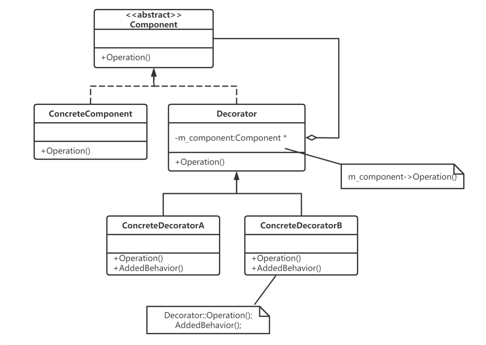
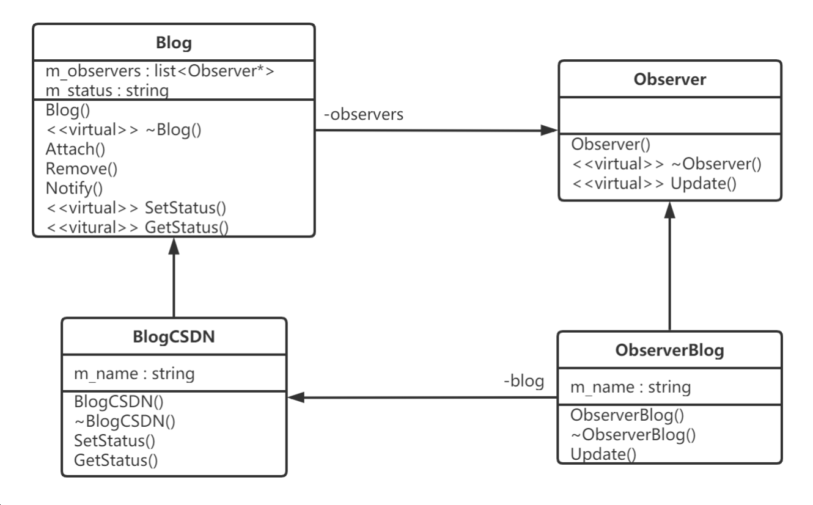

## 1、如何实现一个优美的单例模式


### 阿秀

#### 懒汉模式

下面是对给定代码的详细解析，并带有详细注释：

```cpp
class singlePattern {
private:
    static singlePattern* p; // 静态成员指针，用于保存单例对象的地址
    singlePattern(){} // 私有构造函数，限制外部创建对象
    
    class CG { // 嵌套类，用于在程序结束时自动销毁单例对象
    public:
        ~CG() { // 析构函数，在对象销毁时被调用
            if (singlePattern::p != nullptr) { // 检查单例对象是否已分配内存
                delete singlePattern::p; // 释放单例对象的内存
                singlePattern::p = nullptr; // 将指针赋值为 nullptr，防止使用已释放的内存
            }
        }
    };

public:
    static singlePattern* instance(); // 获取单例对象的静态成员函数
};

singlePattern* singlePattern::p = nullptr; // 初始化静态成员指针为 nullptr
singlePattern* singlePattern::instance() {
    if (p == nullptr) { // 如果单例对象还未被创建
        return new singlePattern(); // 创建新的单例对象并返回
    }
    return p; // 返回已存在的单例对象
}
```

这段代码实现了单例模式。单例模式用于确保一个类只能创建一个对象，并提供全局访问点来获取该对象。

- `singlePattern` 类中的私有静态成员指针 `p` 用于保存单例对象的地址。

- `singlePattern` 类中的私有构造函数 `singlePattern()` 限制了外部对该类进行实例化。因此，只能通过 `instance()` 静态成员函数来创建或获取单例对象。

- `CG` 嵌套类是一个辅助类，用于在程序结束时自动销毁单例对象。它的析构函数会检查指针 `p` 是否为 `nullptr`，如果不为空，则释放单例对象的内存，并将指针 `p` 赋值为 `nullptr`。

- 单例模式的关键在于 `instance()` 静态成员函数。如果单例对象还未被创建（即 `p` 指针为 `nullptr`），则在 `instance()` 函数中创建新的单例对象并返回；如果单例对象已经存在，则直接返回已存在的单例对象。

使用这种方式实现的单例模式可以确保一个类只有一个实例存在，并且在程序结束时自动销毁该实例，从而节约资源并提供全局访问点。


#### 饿汉模式

在给定的代码中，`CG` 类是作为内部嵌套类声明的，因此它的访问级别将与它所嵌套的类的访问级别相同。在这种情况下，`CG` 类被声明在 `singlePattern` 类的内部，而 `singlePattern` 类的访问级别是 `private`。

因此，在给定的代码中，`CG` 类属于 `private` 访问级别。只有 `singlePattern` 类的成员函数可以访问和使用 `CG` 类。外部代码无法直接访问或创建 `CG` 类的实例。

以下是对给定代码进行详细解析的注释：

```cpp
class singlePattern {
private:
    // 私有化构造函数，防止外部直接实例化对象
    singlePattern() {};

    // 静态成员变量指针，用于保存单例对象
    static singlePattern* p;
    
    // 内部类，用于在程序结束时释放单例对象的内存空间
    class CG {
    public:
        ~CG() {
            // 检查单例对象是否存在
            if (singlePattern::p != nullptr) {
                // 释放单例对象的内存空间
                delete singlePattern::p;
                singlePattern::p = nullptr;
            }
        }
    };

public:
    // 静态方法，返回单例对象的指针
    static singlePattern* instance();    
};

// 初始化静态成员变量p，创建单例对象
singlePattern* singlePattern::p = new singlePattern();

// 静态方法，返回单例对象的指针
singlePattern* singlePattern::instance() {
    return p;
}
```

该代码实现了一个单例模式。单例模式是一种设计模式，用于确保类只能创建一个实例，并提供一个全局访问点。

在该代码中，`singlePattern`类有一个私有的默认构造函数，防止外部直接实例化对象。它也定义了一个静态成员变量 `p` ，用于保存单例对象的指针。

静态方法 `instance()` 用于返回单例对象的指针。该方法在第一次调用时创建单例对象，并在后续调用中返回相同的对象。

内部类 `CG` 被用于在程序结束时释放单例对象的内存空间。它定义了一个析构函数，检查单例对象是否存在并释放其内存空间。

在全局作用域下，静态成员变量 `p` 被初始化为一个新创建的 `singlePattern` 对象，从而实现了单例对象的创建。


## 3、说说什么是单例设计模式，如何实现

1. 单例模式定义
 **保证一个类仅有一个实例，并提供一个访问它的全局访问点，该实例被所有程序模块共享**。
    那么我们就必须保证：
（1）**该类不能被复制**。
（2）**该类不能被公开的创造**。
    那么对于C++来说，它的构造函数，拷贝构造函数和赋值函数都不能被公开调用。
2. 单例模式实现方式
 单例模式通常有两种模式，分别为懒汉式单例和饿汉式单例。两种模式实现方式分别如下：
（1）懒汉式设计模式实现方式（2种）
 a. 静态指针 + 用到时初始化 
 b. 局部静态变量
（2）饿汉式设计模式（2种）
 a. 直接定义静态对象
 b. 静态指针 + 类外初始化时new空间实现


### 对比

1. 懒汉式设计模式 
 懒汉模式的特点是**延迟加载**，比如配置文件，采用懒汉式的方法，配置文件的实例直到用到的
时候才会加载，不到万不得已就不会去实例化类，也就是说在第**一次用到类实例的时候才会去实例**
**化**。
2. 饿汉模式
 单例类定义的时候就进行实例化。因为main函数执行之前，**全局作用域的类成员静态变量**
**m_Instance已经初始化**，故**没有多线程的问题**。


### 1. 懒汉模式

 懒汉模式的特点是延迟加载，比如配置文件，采用懒汉式的方法，配置文件的实例直到用到的时候才会加载，不到万不得已就不会去实例化类，也就是说在第一次用到类实例的时候才会去实例化。以下是懒汉模式实现方式C++代码：

#### （1）懒汉模式实现一：静态指针 + 用到时初始化

```cpp
//代码实例（线程不安全）
template<typename T>
class Sintemplate<typename T>
class Singleton
{
public:
    static T& getInstance()
    {
        if (!value_)
        {
            value_ = new T();
        }
        return *value_;
    }
private:
    Singleton();
    ~Singleton();
    static T* value_;
};
template<typename T>
T* Singleton<T>::value_ = NULL;
```

在单线程中，这样的写法是可以正确使用的，但是在多线程中就不行了，该方法是**线程不安全**的。
  a. 假如线程A和线程B, 这两个线程要访问getInstance函数，线程A进入getInstance函数，并检测
if条件，由于是第一次进入，value为空，if条件成立，准备创建对象实例。
  b. 但是，线程A有可能被OS的调度器中断而挂起睡眠，而将控制权交给线程B。
  c. 线程B同样来到if条件，发现value还是为NULL，因为线程A还没来得及构造它就已经被中断
了。此时假设线程B完成了对象的创建，并顺利的返回。
  d. 之后线程A被唤醒，继续执行new再次创建对象，这样一来，两个线程就构建两个对象实例，
这就破坏了唯一性。
 另外，还存在内存泄漏的问题，new出来的东西始终没有释放，下面是一种懒汉式的一种改进。

```cpp
//代码实例（线程安全）
template<typename T>
class Singleton
{
public:
static T& getInstance()
{
    if (!value_)
    {
        value_ = new T();
    }
    return *value_;
}
private:
     class CGarbo     
    {    
    public:    
        ~CGarbo()    
        {    
        	if(Singleton::value_)    
                delete Singleton::value_;    
        }    
    };    
    static CGarbo Garbo;    
    Singleton();
    ~Singleton();
    static T* value_;
};
template<typename T>
T* Singleton<T>::value_ = NULL;
```

在程序运行结束时，系统会调用Singleton的静态成员Garbo的析构函数，该析构函数会删除单例的唯一实例。使用这种方法释放单例对象有以下特征：
 a. 在单例类内部定义专有的嵌套类；
 b. 在单例类内定义私有的专门用于释放的静态成员；
 c. 利用程序在结束时析构全局变量的特性，选择最终的释放时机。

#### （2）懒汉模式实现二：局部静态变量

```cpp
//代码实例（线程不安全）
template<typename T>
class Singleton
{
public:
static T& getInstance() 
{
    static T instance;
    return instance;
}
    
private:
    Singleton(){};
    Singleton(const Singleton&);
    Singleton& operator=(const Singleton&);
};
```

​	同样，静态局部变量的实现方式也是线程不安全的。如果存在多个单例对象的析构顺序有依赖
时，可能会出现程序崩溃的危险。
​    对于局部静态对象的也是一样的。因为 static T instance；语句不是一个原子操作，在第一次被
调用时会调用Singleton的构造函数，而如果构造函数里如果有多条初始化语句，则初始化动作可
以分解为多步操作，就存在多线程竞争的问题。

​    **为什么存在多个单例对象的析构顺序有依赖时，可能会出现程序崩溃的危险？**
 原因：由于静态成员是在第一次调用函数GetInstance时进行初始化，调用构造函数的，因此构
造函数的调用顺序时可以唯一确定了。对于析构函数，我们只知道其调用顺序和构造函数的调用顺
序相反，但是如果几个Singleton类的析构函数之间也有依赖关系，而且出现类似单例实例A的析构
函数中使用了单例实例B，但是程序析构时是先调用实例B的析构函数，此时在A析构函数中使用B
时就可能会崩溃。

```cpp
//代码实例（线程安全）
#include <string>
#include <iostream>
using namespace std;
class Log
{
public:
    static Log* GetInstance()
    {
        static Log oLog;
        return &oLog;
    }
 
    void Output(string strLog)
    {
        cout<<strLog<<(*m_pInt)<<endl;
    }
private:
    Log():m_pInt(new int(3))
    {
    }
    ~Log()
    {cout<<"~Log"<<endl;
        delete m_pInt;
        m_pInt = NULL;
    }
    int* m_pInt;
};
 
class Context
{
public:
    static Context* GetInstance()
    {
        static Context oContext;
        return &oContext;
    }
    ~Context()
    {
        Log::GetInstance()->Output(__FUNCTION__);
    }
 
    void fun()
    {
        Log::GetInstance()->Output(__FUNCTION__);
    }
private:
    Context(){}
    Context(const Context& context);
};
 
int main(int argc, char* argv[])
{
    Context::GetInstance()->fun();
    return 0;
}
```

 在这个反例中有两个Singleton: Log和Context，Context的fun和析构函数会调用Log来输出一
些信息，结果程序Crash掉了，该程序的运行的序列图如下（其中画红框的部分是出问题的部
分）：


解决方案：对于析构的顺序，我们可以用一个容器来管理它，根据单例之间的依赖关系释放实
例，对所有的实例的析构顺序进行排序，之后调用各个单例实例的析构方法，如果出现了循环依赖
关系，就给出异常，并输出循环依赖环。


### 2.饿汉模式

单例类定义的时候就进行实例化。因为main函数执行之前，全局作用域的类成员静态变量m_Instance已经初始化，故没有多线程的问题。

#### （1）饿汉模式实现一：直接定义静态对象

```cpp
//代码实例（线程安全）
//.h文件
class Singleton
{
public:
  static Singleton& GetInstance();
private:
  Singleton(){}
  Singleton(const Singleton&);
  Singleton& operator= (const Singleton&);
private:
  static Singleton m_Instance;
};
//CPP文件
Singleton Singleton::m_Instance;//类外定义-不要忘记写
Singleton& Singleton::GetInstance()
{
   return m_Instance;
}
//函数调用
Singleton& instance = Singleton::GetInstance();
```

**优点**：实现简单，多线程安全。

**缺点**：
 a. 如果存在多个单例对象且这几个单例对象相互依赖，可能会出现程序崩溃的危险。原因:对
编译器来说，静态成员变量的初始化顺序和析构顺序是一个未定义的行为;具体分析在懒汉模式中
也讲到了。
 b. 在程序开始时，就创建类的实例，如果Singleton对象产生很昂贵，而本身有很少使用，这
种方式单从资源利用效率的角度来讲，比懒汉式单例类稍差些。但从反应时间角度来讲，则比懒汉
式单例类稍好些。
 **使用条件**：
 a. 当肯定不会有构造和析构依赖关系的情况。
 b. 想避免频繁加锁时的性能消耗

#### （2）饿汉模式实现二：静态指针 + 类外初始化时new空间实现

```cpp
//代码实例（线程安全）
class Singleton
{
protected:
    Singleton(){}
private:
    static Singleton* p;
public:
    static Singleton* initance();
};
Singleton* Singleton::p = new Singleton;
Singleton* singleton::initance()
{
    return p;
}
```


## 5、请说说工厂设计模式，如何实现，以及它的优点 

1. 工厂设计模式的定义
 **定义一个创建对象的接口，让子类决定实例化哪个类，而对象的创建统一交由工厂去生产**，有良好的封装性，既做到了解耦，也保证了最少知识原则。

2. 工厂设计模式分类
    工厂模式属于创建型模式，大致可以分为三类，**简单工厂模式、工厂方法模式、抽象工厂模式**。听上去差不多，都是工厂模式。下面一个个介绍：

    

### （1）简单工厂模式

​    它的主要特点是需要在工厂类中做判断，从而创造相应的产品。**当增加新的产品时，就需要修改工厂类**。

 **举例：**有一家生产处理器核的厂家，它只有一个工厂，能够生产两种型号的处理器核。客户需要什么样的处理器核，一定要显示地告诉生产工厂。下面给出一种实现方案：

```cpp
//程序实例（简单工厂模式）
enum CTYPE {COREA, COREB};     
class SingleCore    
{    
public:    
    virtual void Show() = 0;  
};   

//单核A    
class SingleCoreA: public SingleCore    
{    
public:    
    void Show() { cout<<"SingleCore A"<<endl; }    
};    
//单核B    
class SingleCoreB: public SingleCore    
{    
public:    
    void Show() { cout<<"SingleCore B"<<endl; }    
};    
//唯一的工厂，可以生产两种型号的处理器核，在内部判断    
class Factory    
{    
public:     
    SingleCore* CreateSingleCore(enum CTYPE ctype)    
    {    
        if(ctype == COREA) //工厂内部判断    
            return new SingleCoreA(); //生产核A    
        else if(ctype == COREB)    
            return new SingleCoreB(); //生产核B    
        else    
            return NULL;    
    }    
}; 
```

**优点**： 简单工厂模式可以根据需求，动态生成使用者所需类的对象，而使用者不用去知道怎么创建对象，使得各个模块各司其职，降低了系统的耦合性。 

**缺点**：就是要增加新的核类型时，就需要修改工厂类。这就违反了开放封闭原则：软件实体（类、模块、函数）可以扩展，但是不可修改。


### （2）工厂方法模式

 所谓工厂方法模式，是**指定义一个用于创建对象的接口，让子类决定实例化哪一个类。Factory Method使一个类的实例化延迟到其子类**。

 **举例**：这家生产处理器核的产家赚了不少钱，于是决定再开设一个工厂专门用来生产B型号的单核，而原来的工厂专门用来生产A型号的单核。这时，客户要做的是找好工厂，比如要A型号的核，就找A工厂要；否则找B工厂要，不再需要告诉工厂具体要什么型号的处理器核了。下面给出一个实现方案：

```cpp
//程序实例（工厂方法模式）
class SingleCore    
{    
public:    
    virtual void Show() = 0;  
};    
//单核A    
class SingleCoreA: public SingleCore    
{    
public:    
    void Show() { cout<<"SingleCore A"<<endl; }    
};    
//单核B    
class SingleCoreB: public SingleCore    
{  
public:    
    void Show() { cout<<"SingleCore B"<<endl; }    
};  


class Factory    
{    
public:    
    virtual SingleCore* CreateSingleCore() = 0;  
};    
//生产A核的工厂    
class FactoryA: public Factory    
{    
public:    
    SingleCoreA* CreateSingleCore() { return new SingleCoreA; }    
};    
//生产B核的工厂    
class FactoryB: public Factory    
{    
public:    
    SingleCoreB* CreateSingleCore() { return new SingleCoreB; }    
};  
```

**优点： 扩展性好，符合了开闭原则**，新增一种产品时，只需增加改对应的产品类和对应的工厂子类即可。

**缺点**：每增加一种产品，就需要增加一个对象的工厂。如果这家公司发展迅速，推出了很多新的处理器核，那么就要开设相应的新工厂。在C++实现中，就是要定义一个个的工厂类。显然，相比简单工厂模式，工厂方法模式需要更多的类定义。


### （3）抽象工厂模式

 **举例**：这家公司的技术不断进步，不仅可以生产单核处理器，也能生产多核处理器。现在简单工厂模式和工厂方法模式都鞭长莫及。抽象工厂模式登场了。它的定义为提供一个创建一系列相关或相互依赖对象的接口，而无需指定它们具体的类。具体这样应用，这家公司还是开设两个工厂，一个专门用来生产A型号的单核多核处理器，而另一个工厂专门用来生产B型号的单核多核处理器，下面给出实现的代码：

```cpp
//程序实例（抽象工厂模式）
//单核    
class SingleCore     
{    
public:    
    virtual void Show() = 0;  
};    
class SingleCoreA: public SingleCore      
{    
public:    
    void Show() { cout<<"Single Core A"<<endl; }    
};    
class SingleCoreB :public SingleCore    
{    
public:    
    void Show() { cout<<"Single Core B"<<endl; }    
};   


//多核    
class MultiCore      
{    
public:    
    virtual void Show() = 0;  
};    
class MultiCoreA : public MultiCore      
{    
public:    
    void Show() { cout<<"Multi Core A"<<endl; }    
    
};    
class MultiCoreB : public MultiCore      
{    
public:    
    void Show() { cout<<"Multi Core B"<<endl; }    
};    


//工厂    
class CoreFactory      
{    
public:    
    virtual SingleCore* CreateSingleCore() = 0;  
    virtual MultiCore* CreateMultiCore() = 0;  
};    
//工厂A，专门用来生产A型号的处理器    
class FactoryA :public CoreFactory    
{    
public:    
    SingleCore* CreateSingleCore() { return new SingleCoreA(); }    
    MultiCore* CreateMultiCore() { return new MultiCoreA(); }    
};    
//工厂B，专门用来生产B型号的处理器    
class FactoryB : public CoreFactory    
{    
public:    
    SingleCore* CreateSingleCore() { return new SingleCoreB(); }    
    MultiCore* CreateMultiCore() { return new MultiCoreB(); }    
};   
```

**优点**： 工厂抽象类创建了多个类型的产品，当有需求时，可以创建相关产品子类和子工厂类来获取。

**缺点**： 扩展新种类产品时困难。抽象工厂模式需要我们在工厂抽象类中提前确定了可能需要的产品种类，以满足不同型号的多种产品的需求。但是如果我们需要的产品种类并没有在工厂抽象类中提前确定，那我们就需要去修改工厂抽象类了，而一旦修改了工厂抽象类，那么所有的工厂子类也需要修改，这样显然扩展不方便。


### 阿秀

#### 简单工厂模式

这段代码实现了一个简单的工厂模式。下面是对代码的详细解释和注释：

```cpp
// 声明一个枚举类型来表示产品类型
typedef enum productType {
	TypeA,
	TypeB,
	TypeC
} productTypeTag;

// 抽象产品类，定义了产品的共同接口
class Product {
public:
	virtual void show() = 0; // 纯虚函数，子类必须实现该方法
	virtual ~Product() = 0; // 纯虚析构函数，用于支持多态销毁对象
};

// 具体产品类 ProductA，实现了抽象产品类的接口
class ProductA : public Product {
public:
	void show() {
		cout << "ProductA" << endl;
	}
	~ProductA() {
		cout << "~ProductA" << endl;
	}
};

// 具体产品类 ProductB，实现了抽象产品类的接口
class ProductB : public Product {
public:
	void show() {
		cout << "ProductB" << endl;
	}
	~ProductB() {
		cout << "~ProductB" << endl;
	}
};

// 具体产品类 ProductC，实现了抽象产品类的接口
class ProductC : public Product {
public:
	void show() {
		cout << "ProductC" << endl;
	}
	~ProductC() {
		cout << "~ProductC" << endl;
	}
};

// 工厂类，负责创建具体产品对象
class Factory {
public:
	// 根据传入的产品类型创建相应的产品对象
	Product* createProduct(productType type) {
		switch (type) {
		case TypeA:
			return new ProductA();
		case TypeB:
			return new ProductB();
		case TypeC:
			return new ProductC();
		default:
			return nullptr;
		}
	}
};
```

该代码实现了一个工厂模式，包含抽象产品类 `Product` 和具体产品类 `ProductA`、`ProductB`、`ProductC`。工厂类 `Factory` 提供了创建具体产品对象的方法。

- 抽象产品类 `Product` 定义了产品的共同接口，其中纯虚函数 `show()` 要求子类必须实现。
- 具体产品类 `ProductA`、`ProductB`、`ProductC` 继承自抽象产品类 `Product`，并分别实现了 `show()` 方法来展示各自的特性。
- 工厂类 `Factory` 提供了一个 `createProduct()` 方法，根据传入的产品类型参数，使用 `switch` 语句创建相应的具体产品对象，并返回其指针。

通过使用工厂模式，客户端可以通过工厂类来创建所需的具体产品对象，而无需直接与具体产品类进行耦合，从而提高代码的灵活性和可维护性。


## 7、请说说装饰器计模式，以及它的优缺点 

1. 装饰器计模式的定义
 指在**不改变现有对象结构的情况下，动态地给该对象增加一些职责（即增加其额外功能）的模式**，它属于对象结构型模式。
2. 优点
（1）装饰器是继承的有力补充，比继承灵活，在不改变原有对象的情况下，动态的给一个对象扩
展功能，即插即用；
（2）通过使用不用装饰类及这些装饰类的排列组合，可以实现不同效果；
（3）装饰器模式完全遵守开闭原则。
3. 缺点
 装饰模式会增加许多子类，过度使用会增加程序得复杂性。
4. 装饰模式的结构与实现
 通常情况下，扩展一个类的功能会使用继承方式来实现。但继承具有静态特征，耦合度高，并且随着扩展功能的增多，子类会很膨胀。
如果使用组合关系来创建一个包装对象（即装饰对象）来包裹真实对象，并在保持真实对象的类结构不变的前提下，为其提供额外的功能，这就是装饰模式的目标。下面来分析其基本结构和实现方法。
装饰模式主要包含以下角色：
（1）抽象构件（Component）角色：定义一个抽象接口以规范准备接收附加责任的对象。
（2）具体构件（ConcreteComponent）角色：实现抽象构件，通过装饰角色为其添加一些职责。
（3）抽象装饰（Decorator）角色：继承抽象构件，并包含具体构件的实例，可以通过其子类扩展具体构件的功能。
（4）具体装饰（ConcreteDecorator）角色：实现抽象装饰的相关方法，并给具体构件对象添加附加的责任。



装饰模式的实现代码如下：

```cpp
#include <iostream>
#include <string>

// 基础组件接口定义了可以被装饰器修改的操作
class Component {
public:
    virtual ~Component() {}
    virtual std::string Operation() const = 0;
};

// 具体组件提供了操作的默认实现。这些类在程序中可能会有几个变体
class ConcreteComponent : public Component {
public:
    std::string Operation() const override { return "ConcreteComponent"; }
};

// 装饰器基类和其他组件遵循相同的接口。这个类的主要目的是为所有的具体装饰器定义封装接口。
// 封装的默认实现代码中可能会包含一个保存被封装组件的成员变量，并且负责对其进行初始化
class Decorator : public Component {
protected:
    Component* component_;

public:
    Decorator(Component* component) : component_(component) {}

    // 装饰器会将所有的工作分派给被封装的组件
    std::string Operation() const override {
        return this->component_->Operation();
    }
};

// 具体装饰器必须在被封装对象上调用方法，不过也可以自行在结果中添加一些内容。
class ConcreteDecoratorA : public Decorator {
    // 装饰器可以调用父类的是实现，来替代直接调用组件方法。
public:
    ConcreteDecoratorA(Component* component) : Decorator(component) {}
    std::string Operation() const override {
        return "ConcreteDecoratorA(" + Decorator::Operation() + ")";
    }
};

// 装饰器可以在调用封装的组件对象的方法前后执行自己的方法
class ConcreteDecoratorB : public Decorator {
public:
    ConcreteDecoratorB(Component* component) : Decorator(component) {}

    std::string Operation() const override {
        return "ConcreteDecoratorB(" + Decorator::Operation() + ")";
    }
};

// 客户端代码可以使用组件接口来操作所有的具体对象。这种方式可以使客户端和具体的实现类脱耦
void ClientCode(Component* component) {
    // ...
    std::cout << "RESULT: " << component->Operation();
    // ...
}

int main() {
    // 创建一个基础组件对象
    Component* simple = new ConcreteComponent;
    std::cout << "Client: I've got a simple component:\n";
    // 使用基础组件对象
    ClientCode(simple);
    std::cout << "\n\n";

    // 使用具体装饰器A和B来装饰基础组件对象
    Component* decorator1 = new ConcreteDecoratorA(simple);
    Component* decorator2 = new ConcreteDecoratorB(decorator1);
    std::cout << "Client: Now I've got a decorated component:\n";
    // 使用装饰后的对象
    ClientCode(decorator2);
    std::cout << "\n";

    delete simple;
    delete decorator1;
    delete decorator2;

    return 0;
}
```

这段代码实现了装饰者模式（Decorator Pattern）。在装饰者模式中，可以动态地为对象添加额外的行为，而不需要修改其代码。主要的类包括：

- `Component`：定义了一个基础的组件接口，这里是一个虚基类，声明了虚函数 `Operation`。
- `ConcreteComponent`：继承自 `Component`，提供了基础的组件实现。
- `Decorator`：继承自 `Component`，是装饰器的基类。它持有一个指向被装饰对象的指针，封装了基础组件，并提供一个默认的 `Operation` 实现，调用被装饰对象的 `Operation`。
- `ConcreteDecoratorA` 和 `ConcreteDecoratorB`：分别继承自 `Decorator`，它们是具体的装饰器，可以在装饰的对象上添加额外的行为。在这里，`ConcreteDecoratorA` 在原有的基础上添加了一些内容，而 `ConcreteDecoratorB` 则在调用被装饰对象的方法前后执行一些操作。

在 `main` 函数中，首先创建一个基础组件对象，并对其进行操作。然后使用装饰器A和B来装饰该基础组件对象，实现了在不修改基础组件代码的情况下为其添加额外的功能。最后释放对象的内存。

### 输出

```
Client: I've got a simple component:
RESULT: ConcreteComponent

Client: Now I've got a decorated component:
RESULT: ConcreteDecoratorB(ConcreteDecoratorA(ConcreteComponent))
```

具体解释如下：

1. 首先，我们创建了一个 `ConcreteComponent` 对象并对其进行操作。因此，输出是 "RESULT: ConcreteComponent"。
2. 然后，我们创建了一个 `ConcreteDecoratorA` 对象，将之前的 `ConcreteComponent` 对象传递给它。当我们调用 `ConcreteDecoratorA` 对象的 `Operation` 方法时，它会首先调用其成员变量中的 `ConcreteComponent` 对象的 `Operation` 方法，然后在返回值上添加自己的修饰，即 "ConcreteDecoratorA(" + ... + ")"。因此，输出变为 "RESULT: ConcreteDecoratorA(ConcreteComponent)"。
3. 最后，我们创建了一个 `ConcreteDecoratorB` 对象，将之前的 `ConcreteDecoratorA` 对象传递给它。同样，当我们调用 `ConcreteDecoratorB` 对象的 `Operation` 方法时，它会首先调用其成员变量中的 `ConcreteDecoratorA` 对象的 `Operation` 方法，然后在返回值上添加自己的修饰，即 "ConcreteDecoratorB(" + ... + ")"。因此，最终的输出为 "RESULT: ConcreteDecoratorB(ConcreteDecoratorA(ConcreteComponent))"。

这种嵌套的方式是装饰者模式的特征，它允许我们动态地组合不同的装饰器，以实现不同的功能组合，同时保持代码的可扩展性。


## 10、请说说观察者设计模式，如何实现

1. 观察者设计模式的定义
 指**多个对象间存在一对多的依赖关系，当一个对象的状态发生改变时，所有依赖于它的对象都**
**得到通知并被自动更新**。这种模式有时又称作发布-订阅模式、模型-视图模式，它是对象行为型模
式。
2. 优点
（1）降低了目标与观察者之间的耦合关系，两者之间是抽象耦合关系。符合依赖倒置原则。
（2）目标与观察者之间建立了一套触发机制。
3. 缺点
（1）目标与观察者之间的依赖关系并没有完全解除，而且有可能出现循环引用。
（2）当观察者对象很多时，通知的发布会花费很多时间，影响程序的效率。
4. 观察者设计模式的结构与实现
 观察者模式的主要角色如下：
（1）抽象主题（Subject）角色：也叫抽象目标类，它提供了一个用于保存观察者对象的聚集类和
增加、删除观察者对象的方法，以及通知所有观察者的抽象方法。
（2）具体主题（Concrete Subject）角色：也叫具体目标类，它实现抽象目标中的通知方法，当
具体主题的内部状态发生改变时，通知所有注册过的观察者对象。
（3）抽象观察者（Observer）角色：它是一个抽象类或接口，它包含了一个更新自己的抽象方
法，当接到具体主题的更改通知时被调用。
（4）具体观察者（Concrete Observer）角色：实现抽象观察者中定义的抽象方法，以便在得到
目标的更改通知时更新自身的状态。


可以举个博客订阅的例子，当博主发表新文章的时候，即博主状态发生了改变，那些订阅的读者就会
收到通知，然后进行相应的动作，比如去看文章，或者收藏起来。博主与读者之间存在种一对多的依赖
关系。下面给出相应的UML图设计:



可以看到博客类中有一个观察者链表（即订阅者），当博客的状态发生变化时，通过Notify成员函数
通知所有的观察者，告诉他们博客的状态更新了。而观察者通过Update成员函数获取博客的状态信
息。代码实现不难，下面给出C++的一种实现。

```cpp
#include <iostream>
#include <list>
#include <string>
using namespace std;
// 观察者
class Observer {
public:
    Observer() {}
    virtual ~Observer() {}
    virtual void Update() {}
};
// 博客
class Blog {
public:
    Blog() {}
    virtual ~Blog() {}
    // 添加观察者

    void Attach(Observer* observer) { m_observers.push_back(observer); }
    // 移除观察者 void
    void Remove(Observer* observer) { m_observers.remove(observer); }
    void Notify()  // 通知观察者
    {
        list<Observer*>::iterator iter = m_observers.begin();
        for (; iter != m_observers.end(); iter++)
            (*iter)->Update();
    }
    virtual void SetStatus(string s) { m_status = s; }  // 设置状态
    virtual string GetStatus() { return m_status; }
    // 获得状态
private:
    list<Observer*> m_observers;  // 观察者链表
protected:
    string m_status;  // 状态
};
```

​	以上是观察者和博客的基类，定义了通用接口。博客类主要完成观察者的添加、移除、通知操作，设置和获得状态仅仅是一个默认实现。下面给出它们相应的子类实现。   

```cpp
// 具体博客类
class BlogCSDN : public Blog {
private:
    string m_name;  // 博主名称
public:
    BlogCSDN(string name) : m_name(name) {}
    ~BlogCSDN() {}
    void SetStatus(string s) {
        m_status = "CSDN通知 : " + m_name + s;
    }  // 具体设置状态信息
    string GetStatus() { return m_status; }
};

// 具体观察者
class ObserverBlog : public Observer {
private:
    string m_name;
    // 观察者名称
    Blog* m_blog;
    // 观察的博客，当然以链表形式更好，就可以观察多个博客
public:
    ObserverBlog(string name, Blog* blog) : m_name(name), m_blog(blog) {}
    ~ObserverBlog() {}
    void Update()  // 获得更新状态
    {
        string status = m_blog->GetStatus();
        cout << m_name << "-------" << status << endl;
    }
};
```

```cpp
int main() {
    Blog* blog = new BlogCSDN("wuzhekai1985");
    Observer* observer1 = new ObserverBlog("tutupig", blog);
    // 通过父类的指针调用父类的成员函数，访问父类的私有成员
    blog->Attach(observer1);
    blog->SetStatus("发表设计模式C++实现（15）——观察者模式");
    blog->Notify();
    delete blog;
    delete observer1;
    return 0;
}
```

父类的指针接收一个子类对象，并且父类写了一个虚函数，子类重写了这个虚函数时，调用同名函数时会调用子类中重写的虚函数，而不是父类中的虚函数。

这是C++中实现多态性的基本机制，也就是说，通过父类的指针调用虚函数会在运行时根据对象的实际类型来确定要调用的函数版本。这使得您可以在子类中重写虚函数，从而实现不同的行为。

如果父类不是虚函数，而子类重写了这个函数，那么通过父类的指针调用同名函数时，会调用父类中的函数，而不是子类中的重写函数。这是因为在 C++ 中，非虚函数的调用是根据指针或引用的静态类型来确定的，而不是根据实际对象的类型。）


### 输出

```
tutupig-------CSDN通知 : wuzhekai1985发表设计模式C++实现（15）——观察者模式
```


