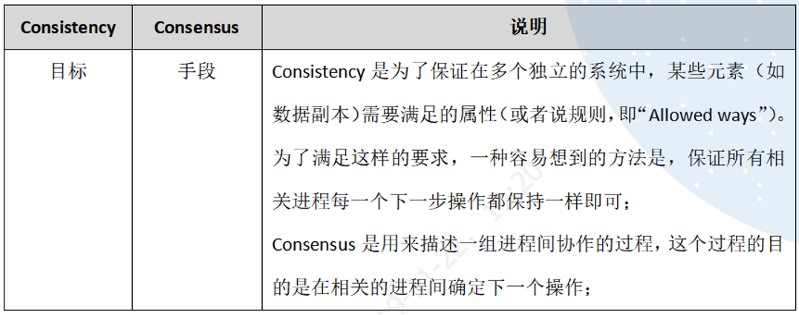

## 1、分布式系统基本概念

### 1、CAP理论基础

分布式系统的最大难点，就是各个节点的状态如何同步。CAP 定理是这方面的基本定理，也是理解分布式系统的起点。

1998年，加州大学的计算机科学家 Eric Brewer 提出，分布式系统有三个指标：

> - Consistency
> - Availability
> - Partition tolerance

它们的第一个字母分别是 `C`、`A`、`P`。Eric Brewer 说，这三个指标不可能同时做到。这个结论就叫做 `CAP` 定理。

它指出对于一个分布式计算系统来说，不可能同时满足以下三点：

- 一致性（Consistency） ：等同于所有节点访问同一份最新的数据副本，或者说同一数据在不同节点上的副本在同一逻辑时钟应当是相同的内容。
- 可用性（Availability）：每次请求都能获取到非错的响应，以及尽量保证低延迟，但是不保证获取的数据为最新数据。
- 分区容错性（Partition tolerance）：以实际效果而言，分区相当于对**通信的时限要求**。要求任意节点故障时，系统仍然可以对外服务。

### 2、数据一致性（C侧）

一些分布式系统通过复制数据来提高系统的可靠性和容错性，并且将数据的不同的副本存放在不同的机器，由于维护数据副本的一致性代价高，因此许多系统**采用弱一致性来提高性能**，一些不同的一致性模型也相继被提出。

- **强一致性**： 要求无论更新操作实在哪一个副本执行，之后所有的读操作都要能获得最新的数据。
- **弱一致性**：用户读到某一操作对系统特定数据的更新需要一段时间，我们称这段时间为“不一致性窗口”。
- **最终一致性**：是弱一致性的一种特例，保证用户**最终（即窗口尽量长） **能够读取到某操作对系统特定数据的更新。

#### 一致性解决方案 

1. 分布式事务：两段提交
2. 分布式锁
3. 消息队列、消息持久化、重试、幂等操作
4. Raft / Paxos 等一致性算法

### 3、服务可用性（A侧）

可用性，意思是只要收到用户的请求，服务器就必须给出回应。

#### 高可用解决方案 

- **负载均衡**：尽力将网络流量平均分发到多个服务器上，以提高系统整体的响应速度和可用性。
- **降级**：当服务器压力剧增的情况下，根据当前业务情况及流量对一些服务和页面有策略的降级，以此释放服务器资源以保证核心任务的正常运行。
- **熔断**：对于目标服务的请求和调用大量超时或失败，这时应该熔断该服务的所有调用，并且对于后续调用应直接返回，从而快速释放资源。确保在目标服务不可用的这段时间内，所有对它的调用都是立即返回的、不会阻塞的，等到目标服务好转后进行接口恢复。
- **流量控制**：流量控制可以有效的防止由于网络中瞬间的大量数据对网络带来的冲击，保证用户网络高效而稳定的运行，类似于TCP拥塞控制方法。
- **异地多活**：在不同地区维护不同子系统，并保证子系统的可用性

熔断是减少由于下游服务故障对自己的影响；而降级则是在整个系统的角度上，考虑业务整体流量，保护核心业务稳定。

### 4、分区容错性（P侧）

大多数分布式系统都分布在多个子网络。每个子网络就叫做一个区（partition）。分区容错的意思是，区间通信可能失败。比如，一台服务器放在中国，另一台服务器放在美国，这就是两个区，它们之间可能无法通信。

般来说，分区容错无法避免，因此可以认为 CAP 的 `P` 总是成立。CAP 定理告诉我们，剩下的 `C` 和 `A` 无法同时做到。

## 2、系统一致性

### 1、基本要求

规范的说，理想的分布式系统一致性应该满足：

1. 可终止性（Termination）：一致的结果在有限时间内能完成；
2. 共识性（Consensus）：不同节点最终完成决策的结果应该相同；
3. 合法性（Validity）：决策的结果必须是其它进程提出的提案。

第一点很容易理解，这是计算机系统可以被使用的前提。需要注意，在现实生活中这点并不是总能得到保障的，例如取款机有时候会是 `服务中断` 状态，电话有时候是 `无法连通` 的。

第二点看似容易，但是隐藏了一些潜在信息。算法考虑的是任意的情形，凡事一旦推广到任意情形，就往往有一些惊人的结果。例如现在就剩一张票了，中关村和西单的电影院也分别刚确认过这张票的存在，然后两个电影院同时来了一个顾客要买票，从各自观察看来，自己的顾客都是第一个到的……怎么能达成结果的共识呢？记住我们的唯一秘诀：**核心在于需要把两件事情进行排序，而且这个顺序还得是合理的、大家都认可的**。

第三点看似绕口，但是其实比较容易理解，即达成的结果必须是节点执行操作的结果。仍以卖票为例，如果两个影院各自卖出去一千张，那么达成的结果就是还剩八千张，决不能认为票售光了。

### 2、强一致性

#### 线性一致性

线性一致性或称 **原子一致性** 或 **严格一致性** 指的是程序在执行的历史中在存在可线性化点P的执行模型，这意味着一个操作将在程序的调用和返回之间的某个点P起作用。这里“起作用”的意思是被系统中并发运行的所有其他线程所感知。要求如下：

1. **写后读** 这里写和读是两个操作，如果写操作在完成之后，读才开始，读要能读到最新的数据，而且保证以后也能读操作也都能读到这个最新的数据。
2. **所有操作的时序与真实物理时间一致**，要求即使不相关的两个操作，如果执行有先后顺序，线性一致性要求最终执行的结果也需要满足这个先后顺序。比如，操作序列(写A，读A，写B，读B)，那么不仅，读A，读B能读到最新A值和B值；而且要保证，如果读B读到最新值时，读A一定也能读到最新值，也就是需要保证执行时序与真实时序相同。
3. 如果两个操作是并发的（比如读A没有结束时，写B开始了），那么这个并发时序不确定，但从最终执行的结果来看，要确保所有线程(进程，节点)看到的执行序列是一致的。

#### 顺序一致性

相比线性一致性，主要区别在于，**对于物理上有先后顺序的操作，不保证这个时序**。具体而言，对于单个线程，操作的顺序仍然要保留，对于多个线程(进程，节点)，执行的事件的先后顺序与物理时钟顺序不保证。但是要求，从执行结果来看，所有线程(进程，节点)看到的执行序列是一样的。

#### 因果一致性

因果一致性，被认为是比` 顺序一致性 `更弱的一致性，在因果一致性中，只对**有因果关系的事件**有顺序要求。

### 3、带约束的一致性

绝对理想的 **强一致性（Strong Consistency）** 代价很大。除非不发生任何故障，所有节点之间的通信无需任何时间，这个时候其实就等价于一台机器了。实际上，越强的一致性要求往往意味着越弱的性能、越低的可用性。

强一致的系统往往比较难实现。很多时候，人们发现实际需求并没有那么强，可以适当放宽一致性要求，降低系统实现的难度。例如在一定约束下实现所谓 **最终一致性（Eventual Consistency）**，即总会存在一个时刻（而不是立刻），系统达到一致的状态，这对于大部分的 Web 系统来说已经足够了。这一类弱化的一致性，被笼统称为 **弱一致性（Weak Consistency）**。

#### 最终一致性

最终一致性也被称为 **乐观复制(optimistic replication)**，用户只能读到某次更新后的值，但系统保证数据将最终达到完全一致的状态，只是所需时间不能保障。这个达成一致所需要的时间，我们称为 **窗口时间**。

我们常见的 **异步复制的主从架构实现的是最终一致性** 。它的一个典型常见是用户读取异步从库时，可能读取到较旧的信息，因为该从库尚未完全与主库同步。注意，同步复制的主从架构会出现任一节点宕机导致的单点问题。

### 4、一致性（Consistency）与共识（Consensus）的关系

我们常说的 **一致性（Consistency）** 在分布式系统中指的是 `副本（Replication）` 问题中对于同一个数据的多个副本，其对外表现的数据一致性，如 `线性一致性` 、`因果一致性`、`最终一致性`等，都是用来描述副本问题中的一致性的。

而 **共识（Consensus）** 则不同，共识问题中所有的节点要最终达成共识，由于最终目标是所有节点都要达成一致，所以根本 **不存在一致性强弱** 之分。

## 3、高并发系统的设计

### 1、系统拆分

将一个系统拆分为多个子系统，用 RPC 来搞。然后每个系统连一个数据库，这样本来就一个库，现在多个数据库，不也可以扛高并发么。

### 2、缓存 

大部分的高并发场景，都是读多写少，那你完全可以在数据库和缓存里都写一份，然后读的时候大量走缓存不就得了。毕竟 Redis 轻轻松松单机几万的并发。所以你可以考虑考虑你的项目里，那些承载主要请求的读场景，怎么用缓存来抗高并发。

### 3、消息队列

可能你还是会出现高并发写的场景，比如说一个业务操作里要频繁搞数据库几十次，增删改增删改。那高并发绝对搞挂你的系统，你要是用 Redis 来承载写那肯定不行，人家是缓存，数据随时就被 LRU 了，数据格式还无比简单，没有事务支持。所以该用 MySQL 还得用 MySQL 啊。那你咋办？用 MQ 吧，大量的写请求灌入 MQ 里，后边系统消费后慢慢写，控制在 MySQL 承载范围之内。所以你得考虑考虑你的项目里，那些承载复杂写业务逻辑的场景里，如何用 MQ 来异步写，提升并发性。

### 4、分库分表
分库分表，可能到了最后数据库层面还是免不了抗高并发的要求，好吧，那么就将一个数据库拆分为多个库，多个库来扛更高的并发；然后将一个表拆分为多个表，每个表的数据量保持少一点，提高 SQL 跑的性能。

### 5、读写分离

读写分离，这个就是说大部分时候数据库可能也是读多写少，没必要所有请求都集中在一个库上吧，可以搞个主从架构，主库写入，从库读取，搞一个读写分离。读流量太多的时候，还可以加更多的从库。

## 4、分布式缓存

### 1、应用场景

1. **页面缓存**：用来缓存Web 页面的内容片段,包括HTML、CSS 和图片等;
2. **应用对象缓存**：缓存系统作为ORM 框架的二级缓存对外提供服务,目的是减轻数据库的负载压力,加速应用访问;解决分布式Web部署的 session 同步问题，状态缓存.缓存包括Session 会话状态及应用横向扩展时的状态数据等,这类数据一般是难以恢复的,对可用性要求较高,多应用于高可用集群。
3. **并行处理**：通常涉及大量中间计算结果需要共享;
4. **云计算领域提供分布式缓存服务**

### 2、缓存雪崩 

缓存雪崩我们可以简单的理解为：由于原有缓存失效、新缓存未到之间(**例如：我们设置缓存时采用了相同的过期时间，在同一时刻出现大面积的缓存过期**)，所有原本应该访问缓存的请求都去查询数据库了，而对数据库CPU和内存造成巨大压力，严重的会造成数据库宕机。从而形成一系列连锁反应，造成整个系统崩溃。

### 3、缓存穿透

缓存穿透是指用户查询数据，在数据库没有，自然在缓存中也不会有。**这样就导致用户查询的时候，在缓存中找不到，每次都要去数据库再查询一遍，然后返回空**（*相当于进行了两次无用的查询*）。这样请求就绕过缓存直接查数据库，这也是经常提的缓存命中率问题。

### 4、缓存预热

缓存预热这个应该是一个比较常见的概念，相信很多小伙伴都应该可以很容易的理解，缓存预热就是系统上线后，将相关的缓存数据直接加载到缓存系统。这样就可以避免在用户请求的时候，先查询数据库，然后再将数据缓存的问题！用户直接查询事先被预热的缓存数据！

### 5、缓存更新

除了缓存服务器自带的缓存失效策略之外，我们还可以根据具体的业务需求进行自定义的缓存淘汰，常见的策略有两种：

1. 定时去清理过期的缓存；
2. 当有用户请求过来时，再判断这个请求所用到的缓存是否过期，过期的话就去底层系统得到新数据并更新缓存。

两者各有优劣，第一种的缺点是维护大量缓存的key是比较麻烦的，第二种的缺点就是每次用户请求过来都要判断缓存失效，逻辑相对比较复杂！具体用哪种方案，大家可以根据自己的应用场景来权衡。

### 6、缓存降级

当访问量剧增、服务出现问题（如响应时间慢或不响应）或非核心服务影响到核心流程的性能时，仍然需要保证服务还是可用的，即使是有损服务。系统可以根据一些关键数据进行自动降级，也可以配置开关实现人工降级。

降级的最终目的是 **保证核心服务可用，即使是有损的**。而且有些服务是无法降级的（如加入购物车、结算）。

在进行降级之前要对系统进行梳理，看看系统是不是可以丢卒保帅；从而梳理出哪些必须誓死保护，哪些可降级；比如可以参考日志级别设置预案：

1. **一般**：比如有些服务偶尔因为网络抖动或者服务正在上线而超时，可以自动降级；
2. **警告**：有些服务在一段时间内成功率有波动（如在95~100%之间），可以自动降级或人工降级，并发送告警；
3. **错误**：比如可用率低于90%，或者数据库连接池被打爆了，或者访问量突然猛增到系统能承受的最大阀值，此时可以根据情况自动降级或者人工降级；
4. **严重错误**：比如因为特殊原因数据错误了，此时需要紧急人工降级。

## 5、分布式锁

### 1、Redis 的 RedLock 锁

为了解决 Redis 单点的问题。 Redis 的作者提出了 RedLock 的解决方案。方案非常的巧妙和简洁。 RedLock 的核心思想就是，**同时使用多个 Redis Master 来冗余，且这些节点都是完全的独立的，也不需要对这些节点之间的数据进行同步**。

假设我们有N个Redis节点，N应该是一个大于2的奇数。RedLock的实现步骤:

1. 取得当前时间
2. 使用单节点获取锁的方式，依次获取 N 个节点的 Redis 锁。
3. 如果获取到的锁的数量大于 N/2+1*N*/2+1 个，且获取的时间小于锁的有效时间(lock validity time)就认为获取到了一个有效的锁，锁自动释放时间就是最初的锁释放时间减去之前获取锁所消耗的时间。
4. 如果获取锁的数量小于 N/2+1*N*/2+1 ，或者在锁的有效时间(lock validity time)内没有获取到足够的锁，就认为获取锁失败，这个时候需要向所有节点发送释放锁的消息。

对于释放锁的实现就很简单了，向所有的 Redis 节点发起释放的操作，无论之前是否获取锁成功。

### 2、基于 ZooKeeper 的分布式锁

#### 方案

基于 ZK 的特性，很容易得出使用 ZK 实现分布式锁的落地方案：

1. 使用 ZK 的临时节点和有序节点，每个线程获取锁就是在 ZK 创建一个临时有序的节点，比如在 `/lock/` 目录下。
2. 创建节点成功后，获取 `/lock` 目录下的所有临时节点，再判断当前线程创建的节点是否是所有的节点的序号最小的节点。
3. 如果当前线程创建的节点是所有节点序号最小的节点，则认为获取锁成功。
4. 如果当前线程创建的节点不是所有节点序号最小的节点，则对节点序号的 **前一个节点** 添加一个事件监听。

#### 缺陷

1. **羊群效应**：当一个节点变化时，会触发大量的 `watches` 事件，导致集群响应变慢。每个节点尽量少的 `watches`，这里就只注册 **前一个节点** 的监听
2. ZK 集群的读写吞吐量不高
3. 网络抖动可能导致 Session 离线，锁被释放

