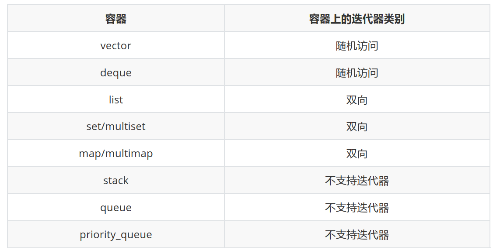

## 1、Vector扩容，什么情况1.5倍，什么情况2倍？

vector 在插入新的元素时，但是之前的内存已经满的时候需要扩容，在VS下是1.5倍，在GCC 下是2 倍。


## 2、Vector的resize和reserve有什么区别？

1. **resize**: `resize(n)`会改变vector的大小，使其包含n个元素。如果n大于当前的大小，那么新的元素会被添加到vector的末尾，如果n小于当前的大小，那么末尾的元素会被删除。`resize`会改变vector的`size()`。
2. **reserve**: `reserve(n)`不会改变vector的大小，它只是预先分配足够的内存，以便在未来可以容纳n个元素。`reserve`不会改变vector的`size()`，但可能会改变`capacity()`。`reserve`的主要目的是为了优化性能，避免在添加元素时频繁进行内存分配。

简单来说，`resize`改变的是vector中元素的数量，而`reserve`改变的是vector的内存容量。


## 3、vector中push_back和emplace_back的区别？

emplace_back通常在性能上优于push_back，因为它可以避免不必要的复制或移动操作。

- push_back() 向容器尾部添加元素时，首先会创建这个元素，然后再将这个元素拷贝或者移动到容器中（如果是拷贝的话，事后会自行销毁先前创建的这个元素）
- 而emplace_back() 在实现时，则是直接在容器尾部创建这个元素，省去了拷贝或移动元素的过程。


## 4、Map，set，unordered_map，unordered_set，底层是用了什么数据结构？

1. **Map**: 底层实现通常是红黑树，这是一种自平衡的二叉查找树。它可以保证插入、删除和查找的时间复杂度都是O(log n)。
2. **Set**: 与Map类似，Set的底层实现通常也是红黑树。Set是一种特殊的Map，只有键没有值。
3. **Unordered_map**: 底层实现通常是哈希表。哈希表可以提供平均时间复杂度为O(1)的查找。
4. **Unordered_set**: 与Unordered_map类似，Unordered_set的底层实现通常也是哈希表。Unordered_set是一种特殊的Unordered_map，只有键没有值。


## 5、hash_map和map区别

- 构造函数：**hash_map需要hash函数，等于函数**；map只需要比较函数(小于函数)
- 存储结构：**hash_map采用hash表存储**，map一般采用红黑树(RB Tree)实现。因此其memory数据结构是不一样的


## 8、请说说 STL 的基本组成部分

标准模板库（Standard Template Library,简称STL）简单说，就是一些常用数据结构和算法的模板的
集合。

**广义上讲**，STL分为3类：Algorithm（算法）、Container（容器）和Iterator（迭代器），容器和算
法通过迭代器可以进行无缝地连接。

**详细的说**，STL由6部分组成：容器(Container)、算法（Algorithm）、 迭代器（Iterator）、仿函数
（Function object）、适配器（Adaptor）、空间配置器（Allocator）。

标准模板库STL主要由6大组成部分：
1. 容器(Container) 
 **是一种数据结构**， 如list, vector, 和deques，**以模板类的方法提供**。为了访问容器中的数据，可
以使用由容器类输出的迭代器。
2. 算法（Algorithm）
 **是用来操作容器中的数据的模板函数**。例如，STL用sort()来对一 个vector中的数据进行排序，
用find()来搜索一个list中的对象， 函数本身与他们操作的数据的结构和类型无关，因此他们可以
用于从简单数组到高度复杂容器的任何数据结构上。
3. 迭代器（Iterator）
 **提供了访问容器中对象的方法**。例如，可以使用一对迭代器指定list或vector中的一定范围的对
象。 迭代器**就如同一个指针**。事实上，C++ 的指针也是一种迭代器。 但是，迭代器也可以是那些
定义了operator*()以及其他类似于指针的操作符方法的类对象;
4. 仿函数（Function object）
 仿函数又称之为函数对象， 其实就是**重载了操作符的struct**,没有什么特别的地方。
5. 适配器（Adaptor）
 简单的说就是一种**接口类**，专门用来**修改现有类的接口**，提供一中新的接口；或调用现有的函
数来实现所需要的功能。主要包括3中适配器**Container Adaptor、Iterator Adaptor、Function** 
**Adaptor**。
6. 空间配制器（Allocator）
 为STL提供空间配置的系统。其中主要工作包括两部分：
（1）**对象的创建与销毁**；
（2）**内存的获取与释放**。


## 11、请说说 STL 中常见的容器，并介绍一下实现原理 

容器可以用于**存放各种类型的数据（基本类型的变量，对象等）的数据结构，都是模板类**，分为顺序
容器、关联式容器、容器适配器三种类型，三种类型容器特性分别如下：


1. 顺序容器  

 **容器并非排序的，元素的插入位置同元素的值无关**。包含vector、deque、list，具体实现原理
如下：
（1）vector 头文件
 动态数组。**元素在内存连续存放**。随机存取任何元素都能在常数时间完成。在尾端增删元
素具有较佳的性能。
（2）deque 头文件
 双向队列。**元素在内存连续存放**。随机存取任何元素都能在常数时间完成（仅次于vector）。在
两端增删元素具有较佳的性能（大部分情况下是常数时间）。
（3）list 头文件 
 双向链表。元素在内存**不连续**存放。在任何位置增删元素都能在常数时间完成。不支持随机
存取。

2. 关联式容器 
 元素是排序的；**插入任何元素，都按相应的排序规则来确定其位置；在查找时具有非常好的性**
**能**；通常以平衡二叉树的方式实现。包含set、multiset、map、multimap，具体实现原理如下：
（1）set/multiset 头文件
 set 即集合。set中不允许相同元素，multiset中允许存在相同元素。
（2）map/multimap 头文件
 map与set的不同在于map中存放的元素有且仅有两个成员变量，一个名为first,另一个名为
second, **map根据first值对元素从小到大排序，并可快速地根据first来检索元素**。
 注意：map同multimap的不同在于是否允许相同first值的元素。

3. 容器适配器  
 **封装了一些基本的容器，使之具备了新的函数功能**，比如把deque封装一下变为一个具有stack
功能的数据结构。这新得到的数据结构就叫适配器。包含**stack,queue,priority_queue**，具体实现
原理如下：
（1）stack 头文件
 栈是项的有限序列，并满足序列中被删除、检索和修改的项只能是最进插入序列的项（栈顶
的项）。后进先出。
（2）queue 头文件
 队列。插入只可以在尾部进行，删除、检索和修改只允许从头部进行。先进先出。
（3）priority_queue 头文件
 优先级队列。内部维持某种有序，然后确保优先级最高的元素总是位于头部。最高优先级元
素总是第一个出列。


## 14、map hashtable deque list 的实现原理 

 map、hashtable、deque、list实现机理分别为红黑树、函数映射、双向队列、双向链表，他们的特
性分别如下：

1. map实现原理
 map内部实现了一个**红黑树**（**红黑树是非严格平衡的二叉搜索树，而AVL是严格平衡二叉搜索**
**树**），红黑树有自动排序的功能，因此**map内部所有元素都是有序的**，红黑树的每一个节点都代
表着map的一个元素。因此，对于map进行的查找、删除、添加等一系列的操作都相当于是对红
黑树进行的操作。map中的元素是按照二叉树（又名二叉查找树、二叉排序树）存储的，特点就
 是左子树上所有节点的键值都小于根节点的键值，右子树所有节点的键值都大于根节点的键值。使
  用**中序遍历可将键值按照从小到大遍历出来**。

2. hashtable（也称散列表，直译作哈希表）实现原理
    hashtable采用了**函数映射的思想，记录的存储位置与记录的关键字关联起来**，从而能够很快速地
    进行查找。这决定了哈希表特殊的数据结构，它同数组、链表以及二叉排序树等相比较有很明显的
    区别，它**能够快速定位到想要查找的记录，而不是与表中存在的记录的关键字进行比较来进行查**
    **找**。
3. deque实现原理
    deque内部 现的是一个双向队列。元素在内存连续存放。**随机存取任何元素都在常数时间完成**
    （仅次于vector）。所有适用于vector的操作都适用于deque。**在两端增删元素具有较佳的性能**
    （大部分情况下是常数时间）。
4. list实现原理
    list内部实现的是一个双向链表。元素在内存不连续存放。在**任何位置增删元素都能在常数时间**
    **完成**。**不支持随机存取**。无成员函数，给定一个下标i，访问第i个元素的内容，**只能从头部挨个遍**
    **历到第i个元素**。


## 16、请你来介绍一下 STL 的空间配置器（allocator） 

 一般情况下,**一个程序包括数据结构和相应的算法**，而**数据结构作为存储数据的组织形式，与内存空间**
**有着密切的联系**。在C++ STL中，空间配置器便是用来实现内存空间(一般是内存，也可以是硬盘等空间)
分配的工具，他与容器联系紧密，**每一种容器的空间分配都是通过空间分配器allocator实现的**。


**答案解析**

1. 两种C++类对象实例化方式的异同
 在c++中，创建类对象一般分为两种方式：一种是**直接利用构造函数**,直接构造类对象，如 Test 
test()；另一种是**通过new来实例化**一个类对象，如 Test *pTest = new Test；那么，这两种方式有
什么异同点呢？
我们知道，内存分配主要有三种方式：
（1） 静态存储区分配：内存在**程序编译的时候已经分配好，这块内存在程序的整个运行空间内都**
**存在。如全局变量,静态变量等**。
（2） 栈空间分配：程序在运行期间，**函数内的局部变量通过栈空间来分配存储**（函数调用栈），
当函数执行完毕返回时，相对应的栈空间被立即回收。主要是局部变量。
（3）堆空间分配：程序在运行期间，通过在堆空间上为数据分配存储空间，通过malloc和new创
建的对象都是从堆空间分配内存，这类空间需要程序员自己来管理，必须通过free()或者是delete()
函数对堆空间进行释放，否则会造成内存溢出。

那么，从**内存空间分配的角度**来对这两种方式的区别，就比较容易区分:
（1）对于第一种方式来说，是直接通过调用Test类的构造函数来实例化Test类对象的,如果该实例
化对象是一个局部变量，则其是在**栈空间**分配相应的存储空间。
（2）对于第二种方式来说,就显得比较复杂。这里主要以new类对象来说明一下。new一个类对象,
其实是执行了两步操作：首先,调用new在堆空间分配内存,然后调用类的构造函数构造对象的内
容；同样，使用delete释放时，也是经历了两个步骤：首先调用类的析构函数释放类对象，然后调
 用delete释放**堆**空间。

2.  C++ STL空间配置器实现

    很容易想象，为了实现空间配置器，完全可以利用new和delete函数并对其进行封装实现STL的
    空间配置器，的确可以这样。但是，为了最大化提升效率，SGI STL版本并没有简单的这样做，而
    是采取了一定的措施，实现了更加高效复杂的空间分配策略。由于以上的构造都分为两部分，所
    以，在SGI STL中，**将对象的构造切分开来，分成空间配置和对象构造两部分**。
     **内存配置操作: 通过alloc::allocate()实现**
     **内存释放操作: 通过alloc::deallocate()实现**
     **对象构造操作: 通过::construct()实现**
     **对象释放操作: 通过::destroy()实现**
     关于内存空间的配置与释放，SGI STL采用了两级配置器：一级配置器主要是考虑**大块**内存空
    间，利用**malloc和free**实现；二级配置器主要是考虑**小块内存**空间而设计的（**为了最大化解决内存**
    **碎片问题，进而提升效率**），采用**链表free_list来维护内存池**（memory pool），free_list通过
    union结构实现，**空闲的内存块互相挂接在一块，内存块一旦被使用，则被从链表中剔除，易于维**
    **护**。


## 18、STL 容器用过哪些，查找的时间复杂度是多少，为什么？ 

参考回答
 STL中常用的容器有vector、deque、list、map、set、multimap、multiset、unordered_map、
unordered_set等。容器底层实现方式及时间复杂度分别如下：

1. vector
采用一维数组实现，元素在内存连续存放，不同操作的时间复杂度为：
插入: O(N)
查看: O(1)
删除: O(N)
2. deque
采用双向队列实现，元素在内存连续存放，不同操作的时间复杂度为：
插入: O(N)
查看: O(1)
删除: O(N)
3. list
采用双向链表实现，元素存放在堆中，不同操作的时间复杂度为：
插入: O(1)
查看: O(N)
删除: O(1)
4. map、set、multimap、multiset
上述四种容器采用红黑树实现，红黑树是平衡二叉树的一种。不同操作的时间复杂度近似为:
插入: O(logN)
查看: O(logN)
删除: O(logN)
5. unordered_map、unordered_set、unordered_multimap、 unordered_multiset
    上述四种容器采用哈希表实现，不同操作的时间复杂度为：
    插入: O(1)，最坏情况O(N)
    查看: O(1)，最坏情况O(N) 
    删除: O(1)，最坏情况O(N)


注意：容器的时间复杂度取决于其底层实现方式。


## 21、迭代器用过吗？什么时候会失效？ 

 用过，常用容器迭代器失效情形如下。

1. 对于序列容器vector，deque来说，**使用erase后，后边的每个元素的迭代器都会失效，后边每个**
**元素都往前移动一位，erase返回下一个有效的迭代器**。
2. 对于关联容器map，set来说，使**用了erase后，当前元素的迭代器失效**，但是其结构是红黑树，
**删除当前元素，不会影响下一个元素的迭代器**，所以在调用erase之前，**记录下一个元素的迭代器**
**即可**。
3. 对于list来说，它**使用了不连续分配的内存**，**并且它的erase方法也会返回下一个有效的迭代器**，因
此上面两种方法都可以使用。 


## 24、说一下STL中迭代器的作用，有指针为何还要迭代器？ 

1. 迭代器的作用
（1）用于指向顺序容器和关联容器中的元素
（2）通过迭代器可以读取它指向的元素
（3）通过非const迭代器还可以修改其指向的元素

2. 迭代器和指针的区别
 **迭代器不是指针，是类模板，表现的像指针**。他只是模拟了指针的一些功能，重载了指针的一
些操作符，-->、++、--等。迭代器封装了指针，是一个”可遍历STL（ Standard Template 
Library）容器内全部或部分元素”的对象，**本质是封装了原生指针**，是指针概念的一种提升，提供
了**比指针更高级**的行为，**相当于一种智能指针**，他可以根据不同类型的数据结构来实现不同的
++，--等操作。
 **迭代器返回的是对象引用而不是对象的值，所以cout只能输出迭代器使用取值后的值而不能直**
**接输出其自身**。

3. 迭代器产生的原因
 Iterator类的访问方式就是**把不同集合类的访问逻辑抽象出来，使得不用暴露集合内部的结构而**
**达到循环遍历集合的效果**。


**答案解析**

1. 迭代器
 Iterator（迭代器）模式又称游标（Cursor）模式，用于提供一种方法顺序访问一个聚合对象中
各个元素, 而又不需暴露该对象的内部表示。 或者这样说可能更容易理解：Iterator模式是运用于
聚合对象的一种模式，通过运用该模式，使得我们可以在不知道对象内部表示的情况下，按照一定
顺序（由iterator提供的方法）访问聚合对象中的各个元素。 **由于Iterator模式的以上特性：与聚**
**合对象耦合，在一定程度上限制了它的广泛运用，一般仅用于底层聚合支持类，如STL的list、**
**vector、stack等容器类及ostream_iterator等扩展Iterator**。

```cpp
#include <vector>
#include <iostream>
using namespace std;

int main() {
    vector<int> v; //一个存放int元素的数组，一开始里面没有元素
    v.push_back(1);
    v.push_back(2);
    v.push_back(3);
    v.push_back(4);
    vector<int>::const_iterator i; //常量迭代器
    for (i = v.begin(); i != v.end(); ++i) //v.begin()表示v第一个元素迭代器指针，++i
指向下一个元素
        cout << *i << ","; //*i表示迭代器指向的元素
    cout << endl;

    vector<int>::reverse_iterator r; //反向迭代器
    for (r = v.rbegin(); r != v.rend(); r++)
        cout << *r << ",";
    cout << endl;
    vector<int>::iterator j; //非常量迭代器
    for (j = v.begin();j != v.end();j++)
        *j = 100;
    for (i = v.begin();i != v.end();i++)
        cout << *i << ",";
    return 0;
}

/*    
    运行结果：
    1,2,3,4,
    4,3,2,1,
    100,100,100,100,
*/         
```


## 27、说说 STL 迭代器是怎么删除元素的 

参考回答
 这是主要考察迭代器失效的问题。

1. 对于序列容器vector，deque来说，**使用erase后，后边的每个元素的迭代器都会失效，后边每个**
**元素都往前移动一位，erase返回下一个有效的迭代器**；
2. 对于关联容器map，set来说，**使用了erase后，当前元素的迭代器失效**，但是其结构是红黑树，
**删除当前元素，不会影响下一个元素的迭代器**，所以在**调用erase之前，记录下一个元素的迭代器**
**即可**；
3. 对于list来说，它**使用了不连续分配的内存，并且它的erase方法也会返回下一个有效的迭代器**，因
此上面两种方法都可以使用。




## 30、 说说 STL 中 resize 和 reserve 的区别 

1. 首先必须弄清楚两个概念：
（1）capacity：该值在容器初始化时赋值，指的是容器能够容纳的最大的元素的个数。还不能通
过下标等访问，因为此时容器中还没有创建任何对象。
（2）size：指的是此时容器中**实际**的元素个数。可以通过下标访问0-(size-1)范围内的对象。
2. resize和reserve区别主要有以下几点：
（1）**resize既分配了空间，也创建了对象**；**reserve表示容器预留空间，但并不是真正的创建对**
**象，需要通过insert（）或push_back（）等创建对象**。
（2）resize既修改capacity大小，也修改size大小；reserve只修改capacity大小，不修改size大
小。
（3）两者的形参个数不一样。 resize带两个参数，一个表示容器大小，一个表示初始值（默认为
0）；reserve只带一个参数，表示容器预留的大小。


**答案解析**

 resize 和 reserve 既有差别，也有共同点。两个接口的**共同点**是它们都保证了**vector的空间大小**
**(capacity)最少达到它的参数所指定的大小**。下面就他们的细节进行分析。

为实现resize的语义，resize接口做了两个保证：
 （1）保证区间[0, new_size)范围内数据有效，如果下标index在此区间内，vector[index]是合法
的；
 （2）保证区间[0, new_size)范围以外数据无效，如果下标index在区间外，vector[index]是非法
的。
 reserve只是保证vector的空间大小(capacity)最少达到它的参数所指定的大小n。在区间[0, n)范围
内，**如果下标是index，vector[index]这种访问有可能是合法的，也有可能是非法的，视具体情况而**
**定**。

```cpp
void resize(size_type new_size)
{ 
    resize(new_size, T());
}
void resize(size_type new_size, const T& x)
{
    if (new_size < size()) 
        erase(begin() + new_size, end()); // erase区间范围以外的数据，确保区间以外的数
据无效
    else
        insert(end(), new_size - size(), x); // 填补区间范围内空缺的数据，确保区间内的
数据有效
}

#include<iostream>
#include<vector>
using namespace std;
int main()
{
    vector<int> a;
    cout<<"initial capacity:"<<a.capacity()<<endl;
    cout<<"initial size:"<<a.size()<<endl;

    /*resize改变capacity和size*/
    a.resize(20);
    cout<<"resize capacity:"<<a.capacity()<<endl;
    cout<<"resize size:"<<a.size()<<endl;

    vector<int> b;
    /*reserve改变capacity,不改变resize*/
    b.reserve(100);
    cout<<"reserve capacity:"<<b.capacity()<<endl;
    cout<<"reserve size:"<<b.size()<<endl;
    return 0;
}

/*    
    运行结果：
    initial capacity:0
    initial size:0
    resize capacity:20
    resize size:20
    reserve capacity:100
    reserve size:0
*/  
```

 **注意**：如果n大于当前的vector的容量(是容量，并非vector的size)，将会引起自动内存分配。所以现
有的pointer,references,iterators将会失效。而内存的重新配置会很耗时间。


## 32、说说 STL 容器动态链接可能产生的问题？ 

参考回答

1. 可能产生 的问题
   **容器是一种动态分配内存空间的一个变量集合类型变量**。在一般的程序函数里，局部容器，参
   数传递容器，参数传递容器的引用，参数传递容器指针都是可以正常运行的，而在动态链接库函数
   内部使用容器也是没有问题的，但是给动态库函数传递容器的对象本身，则会出现内存堆栈破坏的
   问题。
2. 产生问题的原因
    **容器和动态链接库相互支持不够好，动态链接库函数中使用容器时，参数中只能传递容器的引用，**
    **并且要保证容器的大小不能超出初始大小，否则导致容器自动重新分配，就会出现内存堆栈破坏问**
    **题**。


## 34、说说 map 和 unordered_map 的区别？底层实现 

 map和unordered_map的区别在于他们的实现基理不同。
1. map实现机理
 map内部实现了一个**红黑树**（红黑树是**非严格平衡的二叉搜索树**，而**AVL是严格平衡二叉搜索**
**树**），红黑树有自动排序的功能，因此map内部所有元素都是**有序**的，红黑树的每一个节点都代
表着map的一个元素。因此，对于map进行的查找、删除、添加等一系列的操作都相当于是对红
黑树进行的操作。map中的元素是按照二叉树（又名二叉查找树、二叉排序树）存储的，特点就
是左子树上所有节点的键值都小于根节点的键值，右子树所有节点的键值都大于根节点的键值。使
用中序遍历可将键值按照从小到大遍历出来。
2. unordered_map实现机理
unordered_map内部实现了一个哈希表（也叫散列表），通过**把关键码值映射到Hash表中一个位**
**置来访问记录**，**查找时间复杂度可达O（1）** ，其中在海量数据处理中有着广泛应用。因此，元素
的排列顺序是无序的。


## 38、说说 vector 和 list 的区别，分别适用于什么场景？ 

 vector和list区别在于底层实现机理不同，因而特性和适用场景也有所不同。

 **vector：一维数组**
 特点：元素在内存**连续存放**，动态数组，在堆中分配内存，元素连续存放，有保留内存，如果减少大小后内存也不会释放。
 优点：和数组类似开辟一段连续的空间，并且**支持随机访问**，所以它的**查找效率高其时间复杂度O(1)** 。
 缺点：由于开辟一段连续的空间，所以**插入删除会需要对数据进行移动比较麻烦，时间复杂度O（n）** ，另外当空间不足时还需要进行扩容。

 **list：双向链表**
 特点：元素在堆中存放，每个元素都是存放在一块内存中，它的内存空间可以是**不连续的**，通过指针
来进行数据的访问。
 优点：底层实现是循环双链表，当对**大量数据进行插入删除时，其时间复杂度O(1)** 。
 缺点：底层没有连续的空间，只能通过指针来访问，所以**查找数据需要遍历其时间复杂度O（n）** ，
**没有提供[]操作符的重载**。

**应用场景**
 vector拥有一段连续的内存空间，因此支持随机访问，**如果需要高效的随即访问，而不在乎插入和删**
**除的效率，使用vector**。
 list拥有一段不连续的内存空间，如**果需要高效的插入和删除，而不关心随机访问，则应使用list**。


## 41、简述 vector 的实现原理 

 vector底层实现原理为**一维数组**（元素在空间连续存放）。

1. 新增元素
 Vector通过一个连续的数组存放元素，如果**集合已满**，在新增数据的时候，就要**分配一块更大**
**的内存，将原来的数据复制过来，释放之前的内存，再插入新增的元素**。插入新的数据分在最后插
入push_back和通过迭代器在任何位置插入，这里说一下通过迭代器插入，通过**迭代器与第一个元**
**素的距离知道要插入的位置，即int index=iter-begin()** 。这个元素后面的所有元素都向后移动一个
位置，在空出来的位置上存入新增的元素。K

 ```cpp
 //新增元素 
 void insert(const_iterator iter,const T& t )
 {  
     int index=iter-begin();
     if (index<size_)
     {
         if (size_==capacity_)
         {
             int capa=calculateCapacity();
             newCapacity(capa);
         }
         memmove(buf+index+1,buf+index,(size_-index)*sizeof(T)); 
         buf[index]=t;
         size_++;
     } 
 }
 ```

2. 删除元素
    删除和新增差不多，也分两种，删除最后一个元素pop_back和通过迭代器删除任意一个元素
   erase(iter)。通过迭代器删除还是先找到要删除元素的位置，即int index=iter-begin();**这个位置后**
   **面的每个元素都向前移动一个元素的位置。同时我们知道erase不释放内存只初始化成默认值**。

   删除全部元素clear：只是循环调用了erase，**所以删除全部元素的时候，不释放内存。内存是在**
   **析构函数中释放的**。

   ```cpp
   //删除元素 
   iterator erase(const_iterator iter)
   {
       int index=iter-begin(); 
       if (index<size_ && size_>0)
       {
           memmove(buf+index ,buf+index+1,(size_-index)*sizeof(T)); 
           buf[--size_]=T();
       } 
       return iterator(iter); 
   }
   ```

3. 迭代器iteraotr
   迭代器iteraotr是STL的一个重要组成部分,通过iterator可以很方便的存储集合中的元素.STL为每个
   集合都写了一个迭代器, **迭代器其实是对一个指针的包装,实现一些常用的方法,如++,--,!=,==,*,->等,** 
   **通过这些方法可以找到当前元素或是别的元素**. vector是STL集合中比较特殊的一个,**因为vector中**
   **的每个元素都是连续的,所以在自己实现vector的时候可以用指针代替**。

   ```cpp
   //迭代器的实现
   template<class _Category,class _Ty,class _Diff = ptrdiff_t,class _Pointer = 
   _Ty *,class _Reference = _Ty&>
   struct iterator
   {    
       // base type for all iterator classes
       typedef _Category iterator_category;
       typedef _Ty value_type;
       typedef _Diff difference_type;
       typedef _Diff distance_type;    // retained
       typedef _Pointer pointer;
       typedef _Reference reference;
   };
   ```

   

## 43、简述 STL 中的 map 的实现原理 

map是关联式容器，它们的底层容器都是**红黑树**。map 的所有元素都是 pair，同时拥有实值
（value）和键值（key）。**pair 的第一元素被视为键值，第二元素被视为实值**。所有元素都会根据元素
的**键值自动被排序**。不允许键值重复。

1. map的特性如下
（1）map以RBTree作为底层容器；
（2）所有元素都是键+值存在；
（3）不允许键重复；
（4）所有元素是通过键进行自动排序的；
（5）**map的键是不能修改的，但是其键对应的值是可以修改的**。


## 46、C++ 的 vector 和 list中，如果删除末尾的元素，其指针和迭代器如何变化？若删除的是中间的元素呢？

1. 迭代器和指针之间的区别
 **迭代器不是指针，是类模板，表现的像指针**。他只是**模拟**了指针的一些**功能**，**重载**了指针的一
些**操作符**，-->、++、--等。迭代器封装了指针，是一个”可遍历STL（ Standard Template 
Library）容器内全部或部分元素”的对象，**本质是封装了原生指针**，是指针概念的一种提升，提供
了比指针更高级的行为，相当于一种智能指针，他**可以根据不同类型的数据结构来实现不同的**
**++，--等操作**。
 **迭代器返回的是对象引用而不是对象的值**，所以cout只能输出迭代器使用取值后的值而不能直
接输出其自身。 
2. vector和list特性
vector特性 **动态数组**。元素在内存连续存放。随机存取任何元素都在常数时间完成。在尾端增
删元素具有较大的性能（大部分情况下是常数时间）。
list特性 **双向链表**。元素在内存不连续存放。在任何位置增删元素都能在常数时间完成。不支持
随机存取。
3. vector增删元素
对于vector而言，**删除某个元素以后，该元素后边的每个元素的迭代器都会失效，后边每个元素都**
**往前移动一位，erase返回下一个有效的迭代器**。

4. list增删元素
对于list而言，**删除某个元素，只有“指向被删除元素”的那个迭代器失效，其它迭代器不受任何影**
**响**。


## 49、请你来说一下 map 和 set 有什么区别，分别又是怎么实现的？ 

1. set是一种关联式容器，其特性如下：
（1）set以RBTree作为底层容器
（2）所得元素的只有key没有value，value就是key
（3）不允许出现键值重复
（4）所有的元素都会被自动排序
（5）不能通过迭代器来改变set的值，因为set的值就是键，set的迭代器是const的
2. map和set一样是关联式容器，其特性如下：
（1）map以RBTree作为底层容器
（2）所有元素都是键+值存在
（3）不允许键重复
（4）所有元素是通过键进行自动排序的
（5）map的键是不能修改的，但是其键对应的值是可以修改的
综上所述，map和set底层实现都是红黑树；map和set的区别在于map的值不作为键，键和值是
分开的。


## 52、STL 中 vector 与 list 具体是怎么实现的？常见操作的时间复杂度是多少？ 

参考回答

1. vector  一维数组（元素在内存连续存放）
 **是动态数组，在堆中分配内存，元素连续存放**，有保留内存，**如果减少大小后，内存也不会释**
**放；如果新增大小大于当前大小时才会重新分配内存**。
 扩容方式： a. 倍放开辟三倍的内存
                     b. 旧的数据开辟到新的内存
                     c. 释放旧的内存
                     d. 指向新内存
2. list  双向链表（元素存放在堆中）
 **元素存放在堆中**，每个元素都是放在一块内存中，它的内存空间可以是**不连续的**，通过指针来
进行数据的访问，这个特点，使得它**的随机存取变得非常没有效率，因此它没有提供[ ]操作符的重**
**载。但是由于链表的特点，它可以很有效的支持任意地方的删除和插入操作**。
 特点：a. 随机访问不方便
            b. 删除插入操作方便
3. 常见时间复杂度
（1）vector插入、查找、删除时间复杂度分别为：O(n)、O(1)、O(n)；
（2）list插入、查找、删除时间复杂度分别为：O(1)、O(n)、O(1)。

