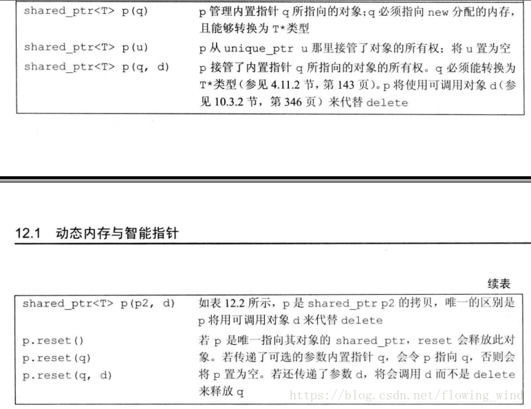

# cpp_智能指针

## 3、智能指针的原理、常用的智能指针及实现

### **原理**

智能指针是一个类，用来存储指向动态分配对象的指针，负责自动释放动态分配的对象，防止堆内存泄漏。动态分配的资源，交给一个类对象去管理，当类对象声明周期结束时，自动调用析构函数释放资源

### **常用的智能指针**

#### **(1) shared_ptr**

**shared_ptr是引用计数型智能指针，一个类模板（class template），它只有一个类型参数**

实现原理：采用引用计数器的方法，允许多个智能指针指向同一个对象，每当多一个指针指向该对象时，指向该对象的所有智能指针内部的引用计数加1，每当减少一个智能指针指向对象时，引用计数会减1，当计数为0的时候会自动的释放动态分配的资源。

- 智能指针将一个计数器与类指向的对象相关联，引用计数器跟踪共有多少个类对象共享同一指针
- 每次创建类的新对象时，初始化指针并将引用计数置为1
- 当对象作为另一对象的副本而创建时，拷贝构造函数拷贝指针并增加与之相应的引用计数
- 对一个对象进行赋值时，赋值操作符减少左操作数所指对象的引用计数（如果引用计数为减至0，则删除对象），并增加右操作数所指对象的引用计数
- 调用析构函数时，构造函数减少引用计数（如果引用计数减至0，则删除基础对象）

#### **(2) unique_ptr**

unique_ptr采用的是独享所有权语义，一个非空的unique_ptr总是拥有它所指向的资源。转移一个unique_ptr将会把所有权全部从源指针转移给目标指针，源指针被置空；所以unique_ptr不支持普通的拷贝和赋值操作，不能用在STL标准容器中；局部变量的返回值除外（因为编译器知道要返回的对象将要被销毁）；如果你拷贝一个unique_ptr，那么拷贝结束后，这两个unique_ptr都会指向相同的资源，造成在结束时对同一内存指针多次释放而导致程序崩溃。

#### **(3) weak_ptr**

**weak_ptr也是一个引用计数型智能指针，但是它不增加对象的引用次数，即弱（weak）引用**

weak_ptr：弱引用。 引用计数有一个问题就是互相引用形成环（环形引用），这样两个指针指向的内存都无法释放。需要使用weak_ptr打破环形引用。weak_ptr是一个弱引用，它是为了配合shared_ptr而引入的一种智能指针，它指向一个由shared_ptr管理的对象而不影响所指对象的生命周期，也就是说，它只引用，不计数。如果一块内存被shared_ptr和weak_ptr同时引用，当所有shared_ptr析构了之后，不管还有没有weak_ptr引用该内存，内存也会被释放。所以weak_ptr不保证它指向的内存一定是有效的，在使用之前使用函数lock()检查weak_ptr是否为空指针。

#### **(4) auto_ptr**

主要是为了解决“有异常抛出时发生内存泄漏”的问题 。因为发生异常而无法正常释放内存。

auto_ptr有拷贝语义，拷贝后源对象变得无效，这可能引发很严重的问题；而unique_ptr则无拷贝语义，但提供了移动语义，这样的错误不再可能发生，因为很明显必须使用std::move()进行转移。

auto_ptr不支持拷贝和赋值操作，不能用在STL标准容器中。STL容器中的元素经常要支持拷贝、赋值操作，在这过程中auto_ptr会传递所有权，所以不能在STL中使用。

### **智能指针shared_ptr代码实现：**

```cpp
template<typename T>
class SharedPtr
{
public:
	SharedPtr(T* ptr = NULL):_ptr(ptr), _pcount(new int(1))
	{}

	SharedPtr(const SharedPtr& s):_ptr(s._ptr), _pcount(s._pcount){
		(*_pcount)++;
	}

	SharedPtr<T>& operator=(const SharedPtr& s){
		if (this != &s)
		{
			if (--(*(this->_pcount)) == 0)
			{
				delete this->_ptr;
				delete this->_pcount;
			}
			_ptr = s._ptr;
			_pcount = s._pcount;
			(*_pcount)++;
		}
		return *this;
	}
	T& operator*()
	{
		return *(this->_ptr);
	}
	T* operator->()
	{
		return this->_ptr;
	}
	~SharedPtr()
	{
		--(*(this->_pcount));
		if (*(this->_pcount) == 0)
		{
			delete _ptr;
			_ptr = NULL;
			delete _pcount;
			_pcount = NULL;
		}
	}
private:
	T* _ptr;
	int* _pcount;//指向引用计数的指针
};
```


### 总结

- shared\_ptr控制对象的生命期。shared\_ptr是强引用（想象成用铁丝 绑住堆上的对象），只要有一个指向x对象的shared\_ptr存在，该x对象 就不会析构。当指向对象x的**最后一个shared\_ptr析构或reset()的时候，x 保证会被销毁**
- weak\_ptr**不控制对象的生命期，但是它知道对象是否还活着**。如果对象还活着，那么它可以提升 （promote）为有效的shared\_ptr；如果对象已经死了，提升会失败，返回一个空的shared\_ptr。“提升／lock()”行为是线程安全的
- shared\_ptr/weak\_ptr的“计数”**在主流平台上是原子操作，没有用锁，性能不俗**
- shared\_ptr/weak\_ptr的线程**安全级别与std::string和STL容器一样**， 后面还会讲


## 4、智能指针的原理

智能指针是C++中用于管理动态分配资源的一种机制，它是一个类，用来存储指向动态分配对象的指针（封装一个原始指针），负责自动释放动态分配的对象，防止堆内存泄漏。动态分配的资源，交给一个类对象去管理，当类对象声明周期结束时，自动调用析构函数释放资源。

智能指针的主要原理是利用了RAII（Resource Acquisition Is Initialization）的概念，即资源获取即初始化。


## 5、手写一个shared_ptr

### 首先回顾一下shared_ptr的概念

- `shared_ptr` 内部维护了一个引用计数器，记录有多少个 `shared_ptr` 共享同一块内存资源。每当创建一个新的 `shared_ptr` 对象指向该资源时，引用计数就加一；当 `shared_ptr` 对象被销毁或者重新赋值时，引用计数就减一。只有当引用计数变为零时，表示没有任何 `shared_ptr` 指向该资源，内存才会被释放。
- shared_ptr将一个计数器与类指向的对象相关联，引用计数跟踪该类有多少个对象共享同一指针。每次创建类的新对象时，初始化指针并将引用计数置为1；
- 当对象作为另一对象的副本而创建时，拷贝构造函数拷贝指针并增加与之相应的引用计数；
- 对一个对象进行赋值时，赋值操作符减少左操作数所指对象的引用计数（如果引用计数为减至0，则删除对象），并增加右操作数所指对象的引用计数；
- 调用析构函数时，构造函数减少引用计数（如果引用计数减至0，则自动删除所指向的堆内存）。

### 智能指针shared_ptr代码实现

```cpp
template<typename T>
class SharedPtr
{
public:
    // 默认构造函数，创建一个空的 SharedPtr 对象。
    explicit SharedPtr(); 
    // 接受一个原始指针 _ptr，创建一个包装该指针的 SharedPtr 对象
    explicit SharedPtr(T *_ptr); 
    // 拷贝构造函数，用于初始化一个新的 SharedPtr 对象，与另一个 SharedPtr 共享所管理的对象。
    SharedPtr(const SharedPtr& p); 
    // 析构函数，负责释放所管理的对象，并递减计数器。当计数器为零时，表示没有任何 SharedPtr 对象引用该对象，可以安全删除。
    ~SharedPtr();

    // 重载拷贝赋值运算符，用于将另一个 SharedPtr 的状态赋值给当前对象。
    // 在赋值之前，会先递减当前对象的计数器，并根据需要释放资源。
    // 然后将另一个 SharedPtr 的指针和计数器赋值给当前对象。
    SharedPtr& operator=(const SharedPtr& p);

    // 重载解引用运算符，返回所管理对象的引用。
    T& operator*();
    // 重载箭头运算符，返回所管理对象的指针。
    T* operator->();
    // 重载布尔值操作
    operator bool();

    // 返回所管理的原始指针。
    T* get() const;

    // 返回当前共享所管理对象的 SharedPtr 数量。
    size_t use_count();

    // 检查是否只有一个 SharedPtr 引用该对象
    bool unique();

    // 交换两个 SharedPtr 对象之间的资源和状态
    void swap(SharedPtr& p);

private:
    size_t *count;
    T *ptr;
};

template<typename T>
SharedPtr<T>::SharedPtr() : count(new size_t(0)), ptr(nullptr)
{}

template<typename T>
SharedPtr<T>::SharedPtr(T *_ptr) : count(new size_t(1)), ptr(_ptr)
{}

template<typename T>
SharedPtr<T>::~SharedPtr()
{
    --(*count);
    if(*count <= 0) {
        delete ptr;
        delete count;
        ptr = nullptr;
        count = nullptr;
    }
    std::cout << "shared ptr destory." << std::endl;
}

template<typename T>
SharedPtr<T>::SharedPtr(const SharedPtr &p)
{
    count = p.count;
    ptr = p.ptr;
    ++(*count);
}

template<typename T>
SharedPtr<T>& SharedPtr<T>::operator=(const SharedPtr &p)
{
    // 如果是原指针，直接返回
    if(ptr == p.ptr) {
        return *this;
    }

    if(ptr) {
        --(*count);
        if((*count) == 0) {
            delete ptr;
            delete count;
        }
    }

    ptr = p.ptr;
    count = p.count;
    ++(*count);
    return *this;
}

template<typename T>
T& SharedPtr<T>::operator*()
{
    return *ptr;
}

template<typename T>
T* SharedPtr<T>::operator->()
{
    return ptr;
}

template<typename T>
SharedPtr<T>::operator bool()
{
    return ptr != nullptr;
}

template<typename T>
T* SharedPtr<T>::get() const
{
    return ptr;
}

template<typename T>
size_t SharedPtr<T>::use_count()
{
    return *count;
}

template<typename T>
bool SharedPtr<T>::unique()
{
    return *count == 1;
}

template<typename T>
void SharedPtr<T>::swap(SharedPtr& p)
{
    std::swap(*this, p);
}
```


### 为什么shared_ptr赋值时，左边引用计数减一，右边引用计数加一

在 `shared_ptr` 赋值时，左边引用计数减一，右边引用计数加一的原因是为了维护资源的正确引用计数。

当一个 `shared_ptr` 对象赋值给另一个 `shared_ptr` 对象时，目标对象（左边）可能已经指向了其他资源。在进行赋值操作之前，我们希望递减左边对象的引用计数，以避免资源的过早释放。

然后，我们将右边对象的资源和引用计数复制到左边对象中。递增右边对象的引用计数是因为赋值操作后，左右两个对象都指向了同一块资源，需要确保引用计数的正确性。

这样做的好处是，在赋值完成后，左右两个 `shared_ptr` 对象都可以独立地管理资源，并且其引用计数也能正确地反映出资源被引用的次数。同时，如果左边对象的引用计数减少到零，则表示没有任何对象引用该资源，可以安全地释放资源。

这种引用计数的机制使得多个 `shared_ptr` 对象能够共享同一个资源，并自动在最后一个引用对象销毁时，释放内存。但是需要注意避免循环引用的情况，即两个或多个 `shared_ptr` 对象相互引用导致无法释放资源的问题。


## 6、手写实现智能指针类需要实现哪些函数？

1、智能指针是一个数据类型，一般用模板实现，模拟指针行为的同时还提供自动垃圾回收机制。它会自动记录SmartPointer<T*>对象的引用计数，一旦T类型对象的引用计数为0，就释放该对象。

除了指针对象外，我们还需要一个引用计数的指针设定对象的值，并将引用计数计为1，需要一个构造函数。新增对象还需要一个构造函数，析构函数负责引用计数减少和释放内存。

通过覆写赋值运算符，才能将一个旧的智能指针赋值给另一个指针，同时旧的引用计数减1，新的引用计数加1

2、一个构造函数、拷贝构造函数、赋值构造函数、析构函数、移动函数；


## 7、智能指针shared_ptr出现循环引用怎么解决

弱指针用于专门解决shared_ptr循环引用的问题，weak_ptr不会修改引用计数，即其存在与否并不影响对象的引用计数器。循环引用就是：两个对象互相使用一个shared_ptr成员变量指向对方。弱引用并不对对象的内存进行管理，在功能上类似于普通指针，然而一个比较大的区别是，弱引用能检测到所管理的对象是否已经被释放，从而避免访问非法内存。

### 我的：

在C++中，当使用`std::shared_ptr`来管理资源时，循环引用（cyclic reference）可能会导致资源无法释放，从而造成内存泄漏。循环引用指的是两个或多个对象彼此持有对方的`std::shared_ptr`，从而导致资源无法被正确释放。

为了解决`std::shared_ptr`循环引用问题，可以采用以下几种方法：

**1. 使用std::weak_ptr：** `std::weak_ptr`是`std::shared_ptr`的一种弱引用，它不会增加所指对象的引用计数，也不拥有所指对象。通过将其中一个`std::shared_ptr`转换为`std::weak_ptr`来打破循环引用。

```
cpp复制代码class ClassB; // 前向声明

class ClassA {
    std::shared_ptr<ClassB> ptrB;
};

class ClassB {
    std::weak_ptr<ClassA> weakPtrA;
};
```

使用`std::weak_ptr`可以避免循环引用导致资源无法释放，但在使用`std::weak_ptr`时需要注意判断其是否过期（expired），可以通过调用`std::weak_ptr`的`lock()`函数获取一个有效的`std::shared_ptr`，然后再进行操作。

### chatgpt：

`std::weak_ptr`可以解决循环引用问题是因为它不会增加所指对象的引用计数，也不拥有所指对象。相比之下，`std::shared_ptr`会增加引用计数，只有当引用计数变为零时，才会释放资源。

通过将其中一个`std::shared_ptr`转换为`std::weak_ptr`，可以打破循环引用，从而避免资源无法正确释放的问题。当存在循环引用时，即使没有其他外部引用，`std::shared_ptr`之间仍然互相持有对方的引用，导致引用计数不为零，资源无法被释放。

而`std::weak_ptr`的特点在于，它可以观测到所指对象是否已经被销毁（expired），并且可以通过调用`lock()`函数生成一个有效的`std::shared_ptr`来使用这个对象。如果所指对象已经销毁，则`lock()`函数返回一个空的`std::shared_ptr`。

使用`std::weak_ptr`作为解决循环引用的机制，可以让其中一个对象持有另一个对象的弱引用，这样在析构时不会增加引用计数，从而允许引用计数变为零，从而释放资源。通过手动调用`lock()`函数来获取一个有效的`std::shared_ptr`，可以确保对象在使用期间不会被提前销毁。

总结起来，`std::weak_ptr`通过不增加引用计数的方式来解决循环引用问题，从而避免资源无法正确释放，并提供了一种安全地观测所指对象是否已销毁的机制。


### 例子

shared\_ptr是带引用计数的智能指针，可以说大部分的情形选择用shared\_ptr不会出问题。那么weak\_ptr是什么，应该怎么用呢？  
weak\_ptr也是智能指针，但是比较弱，感觉没什么用。其实它的出现是伴随shared\_ptr而来，尤其是解决了一个引用计数导致的问题：在存在循环引用的时候会出现内存泄漏。  
关于循环引用，看下面这个小例子就足够了：

```cpp
#include <iostream>
#include <boost/smart_ptr.hpp>
using namespace std;
using namespace boost;

class BB;
class AA
{
public:
    AA() { cout << "AA::AA() called" << endl; }
    ~AA() { cout << "AA::~AA() called" << endl; }
    shared_ptr<BB> m_bb_ptr;  //!
};

class BB
{
public:
    BB() { cout << "BB::BB() called" << endl; }
    ~BB() { cout << "BB::~BB() called" << endl; }
    shared_ptr<AA> m_aa_ptr; //!
};

int main()
{
    shared_ptr<AA> ptr_a (new AA);
    shared_ptr<BB> ptr_b ( new BB);
    cout << "ptr_a use_count: " << ptr_a.use_count() << endl;
    cout << "ptr_b use_count: " << ptr_b.use_count() << endl;
    //下面两句导致了AA与BB的循环引用，结果就是AA和BB对象都不会析构
    ptr_a->m_bb_ptr = ptr_b;
    ptr_b->m_aa_ptr = ptr_a;
    cout << "ptr_a use_count: " << ptr_a.use_count() << endl;
    cout << "ptr_b use_count: " << ptr_b.use_count() << endl;
}
```

运行结果：  
  
可以看到由于AA和BB内部的shared\_ptr各自保存了对方的一次引用，所以导致了ptr\_a和ptr\_b销毁的时候都认为内部保存的指针计数没有变成0，所以AA和BB的析构函数不会被调用。解决方法就是把一个shared\_ptr替换成weak\_ptr。

```cpp
#include <iostream>
#include <boost/smart_ptr.hpp>
using namespace std;
using namespace boost;

class BB;
class AA
{
public:
    AA() { cout << "AA::AA() called" << endl; }
    ~AA() { cout << "AA::~AA() called" << endl; }
    weak_ptr<BB> m_bb_ptr;  //!
};

class BB
{
public:
    BB() { cout << "BB::BB() called" << endl; }
    ~BB() { cout << "BB::~BB() called" << endl; }
    shared_ptr<AA> m_aa_ptr; //!
};

int main()
{
    shared_ptr<AA> ptr_a (new AA);
    shared_ptr<BB> ptr_b ( new BB);
    cout << "ptr_a use_count: " << ptr_a.use_count() << endl;
    cout << "ptr_b use_count: " << ptr_b.use_count() << endl;
    //下面两句导致了AA与BB的循环引用，结果就是AA和BB对象都不会析构
    ptr_a->m_bb_ptr = ptr_b;
    ptr_b->m_aa_ptr = ptr_a;
    cout << "ptr_a use_count: " << ptr_a.use_count() << endl;
    cout << "ptr_b use_count: " << ptr_b.use_count() << endl;
}
```

运行结果：  


关于[weak\_ptr](http://www.boost.org/doc/libs/1_66_0/libs/smart_ptr/doc/html/smart_ptr.html#weak_ptr)更详细的说明可以阅读[boost](http://www.boost.org/doc/libs/)的文档，绝对的宝库。


## 8、强弱智能指针

- **强智能指针**：资源每被强智能指针引用一次，引用计数+1，释放引用计数-1，如shared_ptr;
- **弱智能指针**：仅仅起到观察作用，观察对象释放还存在，不改变资源的引用计数，如weak_ptr.


## 12、boost::scope_ptr智能指针（使用及原理分析）

[[C++\] Boost智能指针——boost::scoped_ptr（使用及原理分析） - helloamigo - 博客园 (cnblogs.com)](https://www.cnblogs.com/helloamigo/p/3572533.html)

 boost::scoped_ptr是一个比较简单的智能指针，它能保证在**离开作用域**之后它所管理对象能被**自动释放**。下面这个例子将介绍它的使用：

```cpp
 1 #include <iostream>
 2 #include <boost/scoped\_ptr.hpp>
 3 
 4 using namespace std; 5 
 6 class Book 7 {
 8 public:
 9 Book()
10 {
11         cout << "Creating book ..." << endl;
12 }
13 
14     ~Book()
15 {
16         cout << "Destroying book ..." << endl;
17 }
18 };
19 
20 int main()
21 {   
22     cout << "=====Main Begin=====" << endl;
23 {
24         boost::scoped\_ptr<Book> myBook(new Book());
25 }
26     cout << "===== Main End =====" << endl;
27 
28     return 0;
29 }
```

 运行结果：


 可以看出：当myBook离开了它的作用域之后，它所管理的Book对象也随之销毁。

**特点——不能共享控制权**

 scoped\_ptr不能通过其他scoped\_ptr共享控制权，因为在scoped\_ptr类的内部将**拷贝构造函数**和**\=运算符重载**定义为**私有的**。我们看下scoped\_ptr类的定义就清楚了：

```cpp
namespace boost
{
    // 声明一个模板类 scoped_ptr，继承 noncopyable，用于管理指针资源
    template<typename T> class scoped_ptr : noncopyable
    {
    private:
        T *px; // 指向被管理的对象的指针

        // 复制构造函数和赋值操作符被私有化，禁止拷贝和赋值
        scoped_ptr(scoped_ptr const &);
        scoped_ptr &operator=(scoped_ptr const &);

        typedef scoped_ptr<T> this_type;

        void operator==( scoped_ptr const & ) const; // 禁用比较操作符==
        void operator!=( scoped_ptr const & ) const; // 禁用比较操作符!=
    public:
        // 构造函数：接受指针参数，并创建 scoped_ptr 实例
        explicit scoped_ptr(T *p = 0);
        // 析构函数：释放指针指向的对象资源
        ~scoped_ptr();

        // 构造函数：接受 std::auto_ptr 参数，并创建 scoped_ptr 实例
        explicit scoped_ptr( std::auto_ptr<T> p ): px( p.release() );
        // 重置指针指向的对象
        void reset(T *p = 0);

        // 解引用操作符：返回指针指向的对象的引用
        T &operator*() const;
        // 成员访问操作符：返回指针指向的对象的指针
        T *operator->() const;
        // 获取内部的指针
        T *get() const;

        // 交换两个 scoped_ptr 实例的指针
        void swap(scoped_ptr &b);
    };

    // 交换两个 scoped_ptr 实例的指针
    template<typename T>
    void swap(scoped_ptr<T> &a, scoped_ptr<T> &b);
}

```

 下面这段代码中的注释部分打开会造成编译失败：

```cpp
#include <iostream>
#include <boost/scoped_ptr.hpp>

using namespace std;

class Book
{
public:
    Book()
    {
        cout << "Creating book ..." << endl;
    }

    ~Book()
    {
        cout << "Destroying book ..." << endl;
    }
};

int main()
{
    cout << "=====Main Begin=====" << endl;
    {
        boost::scoped_ptr<Book> myBook(new Book());
        //boost::scoped_ptr<Book> myBook1(myBook);    // Error: scoped_ptr的拷贝构造函数私有
        //boost::scoped_ptr<Book> myBook2 = myBook;   // Error: scoped_ptr的=运算符重载私有
    }
    cout << "===== Main End =====" << endl;

    return 0;
}
```

所以，scoped\_ptr不能用在标准库的容器中，因为容器中的push\_back操作需要调用scoped\_ptr的=运算符重载函数，结果就是会导致编译失败。

```cpp
#include <iostream>
#include <string>
#include <vector>
#include <boost/scoped_ptr.hpp>

using namespace std;

class Book
{
private:
    string name_;

public:
    Book(string name) : name_(name)
    {
        cout << "Creating book " << name_ << " ..." << endl;
    }

    ~Book()
    {
        cout << "Destroying book " << name_ << " ..." << endl;
    }
};

int main()
{
    cout << "=====Main Begin=====" << endl;
    {
        boost::scoped_ptr<Book> myBook(new Book("「1984」"));
        vector<boost::scoped_ptr<Book>> vecScoped;
        //vecScoped.push_back(myBook);   // Error: push_back操作内部调用了scoped_ptr的=运算符重载函数
    }
    cout << "===== Main End =====" << endl;

    return 0;
}
```

**编译检查=万无一失？**

 虽然我们无法通过scoped\_ptr的拷贝构造函数和=运算符重载函数共享控制权。那如果将一个对象交给多个scoped\_ptr来管理会怎样？

```cpp
#include <iostream>
#include <boost/scoped_ptr.hpp>

using namespace std;

class Book
{
public:
    Book()
    {
        cout << "Creating book ..." << endl;
    }

    ~Book()
    {
        cout << "Destroying book ..." << endl;
    }
};

int main()
{
    cout << "=====Main Begin=====" << endl;
    {
        Book * book = new Book();
        boost::scoped_ptr<Book> myBook(book);
        boost::scoped_ptr<Book> myBook1(book);
    }
    cout << "===== Main End =====" << endl;

    return 0;
}
```

  我们发现编译没报错，但是运行时出错了，如下：


 之所以会这样是因为每个scoped\_ptr对象都保存了自己所管理对象指针px，scoped\_ptr对象在离开自己作用域时会调用了自身的析构函数，在析构函数内部会调用delete px，当**多个scoped\_ptr管理同一个对象时**，那么在它们离开作用域之后，势必会**多次调用delete以释放它们所管理的对象，从而造成程序运行出错**。

**其他接口**

     虽然scoped\_ptr不能转移控制权，但是它们可以交换共享权。就以下面的代码举个例子：

```cpp
#include <iostream>
#include <string>
#include <boost/scoped_ptr.hpp>

using namespace std;

class Book
{
private:
    string name_;

public:
    Book(string name) : name_(name)
    {
        cout << "Creating book " << name_ << " ..." << endl;
    }

    ~Book()
    {
        cout << "Destroying book " << name_ << " ..." << endl;
    }
};

int main()
{
    cout << "=====Main Begin=====" << endl;
    {
        boost::scoped_ptr<Book> myBook(new Book("「1984」"));
        boost::scoped_ptr<Book> myBook1(new Book("「A Song of Ice and Fire」"));
        myBook.swap(myBook1);
    }
    cout << "===== Main End =====" << endl;

    return 0;
}
```

  运行结果：


 根据栈的特性，应该是后面构造的scoped\_ptr对象先销毁（从而销毁了它们所管理的对象），正是因为我们对两个智能指针的控制权进行交换之后，才出现了这种相反的结果。

 此外，在scoped\_ptr离开作用域之前也是可以显式销毁它们所管理的对象的。调用它的reset方法即可。请看下面例子：

```cpp
#include <iostream>
#include <string>
#include <boost/scoped_ptr.hpp>

using namespace std;

class Book
{
private:
    string name_;

public:
    Book(string name) : name_(name)
    {
        cout << "Creating book " << name_ << " ..." << endl;
    }

    ~Book()
    {
        cout << "Destroying book " << name_ << " ..." << endl;
    }
};

int main()
{
    cout << "=====Main Begin=====" << endl;
    {
        boost::scoped_ptr<Book> myBook(new Book("「1984」"));
        myBook.reset();
        cout << "After reset ..." << endl;
    }
    cout << "===== Main End =====" << endl;

    return 0;
}
```

  运行结果：


 可以看出：程序在输出“After reset ...”之前已经完成了对所管理对象的释放。

**总结（摘自《超越C++标准库：Boost库导论》）**

 使用裸指针来写异常安全和无错误的代码是很复杂的。使用智能指针来自动地把动态分配对象的生存期限制在一个明确的范围之内，是解决这种问题的一个有效的方法，并且提高了代码的可读性、可维护性和质量。scoped\_ptr明确地表示被指物不能被共享和转移。当一个动态分配的对象被传送给 scoped\_ptr, 它就成为了这个对象的唯一的拥有者。因为scoped\_ptr几乎总是以自动变量或数据成员来分配的，因此它可以在离开作用域时正确地销毁，从而在执行流由于返回语句或异常抛出而离开作用域时，总能释放它所管理的内存。

 在以下情况时使用scoped\_ptr：

*   在可能有异常抛出的作用域里使用指针
*   函数里有几条控制路径
*   动态分配对象的生存期应被限制于特定的作用域内
*   异常安全非常重要时(始终如此!)

**参考**

*   [http://www.cnblogs.com/sld666666/archive/2010/12/16/1908265.html](http://www.cnblogs.com/sld666666/archive/2010/12/16/1908265.html)
*   Björn Karlsson：Beyond the C++ Standard Library: An Introduction to Boost（《超越C++标准库：Boost库导论》）

（完）

本文转自 [https://www.cnblogs.com/helloamigo/p/3572533.html](https://www.cnblogs.com/helloamigo/p/3572533.html)，如有侵权，请联系删除。


## 14、C++智能指针详解

http://t.csdn.cn/36CE8

参考资料：《C++ Primer中文版 第五版》  
我们知道除了静态内存和栈内存外，每个程序还有一个内存池，这部分内存被称为自由空间或者堆。程序用堆来存储动态分配的对象即那些在程序运行时分配的对象，当动态对象不再使用时，我们的代码必须显式的销毁它们。

在C++中，动态内存的管理是用一对运算符完成的：new和delete，new:在动态内存中为对象分配一块空间并返回一个指向该对象的指针，delete：指向一个动态独享的指针，销毁对象，并释放与之关联的内存。

动态内存管理经常会出现两种问题：一种是忘记释放内存，会造成内存泄漏；一种是尚有指针引用内存的情况下就释放了它，就会产生引用非法内存的指针。

为了更加容易（更加安全）的使用动态内存，引入了智能指针的概念。智能指针的行为类似常规指针，重要的区别是它负责自动释放所指向的对象。标准库提供的两种智能指针的区别在于管理底层指针的方法不同，**shared\_ptr允许多个指针指向同一个对象**，**unique\_ptr则“独占”所指向的对象**。标准库还定义了一种名为weak\_ptr的伴随类，它是一种弱引用，指向shared\_ptr所管理的对象，这三种智能指针都定义在memory头文件中。

### shared\_ptr类  
创建智能指针时必须提供额外的信息，指针可以指向的类型：

```cpp
shared_ptr<string> p1;
shared_ptr<list<int>> p2;
```

默认初始化的智能指针中保存着一个空指针。  
智能指针的使用方式和普通指针类似，解引用一个智能指针返回它指向的对象，在一个条件判断中使用智能指针就是检测它是不是空。

```cpp
if(p1 && p1->empty())
	*p1 = "hi";
```

如下表所示是shared\_ptr和unique\_ptr都支持的操作：  
  
如下表所示是shared\_ptr特有的操作：  


#### **make\_shared函数：**

 最安全的分配和使用动态内存的方法就是调用一个名为make\_shared的标准库函数，此函数在动态内存中分配一个对象并初始化它，返回指向此对象的shared\_ptr。头文件和share\_ptr相同，在memory中  
必须指定想要创建对象的类型，定义格式见下面例子：

```cpp
shared_ptr<int> p3 = make_shared<int>(42);
shared_ptr<string> p4 = make_shared<string>(10,'9');
shared_ptr<int> p5 = make_shared<int>();
```

make\_shared用其参数来构造给定类型的对象，如果我们不传递任何参数，对象就会进行值初始化

**shared\_ptr的拷贝和赋值**  
当进行拷贝和赋值时，每个shared\_ptr都会记录有多少个其他shared\_ptr指向相同的对象。

```auto
auto p = make_shared<int>(42);
auto q(p);
```

我们可以认为每个shared\_ptr都有一个关联的计数器，通常称其为引用计数，无论何时我们拷贝一个shared\_ptr，计数器都会递增。当我们给shared\_ptr赋予一个新值或是shared\_ptr被销毁（例如一个局部的shared\_ptr离开其作用域）时，计数器就会递减，一旦一个shared\_ptr的计数器变为0,它就会自动释放自己所管理的对象。

```auto
auto r = make_shared<int>(42);//r指向的int只有一个引用者
r=q;//给r赋值，令它指向另一个地址
	//递增q指向的对象的引用计数
	//递减r原来指向的对象的引用计数
	//r原来指向的对象已没有引用者，会自动释放
```

**shared\_ptr自动销毁所管理的对象**  
当指向一个对象的最后一个shared\_ptr被销毁时，shared\_ptr类会自动销毁此对象，它是通过另一个特殊的成员函数-析构函数完成销毁工作的，类似于构造函数，每个类都有一个析构函数。析构函数控制对象销毁时做什么操作。析构函数一般用来释放对象所分配的资源。**shared\_ptr的析构函数会递减它所指向的对象的引用计数。如果引用计数变为0，shared\_ptr的析构函数就会销毁对象，并释放它所占用的内存。**

**shared\_ptr还会自动释放相关联的内存**  
当动态对象不再被使用时，shared\_ptr类还会自动释放动态对象，这一特性使得动态内存的使用变得非常容易。如果你将shared\_ptr存放于一个容器中，而后不再需要全部元素，而只使用其中一部分，要记得用erase删除不再需要的那些元素。

**使用了动态生存期的资源的类**：  
程序使用动态内存的原因：  
（1）程序不知道自己需要使用多少对象  
（2）程序不知道所需对象的准确类型  
（3）程序需要在多个对象间共享数据

**直接管理内存**  
C++定义了两个运算符来分配和释放动态内存，new和delete，使用这两个运算符非常容易出错。

使用new动态分配和初始化对象  
在自由空间分配的内存是无名的，因此new无法为其分配的对象命名，而是返回一个指向该对象的指针。

```cpp
int *pi = new int;//pi指向一个动态分配的、未初始化的无名对象
```

此new表达式在自由空间构造一个int型对象，并返回指向该对象的指针

默认情况下，动态分配的对象是默认初始化的，这意味着内置类型或组合类型的对象的值将是未定义的，而类类型对象将用默认构造函数进行初始化。

```cpp
string *ps = new string;//初始化为空string
int *pi = new int;//pi指向一个未初始化的int
```

我们可以直接使用直接初始化方式来初始化一个动态分配一个动态分配的对象。我们可以使用传统的构造方式，在新标准下，也可以使用列表初始化

```cpp
int *pi = new int(1024);
string *ps = new string(10,'9');
vector<int> *pv = new vector<int>{0,1,2,3,4,5,6,7,8,9};
```

也可以对动态分配的对象进行初始化，只需在类型名之后跟一对空括号即可；

动态分配的const对象

```auto
const int *pci = new const int(1024);
//分配并初始化一个const int
const string *pcs = new const string;
//分配并默认初始化一个const的空string
```

类似其他任何const对象，一个动态分配的const对象必须进行初始化。对于一个定义了默认构造函数的类类型，其const动态对象可以隐式初始化，而其他类型的对象就必须显式初始化。由于分配的对象就必须显式初始化。由于分配的对象是const的，new返回的指针就是一个指向const的指针。

**内存耗尽**：  
虽然现代计算机通常都配备大容量内村，但是自由空间被耗尽的情况还是有可能发生。一旦一个程序用光了它所有可用的空间，new表达式就会失败。默认情况下，如果new不能分配所需的内存空间，他会抛出一个bad\_alloc的异常，我们可以改变使用new的方式来阻止它抛出异常

```cpp
//如果分配失败，new返回一个空指针
int *p1 = new int;//如果分配失败，new抛出std：：bad_alloc
int *p2 = new (nothrow)int;//如果分配失败，new返回一个空指针
```

我们称这种形式的new为定位new,定位new表达式允许我们向new传递额外的参数，在例子中我们传给它一个由标准库定义的nothrow的对象，如果将nothrow传递给new，我们的意图是告诉它不要抛出异常。如果这种形式的new不能分配所需内存，它会返回一个空指针。bad\_alloc和nothrow都在头文件new中。

**释放动态内存**  
为了防止内存耗尽，在动态内存使用完之后，必须将其归还给系统，使用delete归还。

**指针值和delete**  
我们传递给delete的指针必须指向动态内存，或者是一个空指针。释放一块并非new分配的内存或者将相同的指针释放多次，其行为是未定义的。即使delete后面跟的是指向静态分配的对象或者已经释放的空间，编译还是能够通过，实际上是错误的。

**动态对象的生存周期直到被释放时为止**  
由shared\_ptr管理的内存在最后一个shared\_ptr销毁时会被自动释放，但是通过内置指针类型来管理的内存就不是这样了，内置类型指针管理的动态对象，直到被显式释放之前都是存在的，所以调用这必须记得释放内存。

使用new和delete管理动态内存常出现的问题：  
（1）忘记delete内存  
（2）使用已经释放的对象  
（3）同一块内存释放两次

**delete之后重置指针值**  
在delete之后，指针就变成了空悬指针，即指向一块曾经保存数据对象但现在已经无效的内存的地址

有一种方法可以避免悬空指针的问题：在指针即将要离开其作用域之前释放掉它所关联的内存  
如果我们需要保留指针可以在delete之后将nullptr赋予指针，这样就清楚的指出指针不指向任何对象。  
动态内存的一个基本问题是可能多个指针指向相同的内存

**shared\_ptr和new结合使用**  
如果我们不初始化一个智能指针，它就会被初始化成一个空指针，接受指针参数的职能指针是explicit的，因此我们不能将一个内置指针隐式转换为一个智能指针，必须直接初始化形式来初始化一个智能指针

```auto
shared_ptr<int> p1 = new int(1024);//错误：必须使用直接初始化形式
shared_ptr<int> p2(new int(1024));//正确：使用了直接初始化形式
```

下表为定义和改变shared\_ptr的其他方法：  
  
**不要混合使用普通指针和智能指针**  
如果混合使用的话，智能指针自动释放之后，普通指针有时就会变成悬空指针，当将一个shared\_ptr绑定到一个普通指针时，我们就将内存的管理责任交给了这个shared\_ptr。一旦这样做了，我们就不应该再使用内置指针来访问shared\_ptr所指向的内存了。  
也不要使用get初始化另一个智能指针或为智能指针赋值

```cpp
shared_ptr<int> p(new int(42));//引用计数为1
int *q = p.get();//正确：但使用q时要注意，不要让它管理的指针被释放
{
	//新程序块
	//未定义：两个独立的share_ptr指向相同的内存
	shared_ptr(q);
	
}//程序块结束，q被销毁，它指向的内存被释放
int foo = *p;//未定义，p指向的内存已经被释放了
```

p和q指向相同的一块内部才能，由于是相互独立创建，因此各自的引用计数都是1，当q所在的程序块结束时，q被销毁，这会导致q指向的内存被释放，p这时候就变成一个空悬指针，再次使用时，将发生未定义的行为，当p被销毁时，这块空间会被二次delete

**其他shared\_ptr操作**  
可以使用reset来将一个新的指针赋予一个shared\_ptr:

```auto
p = new int(1024);//错误：不能将一个指针赋予shared_ptr
p.reset(new int(1024));//正确。p指向一个新对象
```

与赋值类似，reset会更新引用计数，如果需要的话，会释放p的对象。reset成员经常和unique一起使用，来控制多个shared\_ptr共享的对象。在改变底层对象之前，我们检查自己是否是当前对象仅有的用户。如果不是，在改变之前要制作一份新的拷贝：

```auto
if(!p.unique())
p.reset(new string(*p));//我们不是唯一用户，分配新的拷贝
*p+=newVal;//现在我们知道自己是唯一的用户，可以改变对象的值
```

**智能指针和异常**  
如果使用智能指针，即使程序块过早结束，智能指针也能确保在内存不再需要时将其释放，sp是一个shared\_ptr,因此sp销毁时会检测引用计数，当发生异常时，我们直接管理的内存是不会自动释放的。如果使用内置指针管理内存，且在new之后在对应的delete之前发生了异常，则内存不会被释放。

**使用我们自己的释放操作**  
默认情况下，shared\_ptr假定他们指向的是动态内存，因此当一个shared\_ptr被销毁时，会自动执行delete操作，为了用shared\_ptr来管理一个connection，我们必须首先必须定义一个函数来代替delete。这个删除器函数必须能够完成对shared\_ptr中保存的指针进行释放的操作。

**智能指针陷阱**：  
（1）不使用相同的内置指针值初始化（或reset）多个智能指针。  
（2）不delete get()返回的指针  
（3）不使用get()初始化或reset另一个智能指针  
（4）如果你使用get()返回的指针，记住当最后一个对应的智能指针销毁后，你的指针就变为无效了  
（5）如果你使用智能指针管理的资源不是new分配的内存，记住传递给它一个删除器  

### unique\_ptr  

某个时刻只能有一个unique\_ptr指向一个给定对象，由于一个unique\_ptr拥有它指向的对象，因此unique\_ptr不支持普通的拷贝或赋值操作。  
下表是unique的操作：  
  
虽然我们不能拷贝或者赋值unique\_ptr，但是可以通过调用release或reset将指针所有权从一个（非const）unique\_ptr转移给另一个unique

```cpp
//将所有权从p1（指向string Stegosaurus）转移给p2
unique_ptr<string> p2(p1.release());//release将p1置为空
unique_ptr<string>p3(new string("Trex"));
//将所有权从p3转移到p2
p2.reset(p3.release());//reset释放了p2原来指向的内存
```

release成员返回unique\_ptr当前保存的指针并将其置为空。因此，p2被初始化为p1原来保存的指针，而p1被置为空。  
reset成员接受一个可选的指针参数，令unique\_ptr重新指向给定的指针。  
调用release会切断unique\_ptr和它原来管理的的对象间的联系。release返回的指针通常被用来初始化另一个智能指针或给另一个智能指针赋值。  
不能拷贝unique\_ptr有一个例外：我们可以拷贝或赋值一个将要被销毁的unique\_ptr.最常见的例子是从函数返回一个unique\_ptr.

```cpp
unique_ptr<int> clone(int p)
{
	//正确：从int*创建一个unique_ptr<int>
	return unique_ptr<int>(new int(p));
}
```

还可以返回一个局部对象的拷贝：

```cpp
unique_ptr<int> clone(int p)
{
	unique_ptr<int> ret(new int(p));
	return ret;
}
```

向后兼容：auto\_ptr  
标准库的较早版本包含了一个名为auto\_ptr的类，它具有uniqued\_ptr的部分特性，但不是全部。  
**用unique\_ptr传递删除器**  
unique\_ptr默认使用delete释放它指向的对象，我们可以重载一个unique\_ptr中默认的删除器  
我们必须在尖括号中unique\_ptr指向类型之后提供删除器类型。在创建或reset一个这种unique\_ptr类型的对象时，必须提供一个指定类型的可调用对象删除器。

### weak\_ptr  
weak\_ptr是一种不控制所指向对象生存期的智能指针，它指向一个由shared\_ptr管理的对象，将一个weak\_ptr绑定到一个shared\_ptr不会改变shared\_ptr的引用计数。一旦最后一个指向对象的shared\_ptr被销毁，对象就会被释放，即使有weak\_ptr指向对象，对象还是会被释放。  
weak\_ptr的操作  
  由于对象可能不存在，我们不能使用weak\_ptr直接访问对象，而必须调用lock，此函数检查weak\_ptr指向的对象是否存在。如果存在，lock返回一个指向共享对象的shared\_ptr,如果不存在，lock将返回一个空指针

### scoped\_ptr  
scoped和weak\_ptr的区别就是，给出了拷贝和赋值操作的声明并没有给出具体实现，并且将这两个操作定义成私有的，这样就保证scoped\_ptr不能使用拷贝来构造新的对象也不能执行赋值操作，更加安全，但有了"++""–"以及`"++""–"`以及`“*”“->”`这些操作，比weak\_ptr能实现更多功能。


## 16、shared\_ptr技术与陷阱

> ### ①意外延长对象的生命期
>
> - shared\_ptr是强引用，只 要有一个指向x对象的shared\_ptr存在，该对象就不会析构
> - 而shared\_ptr又是允许拷贝构造和赋值的，**如果不小心遗留了一个拷贝，那么对象就永世长存了。例如：**
>   - ①前面提到如果把“五”的代码中把obervers\_的类型改为vector<shared\_ptr<Observer>>，那么**除非手动调用unregister()，否则Observer对象永远不会析构**。即便它的析构函 数会调用unregister()，但是不去unregister()就不会调用Observer的析构（函数。这也是Java内存泄漏的常见原因。）
>   - ②**另外一个出错的可能是boost::bind**，因为std::bind会把实参拷贝一份，如果参数是个shared\_ptr，那么对象的生命期就不会短于std::function对象：
>
> ```cpp
> #include <functional>;
> 
> class Foo
> {
> public:
>  void doit();
> };
> 
> shared_ptr<Foo> pFoo(new Foo);
> std::function<void()> func = std::bind(&Foo::doit, pFoo);
> ```
>
> - 这里**func对象持有了shared\_ptr的一份拷贝**，有可能会在不经意间延长倒数第二行创建的Foo对象的生命期
>
> ### ②函数参数
>
> - 因为要修改引用计数（而且拷贝的时候通常要加锁），shared\_ptr的**拷贝开销比拷贝原始指针要高**，但是需要拷贝的时候并不 多。**多数情况下它可以以const reference方式传递**，一个线程只需要在最外层函数有一个实体对象，之后都可以用const reference来使用这个shared\_ptr。例如有几个函数都要用到Foo对象：
>
> ```cpp
> void save(const std::shared_ptr<Foo>& pFoo); //pass by const reference
> void validateAccount(const Foo& foo);
> 
> vool validate(const std::shared_ptr<Foo>& pFoo) //pass by const reference
> {
>  validateAccount(*pFoo);
> }
> ```
>
> - 那么在通常情况下，**我们可以传常引用：**
>
> ```cpp
> void onMessage(const string& msg)
> {
>  std::tr1::shared_ptr<Foo> pFoo(new Foo(msg)); //只要在最外层持有一个实体，安全就不是问题
>  if (validate(pFoo)) { //没有拷贝pFoo
>      save(pFoo);       //没有拷贝pFoo
>  }
> }
> ```
>
> - **遵照这个规则：**
>   - 基本上**不会遇到反复拷贝shared\_ptr导致的性能问题**
>   - 另外由于pFoo**是栈上对象**，不可能被别的线程看到，那么**读取始终是线程安全的**
>
> ### ③析构动作在创建时被捕获
>
> - **这是一个非常有用的特性，这意味着：**
>   - **虚析构不再是必需的**
>   - shared\_ptr可以持有任何对象，而且能安全地释放
>   - shared\_ptr对象**可以安全地跨越模块边界**，比如从DLL里返回，而不会造成从模块A分配的内存在模块B里被释放这种错误
>   - **二进制兼容性，即便Foo对象的大小变了**，那么旧的客户代码仍然可以使用新的动态库，而无须重新编译。前提是Foo的头文件中不出现访问对象的成员的inline函数，并且Foo对象的由动态库中的Factory构造，返回其shared\_ptr
>   - **析构动作可以定制（通过shared\_ptr的参数2）**
> - 最后这个特性的实现比较巧妙，**因为shared\_ptr只有一个模板参数，而“析构行为”可以是函数指针、仿函数（functor）或者其他什么东西**。这是泛型编程和面向对象编程的一次完美结合（这个技术在后面的对象池中还会用到）
>
> ### ④析构所在的线程
>
> - 析构所在的线程对象的析构是同步的，**当最后一个指向x的shared\_ptr离开其作用域的时候，x会同时在同一个线程析构**。这个线程不一定是对象诞生的线程
> - **这个特性是把双刃剑：**
>   - **缺点：**如果对象的析构比较耗时，那么**可能会拖慢关键线程的速度**（如果最后一个shared\_ptr引发的析构发生在关键线程）
>   - **优点：**同时，我们可以用一个单独的线程来专门做析构，通过一个BlockingQueue<shared\_ptr<void>>**把对象的析构都转移到那个专用线程，从而解放关键线程**
>
> ### ⑤线程的RAII handle
>
> - 我认为RAII（资源获取即初始化）是C++语言区别于其他所有编程语言的最重要的特性，一个不懂RAII的C++程序员不是一个合格的C++程序员
> - 初学C++的教条是**“new和delete要配对， new了之后要记着delete”**
> - 如果使用RAII（参阅Effective C++：[https://blog.csdn.net/qq\_41453285/article/details/104219176](https://blog.csdn.net/qq_41453285/article/details/104219176)），要改成“每一个明确的资源配置动作（例如new）都应该在单一语句中执行，并在该语句中立刻将配置获得的资源交给handle对象（如shared\_ptr），程序中一般不出现delete”
> - **shared\_ptr是管理共享资源的利器，需要注意避免循环引用**，通常的做法是owner持有指向child的shared\_ptr，child持有指向 owner的weak\_ptr


