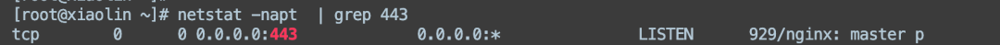

# Linux

## 1、怎么看端口被哪个进程监听了？
```shell
netstat -napt  | grep 443 
```



其中，`-t` 表示 TCP 连接，`-u` 表示 UDP 连接，`-n` 表示不进行 DNS 解析，`-l` 表示只显示监听状态的端口，`-p` 表示显示进程 ID 和名称。

## 2、top命令有哪些参数，说一下

top命令是一个用于实时监控系统资源和进程的命令，它可以显示当前运行的进程、CPU使用情况、内存使用情况等信息。以下是一些常用的top命令参数：

1. -d <秒数>：指定top命令刷新的时间间隔，默认为3秒。
2. -n <次数>：指定top命令执行的次数后自动退出。
3. -p <进程ID>：指定要监控的进程ID。
4. -u <用户名>：只显示指定用户名的进程。
5. -s <排序字段>：按指定字段对进程进行排序，常见的字段有cpu（CPU使用率）、mem（内存使用率）等。
6. -H：显示进程的层次关系。
7. -i：只显示运行中的进程，不显示僵尸进程。

## 3、怎么显示线程？

在Linux中，可以使用以下命令来显示线程：

- top命令：在top命令的默认显示中，可以看到每个进程的线程数（Threads列）。例如，执行top命令后，按下"Shift + H"键可以切换到线程视图，显示每个进程的线程信息。
- ps命令：通过ps命令结合选项来显示线程。例如，使用"ps -eLf"命令可以显示系统中所有线程的详细信息。


### 4、怎么查看日志？

```shell
tail -f test.log
```


## 5、Linux用过吗，常用哪些操作？

chmod chown useradd groupadd netstat等等

文件相关(mv mkdir cd ls)

docker相关(docker container ls docker ps -a )

测试相关(测试连通性:ping 测试端口连通性:telnet)