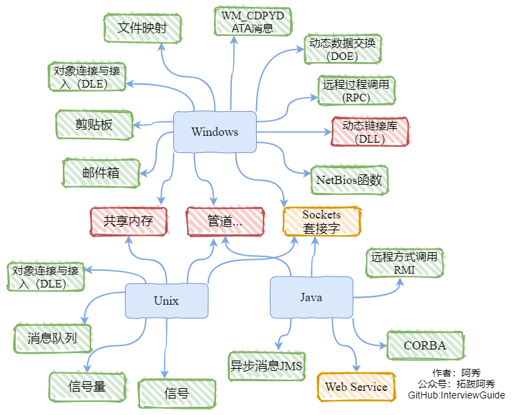
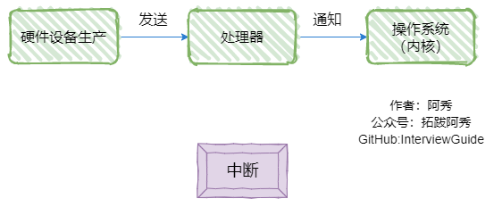

# 操作系统


## 2、Linux和windows下的进程通信方法和线程通信方法分别有哪些？

**进程通信方法**



| 名称及方式                                                   |
| ------------------------------------------------------------ |
| 管道(pipe)：允许一个进程和另一个与它有共同祖先的进程之间进行通信 |
| 命名管道(FIFO)：类似于管道，但是它可以用于任何两个进程之间的通信，**命名管道在文件系统中有对应的文件名**。命名管道通过命令mkfifo或系统调用mkfifo来创建 |
| **消息队列(MQ)**：消息队列是消息的连接表，包括POSIX消息对和System V消息队列。有足够权限的进程可以向队列中添加消息，被赋予读权限的进程则可以读走队列中的消息。消息队列克服了信号承载信息量少，管道只能成该无格式字节流以及缓冲区大小受限等缺点；                                                                                              **消息的链接表，放在内核中。消息队列独立于发送与接收进程，进程终止时，消息队列及其内容并不会被删除；消息队列可以实现消息的随机查询，可以按照消息的类型读取**。 |
| **信号量(semaphore)**：信号量主要作为进程间以及同进程不同线程之间的同步手段；                                        是一个计数器，可以用来控制多个进程对共享资源的访问。信号量用于实现进程间的互斥与同步。 |
| **共享内存(shared memory)**：**它使得多个进程可以访问同一块内存空间**，**是最快的可用IPC形式。**这是针对其他通信机制运行效率较低而设计的。它往往与其他通信机制，如信号量结合使用，以达到进程间的同步及互斥 |
| **信号(signal)**：信号是比较复杂的通信方式，**用于通知接收进程有某种事情发生**，除了用于进程间通信外，进程还可以发送信号给进程本身。**信号是一种异步的通信方式，进程可以通过系统调用signal或sigaction来注册信号处理函数，当接收到特定信号时，会调用相应的处理函数进行处理**。 |
| 内存映射(mapped memory)：内存映射允许任何多个进程间通信，**每一个使用该机制的进程通过把一个共享的文件映射到自己的进程地址空间来实现它** |
| Socket：它是更为通用的进程间通信机制，可用于不同机器之间的进程间通信 |

**线程通信方法**


| 名称及含义                                                   |
| ------------------------------------------------------------ |
| **Linux：**                                                  |
| 信号：类似进程间的信号处理                                   |
| **信号量：包括无名线程信号量和命名线程信号量；计数器，允许多个线程同时访问同一个资源。** |
| **条件变量：使用通知的方式解锁，与互斥锁配合使用**           |
| **锁机制：互斥锁、读写锁和自旋锁。读写锁与互斥量类似。但互斥量要么是锁住状态，要么就是不加锁状态。读写锁一次只允许一个线程写，但允许一次多个线程读，这样效率就比互斥锁要高。** |
| 临界区：每个线程中访问临界资源的那段代码称为临界区（Critical Section）（临界资源是一次仅允许一个线程使用的共享资源）。每次只准许一个线程进入临界区，进入后不允许其他线程进入。不论是硬件临界资源，还是软件临界资源，多个线程必须互斥地对它进行访问。 |
| **Windows：**                                                |
| 全局变量：需要有多个线程来访问一个全局变量时，通常我们会在这个全局变量前加上volatile声明，以防编译器对此变量进行优化 |
| Message消息机制：常用的Message通信的接口主要有两个：PostMessage和PostThreadMessage，PostMessage为线程向主窗口发送消息。而PostThreadMessage是任意两个线程之间的通信接口。 |
| CEvent对象：CEvent为MFC中的一个对象，可以通过对CEvent的触发状态进行改变，从而实现线程间的通信和同步，这个主要是实现线程直接同步的一种方法。 |


## 2、说说进程同步的方式？ 

1. **信号量semaphore**：是一个计数器，可以用来控制多个进程对共享资源的访问。信号量用于实现
进程间的互斥与同步。P操作(递减操作)可以用于阻塞一个进程，V操作(增加操作)可以用于解除阻
塞一个进程。
2. **管道**：一个进程通过调用管程的一个过程进入管程。在任何时候，只能有一个进程在管程中执行，
调用管程的任何其他进程都被阻塞，以等待管程可用。
3. **消息队列**：**消息的链接表，放在内核中**。**消息队列独立于发送与接收进程，进程终止时，消息队列**
**及其内容并不会被删除**；消息队列可以实现消息的随机查询，可以按照消息的类型读取。


## 2、说说线程同步方式有哪些？ 

线程间的同步方式包括互斥锁、信号量、条件变量、读写锁：

1. **互斥锁**：采用互斥对象机制，只有拥有互斥对象的线程才可以访问。因为互斥对象只有一个，所以
可以保证公共资源不会被多个线程同时访问。
2. **读写锁**：读写锁与互斥量类似。但互斥量要么是锁住状态，要么就是不加锁状态。读写锁一次只允
  许一个线程写，但允许一次多个线程读，这样效率就比互斥锁要高。
3. **信号量**：计数器，允许多个线程同时访问同一个资源。
4. **条件变量**：通过条件变量通知操作的方式来保持多线程同步。


## 3、线程与进程的比较或者说区别？

### 第一种回答

1、线程启动速度快，轻量级

2、线程的系统开销小

3、线程使用有一定难度，需要处理数据一致性问题

4、同一线程共享的有堆、全局变量、静态变量、指针，引用、文件等，而独自占有栈

### 第二种回答

- 调度：线程是调度的基本单位（PC程序技术器，状态码，通用寄存器，线程栈及栈指针）；进程是拥有资源的基本单位（打开文件，**堆，静态区，代码段**等）（CPU资源、内存资源、文件资源和句柄等）。
- 并发性：**一个进程内多个线程可以并发（最好和CPU核数相等）；多个进程可以并发**。
- 拥有资源：线程不拥有系统资源，但一个进程的多个线程可以共享隶属进程的资源；进程是拥有资源的独立单位。
- 系统开销：**线程创建销毁只需要处理PC值，状态码，通用寄存器值，线程栈及栈指针即可**；**进程需要切换虚拟地址空间，切换内核栈和硬件上下文，CPU高速缓存失效、页表切换，开销很大**。


## 4、你会如何实现一个操作系统

实现一个操作系统是一项复杂的任务，需要深入了解计算机体系结构、操作系统原理和编程技术。以下是一般情况下实现操作系统的一些基本步骤：

1. 定义需求和目标：确定你想要实现的操作系统的功能和特性。这包括选择适当的硬件平台和处理器架构。

2. 编写**引导程序**：创建一个引导程序，用于加载操作系统内核。该程序负责初始化硬件并将控制权转移到操作系统内核。

3. 实现**内核功能**：编写操作系统内核，包括处理中断、管理**进程**、调度任务、**内存**管理、**文件**系统等关键功能。这通常需要使用汇编语言和低级编程语言（如C或C++）。

4. 构建**驱动程序**：为操作系统开发设备驱动程序，以便与硬件进行通信和控制。这可能涉及到与各种设备和接口（如磁盘、网络、图形显示等）的交互。

5. 设计**用户界面**：实现用户界面（如命令行界面或图形用户界面），以便用户可以与操作系统进行交互和使用。

6. 进行测试和调试：对操作系统进行测试，确保其稳定性、正确性和安全性。进行调试以修复错误和改进性能。

7. 优化和优化：对操作系统进行性能优化和优化，以提高其效率和响应速度。

需要指出的是，实现一个完整的操作系统是一项庞大的工程，需要深入的计算机科学知识、系统编程技巧和时间投入。以上步骤仅提供了一个粗略的概述，实际的操作系统开发可能还涉及到许多其他方面的细节和挑战。


## 5、进程、线程和协程的区别和联系

|          | 进程                                                         | 线程                                               | 协程                                                         |
| -------- | ------------------------------------------------------------ | -------------------------------------------------- | ------------------------------------------------------------ |
| 定义     | 资源分配和拥有的基本单位                                     | 程序执行的基本单位                                 | **用户态的轻量级线程，线程内部调度的基本单位**               |
| 切换情况 | 进程CPU环境(栈、寄存器、页表和文件句柄等)的保存以及新调度的进程CPU环境的设置 | 保存和设置程序计数器、少量寄存器和栈的内容         | 先将寄存器上下文和栈保存，等切换回来的时候再进行恢复         |
| 切换者   | 操作系统                                                     | 操作系统                                           | 用户                                                         |
| 切换过程 | 用户态->内核态->用户态                                       | 用户态->内核态->用户态                             | **用户态(没有陷入内核)**                                     |
| 调用栈   | 内核栈                                                       | 内核栈                                             | **用户栈**                                                   |
| 拥有资源 | **CPU资源、内存资源、文件资源和句柄等**                      | **程序计数器、寄存器、栈和状态字**                 | **拥有自己的寄存器上下文和栈**                               |
| 并发性   | **不同进程之间切换实现并发，各自占有CPU实现并行**            | **一个进程内部的多个线程并发执行**                 | **同一时间只能执行一个协程，而其他协程处于休眠状态，适合对任务进行分时处理** |
| 系统开销 | **切换虚拟地址空间，切换内核栈和硬件上下文，CPU高速缓存失效、页表切换，开销很大** | 切换时只需保存和设置少量寄存器内容，因此开销很小   | 直接操作栈则基本没有内核切换的开销，可以不加锁的访问全局变量，所以上下文的切换非常快 |
| 通信方面 | 进程间通信需要借助操作系统                                   | 线程间可以直接读写进程数据段(如全局变量)来进行通信 | 共享内存、消息队列                                           |

1、进程是资源分配的基本单位，运行一个可执行程序会创建一个或多个进程，进程就是运行起来的可执行程序

2、线程是资源调度的基本单位，也是程序执行的基本单位，是轻量级的进程。每个进程中都有唯一的主线程，且只能有一个，主线程和进程是相互依存的关系，主线程结束进程也会结束。多提一句：协程是用户态的轻量级线程，线程内部调度的基本单位


### 第2种

1. **进程**：程序是指令、数据及其组织形式的描述，而进程则是程序的运行实例，包括程序计数器、寄
    存器和变量的当前值。
2. **线程**：微进程，一个进程里更小粒度的执行单元。一个进程里包含多个线程并发执行任务。
3. **协程**：**协程是微线程，在子程序内部执行，可在子程序内部中断，转而执行别的子程序，在适当的**
    **时候再返回来接着执行**。

**区别**：

1. 线程与进程的区别：
    （1）一个线程从属于一个进程；一个进程可以包含多个线程。
    （2）一个线程挂掉，对应的进程挂掉；一个进程挂掉，不会影响其他进程。
    （3）进程是系统资源调度的最小单位；线程CPU调度的最小单位。
    （4）进程系统开销显著大于线程开销；线程需要的系统资源更少。
    （5）进程在执行时拥有独立的内存单元，多个线程共享进程的内存，如代码段、数据段、扩展
    段；但每个线程拥有自己的栈段和寄存器组。
    （6）进程切换时需要刷新TLB并获取新的地址空间，然后切换硬件上下文和内核栈，线程切换时
    只需要切换硬件上下文和内核栈。
    （7）通信方式不一样。
    （8）进程适应于多核、多机分布；线程适用于多核
2. **线程与协程的区别**：
    （1）协程执行效率极高。协程直接操作栈基本没有内核切换的开销，所以上下文的切换非常快，
    切换开销比线程更小。
    （2）协程不需要多线程的锁机制，因为**多个协程从属于一个线程，不存在同时写变量冲突，效率**
    **比线程高**。
    （3）一个线程可以有多个协程。


## 5、协程是轻量级线程，轻量级表现在哪里？ 

1. **协程调用跟切换比线程效率高**：协程执行效率极高。**协程不需要多线程的锁机制，可以不加锁的访**
**问全局变量，所以上下文的切换非常快**。
2. **协程占用内存少**：执行协程只需要极少的栈内存（大概是4～5KB），而默认情况下，线程栈的大
小为1MB。
3. **切换开销更少**：协程直接操作栈基本没有内核切换的开销，所以切换开销比线程少。


## 6、说说你了解的死锁？包括死锁产生原因、必要条件、处理方法、死锁回复以及死锁预防等（死锁相关问题大总结，超全！）

**死锁是指两个（多个）线程相互等待对方数据的过程，死锁的产生会导致程序卡死，不解锁程序将永远无法进行下去。**

### 1、死锁产生原因

举个例子：两个线程A和B，两个数据1和2。线程A在执行过程中，首先对资源1加锁，然后再去给资源2加锁，但是由于线程的切换，导致线程A没能给资源2加锁。线程切换到B后，线程B先对资源2加锁，然后再去给资源1加锁，由于资源1已经被线程A加锁，因此线程B无法加锁成功，当线程切换为A时，A也无法成功对资源2加锁，由此就造成了线程AB双方相互对一个已加锁资源的等待，死锁产生。

理论上认为死锁产生有以下四个必要条件，缺一不可：

1. **互斥条件**：进程对所需求的资源具有排他性，若有其他进程请求该资源，请求进程只能等待。
2. **不剥夺条件**：进程在所获得的资源未释放前，不能被其他进程强行夺走，只能自己释放。
3. **请求和保持条件**：进程当前所拥有的资源在进程请求其他新资源时，由该进程继续占有。
4. **循环等待条件**：存在一种进程资源循环等待链，链中每个进程已获得的资源同时被链中下一个进程所请求。

### 2、死锁演示

通过代码的形式进行演示，需要两个线程和两个互斥量。

```cpp
#include <iostream>
#include <vector>
#include <list>
#include <thread>
#include <mutex>  //引入互斥量头文件
using namespace std;

class A {
public:
	//插入消息，模拟消息不断产生
	void insertMsg() {
		for (int i = 0; i < 100; i++) {
			cout << "插入一条消息:" << i << endl;
			my_mutex1.lock(); //语句1
			my_mutex2.lock(); //语句2
			Msg.push_back(i);
			my_mutex2.unlock();
			my_mutex1.unlock();
		}
	}
	//读取消息
	void readMsg() {
		int MsgCom;
		for (int i = 0; i < 100; i++) {
			MsgCom = MsgLULProc(i);
			if (MsgLULProc(MsgCom)) {
				//读出消息了
				cout << "消息已读出" << MsgCom << endl;
			}
			else {
				//消息暂时为空
				cout << "消息为空" << endl;
			}
		}
	}
	//加解锁代码
	bool MsgLULProc(int &command) {
		int curMsg;
		my_mutex2.lock();   //语句3
		my_mutex1.lock();   //语句4
		if (!Msg.empty()) {
			//读取消息，读完删除
			command = Msg.front();
			Msg.pop_front();
			
			my_mutex1.unlock();
			my_mutex2.unlock();
			return true;
		}
		my_mutex1.unlock();
		my_mutex2.unlock();
		return false;
	}
private:
	std::list<int> Msg;  //消息变量
	std::mutex my_mutex1; //互斥量对象1
	std::mutex my_mutex2; //互斥量对象2
};

int main() {
	A a;
	//创建一个插入消息线程
	std::thread insertTd(&A::insertMsg, &a); //这里要传入引用保证是同一个对象
	//创建一个读取消息线程
	std::thread readTd(&A::readMsg, &a); //这里要传入引用保证是同一个对象
	insertTd.join();
	readTd.join();
	return 0;
}
```

语句1和语句2表示线程A先锁资源1，再锁资源2，语句3和语句4表示线程B先锁资源2再锁资源1，具备死锁产生的条件。

### 3、死锁的解决方案*

 保证上锁的顺序一致。

### 4、死锁必要条件

- 互斥条件：进程对所需求的资源具有排他性，若有其他进程请求该资源，请求进程只能等待。
- 不剥夺条件：进程在所获得的资源未释放前，不能被其他进程强行夺走，只能自己释放
- 请求和保持条件：进程当前所拥有的资源在进程请求其他新资源时，由该进程继续占有。
- 循环等待条件：存在一种进程资源循环等待链，链中每个进程已获得的资源同时被链中下一个进程所请求。

### 5、处理方法

主要有以下四种方法：

- 鸵鸟策略
- 死锁检测与死锁恢复
- 死锁预防
- 死锁避免

#### **鸵鸟策略**

把头埋在沙子里，假装根本没发生问题。

因为解决死锁问题的代价很高，因此鸵鸟策略这种不采取任务措施的方案会获得更高的性能。

当发生死锁时不会对用户造成多大影响，或发生死锁的概率很低，可以采用鸵鸟策略。

大多数操作系统，包括 Unix，Linux 和 Windows，处理死锁问题的办法仅仅是忽略它。

#### **死锁检测与死锁恢复**

不试图阻止死锁，而是当检测到死锁发生时，采取措施进行恢复。

1、每种类型一个资源的死锁检测


上图为资源分配图，其中方框表示资源，圆圈表示进程。资源指向进程表示该资源已经分配给该进程，进程指向资源表示进程请求获取该资源。

图 a 可以抽取出环，如图 b，它满足了环路等待条件，因此会发生死锁。

每种类型一个资源的死锁检测算法是通过检测有向图是否存在环来实现，从一个节点出发进行深度优先搜索，对访问过的节点进行标记，如果访问了已经标记的节点，就表示有向图存在环，也就是检测到死锁的发生。

2、每种类型多个资源的死锁检测


上图中，有三个进程四个资源，每个数据代表的含义如下：

- E 向量：资源总量
- A 向量：资源剩余量
- C 矩阵：每个进程所拥有的资源数量，每一行都代表一个进程拥有资源的数量
- R 矩阵：每个进程请求的资源数量

进程 P1 和 P2 所请求的资源都得不到满足，只有进程 P3 可以，让 P3 执行，之后释放 P3 拥有的资源，此时 A = (2 2 2 0)。P2 可以执行，执行后释放 P2 拥有的资源，A = (4 2 2 1) 。P1 也可以执行。所有进程都可以顺利执行，没有死锁。

算法总结如下：

每个进程最开始时都不被标记，执行过程有可能被标记。当算法结束时，任何没有被标记的进程都是死锁进程。

1. 寻找一个没有标记的进程 Pi，它所请求的资源小于等于 A。
2. 如果找到了这样一个进程，那么将 C 矩阵的第 i 行向量加到 A 中，标记该进程，并转回 1。
3. 如果没有这样一个进程，算法终止。

### 6、死锁恢复

- 利用抢占恢复
- 利用回滚恢复
- 通过杀死进程恢复

### 7、死锁预防

在程序运行之前预防发生死锁。

1. 破坏互斥条件

 例如假脱机打印机技术允许若干个进程同时输出，唯一真正请求物理打印机的进程是打印机守护进程。

1. 破坏请求和保持条件

 一种实现方式是规定所有进程在开始执行前请求所需要的全部资源。

1. 破坏不剥夺条件

 允许抢占资源

1. 破坏循环请求等待

 给资源统一编号，进程只能按编号顺序来请求资源。

### 8、死锁避免

在程序运行时避免发生死锁。

1. #### **安全状态**


图 a 的第二列 Has 表示已拥有的资源数，第三列 Max 表示总共需要的资源数，Free 表示还有可以使用的资源数。从图 a 开始出发，先让 B 拥有所需的所有资源（图 b），运行结束后释放 B，此时 Free 变为 5（图 c）；接着以同样的方式运行 C 和 A，使得所有进程都能成功运行，因此可以称图 a 所示的状态时安全的。

定义：如果没有死锁发生，并且即使所有进程突然请求对资源的最大需求，也仍然存在某种调度次序能够使得每一个进程运行完毕，则称该状态是安全的。

安全状态的检测与死锁的检测类似，因为安全状态必须要求不能发生死锁。下面的银行家算法与死锁检测算法非常类似，可以结合着做参考对比。

1. #### **单个资源的银行家算法**

一个小城镇的银行家，他向一群客户分别承诺了一定的贷款额度，算法要做的是判断对请求的满足是否会进入不安全状态，如果是，就拒绝请求；否则予以分配。


上图 c 为不安全状态，因此算法会拒绝之前的请求，从而避免进入图 c 中的状态。

1. #### **多个资源的银行家算法**


上图中有五个进程，四个资源。左边的图表示已经分配的资源，右边的图表示还需要分配的资源。最右边的 E、P 以及 A 分别表示：总资源、已分配资源以及可用资源，注意这三个为向量，而不是具体数值，例如 A=(1020)，表示 4 个资源分别还剩下 1/0/2/0。

#### 4、**检查一个状态是否安全的算法如下**：

- 查找右边的矩阵是否存在一行小于等于向量 A。如果不存在这样的行，那么系统将会发生死锁，状态是不安全的。
- 假若找到这样一行，将该进程标记为终止，并将其已分配资源加到 A 中。
- 重复以上两步，直到所有进程都标记为终止，则状态时安全的。

如果一个状态不是安全的，需要拒绝进入这个状态。


## 6、说说什么是死锁，产生的条件，如何解决？

1. **死锁**: 是指多个进程在执行过程中，因争夺资源而造成了互相等待。此时系统产生了死锁。比如两
只羊过独木桥，若两只羊互不相让，争着过桥，就产生死锁。
2. **产生的条件**：死锁发生有**四个必要条件**：
    （1）互斥条件：进程对所分配到的资源不允许其他进程访问，若其他进程访问，只能等待，直到
    进程使用完成后释放该资源；
    （2）请求保持条件：进程获得一定资源后，又对其他资源发出请求，但该资源被其他进程占有，
    此时请求阻塞，而且该进程不会释放自己已经占有的资源；
    （3）不可剥夺条件：进程已获得的资源，只能自己释放，不可剥夺；
    （4）环路等待条件：若干进程之间形成一种头尾相接的循环等待资源关系。
3. 如何解决：
    （1）保证上锁的顺序一致
    （1）**资源一次性分配，从而解决请求保持的问题**
    （2）**可剥夺资源：当进程新的资源未得到满足时，释放已有的资源**；
    （3）**资源有序分配**：资源按序号递增，进程请求按递增请求，释放则相反。
    （4）**避免死锁的话可以⼿动的 kill 掉某⼀个进程来结束当前的死锁状态**。
    （5）**也可以说设置⼀些抢占的规则。如果这个进程占⽤的时间⾮常⻓的话，通过上下⽂切换给另外⼀个**
    **进程运⾏的机会**

**答案解析**
举个例子，比如：如果此时有两个线程T1和T2，它们分别占有R1和R2资源
此时，T1请求R2资源的同时，T2请求R1资源。
这个时候T2说：你把R1给我，我就给你R2
T1说：不行，你要先给我R2，我才能给你R1
那么就这样，死锁产生了。如下图：


## 7、Linux中异常和中断的区别/键盘敲击发生的中断是怎么回事？

### **中断**

大家都知道，当**我们在敲击键盘的同时就会产生中断，当硬盘读写完数据之后也会产生中断**，所以，我们需要知道，**中断是由硬件设备产生的**，而它们从物理上说就是电信号。

之后，它们通过中断控制器发送给CPU，接着CPU判断收到的中断来自于哪个硬件设备（这定义在内核中）。

最后，由CPU发送给内核，有内核处理中断。下面这张图显示了中断处理的流程：



### **异常**

我们在学习《计算机组成原理》的时候会知道两个概念，CPU处理程序的时候一旦程序不在内存中，会产生缺页异常；当运行除法程序时，当除数为0时，又会产生除0异常。

所以，大家也需要记住的是，**异常是由CPU产生的，同时，它会发送给内核，要求内核处理这些异常**，下面这张图显示了异常处理的流程：


### **相同点**

- 最后都是由CPU发送给内核，由内核去处理
- 处理程序的流程设计上是相似的

### **不同点**

- 产生源不相同，异常是由CPU产生的，而中断是由硬件设备产生的
- 内核需要根据是异常还是中断调用不同的处理程序
- 中断不是时钟同步的，这意味着中断可能随时到来；异常由于是CPU产生的，所以它是时钟同步的
- 当处理中断时，处于中断上下文中；处理异常时，处于进程上下文中

## 8、用户态和内核态是什么？有什么区别？什么时候会进入系统态

### 内核态

cpu可以访问内存的所有数据，包括**外围设备，例如硬盘，网卡，cpu也可以将自己从一个程序切换到另一个程**序。

### 用户态

**只能受限的访问内存，且不允许访问外围设备，占用cpu的能力被剥夺，cpu资源可以被其他程序获取**。

最大的区别就是权限不同，在**运行在用户态下的程序不能直接访问操作系统内核数据结构和程序**。

### 为什么要有这两态

**需要限制不同的程序之间的访问能力**，**防止他们获取别的程序的内存数据，或者获取外围设备的数据**，并发送到网络，CPU划分出两个权限等级 – 用户态和内核态。


### 第2种

1. **内核态与用户态**：内核态（系统态）与用户态是操作系统的两种运行级别。内核态拥有最高权限，
可以访问所有系统指令；用户态则只能访问一部分指令。
2. **什么时候进入内核**态：共有三种方式：a、系统调用。b、异常。c、设备中断。其中，系统调用是
**主动**的，另外两种是被动的。
3. **为什么区分内核态与用户态**：在CPU的所有指令中，有一些指令是非常危险的，如果错用，将导致
整个系统崩溃。比如：清内存、设置时钟等。所以区分内核态与用户态主要是出于**安全**的考虑。


## 9、线程切换有哪些状态需要切换

参考回答
进程有五种状态：创建、就绪、执行、阻塞、终止。**一个进程创建后，被放入队列处于就绪状态，等待**
**操作系统调度执行，执行过程中可能切换到阻塞状态（并发），任务完成后，进程销毁终止**。

答案解析
**创建状态**
一个应用程序从系统上启动，首先就是进入**创建状态**，需要**获取系统资源创建进程管理块**（PCB：
Process Control Block）完成**资源分配**。
**就绪状态**
在**创建状态完成之后**，进程已经准备好，**处于就绪状态**，但是还**未获得处理器资源**，无法运行。
**运行状态**
获取处理器资源，被系统调度，当**具有时间片开始进入运行状态**。如果**进程的时间片用完了就进入就绪**
**状态**。
**阻塞状态**
在运行状态期间，如果进行了阻塞的操作，如**耗时的I/O操作**，此时进程暂时无法操作就进入到了阻塞
状态，在这些**操作完成后就进入就绪状态**。等待再次获取处理器资源，被系统调度，当具有时间片就进
入运行状态。
**终止状态**
**进程结束或者被系统终止，进入终止状态**

**相互转换如图**：


## 10、信号量

计数器，保护对共享资源的访问，同步或互斥，减阻塞加唤醒


信号初始化为 1 ，就代表着是互斥信号量，它可以保证共享内存在任何时刻只有⼀个进程在访问，这就很好的保护了共享内存。


信号初始化为 0 ，就代表着是同步信号量，它可以保证进程 A 应在进程 B 之前执⾏。


同步与互斥是两种不同的概念：

同步就好⽐：「操作 A 应在操作 B 之前执⾏」，「操作 C 必须在操作 A 和操作 B 都完成之后才能执
⾏」等；
互斥就好⽐：「操作 A 和操作 B 不能在同⼀时刻执⾏」；


**P 操作是用在进入共享资源之前，V 操作是用在离开共享资源之后**，这两个操作是必须成对出现的。

- ⼀个是 P 操作，这个操作会把信号量减去 1，相减后如果**信号量 < 0，则表明资源已被占⽤**，进程需
  阻塞等待；相减后如果**信号量 >= 0，则表明还有资源可使⽤，进程可正常继续执⾏**。
- 另⼀个是 V 操作，这个操作会把信号量加上 1，相加后如果**信号量 <= 0，则表明当前有阻塞中的进**
  **程**，于是会**将该进程唤醒运⾏**；相加后如果**信号量 > 0，则表明当前没有阻塞中的进程**；


### 面试宝典

1. **概念**：信号量本质上是一个**计数器**，**用于多进程对共享数据对象的读取**，**它主要是用来保护共享资**
    **源**（信号量也属于临界资源），**使得资源在一个时刻只有一个进程独享**。

2. **原理**：由于信号量只能进行两种操作等待和发送信号，即P(sv)和V(sv)，具体的行为如下：
    （1）P(sv)操作：如果sv的值大于零，就给它减1；如果它的值为零，就挂起该进程的执行（信号
    量的值为正，进程获得该资源的使用权，进程将信号量减1，表示它使用了一个资源单位）。
    （2）V(sv)操作：如果有其他进程因等待sv而被挂起，就让它恢复运行，如果没有进程因等待sv而
    挂起，就给它加1（若此时信号量的值为0，则进程进入挂起状态，直到信号量的值大于0，若进程
    被唤醒则返回至第一步）。

  


## 11、分段和分页的区别

分页和分段都是操作系统中的存储管理技术，但它们有一些区别。

### 分页

分页是将物理内存分成固定大小的块，称为页框，再将逻辑地址分成相同大小的页，然后将每个页映射到一个页框中。

### 分段

分段是将物理内存分成固定大小的块，称为段表，再将逻辑地址分成相同大小的段，然后将每个段映射到一个段表中。

### 总结

采用分页是**为了消除内存碎片，提高内存利用率，仅仅是系统的行为，对用户是不可见的**。

而分段的目的**主要是为了更好地满足用户的需要**。


## 12、堆和栈的区别

### 申请方式不同

- 栈由系统自动分配。
- 堆是自己申请和释放的。

### 申请大小限制不同

- 栈顶和栈底是之前预设好的，栈是**向栈底扩展**，大小固定，可以通过ulimit -a查看，由ulimit -s修改。
- **堆向高地址扩展**，是**不连续的内存区域**，**大小可以灵活调整**。

### 申请效率不同

- **栈由系统分配，速度快，不会有碎片。**
- **堆由程序员分配，速度慢，且会有碎片**。

栈空间默认是4M, 堆区一般是 1G - 4G

|                  | 堆                                                           | 栈                                                           |
| :--------------- | ------------------------------------------------------------ | ------------------------------------------------------------ |
| **管理方式**     | 堆中资源由程序员控制（容易产生memory leak）                  | 栈资源由编译器自动管理，无需手工控制                         |
| **内存管理机制** | 系统有一个记录空闲内存地址的链表，当系统收到程序申请时，遍历该链表，寻找第一个空间大于申请空间的堆结点，删 除空闲结点链表中的该结点，并将该结点空间分配给程序（大多数系统会在这块内存空间首地址记录本次分配的大小，这样delete才能正确释放本内存空间，另外系统会将多余的部分重新放入空闲链表中） | 只要栈的剩余空间大于所申请空间，系统为程序提供内存，否则报异常提示栈溢出。（这一块理解一下链表和队列的区别，不连续空间和连续空间的区别，应该就比较好理解这两种机制的区别了） |
| **空间大小**     | 堆是不连续的内存区域（因为系统是用链表来存储空闲内存地址，自然不是连续的），堆大小受限于计算机系统中有效的虚拟内存（32bit 系统理论上是4G），所以堆的空间比较灵活，比较大 | 栈是一块连续的内存区域，大小是操作系统预定好的，windows下栈大小是2M（也有是1M，在 编译时确定，VC中可设置） |
| **碎片问题**     | 对于堆，频繁的new/delete会造成大量碎片，使程序效率降低       | 对于栈，它是有点类似于数据结构上的一个先进后出的栈，进出一一对应，不会产生碎片。（看到这里我突然明白了为什么面试官在问我堆和栈的区别之前先问了我栈和队列的区别） |
| **生长方向**     | 堆向上，向高地址方向增长。                                   | 栈向下，向低地址方向增长。                                   |
| **分配方式**     | 堆都是动态分配（没有静态分配的堆）                           | 栈有静态分配和动态分配，静态分配由编译器完成（如局部变量分配），动态分配由alloca函数分配，但栈的动态分配的资源由编译器进行释放，无需程序员实现。 |
| **分配效率**     | 堆由C/C++函数库提供，机制很复杂。所以堆的效率比栈低很多。    | 栈是其系统提供的数据结构，计算机在底层对栈提供支持，分配专门 寄存器存放栈地址，栈操作有专门指令。 |

### 形象的比喻

栈就像我们去饭馆里吃饭，只管点菜（发出申请）、付钱、和吃（使用），吃饱了就走，不必理会切菜、洗菜等准备工作和洗碗、刷锅等扫尾工作，他的好处是快捷，但是自由度小。

堆就象是自己动手做喜欢吃的菜肴，比较麻烦，但是比较符合自己的口味，而且自由度大。


## 14、原子操作的是如何实现的

处理器使用基于对**缓存加锁或总线加锁**的方式来实现多处理器之间的原子操作。

首先处理器会自动保证基本的内存操作的原子性。处理器保证从系统内存中读取或者写入一个字节是原子的，意思是当一个处理器读取一个字节时，其他处理器不能访问这个字节的内存地址。

Pentium 6和最新的处理器能自动保证单处理器对同一个缓存行里进行16/32/64位的操作是原子的，但是复杂的内存操作处理器是不能自动保证其原子性的，比如跨总线宽度、跨多个缓存行和跨页表的访问。但是，处理器提供总线锁定和缓存锁定两个机制来保证复杂内存操作的原子性。

### 1）使用总线锁保证原子性

第一个机制是通过总线锁保证原子性。如果多个处理器同时对共享变量进行读改写操作（i++就是经典的读改写操作），那么共享变量就会被多个处理器同时进行操作，这样读改写操作就不是原子的，操作完之后共享变量的值会和期望的不一致。举个例子，如果i=1，我们进行两次i++操作，我们期望的结果是3，但是有可能结果是2，如图下图所示。

```
CPU1    CPU2
 i=1     i=1
 i+1     i+1
 i=2     i=2
```

原因可能是多个处理器同时从各自的缓存中读取变量i，分别进行加1操作，然后分别写入系统内存中。那么，想要保证读改写共享变量的操作是原子的，就必须保证CPU1读改写共享变量的时候，CPU2不能操作缓存了该共享变量内存地址的缓存。

处理器使用总线锁就是来解决这个问题的。**所谓总线锁就是使用处理器提供的一个LOCK＃信号，当一个处理器在总线上输出此信号时，其他处理器的请求将被阻塞住，那么该处理器可以独占共享内存。**

### 2）使用缓存锁保证原子性

第二个机制是通过缓存锁定来保证原子性。在同一时刻，我们只需保证对某个内存地址的操作是原子性即可，但**总线锁定把CPU和内存之间的通信锁住了**，这使得锁定期间，其他处理器不能操作其他内存地址的数据，所以**总线锁定的开销比较大**，目前处理器在某些场合下使用缓存锁定代替总线锁定来进行优化。

频繁使用的内存会缓存在处理器的L1、L2和L3高速缓存里，那么原子操作就可以直接在处理器内部缓存中进行，并不需要声明总线锁，在Pentium 6和目前的处理器中可以使用“缓存锁定”的方式来实现复杂的原子性。

所谓“缓存锁定”是指**内存区域如果被缓存在处理器的缓存行中**，并且在Lock操作期间被锁定，那么当它执行锁操作回写到内存时，处理器不在总线上声言LOCK＃信号，而是修改内部的内存地址，并允许它的缓存一致性机制来保证操作的原子性。

因为缓**存一致性机制会阻止同时修改由两个以上处理器缓存的内存区域数据**，当**其他处理器回写已被锁定的缓存行的数据时，会使缓存行无效**，在如上图所示的例子中，当CPU1修改缓存行中的i时使用了缓存锁定，那么CPU2就不能使用同时缓存i的缓存行。

### 但是有两种情况下处理器不会使用缓存锁定。

第一种情况是：**当操作的数据不能被缓存在处理器内部，或操作的数据跨多个缓存行（cache line）时，则处理器会调用总线锁定**。
第二种情况是：有些**处理器不支持缓存锁定**。对于Intel 486和Pentium处理器，就算锁定的内存区域在处理器的缓存行中也会调用总线锁定。


### 其他

操作系统中的原子性操作是通过硬件和软件的支持来实现的。在多核处理器上，原子性操作需要保证在多个核心之间的并发执行中的正确性和一致性。

硬件层面上，现代处理器提供了一些特殊的指令或机制来支持原子性操作，例如原子交换（atomic exchange）、原子比较并交换（atomic compare-and-swap）等。这些指令能够在执行期间禁止中断或其他核心的干扰，确保操作的原子性。

软件层面上，操作系统提供了一些原子性操作的接口或函数，例如原子操作函数（atomic operation），它们使用了硬件提供的原子性指令来实现原子性操作。这些函数通常是在内核态下执行，可以保证在多个进程或线程之间的原子性。

操作系统还可以使用锁机制来实现原子性操作。例如，互斥锁（mutex）可以用来保护共享资源的访问，只有持有锁的进程或线程可以访问共享资源，其他进程或线程需要等待锁的释放。通过锁的机制，可以保证对共享资源的原子性操作。


## 15、守护线程是什么？

为了防止锁在业务没有执行完成后就释放掉了,开启一个线程来定期对这把锁进行延期操作。


## 16、介绍一下几种典型的锁

### **读写锁**

- 多个读者可以同时进行读
- 写者必须互斥（只允许一个写者写，也不能读者写者同时进行）
- 写者优先于读者（一旦有写者，则后续读者必须等待，唤醒时优先考虑写者）

### **互斥锁**

**一次只能一个线程拥有互斥锁，其他线程只有等待**

**互斥锁是在抢锁失败的情况下主动放弃CPU进入睡眠状态直到锁的状态改变时再唤醒**，而**操作系统负责线程调度，为了实现锁的状态发生改变时唤醒阻塞的线程或者进程**，**需要把锁交给操作系统管理**，所以**互斥锁在加锁操作时涉及上下文的切换**。互斥锁实际的效率还是可以让人接受的，加锁的时间大概100ns左右，而实际上互斥锁的一种可能的实现是先自旋一段时间，当自旋的时间超过阀值之后再将线程投入睡眠中，因此在并发运算中使用互斥锁（每次占用锁的时间很短）的效果可能不亚于使用自旋锁

### **自旋锁**

**如果进线程无法取得锁，进线程不会立刻放弃CPU时间片，而是一直循环尝试获取锁，直到获取为止**。如果别的线程**长时期**占有锁那么自旋就是在浪费CPU做无用功，但是自旋锁一般应用于**加锁时间很短的场景**，这个时候效率比较高。


### **条件变量**

互斥锁一个明显的缺点是他只有两种状态：**锁定和非锁定**。而**条件变量通过允许线程阻塞和等待另一个线程发送信号的方法弥补了互斥锁的不足，他常和互斥锁一起使用，以免出现竞态条件**。

- 当**条件不满足**时，线程往往**解开相应的互斥锁**并**阻塞线程然后等待条件发生变化**。
- 一旦其他的**某个线程改变了条件变量**，他**将通知相应的条件变量唤醒一个或多个正被此条件变量阻塞的线程**。
- 总的来说互**斥锁是线程间互斥的机制，条件变量则是同步机制**。


## 17、守护进程、僵尸进程和孤儿进程

### 守护进程

指**在后台运行的**，没有控制终端与之相连的进程。它**独立于控制终端，周期性地执行某种任务**。Linux的大多数服务器就是用守护进程的方式实现的，如web服务器进程http等

创建守护进程要点：

（1）让程序在后台执行。方法是调用fork（）产生一个子进程，然后使父进程退出。

（2）调用setsid（）创建一个新对话期。控制终端、登录会话和进程组通常是从父进程继承下来的，守护进程要摆脱它们，不受它们的影响，方法是调用setsid（）使进程成为一个会话组长。**setsid（）调用成功后，进程成为新的会话组长和进程组长，并与原来的登录会话、进程组和控制终端脱离**。

（3）禁止进程重新打开控制终端。经过以上步骤，进程已经成为一个无终端的会话组长，但是它可以重新申请打开一个终端。为了避免这种情况发生，可以通过使进程不再是会话组长来实现。**再一次通过fork（）创建新的子进程，使调用fork的进程退出**。

（4）**关闭不再需要的文件描述符。子进程从父进程继承打开的文件描述符。如不关闭，将会浪费系统资源，造成进程所在的文件系统无法卸下以及引起无法预料的错误。首先获得最高文件描述符值，然后用一个循环程序，关闭0到最高文件描述符值的所有文件描述符**。

（5）**将当前目录更改为根目录**。

（6）**子进程从父进程继承的文件创建屏蔽字可能会拒绝某些许可权。为防止这一点，使用unmask（0）将屏蔽字清零**。

（7）处理SIGCHLD信号。对于服务器进程，**在请求到来时往往生成子进程处理请求**。**如果子进程等待父进程捕获状态，则子进程将成为僵尸进程（zombie），从而占用系统资源。如果父进程等待子进程结束，将增加父进程的负担，影响服务器进程的并发性能**。**在Linux下可以简单地将SIGCHLD信号的操作设为SIG_IGN。这样，子进程结束时不会产生僵尸进程**。


### 孤儿进程

如果父进程先退出，**子进程还没退出，那么子进程的父进程将变为init进程**。（注：任何一个进程都必须有父进程）。

一个父进程退出，而它的一个或多个子进程还在运行，那么那些子进程将成为孤儿进程。孤儿进程将被init进程(进程号为1)所收养，并**由init进程对它们完成状态收集工作**。

### 僵尸进程

**如果子进程先退出，父进程还没退出，那么子进程必须等到父进程捕获到了子进程的退出状态才真正结束，否则这个时候子进程就成为僵尸进程**。

设置**僵尸进程的目**的是维护子进程的**信息**，以便父进程在以后某个时候获取。这些信息至少包括**进程ID**，**进程的终止状态**，以及该**进程使用的CPU时间**，所以**当终止子进程的父进程调用wait或waitpid时就可以得到这些信息**。如果一个进程终止，而该进程有子进程处于僵尸状态，那么它的所有僵尸子进程的父进程ID将被重置为1（init进程）。继承这些子进程的init进程将清理它们（也就是说init进程将wait它们，从而去除它们的僵尸状态）。


## 18、请你说说什么是孤儿进程，什么是僵尸进程，如何解决僵尸进程

1. **孤儿进程**：是指一个父进程退出后，而它的一个或多个子进程还在运行，那么这些子进程将成为孤
    儿进程。**孤儿进程将被init进程（进程号为1）所收养**，并且由init进程对它们**完整状态收集工作**。

2. **僵尸进程**：是指一个进程使用fork函数创建子进程，如果子进程退出，而父进程**并没有调用wait()**
    **或者waitpid()系统调用取得子进程的终止状态**，那么**子进程的进程描述符仍然保存在系统中**，**占**
    **用系统资源**，这种进程称为僵尸进程。（另一种：父进程结束或者异常终止，而子进程继续运行。此时子进程的 PID 将被操作系统设置为 1，即 init 进程。init 进接管了该子进程，并等待它结束。在父进程退出之后，子进程退出之前，该子进程处于僵尸态。）

3. 如何解决僵尸进程：
    （1）一般，为了防止产生僵尸进程，在fork子进程之后我们都要及时使用**wait系统调用**；同时，当子进程退出的时候，内核都会给父进程一个**SIGCHLD信号**，所以我们可以**建立一个捕获SIGCHLD信号的信号处理函数，在信号处理函数体中调用wait（或waitpid），就可以清理退出的子进程以达到防止僵尸进程的目的**。
    （2）使用kill命令。
   打开终端并输入下面命令:

  ```shell
   ps aux | grep Z
  ```

  会列出进程表中所有僵尸进程的详细内容。

然后输入命令：

  ```shell
  kill -s SIGCHLD pid(父进程pid)
  ```


```cpp
#include <sys/types.h>
#include <sys/wait.h>
// wait进程将阻塞进程, 直到该进程的某个子进程结束运行为止. 他返回结束的子进程的PID, 并将该子进程的退出状态存储于stat_loc参数指向的内存中. sys/wait.h 头文件中定义了宏来帮助解释退出信息.
pid_t wait(int* stat_loc);

// 非阻塞, 只等待由pid指定的目标子进程(-1为阻塞)
// options函数取值WNOHANG-waitpid立即返回
// 如果目标子进程正常退出, 则返回子进程的pid
// 如果还没有结束或意外终止, 则立即返回0
// 调用失败返回-1
pid_t waitpid(pid_t pid, int* stat_loc, int options);
```


## 18、请你说说什么是守护进程，如何实现？ 

1. 守护进程：守护进程是运行在后台的一种生存期长的特殊进程。它独立于控制终端，处理一些**系统级别任务**。
2. 如何实现：
（1）创建子进程，终止父进程。方法是调用fork() 产生一个子进程，然后使父进程退出。
（2）调用setsid() 创建一个新会话。
（3）将当前目录更改为根目录。使用fork() 创建的子进程也继承了父进程的当前工作目录。
（4）重设文件权限掩码。文件权限掩码是指屏蔽掉文件权限中的对应位。
（5）关闭不再需要的文件描述符。子进程从父进程继承打开的文件描述符。

答案解析
实现代码如下

```cpp
#include <stdio.h>  
#include <stdlib.h>  
#include <string.h>  
#include <fcntl.h>  
#include <unistd.h>  
#include <sys/wait.h>  
#include <sys/types.h>  
#include <sys/stat.h>  
      
#define MAXFILE 65535  
  
int main(){  
    //第一步:创建进程   
    int pid = fork();  
    if (pid > 0)  
        exit(0);//结束父进程   
    else if (pid < 0){  
        printf("fork error!\n");  
        exit(1);//fork失败，退出   
    }  
    //第二步:子进程成为新的会话组长和进程组长,并与控制终端分离   
    setsid();  
    //第三步:改变工作目录到  
    chdir("/");  
    //第四步:重设文件权限掩模   
    umask(0);  
    //第五步:关闭打开的文件描述符  
    for (int i=0; i<MAXFILE; ++i)   
        close(i); 
        sleep(2);  
    }  
    return 0;  
}  
```


## 19、介绍一下你了解的进程调度算法？

### 1、 **先来先服务 first-come first-serverd（FCFS）**

非抢占式的调度算法，按照请求的顺序进行调度。

有利于长作业，但不利于短作业，因为短作业必须一直等待前面的长作业执行完毕才能执行，而长作业又需要执行很长时间，造成了短作业等待时间过长。

### 2、 **短作业优先 shortest job first（SJF）**

非抢占式的调度算法，按**估计运行时间最短的顺序进行调度**。

长作业有可能会饿死，处于一直等待短作业执行完毕的状态。因为如果一直有短作业到来，那么长作业永远得不到调度。

### 3、**最短剩余时间优先 shortest remaining time next（SRTN）**

最短作业优先的抢占式版本，按剩余运行时间的顺序进行调度。 当一个新的作业到达时，其**整个运行时间与当前进程的剩余时间作比较**。

如果新的进程需要的时间更少，则挂起当前进程，运行新的进程。否则新的进程等待。

### 4、**时间片轮转**

将所有就绪进程按 FCFS 的原则排成一个队列，每次调度时，把 CPU 时间分配给队首进程，该进程可以执行一个时间片。

当时间片用完时，由计时器发出时钟中断，调度程序便停止该进程的执行，并将它送往就绪队列的末尾，同时继续把 CPU 时间分配给队首的进程。

时间片轮转算法的效率和时间片的大小有很大关系：

- 因为进程切换都要保存进程的信息并且载入新进程的信息，如果时间片太小，会导致进程切换得太频繁，在进程切换上就会花过多时间。
- 而如果时间片过长，那么实时性就不能得到保证。


### 5、**优先级调度**

为每个进程分配一个优先级，按优先级进行调度。

为了防止低优先级的进程永远等不到调度，可以随着时间的推移增加等待进程的优先级。

### 6、**多级反馈队列**

一个进程需要执行 100 个时间片，如果采用时间片轮转调度算法，那么需要交换 100 次。

多级队列是为这种需要连续执行多个时间片的进程考虑，它设置了多个队列，每个队列时间片大小都不同，例如 1,2,4,8,…。进程在第一个队列没执行完，就会被移到下一个队列。

这种方式下，之前的进程只需要交换 7 次。每个队列优先权也不同，最上面的优先权最高。因此只有上一个队列没有进程在排队，才能调度当前队列上的进程。

可以将这种调度算法看成是时间片轮转调度算法和优先级调度算法的结合。


**在这些调度算法中，有抢占式和非抢占式的区别**。

1. 非抢占式优先权算法
在这种方式下，系统一旦把处理机分配给就绪队列中优先权最高的进程后，该进程便一直执行下
去，直至完成；或因发生某事件使该进程放弃处理机时，系统方可再将处理机重新分配给另一优先
权最高的进程。这种调度算法主要用于批处理系统中；也可用于某些对实时性要求不严的实时系统
中。
2. 抢占式优先权调度算法
在这种方式下，系统同样是把处理机分配给优先权最高的进程，使之执行。但在其执行期间，只要
又出现了另一个其优先权更高的进程，进程调度程序就立即停止当前进程(原优先权最高的进程)的
执行，重新将处理机分配给新到的优先权最高的进程。因此，在采用这种调度算法时，是每当系统
中出现一个新的就绪进程i 时，就将其优先权Pi与正在执行的进程j 的优先权Pj进行比较。如果
Pi≤Pj，原进程Pj便继续执行；但如果是Pi>Pj，则立即停止Pj的执行，做进程切换，使i 进程投入执
行。显然，这种抢占式的优先权调度算法能更好地满足紧迫作业的要求，故而常用于要求比较严格
的实时系统中，以及对性能要求较高的批处理和分时系统中。


**区别**：
非抢占式（Nonpreemptive）：让进**程运行直到结束或阻塞的调度方式**，容易实现，适合专用系统，不适合通用系统。
抢占式（Preemptive）：允许将逻辑上可继续运行的，在**运行过程暂停的调度方式**，可防止单一进程长时间独占，CPU系统开销大（降低途径：**硬件实现进程切换**，或扩充主存以贮存大部分程序）


## 19、线程同步机制知道哪些？

线程同步机制是指在多线程编程中，为了保证线程之间的互不干扰，而采用的一种机制。常见的线程同步机制有以下几种：

- 信号量：用于控制多个线程对共享资源进行访问的工具。
- 条件变量：当某个条件满足时，通知其他等待该条件的线程。
- 互斥量：用于保护共享资源，防止多个线程同时访问。互斥锁、读写锁
- 临界区：在用户模式下，不会发生用户态到内核态的切换，只能用于同进程内线程间同步。


## 20、什么是公平锁和非公平锁？

公平锁和非公平锁是针对锁的获取方式而言的。

公平锁是指多个线程**按照申请锁的顺序来获取锁，即先到先得的原则**。当线程A释放锁后，线程B、C、D依次获取锁，如果此时线程E申请锁，则它需要等待B、C、D依次获取到锁并释放锁后才能获取锁。

非公平锁是指**多个线程获取锁的顺序是随机的，不保证公平性**。当线程A释放锁后，线程B、C、D等线程都可以通过竞争获取到锁，而此时线程E也可以通过竞争获取到锁。

在实际应用中，公平锁可以**避免饥饿**现象，但是**由于需要维护线程队列，因此效率相对较低**。而非公平锁由于不需要维护线程队列，因此**效率相对较高，但是可能会导致某些线程长时间无法获取锁**。


## 21、多线程锁是什么？

多线程锁是一种**用来保护共享资源的机制**。在多线程编程中，如果多个线程同时访问同一个共享资源，可能**会发生竞态条件（Race Condition），导致程序的行为出现未定义的情况**。为了避免这种情况的发生，可以使用多线程锁来保护共享资源。

多线程锁的基本思想是，在访问共享资源之前先获取锁，访问完成之后再释放锁。这样可以保证同一时刻只有一个线程可以访问共享资源，从而避免竞态条件的发生。

常见的多线程锁包括**互斥锁、读写锁、条件变量**等。其中，互斥锁用于保护共享资源的访问，读写锁用于在读多写少的情况下提高并发性能，条件变量用于线程之间的同步和通信。


## 22、信号和信号量的区别

- 信号：**一种处理异步事件的方式** 。信号是比较复杂的通信方式，用于**通知接收进程有某种事件发生**，除了用于进程外，**还可以发送信号给进程本身**。

- 信号量：**进程间通信处理同步互斥的机制**。是在多线程环境下使用的一种设施，它负责**协调各个线程，以保证它们能够正确，合理的使用公共资源**。


## 23、虚拟地址是怎么转化到物理地址的？


虚拟地址到物理地址的转换是**通过操作系统中的内存管理单元（MMU，Memory Management Unit）来完成的**。下面是一般的虚拟地址到物理地址转换过程：

- 程序发出内存访问请求时，使用虚拟地址进行访问。
- 虚拟地址被传递给MMU进行处理。
- MMU中的地址映射表（页表）被用来将虚拟地址转换为物理地址。**页表是一种数据结构，用于存储虚拟地址和物理地址之间的映射关系**。
- MMU根据页表中的映射关系，将虚拟地址转换为对应的物理地址。
- **转换后的物理地址被传递给内存系统，用于实际的内存访问操作**。


### 回答2：

在虚拟地址转换的过程中，通常会使用页表（Page Table）来进行映射。页表是一种数据结构，它将虚拟地址空间划分为固定大小的页（Page），对应于物理内存中的页框（Page Frame）。每个页表项（Page Table Entry）记录了虚拟页和物理页的对应关系。

当程序访问一个虚拟地址时，MMU会将虚拟地址分解为页号和页内偏移量。然后，MMU会查找页表，根据页号找到对应的页表项。页表项中包含了物理页的地址或页框号。最后，MMU将物理页的地址与页内偏移量组合，得到对应的物理地址。

虚拟地址转化为物理地址的过程中，还可能涉及到多级页表、TLB（Translation Lookaside Buffer）缓存等机制，以提高地址转换的效率。


## 25、页表

页表是一种**数据结构**，用于存储虚拟地址和物理地址之间的映射关系。**多级页表将页表分为多个层级，每个层级的页表项存储下一级页表的物理地址**。通过多级索引，可以逐级查找，最终找到对应的物理页。

对于 64 位的系统，主要有四级目录，分别是：

- 全局页目录项 PGD
- 上层页目录项 PUD
- 中间页目录项 PMD
- 页表项 PTE


## 28、面试题：共享内存和套接字通信的区别？使用场景？

共享内存和套接字通信是两种不同的进程间通信方式，它们有以下区别和适用场景：

1. 数据传输方式：共享内存是一种直接的内存共享方式，进程可以通过共享同一块内存区域来进行数据传输。而套接字通信是通过网络套接字进行数据传输，数据需要在进程之间进行序列化和网络传输。

2. 通信效率：由于共享内存是直接访问内存，因此它在数据传输方面具有很高的效率。相比之下，套接字通信需要进行数据的序列化和网络传输，因此在效率上相对较低。

3. 进程间关系：共享内存通常用于同一台计算机上的进程间通信，这些进程可以是父子进程或由同一、不同应用程序创建的进程。套接字通信主要用于不同计算机上的进程间通信，可以通过网络进行远程通信。

4. 安全性和可靠性：共享内存通信需要进程之间共享同一块内存区域，因此需要考虑并发访问和数据一致性的问题。套接字通信通过网络传输数据，可以提供一定的安全性和可靠性，例如使用加密和校验机制来确保数据的完整性和安全性。

适用场景：

- 共享内存适用于需要高效的、实时的数据交换的进程间通信场景。例如，多个进程需要共享大量数据或共享计算资源，共享内存可以避免数据复制和网络传输的开销，提高通信效率。

- 套接字通信适用于需要跨网络进行通信的进程间通信场景。例如，不同计算机上的进程需要进行远程调用、数据传输或分布式计算，套接字通信可以提供灵活的网络通信能力。

需要根据具体的应用需求和场景选择合适的通信方式。有时候，共享内存和套接字通信也可以结合使用，例如在分布式系统中，可以使用共享内存进行本地进程间通信，然后通过套接字进行跨网络的进程间通信。


## 30、共享内存是怎么实现的

**共享内存的机制，就是拿出一块虚拟地址空间来，映射到相同的物理内存中。**这样这个进程写入的东西，另外一个进程马上就能看到了，都不需要拷贝来拷贝去，传来传去，大大提高了进程间通信的速度。


## 31、为什么并发执行线程要加锁？

并发执行线程需要加锁主要是为了保护共享数据，防止出现"竞态条件"。

"竞态条件"是指当**多个线程同时访问和操作同一块数据时，最终结果依赖于线程的执行顺序**，这可能**导致数据的不一致性**。

通过加锁，我们可以确保在任何时刻只有一个线程能够访问共享数据，从而避免"竞态条件"，确保数据的**一致性和完整性**。


## 32、除了互斥锁你还知道什么锁？分别应用于什么场景？

还有读写锁、自旋锁、条件变量、信号量。

1. 读写锁：读写锁允许多个线程同时读取共享资源，但只允许一个线程进行写操作。**适用于读操作频繁、写操作较少的场景，可以提高并发性能**。
2. 自旋锁：自旋锁是一种忙等待锁，线程在获取锁时不会进入阻塞状态，而是**循环忙等待直到获取到锁。适用于临界区很小且锁的持有时间很短的场景，避免线程频繁切换带来的开销**。
3. 条件变量：**条件变量用于线程间的同步和通信**。它通常与互斥锁一起使用，线程可以通过条件变量等待某个条件满足，当条件满足时，其他线程可以通过条件变量发送信号通知等待线程。
4. 信号量：信号量是一种计数器，用于控制对共享资源的访问。它可以用来**限制同时访问资源的线程数量，或者用于线程间的同步**。


### 简述自旋锁与互斥锁的使用场景

加锁的目的就是保证共享资源在任意时间里，只有一个线程访问，这样就可以避免多线程导致共享数据错乱的问题。

当已经有一个线程加锁后，其他线程加锁则就会失败，互斥锁和自旋锁对于加锁失败后的处理方式是不一样的：

- **互斥锁**加锁失败后，线程会**释放 CPU** ，给其他线程；
- **自旋锁**加锁失败后，线程会**忙等待**，直到它拿到锁；

所以，**如果你能确定被锁住的代码执行时间很短，就不应该用互斥锁，而应该选用自旋锁，否则使用互斥锁。**

**当加锁失败时，互斥锁用「线程切换」来应对，自旋锁则用「忙等待」来应对**。

参考：[互斥锁、自旋锁、读写锁、悲观锁、乐观锁的应用场景—CSDN](https://blog.csdn.net/qq_34827674/article/details/108608566)


## 34、信号量与互斥锁的不同

- 信号量（semaphore[ˈseməfɔ:(r)]）用在**多线程多任务同步**的，一个线程完成了某一个动作就通过信号量告诉别的线程，别的线程再进行某些动作。
- 互斥锁（Mutual exclusion，缩写 Mutex）是用在**多线程多任务互斥**的，一个线程占用了某一个资源，那么别的线程就无法访问，直到这个线程unlock，其他的线程才开始可以利用这个资源。

> mutex是semaphore的一种特殊情况（n=1时）


## 35、 简述操作系统中的缺页中断？

缺页中断：在请求分页系统中，可以通过**查询页表中的状态位来确定所要访问的页面是否存在于内存中**。每**当所要访问的页面不在内存中时，会产生一次缺页中断，此时操作系统会根据页表中的外存地址在外存中找到所缺的一页，将其调入内存**。

缺页中断是由于**所要访问的页面不存在于内存时**，由**硬件所产生的一种特殊的中断**，因此，与一般的中断存在区别：

1. 在**指令执行期间产生和处理缺页中断信号**
2. 一条指令在执行期间，可能**产生多次缺页中断**
3. **缺页中断返回是执行产生中断的一条指令，而一般的中断返回是执行下一条指令**

> 页表在内存中，为了加快对页表的访问，加入了 TLB（Transfer Look-aside Table）快表/高速地址缓存表，TLB 表在缓存中，如果命中直接从内存访问数据，否则就去内存找页表


## 37、简述 mmap 的使用场景以及原理

Linux通过**将一个虚拟内存区域与一个磁盘上的对象(object)关联起来**，**以初始化这个虚拟内存区域的内容**，这个过程称为**内存映射**(memory mapping)。

**mmap是用来建立从虚拟空间到磁盘空间的映射的**，可以**将一个虚拟空间地址映射到一个磁盘文件上**，当不设置这个地址时，则由系统自动设置，函数返回对应的内存地址（虚拟地址），**当访问这个地址的时候，就需要把磁盘上的内容拷贝到内存了，然后就可以读或者写**，最后通过munmap可以将内存上的数据换回到磁盘，**也就是解除虚拟空间和内存空间的映射，这也是一种读写磁盘文件的方法，也是一种进程共享数据的方法 **


**共享内存和内存映射的区别**：
虽然两者都涉及内存区域映射，但共享内存通常用于进程间通信，而内存映射（mmap）通常用于文件内容的操作。


### 面试宝典

**原理**：mmap是一种内存映射文件的方法，即将一个文件或者其它对象映射到进程的地址空间，实现文
件磁盘地址和进程虚拟地址空间中一段虚拟地址的一一对映关系。实现这样的映射关系后，进程就可以
采用指针的方式读写操作这一段内存，而系统会自动回写脏页面到对应的文件磁盘上，即完成了对文件
的操作而不必再调用read, write等系统调用函数。相反，内核空间对这段区域的修改也直接反映用户空
间，从而可以实现不同进程间的文件共享。如下图：


**使用场景**：

1. 对同一块区域频繁读写操作；
2. 可用于实现用户空间和内核空间的高效交互
3. 可提供进程间共享内存及相互通信
4. 可实现高效的大规模数据传输。


## 39、什么时候会由用户态陷入内核态？

a. **系统调用**：用户进程**通过系统调用申请操作系统提供的服务程序完成工作**，调用int `$0x80`的汇编指令（软中断）

b. **异常**：当CPU在执行运行在用户态的程序时，发现了某些事件不可知的异常，这是会触发由当前运行进程切换到**处理此异常的内核相关程序中**，也就到了内核态，比如**缺页异常**（硬中断）

c. **外围设备的中断**：**硬盘读写操作完成，系统会切换到硬盘读写的中断处理程序中执行后续操作等**
（外部中断是由外部事件触发的，如硬件中断、时钟中断等。当**外部中断发生时，处理器会从用户态切换到内核态，操作系统会处理中断并执行相应的中断服务例程**。）


## 40、什么情况下，进程会进行切换？


进程切换和线程切换的区别？

> 最主要的一个区别在于**进程切换涉及虚拟地址空间的切换而线程不会**。因为每个进程都有自己的虚拟地址空间，而线程是共享所在进程的虚拟地址空间的，因此同一个进程中的线程进行线程切换时不涉及虚拟地址空间的转换。

有的同学可能还是不太明白，为什么虚拟地址空间切换会比较耗时呢？

> 现在我们已经知道了进程都有自己的虚拟地址空间，把虚拟地址转换为物理地址需要查找页表，**页表查找是一个很慢的过程**，因此通常**使用 cache 来缓存常用的地址映射，这样可以加速页表查找**，这个 cache 就是 TLB（Translation Lookaside Buffer，我们不需要关心这个名字只需要知道 TLB 本质上就是一个 cache，是用来加速页表查找的）。由于**每个进程都有自己的虚拟地址空间，那么显然每个进程都有自己的页表**，那么**当进程切换后页表也要进行切换，页表切换后 TLB 就失效了**，cache 失效**导致命中率降低**，那么**虚拟地址转换为物理地址就会上变慢，表现出来的就是程序运行会变慢**，而线程切换则不会导致 TLB 失效，因为线程无需切换地址空间，因此我们通常说线程切换要比较进程切换快，原因就在这里。


## 42、简述 Linux 零拷贝的原理

**零拷贝(Zero-Copy)** 是指**将数据直接从磁盘文件复制到网卡设备中**，而不需要经由应用程序之手 。零拷贝大大提高了应用程序的性能，**减少了内核和用户模式之间的上下文切换** 。 对 Linux操作系统而言，零拷贝技术依赖于底层的 `sendfile()` 方法实现 。

> 考虑这样一种常用的情形 ： 你需要将静态内容(类似图片、文件)展示给用户 。 这个情形就意味着需要先将静态内容从磁盘中复制出来放到一个内存 buf 中，然后将这个 buf 通过套接字（Socket）传输给用户，进而用户获得静态内容
>
> ```
> read(file, tmp_buf, len);
> write(socket, tmp_buf, len);
> ```
>
> 如果采用了零拷贝技术，那么应用程序可以直接请求内核把磁盘中的数据传输给 Socket
>
> <https://zhuanlan.zhihu.com/p/85571977>


### 面试宝典

1. 什么是零拷贝：
    所谓「零拷贝」描述的是计算机操作系统当中，CPU不执行将数据从一个内存区域，拷贝到另外一
    个内存区域的任务。通过网络传输文件时，这样通常可以**节省 CPU 周期和内存带宽**（**将数据直接从磁盘文件复制到网卡设备中，减少了内核和用户模式之间的上下文切换**）。

2. **零拷贝的好处**：
    （1）节省了 **CPU 周期**，空出的 CPU 可以完成更多其他的任务
    （2）减少了内存区域之间数据拷贝，节省**内存带宽**
    （3）**减少用户态和内核态之间数据拷贝**，**提升数据传输效率**
    （4）应用零拷贝技术，减少用户态和内核态之间的**上下文切换**

3. **零拷贝原理**：
    在传统 IO 中，**用户态空间与内核态空间之间的复制是完全不必要的**，因为**用户态空间仅仅起到了**
    **一种数据转存媒介的作用，除此之外没有做任何事情**。
    （1）Linux 提供了 sendfile() 用来减少我们的数据拷贝和上下文切换次数。
    过程如图：
    

  a. 发起 sendfile() 系统调用，操作系统由用户态空间切换到内核态空间（第一次上下文切换）
  b. 通过 DMA 引擎将数据从磁盘拷贝到内核态空间的输入的 内核缓冲区中（第一次拷贝）
  c. 将数据从内核空间拷贝到与之关联的 socket 缓冲区（第二次拷贝）
  d. 将 socket 缓冲区的数据拷贝到协议引擎中（第三次拷贝）-
  e. sendfile() 系统调用结束，操作系统由用户态空间切换到内核态空间（第二次上下文切换）

  根据以上过程，一共有 2 次的上下文切换，3 次的 I/O 拷贝。我们看到从用户空间到内核空间并没
  有出现数据拷贝，**从操作系统角度来看，这个就是零拷贝**。内核空间出现了复制的原因: 通常的硬
  件在通过DMA访问时期望的是连续的内存空间。


  （2）**mmap 数据零拷贝原理**
  **如果需要对数据做操作，Linux 提供了mmap 零拷贝来实现**。


## 44、简述LRU算法及其实现方式

1. LRU算法：**LRU算法用于缓存淘汰。思路是将缓存中最近最少使用的对象删除掉**
2. 实现方式：利用链表和hashmap。
- 使用**哈希表**存储数据的键值对，**键为缓存的键，值为对应的节点**。
- 使用**双向链表存储数据节点，链表头部为最近访问的节点，链表尾部为最久未访问的节点**。
3. 当需要插入新的数据项的时候，如果新数据项在链表中存在（一般称为命中），则把该节点移到链
    表头部，如果不存在，则新建一个节点，放到链表头部，若缓存满了，则把链表最后一个节点删除
    即可。
    在访问数据的时候，如果数据项在链表中存在，则把该节点移到链表头部，否则返回-1。这样一来
    在链表尾部的节点就是最近最久未访问的数据项。

```cpp
#include <iostream>
#include <unordered_map>
#include <list>
using namespace std;

class LRUCache{
public:
    list<pair<int,int>> cache;
    unordered_map<int, list<pair<int,int>>::iterator> map;
    int cap;
public:
    LRUCache(int capacity){
        cap=capacity;
    }

    int get(int key){
        if(map.count(key)>0){
            auto temp=*map[key];
            cache.erase(map[key]);
            map.erase(key);
            cache.push_front(temp);
            map[key]=cache.begin();
            return temp.second;
        }

        return -1;
    }

    void put(int key, int value){
        if(map.count(key)>0){
            cache.erase(map[key]);
            map.erase(key);
        }
        else if(cap==cache.size()){
            auto temp=cache.back();
            map.erase(temp.first);
            cache.pop_back();
        }

        cache.push_front(pair<int, int>(key, value));
        map[key]=cache.begin();
    }
};

int main(){
    LRUCache cache(2);
    // DLinkedNode* cur=nullptr;
    cache.put(1, 1);
    cache.put(2, 2);
    cache.get(1);       // 返回  1
    cache.put(3, 3);    // 该操作会使得密钥 2 作废
    
    cache.get(2);       // 返回 -1 (未找到)
    cache.put(4, 4);    // 该操作会使得密钥 1 作废
    auto it=cache.cache.begin();;
    while(it!=cache.cache.end()){
        cout<<it->first<<":"<<it->second<<endl;
        it++;
    }
    cache.get(1);       // 返回 -1 (未找到)
    cache.get(3);       // 返回  3
    cache.get(4);       // 返回  4

    return 0;
}
```


## 47、请你说说并发和并行 

1. 并发：对于**单个CPU，在一个时刻只有一个进程在运行**，但是线程的切换时间则减少到纳秒数量
级，**多个任务不停来回快速切换**。
2. 并行：**对于多个CPU，多个进程同时运行**。
3. 区别。通俗来讲，它们虽然都说是"多个进程同时运行"，但是它们的"同时"不是一个概念。并行
的"同时"是同一时刻可以多个任务在运行(处于running)，并发的"同时"是经过不同线程快速切换，
使得看上去多个任务同时都在运行的现象。


## 50、请你说说Linux的fork的作用 

fork函数用来创建一个子进程。对于父进程，fork()函数返回新创建的子进程的PID。对于子进程，fork()函数调用成功会返回0。如果创建出错，fork()函数返回-1。

**答案解析**
fork()函数，其原型如下：

```c
#include <unistd.h>  
pid_t fork(void); 
```

fork()函数不需要参数，返回值是一个进程标识符PID。返回值有以下三种情况：
（1） 对于父进程，fork()函数返回新创建的子进程的PID。
（2） 对于子进程，fork()函数调用成功会返回0。
（3） 如果创建出错，fork()函数返回-1。

**fork()函数创建一个新进程后，会为这个新进程分配进程空间，将父进程的进程空间中的内容复制到子**
**进程的进程空间中，包括父进程的数据段和堆栈段，并且和父进程共享代码段。**这时候，子进程和父进
程一模一样，都接受系统的调度。因为两个进程都停留在fork()函数中，最后fork()函数会返回两次，一
次在父进程中返回，一次在子进程中返回，两次返回的值不一样，如上面的三种情况。


### 其他

fork 函数复制当前进程，在内核进程表中创建一个新的进程表项。新的进程表项有很多属性和原进程相同，比如堆指针、栈指针和标志寄存器的值。但也有许多属性被赋予了新的值，比如该进程的 PID 被设置成原进程的 PID，信号位图被清除(原进程设置的信号处理函数不再对新进程起作用)。


## 53、说说进程有多少种状态？ 

**参考回答**
进程有五种状态：**创建、就绪、执行、阻塞、终止**。一个进程创建后，被放入队列处于就绪状态，等待
操作系统调度执行，执行过程中可能切换到阻塞状态（并发），任务完成后，进程销毁终止。

**答案解析**
**创建状态**
一个应用程序从系统上启动，首先就是进入创建状态，需要获取系统资源创建进程管理块（PCB：
Process Control Block）完成资源分配。
**就绪状态**
在创建状态完成之后，进程已经准备好，处于就绪状态，但是还未获得处理器资源，无法运行。
**运行状态**
获取处理器资源，被系统调度，当具有时间片开始进入运行状态。如果进程的时间片用完了就进入就绪
状态。
**阻塞状态**
在运行状态期间，如果进行了阻塞的操作，如耗时的I/O操作，此时进程暂时无法操作就进入到了阻塞
状态，在这些操作完成后就进入就绪状态。等待再次获取处理器资源，被系统调度，当具有时间片就进
入运行状态。
**终止状态**
进程结束或者被系统终止，进入终止状态

相互转换如图：


## 57、进程通信中的管道实现原理是什么？ 

**操作系统在内核中开辟一块缓冲区（称为管道）用于通信**。管道是一种两个进程间进行**单向通信**的机
制。因为这种单向性，**管道又称为半双工管道**，所以其使用是有一定的局限性的。**半双工是指数据只能**
**由一个进程流向另一个进程（一个管道负责读，一个管道负责写）**；如果是全双工通信，需要建立两个
管道。管道分为无名管道和命名管道，无名管道只能用于具有亲缘关系的进程直接的通信（父子进程或
者兄弟进程），可以看作一种特殊的文件，**管道本质是一种文件**；命名管道可以允许无亲缘关系进程间
的通信。

管道原型如下：

```c
＃include <unistd.h>  
int pipe(int fd[2]); 
```

pipe()函数创建的管道处于一个进程中间，因此**一个进程在由 pipe()创建管道后，一般再使用fork() 建立**
**一个子进程，然后通过管道实现父子进程间的通信**。管道两端可分别用描述字fd[0]以及fd[1]来描述。
注意管道的两端的任务是固定的，即一端只能用于读，由描述字fd[0]表示，称其为管道读端；另 一端
则只能用于写，由描述字fd[1]来表示，称其为管道写端。如果试图从管道写端读取数据，或者向管道读
端写入数据都将发生错误。一般文件的 I/O 函数都可以用于管道，如close()、read()、write()等。

**具体步骤如下**：

1. 父进程调用pipe开辟管道,得到两个文件描述符指向管道的两端。
2. 父进程调用fork创建子进程,那么子进程也有两个文件描述符指向同一管道。
3. **父进程关闭管道读端,子进程关闭管道写端**。**父进程可以往管道里写,子进程可以从管道里读**,管道是
用环形队列实现的,数据从写端流入从读端流出,这样就实现了进程间通信

**答案解析**
给出实现的代码，实现父子进程间的管道通信

```c
#include<unistd.h>    
#include<stdio.h>    
#include<stdlib.h>    
#include<string.h>    
#define INPUT  0     
#define OUTPUT 1    
    
int main(){  
	    //创建管道    
    int fd[2];    
    pipe(fd);    
    //创建子进程    
    pid_t pid = fork();    
    if (pid < 0){    
        printf("fork error!\n");    
        exit(-1);    
    }    
    else if (pid == 0){//执行子进程  
        printf("Child process is starting...\n");  
        //子进程向父进程写数据，关闭管道的读端   
        close(fd[INPUT]);  
        write(fd[OUTPUT], "hello douya!", strlen("hello douya!"));  
        exit(0);  
    }  
    else{//执行父进程  
        printf ("Parent process is starting......\n");  
        //父进程从管道读取子进程写的数据 ，关闭管道的写端    
        close(fd[OUTPUT]);    
        char buf[255];  
        int output = read(fd[INPUT], buf, sizeof(buf));  
        printf("%d bytes of data from child process: %s\n", output, buf);  
    }  
    return 0;    
}   
```


## 60、互斥量能不能在进程中使用？ 

**能。**

不同的进程之间，存在资源竞争或并发使用的问题，所以需要互斥量。
进程中也需要互斥量，因为一个进程中可以包含多个线程，线程与线程之间需要通过互斥的手段进行同步，避免导致**共享数据**修改引起冲突。**可以使用互斥锁，属于互斥量的一种**。


## 63、说说常见信号有哪些，表示什么含义？ 

编号为1 ~ 31的信号为传统UNIX支持的信号，是**不可靠信号(非实时的)** 。不可靠信号和可靠信号的区别
在于前者**不支持排队，可能会造成信号丢失**，而后者不会。编号为1 ~ 31的信号如下：

**信号代号|信号名称|说明**

1 SIGHUP 该信号让进程立即关闭.然后重新读取配置文件之后重启

2 SIGINT 程序中止信号，用于中止前台进程。相当于输出 Ctrl+C 快捷键

8 SIGFPE 在发生致命的算术运算错误时发出。不仅包括浮点运算错误，还包括溢出及除数为 0 等其他所有的算术运算错误

9 SIGKILL 用来立即结束程序的运行。本信号不能被阻塞、处理和忽略。般用于强制中止进程

14 SIGALRM 时钟定时信号，计算的是实际的时间或时钟时间。alarm 函数使用该信号

15 SIGTERM 正常结束进程的信号，**kill 命令的默认信号**。如果进程已经发生了问题，那么这 个信号是无法正常中止进程的，这时我们才会尝试 SIGKILL 信号，也就是信号 9

17 SIGCHLD 子进程结束时, 父进程会收到这个信号。

18 SIGCONT 该信号可以让暂停的进程恢复执行。本信号不能被阻断

19 SIGSTOP 该信号可以暂停前台进程，相当于输入 Ctrl+Z 快捷键。本信号不能被阻断


## 66、 有了进程，为什么还要有线程？ 

1. **原因**
进程在早期的多任务操作系统中是**基本的执行单元**。每次**进程切换，都要先保存进程资源然后再恢**
**复，这称为上下文切换**。但是**进程频繁切换将引起额外开销，从而严重影响系统的性能**。为了**减少**
**进程切换的开销**，人们把两个任务放到一个进程中，每个任务用一个更**小粒度**的执行单元来实现并
发执行，这就是**线程**。
2. **线程与进程对比**

（1）**进程间的信息难以共享**。由于**除去只读代码段外**，**父子进程并未共享内存**，**因此必须采用一**
**些进程间通信方式，在进程间进行信息交换**。
但**多个线程共享**进程的内存，如**代码段、数据段、扩展段**，线程间进行信息交换十分方便。
（2）**调用 fork() 来创建进程的代价相对较高**，即便利用写时复制技术，仍然需要复制诸如**内存页**
**表和文件描述符表**之类的**多种进程属性**，这意味着 fork() 调用在时间上的开销依然不菲。
但创建线程比创建进程通常要快 10 倍甚至更多。**线程间是共享虚拟地址空间的**，无需采用写时复
制来**复制内存**，也**无需复制页表**。


## 69、单核机器上写多线程程序，是否要考虑加锁，为什么？ 

在单核机器上写多线程程序，仍然需要线程锁。

**原因**：因为线程锁通常用来实现线程的同步和通信。在单核机器上的多线程程序，仍然存在**线程同步**的
问题。因为在抢占式操作系统中，通常为每个线程分配一个**时间片**，当某个线程时间片耗尽时，操作系
统会将其挂起，然后运行另一个线程。如果这两个**线程共享某些数据**，**不使用线程锁的前提下，可能会**
**导致共享数据修改引起冲突**。


### chatgpt的解释

多线程是并发执行的，但是问题在于**多个线程可以在短时间内轮流执行**，并且在这个过程中可能会同时访问共享的资源，从而**引发冲突和数据不一致**的问题。这是因为在多线程并发执行的情况下，**线程的执行顺序是不确定**的，**原子操作问题：** **即使多线程在某种意义上是并发执行的，但在实际执行中，多个线程的操作可能会被切分成多个CPU指令。在这些指令之间，其他线程可能会插入操作，导致不同的线程看到不同的中间状态**。

1. **上下文切换：** 当多个线程在同一时间片内轮流执行时，**操作系统会进行上下文切换，将一个线程的执行状态保存下来，然后切换到另一个线程**。这可能导致多个线程之间的状态交错，需要确保共享资源在这些切换时的同步。


## 72、说说多线程和多进程的不同？ 

（1）一个线程从属于一个进程；一个进程可以包含多个线程。
（2）一个线程挂掉，对应的进程挂掉，**多线程也挂掉**；一个进程挂掉，不会影响其他进程，**多进程稳**
**定**。
（3）**进程系统开销显著大于线程开销；线程需要的系统资源更少**。
（4）多个进程在执行时拥有**各自独立的内存单元**，**多个线程共享进程的内存，如代码段、数据段、扩**
**展段**；但每个线程拥有自己的程序计数器、寄存器组、栈段和状态字。
（5）多进程切换时需要刷新TLB并获取新的地址空间，然后切换硬件上下文和内核栈；多线程切换时只
需要切换硬件上下文和内核栈。
（6）**通信方式不一样**。
（7）多进程适应于多核、多机分布；多线程适用于多核


## 75、简述互斥锁的机制，互斥锁与读写的区别？ 

1. **互斥锁机制**：mutex，用于保证在任何时刻，都**只能有一个线程访问该对象**。当**获取锁操作失败**
**时，线程会进入睡眠，等待锁释放时被唤醒**。
2. **互斥锁和读写锁**：
（1） 读写锁区分读者和写者，而互斥锁不区分
（2）互斥锁同一时间只允许一个线程访问该对象，无论读写；**读写锁同一时间内只允许一个写者，但是允许多个读者同时读对象**。

**答案解析**

**原理详解**：
互斥锁其实就是一个bool型变量，为true时表示锁可获取，为false时表示已上锁。这里说的是互斥锁，其实是泛指linux中所有的锁机制。
我们采用互斥锁保护临界区，从而防止竞争条件。也就是说，**一个线程在进入临界区时应得到锁；它在退出临界区时释放锁**。函数 acquire() 获取锁，而函数 release() 释放锁，如图：


每个互斥锁有一个布尔变量 available，它的值表示锁是否可用。如果锁是可用的，那么调用 acquire() 
会成功，并且锁不再可用。当一个线程试图获取不可用的锁时，它会阻塞，直到锁被释放。
按如下定义 acquire()：

```cpp
acquire() {
    while (!available);
    /* busy wait */
    available = false;
}
```

按如下定义release()：

```cpp
release() {
    available = true;
}
```


## 78、进程、线程的中断切换的过程是怎样的？ 

上下文切换指的是内核（操作系统的核心）在CPU上对进程或者线程进行切换。

1. 进程上下文切换
（1）保护被中断进程的处理器现场信息
（2）修改被中断进程的进程控制块有关信息，如进程状态等
（3）把被中断进程的进程控制块加入有关队列
（4）选择下一个占有处理器运行的进程
（5）根据被选中进程设置操作系统用到的地址转换和存储保护信息
 **切换页目录以使用新的地址空间**
 **切换内核栈和硬件上下文（包括分配的内存，数据段，堆栈段等）**
（6）根据被选中进程恢复处理器现场
2. 线程上下文切换
（1）保护被中断线程的处理器现场信息
（2）修改被中断线程的线程控制块有关信息，如线程状态等
（3）把被中断线程的线程控制块加入有关队列
（4）选择下一个占有处理器运行的线程
（5）根据被选中线程设置操作系统用到的存储保护信息
 **切换内核栈和硬件上下文（切换堆栈，以及各寄存器）**
（6）根据被选中线程恢复处理器现场


## 81、简述自旋锁和互斥锁的使用场景 

1. **互斥锁**用于临界区持锁时间比较长的操作，比如下面这些情况都可以考虑
 （1）临界区有IO操作
 （2）临界区代码复杂或者循环量大
 （3）临界区竞争非常激烈
 （4）单核处理器
2. **自旋锁**就主要用在临界区持锁时间非常短且CPU资源不紧张的情况下。


## 84、说说sleep和wait的区别？ 

1. **sleep**
    **sleep是一个延时函数，让进程或线程进入休眠。休眠完毕后继续运行**。
    在linux下面，sleep函数的参数是秒，而windows下面sleep的函数参数是毫秒。
    例如：

  ```cpp
  #include <windows.h>// 首先应该先导入头文件
  Sleep (500) ; //注意第一个字母是大写。
  //就是到这里停半秒，然后继续向下执行。
  ```

  在 Linux C语言中 sleep的单位是秒
  例如：

  ```c
  #include <unistd.h>// 首先应该先导入头文件
  sleep(5); //停5秒
  //就是到这里停5秒，然后继续向下执行。
  ```

2. **wait**
    wait是父进程**回收子进程PCB资源**的一个系统调用。**进程一旦调用了wait函数，就立即阻塞自己本**
    **身，然后由wait函数自动分析当前进程的某个子进程是否已经退出，当找到一个已经变成僵尸的子**
    **进程，wait就会收集这个子进程的信息，并把它彻底销毁后返回**；**如果没有找到这样一个子进程，**
    **wait就会一直阻塞，直到有一个出现为止**。函数原型如下：

  ```c
  #include<sys/types.h>  
  #include<sys/wait.h>  
   
  pid_t wait(int* status);  
  ```

  子进程的结束状态值会由参数status返回，而子进程的进程识别码也会一起返回。如果不需要结束状态值，则参数status可以设成 NULL。

3. **区别**：
（1）sleep是一个**延时函数**，让进程或线程进入休眠。休眠完毕后继续运行。
（2）wait是父进程回收子进程PCB（Process Control Block）资源的一个**系统调用**。


## 87、进程和线程相比，为什么慢？ 

1. 进程系统开销显著大于线程开销；线程需要的系统资源更少。
2. 进程切换开销比线程大。多进程切换时需要刷新TLB并获取新的地址空间，然后切换硬件上下文和
内核栈；多线程切换时只需要切换硬件上下文和内核栈。
3. 进程通信比线程通信开销大。**进程通信需要借助管道、队列、共享内存，需要额外申请空间，通信**
**繁琐**；而线程共享进程的内存，如**代码段、数据段、扩展段**，通信快捷简单，同步开销更小。


## 89、文件描述符是什么?如何创建的？

### 定义

在操作系统中，描述符是一种**数据结构**，用于**表示和管理文件、设备、进程等资源**。**每个描述符都包含了资源的一些属性和操作方法**。

### 创建

**描述符的创建通常是通过系统调用来完成**，具体的操作系统和编程语言可能有所不同。一般而言，创建描述符的步骤如下：

- **打开资源：首先需要打开需要操作的资源，例如文件、设备等**。在大多数操作系统中，**可以使用open()或者类似的函数来打开资源，并返回一个文件描述符**。
- **分配描述符：系统会为每个打开的资源分配一个唯一的描述符**。描述符一般是一个整数值，可以用来识别和访问对应的资源。
- 操作资源：**通过描述符可以对资源执行各种操作，例如读写文件、发送数据等**。操作资源时，可以使用描述符作为参数来指定要操作的资源。
- 关闭资源：当**不再需要使用资源时，需要关闭对应的描述符，释放资源并清理相关的数据结构**。一般可以**使用close()函数来关闭描述符**。

需要注意的是，描述符是操作系统内部使用的一种抽象，通常不直接暴露给应用程序。应用程序可以通过高级的接口（例如文件操作、网络操作等）来间接操作资源，而无需直接处理描述符。


## 91、阻塞和非阻塞是什么意思？

在操作系统中，阻塞和非阻塞是指进程在执行某个操作时是否会等待操作的完成。

**阻塞**是指当一个进程执行某个操作时，如果该操作没有完成，进程会被挂起，等待操作完成后再继续执行。在**阻塞状态下，进程无法进行其他的操作，直到阻塞的操作完成或者被取消**。

**非阻塞**是指当一个进程执行某个操作时，如果该操作没有完成，进程**不会被挂起**，而是**立即返回一个错误码或者一个特殊的值，继续执行其他的操作。在非阻塞状态下，进程可以进行其他的操作，无需等待阻塞的操作完成**。

阻塞和非阻塞的选择取决于应用程序的需求和设计。阻塞操作可以保证操作的**正确性和一致性**，但可能会导致应用程序的**响应时间延长**。非阻塞操作可以**提高应用程序的响应速度，但可能需要额外的处理逻辑来处理未完成的操作**。