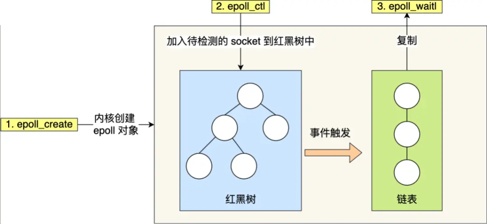
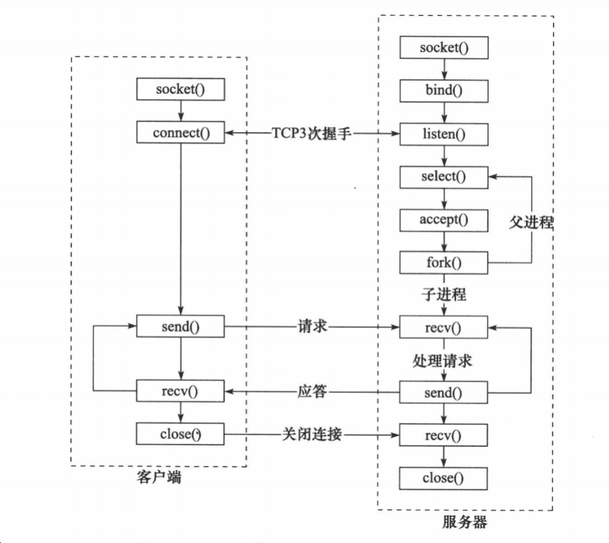

# 操作系统-网络系统

## 1、如果同时有大量客户并发建立连接，服务器端有什么机制进行处理

两种方法：多线程同步阻塞和I/O多路复用socket的建立。

### 多线程同步阻塞

多线程同步阻塞是指在每个客户端连接到来时，都会创建一个新的线程来处理该连接，这样可以实现并发处理。

### I/O多路复用socket的建立

在一个线程中同时监听多个端口，当有新的连接请求到来时，该线程会将该连接请求分配给一个空闲的线程来处理。


## 2、IO多路复用

IO多路复用（I/O Multiplexing）是一种高效的I/O处理方式，它通过**单线程或少量线程同时监听多个I/O事件，并在有事件发生时进行相应的处理**。常见的IO多路复用技术包括select、poll和epoll。

IO多路复用的优势如下：

1. 单线程或少量线程可以同时处理多个I/O事件，极大地提高了系统的并发性能和吞吐量。

2. 相比于传统的阻塞式IO，IO多路复用可以避免阻塞式IO中线程因等待I/O而被浪费掉的时间，提高了CPU的利用率。

3. IO多路复用采用事件驱动模式，只有在I/O事件就绪时才会进行相应的操作，减少了不必要的系统调用次数，降低了系统开销。

4. IO多路复用可以同时监听多种类型的I/O事件，如读、写、异常等，具有更灵活的功能。

5. 适用于处理大量连接的场景，能够有效地管理和服务大规模的客户端请求。

需要注意的是，在使用IO多路复用时也需要考虑以下问题：

1. 对于长时间的I/O操作，仍然可能造成阻塞，影响其他事件的处理，需要进行合理的超时设置和错误处理。

2. 在使用select和poll时，需要维护一个存放I/O事件的数据结构，随着监听的文件描述符增多，效率可能会降低。

3. epoll是Linux下较为常用的IO多路复用机制，但并不跨平台，使用时需要注意兼容性问题。

总结：IO多路复用是一种高效的I/O处理方式，能够同时监听多个I/O事件并在事件就绪时进行相应处理，提高了系统的并发性能和吞吐量。它适用于大量连接、高并发的场景，可以提高服务器的性能和可扩展性。


## 3、select、poll和epoll

select、poll和epoll都是常见的**IO多路复用机制**，它们**用于监听多个I/O事件并在事件就绪时进行相应处理，提高系统的并发性能和吞吐量**。下面是对它们的简要介绍：

1. select：select 是最早出现的IO多路复用机制，可以同时监听多个文件描述符上的读、写和异常事件。使用 select 需要**将所有待监听的文件描述符集合复制到内核空间**，并通过**调用 select 函数不断轮询检查是否有事件就绪**。select 的缺点是每次调用 select 都需要将文件描述符集合从用户空间复制到内核空间，效率较低。

2. poll：poll 是对 select 的改进版本，在功能上类似于 select，但采用了基于链表的数据结构来存储待监听的文件描述符集合，避免了 select 中需要复制集合的问题。使用 poll 时，仍然需要不断轮询检查是否有事件就绪，但由于没有了集合复制的开销，相对于 select 来说效率稍高一些。

3. epoll：epoll 是 Linux 下的一种高性能 IO 多路复用机制，相比于 select 和 poll 具有更好的性能和扩展性。**通过 epoll_ctl 函数注册需要监听的事件，将关注的文件描述符添加到内核事件表中，当事件就绪时，内核会主动通知应用程序**。epoll 支持水平触发和边缘触发两种模式，能够有效地避免无效的事件通知，提高了性能。

总结：select、poll和epoll都是常见的IO多路复用机制，它们在监听多个I/O事件方面有相似的功能，但在性能和扩展性上有一定差异。select 是最早出现的，效率较低；poll 对 select 进行了改进，减少了集合复制的开销；epoll 是 Linux 下的高性能IO多路复用机制，具有较好的性能和扩展性。选择使用哪种机制应该根据实际需求和系统环境进行权衡和选择。


### 面试宝典

1. select，poll，epoll都是IO多路复用的机制，I/O多路复用就是通过一种机制，可以监视多个文件
    描述符，**一旦某个文件描述符就绪（一般是读就绪或者写就绪），能够通知应用程序进行相应的读**
    **写操作**。

2. 区别：

  （1）select 需要**将所有待监听的文件描述符集合复制到内核空间**，并通过**调用 select 函数不断轮询检查是否有事件就绪**。select 的缺点是每次调用 select 都需要将文件描述符集合从用户空间复制到内核空间，效率较低。
  （1）poll与select不同，**通过一个pollfd数组向内核传递需要关注的事件，故没有描述符个数的限**
  **制**，pollfd中的events字段和revents分别用于标示关注的事件和发生的事件，故pollfd数组只需要
  被初始化一次。
  （2）**select，poll实现需要自己不断轮询所有fd集合，直到设备就绪，期间可能要睡眠和唤醒多次**
  **交替。而epoll只要判断一下就绪链表是否为空就行了，这节省了大量的CPU时间**。
  （3）select，poll**每次调用都要把fd集合从用户态往内核态拷贝一次**，并且要把当前进程往设备等
  待队列中挂一次，而epoll只要一次拷贝，而且把当前进程往等待队列上挂也只挂一次，这也能节
  省不少的开销。


### 小林

#### select

select 实现多路复⽤的⽅式是，将已连接的 Socket 都放到⼀个**⽂件描述符集合**，然后调⽤ select 函数
将⽂件描述符集合**拷贝到内核里**，让**内核来检查是否有网络事件产⽣**，检查的⽅式很粗暴，就是通过**遍**
**历**⽂件描述符集合的⽅式，当**检查到有事件产生后，将此 Socket 标记为可读或可写**， 接着**再把整个⽂**
**件描述符集合拷⻉回⽤户态⾥**，然后⽤户态还需要再通过遍历的⽅法找到可读或可写的 Socket，然后再
对其处理。

所以，对于 select 这种⽅式，需要进⾏ **2 次「遍历」问件描述符集合**，⼀次是在内核态⾥，⼀个次是在
⽤户态⾥ ，⽽且还会发⽣ 2 次「拷⻉」⽂件描述符集合，先从⽤户空间传⼊内核空间，由内核修改后，
再传出到⽤户空间中。

select 使⽤固定⻓度的 BitsMap，表示⽂件描述符集合，⽽且所⽀持的⽂件描述符的个数是有限制的，
在 Linux 系统中，**由内核中的 FD_SETSIZE 限制， 默认最⼤值为 1024**，只能监听 0~1023 的⽂件描述
符。


#### poll

poll 不再⽤ BitsMap 来存储所关注的⽂件描述符**，取而代之用动态数组，以链表形式来组织**，突破了 
select 的⽂件描述符个数限制，当然还会受到系统⽂件描述符限制。

但是 poll 和 select 并没有太⼤的本质区别，**都是使用「线性结构」存储进程关注的 Socket 集合，因此**
**都需要遍历文件描述符集合来找到可读或可写的 Socket，时间复杂度为 O(n)，⽽且也需要在用户态与**
**内核态之间拷贝文件描述符集合**，这种⽅式随着并发数上来，性能的损耗会呈指数级增⻓。


#### epoll



1、epoll 在内核⾥**使用「红黑树」来关注进程所有待检测的 Socket**，红⿊树是个⾼效的数据结构，**增删**
**改⼀般时间复杂度是 O(logn)** ，通过对这棵⿊红树的管理，**不需要像 select/poll 在每次操作时都传⼊整**
**个 Socket 集合，减少了内核和⽤户空间⼤量的数据拷⻉和内存分配**。
2、epoll 使⽤事件驱动的机制，内核⾥**维护了⼀个「链表」来记录就绪事件**，只**将有事件发⽣的 Socket**
**集合传递给应用程序**，不需要像 select/poll 那样轮询扫描整个集合（包含有和⽆事件的 Socket ），⼤
⼤提⾼了检测的效率。


## 4、epoll水平触发和边缘触发的区别是什么

在使用 epoll I/O 多路复用机制时，可以选择水平触发（Level Triggered）或边缘触发（Edge Triggered）两种模式。它们之间的区别主要体现在对事件通知的触发方式和处理方式上：

1. 水平触发（Level Triggered）：
- 当一个文件描述符就绪时，epoll_wait 函数会立即返回，并将该文件描述符加入到已就绪的事件集合中。
- 应用程序需要循环调用 epoll_wait 来获取所有已就绪的事件，并进行相应的处理。
- 如果一个文件描述符上的数据没有全部读取完毕，在下一次 epoll_wait 调用时仍然会返回该文件描述符，表示该文件描述符上仍有数据可读。

2. 边缘触发（Edge Triggered）：
- 当一个文件描述符就绪时，epoll_wait 函数只会触发一次事件通知，并将该文件描述符加入到已就绪的事件集合中。
- 应用程序需要循环调用 epoll_wait 来获取所有已就绪的事件，并进行相应的处理。
- 如果一个文件描述符上的数据没有全部读取完毕，在下一次 epoll_wait 调用时不会再返回该文件描述符，除非有新的数据到达。

总结来说，水平触发会在文件描述符就绪时重复触发事件通知，而边缘触发只会触发一次事件通知。边缘触发需要应用程序自行确保将一个就绪的文件描述符上的数据全部读取完毕，以免遗漏未读取的数据。相对于水平触发，边缘触发具有更高的触发效率，但也要求应用程序更加细致地处理事件和数据的读写。选择使用哪种触发方式需要根据实际需求和系统特点进行权衡。


## 6、简述 socket 中 select 与 epoll 的使用场景以及区别，epoll 中水平触发以及边缘触发有什么不同？

> I/O多路复用中 select, poll, epoll之间有什么区别，各自支持的最大描述符上限以及原因是什么？

参考：

[Cyc2018-IO模型](http://www.cyc2018.xyz/计算机基础/Socket/Socket.html#一、i-o-模型)

[Cyc2018-IO复用](http://www.cyc2018.xyz/计算机基础/Socket/Socket.html#二、i-o-复用)

1. **select，epoll的使用场景**：都是IO多路复用的机制，应用于高并发的网络编程的场景。I/O多路复
用就是通过一种机制，**可以监视多个文件描述符，一旦某个文件描述符就绪（一般是读就绪或者写**
**就绪），能够通知应用程序进行相应的读写操作**。
2. select，epoll的区别：
（1）**每次调用select，都需要把fd集合从用户态拷贝到内核态，这个开销在fd很多时会很大；而**
**epoll保证了每个fd在整个过程中只会拷贝一次**。
（2）每次调用select都需要在**内核遍历传递进来的所有fd**；而epoll只需要轮询一次fd集合，同时
**查看就绪链表中有没有就绪的fd就可以了**。
（3）select支持的文件描述符数量太小了，默认是**1024**；而epoll没有这个限制，它所支持的fd上
限是**最大可以打开文件的数目**，这个数字一般远大于2048。
3. **epoll水平触发与边缘触发的区别**
LT模式（水平触发）下，**只要这个fd还有数据可读，每次 epoll_wait都会返回它的事件，提醒用户**
**程序去操作**；
而在ET（边缘触发）模式中，**它只会提示一次，无论fd中是否还有数据可读，直到下次再有数据流入之前都不会再提示了**。


## 9、说说什么是大端小端，如何判断大端小端？

**小端模式**：**低的有效字节存储在低的存储器地址**。**小端一般为主机字节序**；常用的X86结构是小端模
式。很多的ARM，DSP都为小端模式。
**大端模式**：**高的有效字节存储在低的存储器地址**。**大端为网络字节序**；KEIL C51则为大端模式。


有些ARM处理器还可以由硬件来选择是大端模式还是小端模式。

如何判断：我们可以根据联合体来判断系统是大端还是小端。因为联合体变量总是从低地址存储。

```cpp
int fun1(){  
    union test{   
        char c;   
        int i; 
    };  
    test t; t.i = 1;  
    //如果是大端，则t.c为0x00，则t.c != 1，反之是小端  
    return (t.c == 1);  
} 
```


## 12、在进行网络通信时是否需要进行字节序转换？

相同字节序的平台**在进行网络通信时可以不进行字节序转换，但是跨平台进行网络数据通信时必须进行字节序转换**。

原因如下：

- 网络协议（大端字节序）**规定接收到得第一个字节是高字节，存放到低地址，所以发送时会首先去低地址取数据的高字节**。
- 小端模式的多字节数据在存放时，低地址存放的是低字节，而被发送方网络协议函数发送时会首先去低地址取数据（想要取高字节，真正取得是低字节），
- 接收方网络协议函数接收时会将接收到的第一个字节存放到低地址（想要接收高字节，真正接收的是低字节），所以最后双方都正确的收发了数据。
- 而相同平台进行通信时，如果双方都进行转换最后虽然能够正确收发数据，但是所做的转换是没有意义的，造成资源的浪费。
- 而不同平台进行通信时必须进行转换，不转换会造成错误的收发数据，字节序转换函数会根据当前平台的存储模式做出相应正确的转换，**如果当前平台是大端，则直接返回不进行转换，如果当前平台是小端，会将接收到得网络字节序进行转换**。


**网络字节序**

网络上传输的数据都是字节流,对于一个多字节数值,在进行网络传输的时候,先传递哪个字节?

也就是说,当接收端收到第一个字节的时候,它将这个字节作为高位字节还是低位字节处理,是一个比较有
意义的问题; 

UDP/TCP/IP协议规定: 把接收到的第一个字节当作高位字节看待, 这就要求发送端发送的第一个字节是高位字节; 而在发送端发送数据时,发送的第一个字节是该数值在内存中的起始地址处对应的那个字节,也就是说,该数值在内存中的起始地址处对应的那个字节就是要发送的第一个高位字节(即:高位字节存放在低地址处);

由此可见,**多字节数值在发送之前,在内存中应该是以大端法存放的**; 所以说,网络字节序是大端字节序; 比如,我们经过网络发送整型数值0x12345678时,在80X86平台中,它是以小端发存放的,**在发送之前需要使用系统提供的字节序转换函数htonl()将其转换成大端法存放的数值;** 


## 16、说说Reactor、Proactor模式。 

 在高性能的I/O设计中，有两个比较著名的模式Reactor和Proactor模式，其中**Reactor模式用于同步**
**I/O，而Proactor运用于异步I/O操作**。

1. **Reactor模式**：Reactor模式应用于同步I/O的场景。Reactor中读操作的具体步骤如下：
读取操作：
（1）应用程序**注册**读就绪事件和相关联的事件处理器
（2）事件分离器**等待事件**的发生
（3）当发生读就绪事件的时候，事件分离器调用第一步注册的事件处理器
（4）事件处理器首先执行实际的读取操作，然后根据读取到的内容进行进一步的处理
2. **Proactor模式**：Proactor模式应用于异步I/O的场景。Proactor中读操作的具体步骤如下：
（1）应用程序**初始化一个异步读取操作，然后注册相应的事件处理器**，此时事件处理器不关注读
取就绪事件，而是**关注读取完成事件**，这是区别于Reactor的关键。
（2）事件分离器等待读取操作完成事件
（3）在事件分离器**等待读取操作完成的时候**，**操作系统调用内核线程完成读取操作**，并**将读取的**
**内容放入用户传递过来的缓存区中**。这也是区别于Reactor的一点，Proactor中，应用程序需要传
递缓存区。
（4）事件分离器捕获到**读取完成事件**后，**激活应用程序注册的事件处理器，事件处理器直接从缓**
**存区读取数据，而不需要进行实际的读取操作**。
3. 区别：从上面可以看出，Reactor中需要**应用程序自己读取或者写入数据**，而Proactor模式中，应
    用程序**不需要用户再自己接收数据，直接使用就可以了，操作系统会将数据从内核拷贝到用户区**。


## 19、IO模型的类型。

（1）阻塞IO：**调用者调用了某个函数**，**等待这个函数返回，期间什么也不做，不停的检查这个函数有**
**没有返回**，必须等这个函数返回后才能进行下一步动作。

（2）非阻塞IO：非阻塞等待，**每隔一段时间就去检查IO事件是否就绪**。没有就绪就可以做其他事情。

（3）信号驱动IO：**Linux用套接口进行信号驱动IO，安装一个信号处理函数，进程继续运行并不阻塞，**
**当IO事件就绪，进程收到SIGIO信号，然后处理IO事件**。

（4）IO多路复用：Linux用select/poll函数实现IO复用模型，**这两个函数也会使进程阻塞，但是和阻塞**
**IO所不同的是这两个函数可以同时阻塞多个IO操作**。而且可以**同时对多个读操作、写操作的IO函数进行**
**检查**。**直到有数据可读或可写时，才真正调用IO操作函数**。

（5）异步IO：Linux中，可以**调用aio_read函数告诉内核描述字缓冲区指针和缓冲区的大小、文件偏移**
**及通知的方式，然后立即返回，当内核将数据拷贝到缓冲区后，再通知应用程序。用户可以直接去使用**
**数据**。

前四种模型--阻塞IO、非阻塞IO、多路复用IO和信号驱动IO都属于同步模式，因为其中真正的IO操作(函
数)都将会阻塞进程，只有异步IO模型真正实现了IO操作的异步性。

 


## 22、 简述同步与异步的区别，阻塞与非阻塞的区别？

1. 数据准备阶段：根据系统IO操作的就绪状态，可以分为阻塞和非阻塞方式。
   - 阻塞方式：调用者调用了某个函数，等待这个函数返回，期间什么也不做，直到数据准备就绪、函数返回。
   - 非阻塞方式：当前线程会立即返回，无论数据是否准备就绪。每隔一段时间就去检查IO事件是否就绪。没有就绪就可以做其他事情。
2. 数据读写阶段：根据应用程序和内核的交互方式，可以分为同步和异步方式。（IO的同步和异步）
   - 同步方式：数据的读写由请求方自己完成，无论是阻塞还是非阻塞。
   - 异步方式：请求方将请求的事件以及事件发生时的通知方式传递给对方，立即返回，可以继续处理其他逻辑，等待对方的通知。当内核将数据拷贝到缓冲区后，再通知应用程序。用户可以直接去使用数据。


## 25、BIO、NIO有什么区别？ 

**BIO（Blocking I/O）：阻塞IO**。调用者调用了某个函数，等待这个函数返回，期间什么也不做，不停
的检查这个函数有没有返回，必须等这个函数返回后才能进行下一步动作。
**NIO（New I/O）：同时支持阻塞与非阻塞模式**，NIO的做法是叫一个线程不断的轮询每个IO的状态，
看看是否有IO的状态发生了改变，从而进行下一步的操作。


## 28、请说一下socket网络编程中客户端和服务端用到哪些函数？

1. **服务器端函数**：
（1）socket创建一个套接字
（2）bind绑定ip和port
（3）listen使套接字变为可以被动链接
（4）accept等待客户端的链接
（5）write/read接收发送数据
（6）close关闭连接
2. **客户端函数**：
（1）创建一个socket，用函数socket()
（2）bind绑定ip和port（**不用**）
（3）连接服务器，用函数connect()
（4）收发数据，用函数send()和recv()，或read()和write()
（5）close关闭连接




## 30、epoll 具体⼯作流程 

读者回答：先建⽴epoll对象，然后添加事件，然后wait等待事件发⽣ 但他好像不是很满意这个回答。
⼩林补充：

1. **通过epoll_create创建epoll对象**，此时epoll对象的内核结构包含就绪链表和红⿊树，**就绪链表是⽤**
**于保存所有读写事件到来的socket**。**红⿊树⽤于保存所有待检测的socket**。
2. **通过 epoll_crt 将待检测的socket，加⼊到红⿊树中，并注册⼀个事件回调函数，当有事件到来的**
**之后，会调⽤这个回调函数，进⽽通知到 epoll 对象**。
3. **调⽤ epoll_wait 等待事件的发⽣**，当**内核检测到事件发⽣后**，**调⽤该socket注册的回调函数，执⾏**
**回调函数就能找到socket对应的epoll对象**，然后会**将事件加⼊到epoll对象的就绪队列中，最后将就**
**绪队列返回给应⽤层**。

