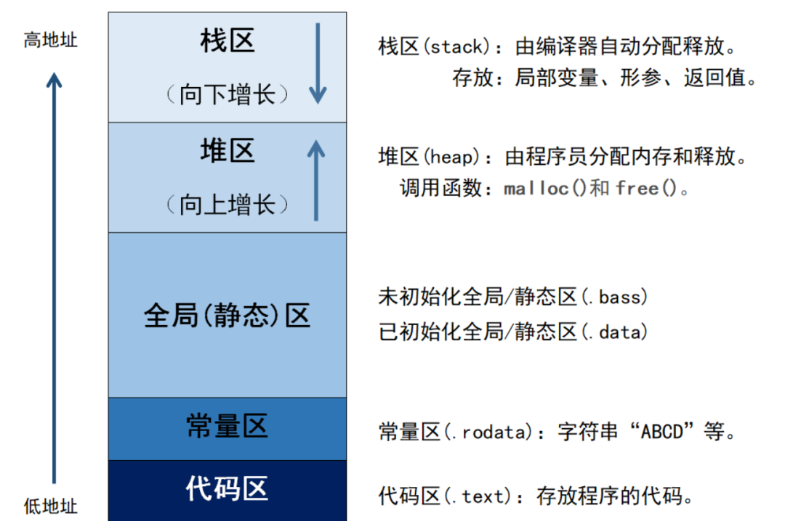
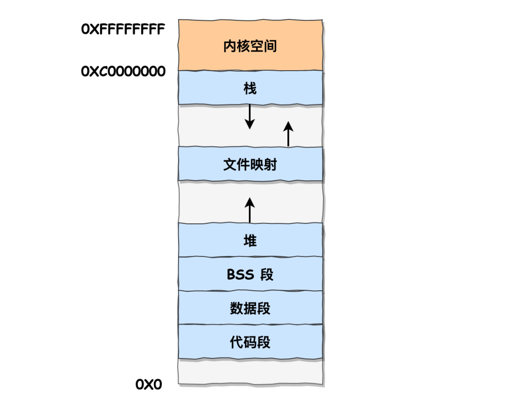
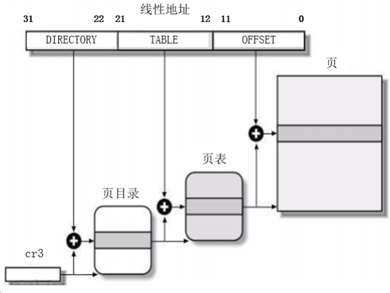
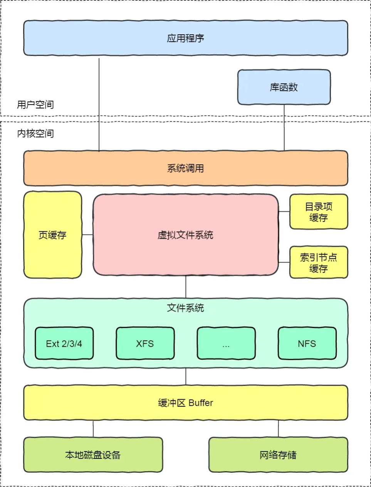

# 内存管理

## 1、讲一下程序的内存分区/内存模型？

内存分区，分别是堆、栈、自由存储区、全局/静态存储区、常量存储区和代码区。如下图所示

**栈**：在执行函数时，函数内局部变量的存储单元都可以在栈上创建，函数执行结束时这些存储单元自动被释放。**栈内存分配运算内置于处理器的指令集中，效率很高，但是分配的内存容量有限**

**堆**：就是那些由 `new`分配的内存块，他们的释放编译器不去管，由我们的应用程序去控制，一般一个`new`就要对应一个 `delete`。如果程序员没有释放掉，那么在程序结束后，操作系统会自动回收

**自由存储区**：如果说堆是操作系统维护的一块内存，那么自由存储区就是C++中通过new和delete动态分配和释放对象的抽象概念。需要注意的是，自由存储区和堆比较像，但不等价。

**全局/静态存储区**：全局变量和静态变量被分配到同一块内存中，在以前的C语言中，全局变量和静态变量又分为初始化的和未初始化的，在C++里面没有这个区分了，它们共同占用同一块内存区，在该区定义的变量若没有初始化，则会被自动初始化，例如int型变量自动初始为0

**常量存储区**：这是一块比较特殊的存储区，这里面存放的是常量，不允许修改

**代码区**：存放函数体的二进制代码

### 我的

自由存储区（Free Store）和堆（Heap）是两个相关但不完全相同的概念。

**自由存储区（Free Store）：**
- 自由存储区是指程序运行时在内存中分配对象或数据的区域。
- 在C++中，使用`new`关键字从自由存储区动态分配内存，而使用`delete`关键字释放已分配的内存。
- 自由存储区是与特定的作用域或生命周期无关的，它的生命周期由程序员显式控制。
- 通过自由存储区分配的内存需要手动释放，  否则可能导致内存泄漏。

**堆（Heap）：**
- 堆是操作系统中的一块内存区域，用于存储动态分配的内存。
- 堆由操作系统管理，用于整个程序的运行期间。
- 在C++中，通过自由存储区分配的内存实际上是从堆中获取的。
- 堆上的内存分配和释放通常由运行时库提供的函数（如`malloc`和`free`）来处理。

因此，自由存储区是C++中使用`new`和`delete`进行动态内存分配和释放的概念，而堆是操作系统中的一块内存区域，用于存储动态分配的内存。自由存储区是堆的一部分，用于描述在C++中动态分配和释放内存的概念。

### 小林

在C++中，内存主要分为以下五个区域：

在C++中，内存主要分为以下五个区域：

- 栈区（Stack）：由编译器自动分配释放，存放函数的参数值，局部变量等。其操作方式类似于数据结构中的栈。栈的大小是固定的，一般是 8 MB。当然系统也提供了参数，以便我们自定义大小；
- 文件映射段：堆区和栈区之间其实还有一个文件映射段包括动态库、共享内存等
- 堆区（Heap）：一般由程序员分配释放，若程序员不释放，程序结束时可能由OS回收。注意，与数据结构中的堆是两回事，分配方式倒是类似于链表。从低地址开始向上增长；
- 全局区（静态区）（Static）：全局变量和静态变量被分配到同一块内存中。在C++中，全局区还包含了常量区，字符串常量和其他常量也是存储在此。（.data数据段，包括已初始化的静态变量量和全局变量；.bss段：包括未初始化的静态变量和全局变量；）
- 常量区：是全局区的一部分，存放常量，不允许修改。
- 代码区（Text）：存放函数体的二进制代码。

上图中的内存布局可以看到，代码段下面还有一段内存空间的（灰色部分），这一块区域是**「保留区」**，之所以要有保留区这是因为在大多数的系统里，我们**认为比较小数值的地址不是一个合法地址**，例如，我们通常在 C 的代码里**会将无效的指针赋值为 NULL**。因此，这里会出现一段不可访问的内存保留区，防止程序因为出现 bug，导致读或写了一些小内存地址的数据，而使得程序跑飞。

**在这 7 个内存段中，堆和文件映射段的内存是动态分配的。比如说，使用 C 标准库的 `malloc()` 或者 `mmap()` ，就可以分别在堆和文件映射段动态分配内存。**

## 2、说一说你理解的内存对齐以及原因

### 回答：

#### 介绍一下内存对齐

**内存对齐就是就是将数据存放在内存的某个位置**，使得**CPU可以更快地访问到这个数据，以空间换时间的方式来提高 cpu 访问数据的性能**。

在C++中，内存对齐主要涉及到两个概念：对齐边界和填充字节。

- **对齐边界：一般情况下，编译器会自动地将数据存放在它的自然边界上**。例如，int类型的数据，它的大小为4字节，编译器会将其存放在4的倍数的地址上。这就是所谓的对齐边界。
- **填充字节：为了满足对齐边界的要求，编译器有时候需要在数据之间填充一些字节。这些字节没有实际的意义，只是为了满足内存对齐的要求**。

#### 为什么要内存对齐？

- 平台原因(移植原因)：**不是所有的硬件平台都能访问任意地址上的任意数据的**；某些硬件平台只能在某些地址处取某些特定类型的数据，否则抛出硬件异常。
- **性能原因：数据结构(尤其是栈)应该尽可能地在自然边界上对齐。原因在于，为了访问未对齐的内存，处理器需要作两次内存访问；而对齐的内存访问仅需要一次访问**。

### 简述 C++ 中内存对齐的使用场景

- 结构(struct) 或 联合(union) 的数据成员，第一个数据成员放在offset为0的地方，以后每个数据成员存储的起始位置要从该成员大小或者成员的子成员大小（只要该成员有子成员，比如说是数组，结构体等）的整数倍开始

- 结构体作为成员: 如果一个结构里有某些结构体成员,则结构体成员要从其内部**最宽基本类型成员**的整数倍地址开始存储

  > struct a里存有struct b, b里有 char, int, double 等元素,那b应该从8的整数倍开始存储

## 3、栈上的内存需要手动释放吗

**在C++中，栈上的内存不需要手动释放。栈上的内存是由编译器自动管理的，它遵循了作用域的原则，即当变量超出其作用域时，编译器会自动释放该变量所占用的内存。**

当在函数中声明一个**局部变量**时，该变量的内存分配发生在函数的栈帧上。当函数执行完毕或离开变量的作用域时，栈帧会被销毁，其中的局部变量所占用的内存也会自动释放。这种自动管理的方式使得栈上的内存分配和释放变得简单和高效。

与栈上的内存不同，堆上的内存需要手动分配和释放。在C++中，可以使用`new`操作符来在堆上动态分配内存，并使用`delete`操作符来释放堆上的内存。这是因为堆上的内存可以在不同的作用域中共享，并且需要开发人员负责管理其生命周期。

需要注意的是，虽然栈上的内存不需要手动释放，但是在使用栈上的对象时，需要注意对象的生命周期，以避免在超出其作用域之后仍然引用该对象，导致悬空指针或访问无效内存的问题。

## 4、面试题：如果有一个for循环一直申请空间，会出现什么问题？

内存泄漏：每次循环迭代时，申请的内存空间会累积，而没有释放。这会导致内存泄漏，即程序使用的内存越来越多，最终可能耗尽系统的可用内存。内存泄漏会**导致程序性能下降，并可能导致程序崩溃或被操作系统终止**。

## 5、面试题：内存有哪几种？

在计算机中，内存可以分为以下几种类型：

1. **寄存器**（Registers）：**寄存器是位于CPU内部的高速存储器，用于存储CPU正在执行的指令、数据和地址等**。寄存器是最快的存储器类型，但容量有限。不同的CPU架构和制造商可能具有不同数量和类型的寄存器。

2. **缓存**（Cache）：**缓存是位于CPU和主存之间的一层高速存储器，用于存储最常用的指令和数据**。缓存的目的是提高CPU访问内存的速度，**通过缓存命中可以避免频繁从较慢的主存中读取数据**。缓存分为多级，从L1到L3不等，容量逐级增大但速度逐级降低。

3. 主存（Main Memory）：**主存也称为内存（Memory），是计算机中用于存储程序和数据的主要存储器**。主存是**按字节寻址的，每个字节都有唯一的地址。主存的容量相对较大，但速度比寄存器和缓存慢**。主存通常是通过DRAM（动态随机存取存储器）实现的。

4. 虚拟内存（Virtual Memory）：虚拟内存是一种通过**将部分数据和程序存储在磁盘上**的技术。**虚拟内存允许程序使用比实际物理内存更大的地址空间。当程序访问虚拟内存中的数据时，操作系统会将数据从磁盘加载到物理内存中**。虚拟内存的使用可以提供更大的内存容量，但访问速度相对较慢。

除了上述类型的内存，还有其他一些特殊类型的存储器，如闪存（Flash Memory）用于存储固件和持久化数据，以及磁盘（硬盘或固态硬盘）用于长期存储数据。

需要注意的是，不同类型的内存具有不同的访问速度、容量和成本。在程序设计和优化中，合理利用各种内存层次结构，尽可能减少内存访问次数和数据传输量，可以提高程序的性能和效率。

## 6、什么是虚拟内存？解决了什么问题？

虚拟内存是操作系统内存管理的一种技术，每个进程启动时，操作系统会提供一个**独立的虚拟地址空间**，**这个地址空间是连续的，进程可以很方便的访问内存**，这里的内存指的是访问**虚拟内存**。**虚拟内存的目的，一是方便进程进行内存的访问，二是可以使有限的物理内存运行一个比它大很多的程序。**

虚拟内存的基本思想：每个程序拥有**自己的地址空间，这个空间被分割成很多块，每块称为一页，每一页地址都是连续的地址范围**。这些页被映射到物理内存，但**不要求是连续的物理内存，也不需要所有的页都映射到物理内存**，而是**按需分配，在程序片段需要分配内存时由硬件执行映射(通常是 MMU)**，调入内存中执行。

## 7、说说分页和分段的机制？

分页是实现虚拟内存的技术，虚拟内存按照固定的大小分为页面，物理内存也会按照固  定的大小分成页框，页面和页框大小通常是一样的，一般是 4KB，页面和页框可以实现一对一的映射。**分页是一维的，主要是为了获得更大的线性地址空间。**但是一个地址空间可能存在很多个表，表的数据大小是动态增长的，由于多个表都在一维空间中，有可能导致一个表的数据覆盖了另一个表。

分段是把虚拟内存划分为多个独立的地址空间，每个地址空间可以动态增长，互不影响。每个段可以单独进行控制，有助于保护和共享。

## 8、页表的作用？为什么引入多级页表？

页表实现了虚拟内存到物理内存的映射，当访问一个虚拟内存页面时，页面的虚拟地址将作为一个索引指向页表，如果页表中存在对应物理内存的映射，则直接返回物理内存的地址，否则将引发一个缺页异常，从而陷入到内核中分配物理内存，返回对应的物理地址，然后更新页表。

为了加快虚拟地址到物理地址的转换，多数系统会引入一个转换检测缓冲区（TLB）的设备，通常又称为**快表**，当请求访问一个虚拟地址时，处理器检查是否缓存了该虚拟地址的映射，如果命中则直接返回物理地址，否则就通过页表搜索对应的物理地址。

由于虚拟内存通常比较大(32 位系统通常是 4G)，要实现整个地址空间的映射，需要非常大的页表。解决的办法是引入多级页表，只将那些用到的页面装载进来，因此，多级页表可以大大节约地址转换所需要的的空间。

## 8、什么是页表，为什么要有

**参考回答**
页表是虚拟内存的概念。操作系统虚拟内存到物理内存的映射表，就被称为页表。

**原因**：**不可能每一个虚拟内存的 Byte 都对应到物理内存的地址。这张表将大得真正的物理地址也放不**
**下，于是操作系统引入了页（Page）的概念。进行分页，这样可以减小虚拟内存页对应物理内存页的映**
**射表大小。**

**答案解析**
如果将每一个虚拟内存的 Byte 都对应到物理内存的地址，每个条目最少需要 8字节（32位虚拟地址-
32位物理地址），在 4G 内存的情况下，就需要 32GB 的空间来存放对照表，那么这张表就大得真正
的物理地址也放不下了，于是操作系统引入了页（Page）的概念。

在系统启动时，操作系统将整个物理内存以 4K 为单位，划分为各个页。之后进行内存分配时，都以页
为单位，那么虚拟内存页对应物理内存页的映射表就大大减小了，4G 内存，只需要 8M 的映射表即
可，一些进程没有使用到的虚拟内存，也并不需要保存映射关系，而且Linux 还为大内存设计了多级页
表，可以进一页减少了内存消耗。

## 9、页面置换算法有哪几种？

当访问的页面不在内存中时，会发生一个缺页异常，操作系统必须将该页换出内存，如果此时内存已满，则操作系统必须将其中一个页面换出，放到 swap 交换区中，为当前访问的页面腾出空间，这个过程称为页面置换。操作系统提供了多种页面置换算法：

**最优页面置换算法**

选择一个将来最长时间不会被访问的页面换出。这样可以保证将来最低的缺页率。这是一种理论上的算法，因为无法知道哪个页面是将来最长时间都不会被访问的。

**最近未使用页面置换算法 (NRU)**

为每个页面设两个状态位：被访问时设置为 R=1 位，页面被修改时，设置为 M=1 位。当启动一个进程时，所有页面都被初始化为 R=0，M=0。其中 R 位会被定时的清 0，以此区分最近被访问的页面和没有被访问的页面。

于是所有页面可以分为以下 4 类：

0 类：R=0，M=0；

1 类：R=0，M=1；

2 类：R=1，M=0；

3 类：R=1，M=1；

当发生缺页中断时，NRU 算法随机地从类编号最小的非空类中挑选一个页面将它换出（挑选优先级：1 类 > 2 类 > 3 类）。

**最近最少未使用（LRU）页面置换算法**

在内存中维护一个所有页面的单链表。当一个页面被访问时，将这个页面移到链表表头。这样就能保证链表表尾的页面是最近最久未访问的。

因为每次访问都需要更新链表，因此这种方式实现的 LRU 代价很高。

**先进先出（FIFO）页面置换算法**

维护一个链表，最先进入的页面放在表头，最后进入的页面放在表尾，当缺页中断发生时，直接淘汰表头的页面，并把新的页面放在表尾。

这种算法有可能置换掉经常访问的页面，导致缺页率升高。

**第二次机会页面置换算法**

对 FIFO 算法做一个修改：取出表头的页面时，检查该页面的 R 位，如果是 1 表示是最近有访问的，将其清 0，然后放入表尾，然后继续检查下一个表头的页面，直到遇到一个 R 位为 0 的页面，将其换出。

**时钟页面置换算法**

与上一个算法类似，只不过单链表改成了环形链表，形成一个时钟，移动的也不是页面，而是中间的表针。检查页面逻辑类似，如果该页面 R 为 0，则直接置换该页面，否则将该 R 位清 0，然后表针向前移动。

## 10、内存是如何分配的

Linux 分配物理内存的主要机制是页面分配机制（页分配器），使用了著名的伙伴算法，主要用来分配页大小的整数倍的内存(4n KB)。如果是小于页大小的内存分配，通常使用 slab 管理器。通过 slab 分配的内存通常会缓存起来，方便下次使用。

## 11、内存是如何回收的？

应用程序用完内存后，可以调用 free() 释放内存，或调用 unmap() 取消内存映射，归还系统。

在内存紧张时，会通过一系列机制来回收内存，如以下三种方式：

- 回收缓存。主要是页缓存。
- 回收不常访问的页面。使用页面置换算法，把不常用的页面放到交换区中。
- 通过 OOM 杀死占用大量内存的进程，释放内存。

## 12、申请和管理内存

- 申请：申请虚拟地址

  - brk是将数据段的最高地址指针_edata往高地址推；
  - mmap是在进程的虚拟地址空间中（堆和栈中间，文件映射区   ）找一块空闲的虚拟内存。

  > **这两种方式分配的都是虚拟内存，没有分配物理内存。在第一次访问已分配的虚拟地址空间的时候，发生缺页中断，操作系统负责分配物理内存，然后建立虚拟内存和物理内存之间的映射关系**

- 管理：通过首次适应、最佳适应、最坏适应分配内存块

  - 页式管理：内部碎片
  - 段式管理：外部碎片
  - 段页式管理：内部碎片

## 13、简述操作系统如何申请以及管理内存的？

**操作系统如何管理内存**：

1. **物理内存**：物理内存有四个层次，分别是寄存器、高速缓存、主存、磁盘。
    寄存器：速度最快、量少、价格贵。
    高速缓存：次之。
    主存：再次之。
    磁盘：速度最慢、量多、价格便宜。
    

  操作系统会对物理内存进行管理，有一个部分称为**内存管理器(memory manager)**，它的主要工
  作是有效的管理内存，记录哪些内存是正在使用的，在进程需要时分配内存以及在进程完成时回收
  内存。

2. **虚拟内存**：操作系统为每一个进程分配一个独立的地址空间，但是虚拟内存。虚拟内存与物理内存
   存在映射关系，通过页表寻址完成虚拟地址和物理地址的转换。

**操作系统如何申请内存**：
从操作系统角度来看，进程分配内存有两种方式，分别由两个系统调用完成：*brk和mmap

## 15、虚拟地址是怎么转化到物理地址的？

虚拟地址到物理地址的转化是通过页表(Page Table)来实现的。页表是一种数据结构，用于将虚拟地址映射到物理地址。

在分段和分页机制下，CPU会将虚拟地址转换为线性地址，然后再将线性地址转换为物理地址。

### 分段分页

分段机制简单的来说是将进程的代码、数据、栈分在不同的虚拟地址段上，从而避免了不同段之间的内存访问冲突。

分页机制则是为了解决分段机制中存在的问题而提出的。它将进程的代码、数据、栈等分成多个大小相等的页，每个页都有一个唯一的页号，这样就可以将整个进程映射到一个连续的物理地址空间上了。

## 17、虚拟地址与物理地址相关

1. 如何映射？
   - 虚拟内存地址由页号（与页表中的页号关联）和偏移量组成
   - 虚拟内存地址的大小是与地址总线位数相关，物理内存地址的大小跟物理内存条的容量相关。
   - 页号+页内偏移
2. Linux 中虚拟内存和物理内存有什么区别？有什么优点？
   - 一个新进程建立的时候，将会建立起自己的内存空间，各个进程的内存空间具有类似的结构，这就是虚拟内存。当进程访问某个虚拟地址，去看页表，都需要把地址翻译为实际物理内存地址，如果发现对应的数据不在物理内存中，则缺页异常。
   - 优点
     - 既然每个进程的内存空间都是一致而且固定的，所以链接器在链接可执行文件时，可以设定内存地址，而不用去管这些数据最终实际的内存地址，这是有独立内存空间的好处
     - 当不同的进程使用同样的代码时，比如库文件中的代码，物理内存中可以只存储一份这样的代码，不同的进程只需要把自己的虚拟内存映射过去就可以了，节省内存

## 18、为什么要用虚拟内存

虚拟内存：操作系统为每一个进程分配一个独立的地址空间，但是虚拟内存。虚拟内存与物理内存
存在映射关系，通过页表寻址完成虚拟地址和物理地址的转换。

1. 为什么要用虚拟内存：因为早期的内存分配方法存在以下问题：
（1）进程地址空间不隔离。会导致数据被随意修改。
（2）内存使用效率低。
（3）程序运行的地址不确定。操作系统随机为进程分配内存空间，所以程序运行的地址是不确定
的。
2. 使用虚拟内存的好处：
（1）**扩大地址空间。每个进程独占一个4G空间，虽然真实物理内存没那么多**。
（2）**内存保护：防止不同进程对物理内存的争夺和践踏，可以对特定内存地址提供写保护，防止**
**恶意篡改**。
（3）可以实现内存共享，方便进程通信。
（4）**可以避免内存碎片，虽然物理内存可能不连续，但映射到虚拟内存上可以连续**。
3. 使用虚拟内存的缺点：
（1）虚拟内存需要额外构建数据结构，占用**空间**。
（2）虚拟地址到物理地址的转换，增加了执行**时间**。
（3）页面换入换出耗时。
（4）一页如果只有一部分数据，浪费内存。

## 20、什么是内存泄漏，怎么确定内存泄漏？

- **内存泄漏**：内存泄漏是指**由于疏忽或错误造成了程序未能释放掉不再使用的内存的情况**。内存泄漏**并非指内存在物理上消失，而是应用程序分配某段内存后，由于设计错误，失去了对该段内存的控制**；

- **三种常见情况**：

  - 指针的错误赋值
  - 错误的内存释放，先释放父指针导致子指针无法释放
  - 函数返回地址之后没有处理导致分配的内存块丢失

- **如何确定**：

  - 检查方法：在main函数最后面一行，加上一句`_CrtDumpMemoryLeaks()`。调试程序，自然关闭程序让其退出，查看输出：输出这样的格式`{453}normal block at 0x02432CA8,868 bytes long`，被`{}`包围的`453`就是我们需要的内存泄漏定位值，`868 bytes long`就是说这个地方有868比特内存没有释放。
  - 定位代码位置：在`main`函数第一行加上`_CrtSetBreakAlloc(453)`；**意思就是在申请453这块内存的位置中断。然后调试程序，程序中断了，查看调用堆栈。** 注意加上头文件`#include <crtdbg.h>`

- **检漏方法？**

  > 对象计数方法：**在对象构造时计数++，析构时--**，每隔一段时间打印对象的数量
  >
  > 重载new和delete方法：**重载new/delete，记录分配点（甚至是调用堆栈），定期打印。**

### 实际运行中泄漏如何快速定位

valgrind 内存泄漏检测⼯具

## 21、程序如何避免内存泄漏

- 动态内存的申请与释放必须配对，防止**内存泄漏**
- **使用智能指针**：
  - C++中的智能指针（例如`std::shared_ptr`和`std::unique_ptr`）可以帮助自动管理内存。它们会在不再需要对象时自动释放内存，从而避免了手动释放内存的疏忽和错误。
- **使用工具和分析器**：
  - 使用内存分析工具如Valgrind（对于C/C++）或内存分析器（Memory Profiler）来检测内存泄漏。这些工具可以帮助识别潜在的内存泄漏问题。

## 23、如何让类对象只在栈（堆）上分配空间

首先明白类对象建立的两种方式：静态建立，如 A a ；动态建立，如 A* ptr = new A()

- 「静态建立类对象」是由编译器为对象在栈空间中分配内存，是通过直接移动栈顶指针，挪出适当的空间，然后在这片内存空间上调用构造函数形成一个栈对象。使用这种方法，**直接调用类的构造函数**。
- 「动态建立类对象」 是使用new运算符将对象建立在堆空间中。这个过程分为两步，第一步是执行operator new()函数，在堆空间中搜索合适的内存并进行分配；第二步是调用构造函数构造对象，初始化这片内存空间。这种方法，**间接调用类的构造函数**。

**限制只能在堆上分配空间**：将析构函数私有化，这样静态建立就失败了，只能动态建立，类中必须提供一个`destory`函数，来进行内存空间的释放。类对象使用完成后，必须调用`destory`函数。

- 无法解决继承问题，私有化之后子类无法访问，还好 protected 化可以缓解一下
- 类的使用很不方便，无法使用 delete，必须要调用 destroy 函数，很怪异

**限制只能在栈上分配空间**：将「new 运算符私有化」，由于 new 运算符总是通过调用 operator new() 函数分配内存，所以可以私有化这个函数，[参考](https://segmentfault.com/a/1190000009023942)

## 25、一个线程占多大内存

**参考回答**
一个linux的线程大概占8M内存。

**答案解析**
linux的栈是通过缺页来分配内存的，不是所有栈地址空间都分配了内存。因此，8M是最大消耗，实际的内存消耗只会略大于实际需要的内存(内部损耗，每个在4k以内)。

## 27、简述操作系统中的缺页中断

**参考回答**

1. 缺页异常：malloc和mmap函数在分配内存时**只是建立了进程虚拟地址空间，并没有分配虚拟内**
    **存对应的物理内存**。当进程**访问这些没有建立映射关系的虚拟内存时，处理器自动触发一个缺页异**
    **常，引发缺页中断**。
2. 缺页中断：缺页异常后将产生一个缺页中断，此时**操作系统会根据页表中的外存地址在外存中找到**
    **所缺的一页，将其调入内存**。

**答案解析**

两者区别。
缺页中断与一般中断一样，需要经历四个步骤：保护CPU现场、分析中断原因、转入缺页中断处理程序、恢复CPU现场，继续执行。

缺页中断与一般中断区别：
（1）在指令执行期间产生和处理缺页中断信号
（2）一条指令在执行期间，可能产生多次缺页中断
（3）缺页中断返回的是执行产生中断的一条指令，而一般中断返回的是执行下一条指令。

## 30、虚拟地址到物理地址怎么映射的？ 

**操作系统为每一个进程维护了一个从虚拟地址到物理地址的映射关系的数据结构，叫页表。页表中的每**
**一项都记录了这个页的基地址**。

**三级页表转换方法：（两步）** 

1. 逻辑地址转线性地址：段起始地址+段内偏移地址=线性地址
2. 线性地址转物理地址：
（1）每一个32位的线性地址被划分为三部分：**页目录索引（DIRECTORY，10位）、页表索引**
**（TABLE，10位）、页内偏移（OFFSET，12位）** 
（2）从cr3中取出进程的页目录地址（操作系统调用进程时，这个地址被装入寄存器中）
 页目录地址 + 页目录索引 = 页表地址
 页表地址 + 页表索引 = 页地址
 页地址 + 页内偏移 = 物理地址

 按照以上两步法，就完成了一个三级页表从虚

## 33、说说堆栈溢出是什么，会怎么样？ 

堆栈溢出就是不顾堆栈中分配的局部数据块大小，向该数据块写入了过多的数据，导致数据越界。常指
调用堆栈溢出，本质上一种数据结构的满溢情况。堆栈溢出可以理解为两个方面：**堆溢出和栈溢出**。

1. 堆溢出：比如**不断的new 一个对象，一直创建新的对象，而不进行释放，最终导致内存不足**。将
会报错：OutOfMemory Error。
2. 栈溢出：一次函数调用中，**栈中将被依次压入：参数，返回地址等**，而方法如果递归比较深或进去
死循环，就会导致栈溢出。将会报错：StackOverflow Error。

## 35、简述操作系统中malloc的实现原理 

malloc底层实现：当开辟的空间小于 128K 时，调用 brk（）函数；当开辟的空间大于 128K 时，调用
mmap（）。malloc采用的是内存池的管理方式，以减少内存碎片。**先申请大块内存作为堆区，然后将**
**堆区分为多个内存块**。当用户申请内存时，直接**从堆区分配一块合适的空闲快**。采用**隐式链表将所有空**
**闲块连接**，**每一个空闲块记录了一个未分配的、连续的内存地址**。

## 38、32位系统能访问4GB以上的内存吗？ 

**参考回答**
正常情况下是不可以的。原因是计算机使用二进制，每位数只有0或1两个状态，32位正好是2的32次
方，正好是4G，所以大于4G就没办法表示了，而在32位的系统中，因其它原因还需要占用一部分空
间，所以内存只能识别3G多。要使用4G以上就只能换64位的操作系统了。
但是使用PAE技术就可以实现 32位系统能访问4GB以上的内存。

**答案解析**
Physical Address Extension（PAE）技术最初是为了弥补32位地址在PC服务器应用上的不足而推出
的。我们知道，传统的IA32架构只有32位地址总线，只能让系统容纳不超过4GB的内存，这么大的内
存，对于普通的桌面应用应该说是足够用了。可是，对于服务器应用来说，还是显得不足，因为服务器
上可能承载了很多同时运行的应用。PAE技术将地址扩展到了36位，这样，系统就能够容纳2^36=64GB
的内存。

## 40、pagecache是什么

为了提升对⽂件的读写效率，Linux 内核会以**⻚⼤⼩（4KB）为单位，将⽂件划分为多数据块**。当⽤户对
⽂件中的某个数据块进⾏读写操作时，内核⾸**先会申请⼀个内存⻚（称为 ⻚缓存）与⽂件中的数据块进**
**⾏绑定**。如下图所示：

如上图所示，当⽤户对⽂件进⾏读写时，实际上是对⽂件的 ⻚缓存 进⾏读写。所以对⽂件进⾏读写操
作时，会分以下两种情况进⾏处理：

- 当从⽂件中读取数据时，如果要读取的数据所在的⻚缓存已经存在，那么就直接把⻚缓存的数据拷
  ⻉给⽤户即可。否则，内核⾸先会申请⼀个空闲的内存⻚（⻚缓存），然后从⽂件中读取数据到⻚
  缓存，并且把⻚缓存的数据拷⻉给⽤户。
- 当向⽂件中写⼊数据时，如果要写⼊的数据所在的⻚缓存已经存在，那么直接把新数据写⼊到⻚缓
  存即可。否则，内核⾸先会申请⼀个空闲的内存⻚（⻚缓存），然后从⽂件中读取数据到⻚缓存，
  并且把新数据写⼊到⻚缓存中。对于被修改的⻚缓存，内核会定时把这些⻚缓存刷新到⽂件中。

## 42、堆和栈的区别

### 申请方式不同

- 栈由系统自动分配。
- 堆是自己申请和释放的。

### 申请大小限制不同

- 栈顶和栈底是之前预设好的，**栈是向栈底扩展，大小固定**，可以通过ulimit -a查看，由ulimit -s修改。
- 堆向高地址扩展，是**不连续**的内存区域，大小可以灵活调整。

### 申请效率不同

- 栈由系统分配，**速度快，不会有碎片**。
- 堆由程序员分配，**速度慢，且会有碎片**。

栈空间默认是4M, 堆区一般是 1G - 4G

|                  | 堆                                                           | 栈                                                           |
| :--------------- | ------------------------------------------------------------ | ------------------------------------------------------------ |
| **管理方式**     | 堆中资源由程序员控制（容易产生memory leak）                  | 栈资源由编译器自动管理，无需手工控制                         |
| **内存管理机制** | 系统有一个记录空闲内存地址的链表，当系统收到程序申请时，遍历该链表，寻找第一个空间大于申请空间的堆结点，删 除空闲结点链表中的该结点，并将该结点空间分配给程序（大多数系统会在这块内存空间首地址记录本次分配的大小，这样delete才能正确释放本内存空间，另外系统会将多余的部分重新放入空闲链表中） | 只要栈的剩余空间大于所申请空间，系统为程序提供内存，否则报异常提示栈溢出。（这一块理解一下链表和队列的区别，不连续空间和连续空间的区别，应该就比较好理解这两种机制的区别了） |
| **空间大小**     | 堆是不连续的内存区域（因为系统是用链表来存储空闲内存地址，自然不是连续的），堆大小受限于计算机系统中有效的虚拟内存（32bit 系统理论上是4G），所以堆的空间比较灵活，比较大 | 栈是一块连续的内存区域，大小是操作系统预定好的，windows下栈大小是2M（也有是1M，在 编译时确定，VC中可设置） |
| **碎片问题**     | 对于堆，频繁的new/delete会造成大量碎片，使程序效率降低       | 对于栈，它是有点类似于数据结构上的一个先进后出的栈，进出一一对应，不会产生碎片。（看到这里我突然明白了为什么面试官在问我堆和栈的区别之前先问了我栈和队列的区别） |
| **生长方向**     | 堆向上，向高地址方向增长。                                   | 栈向下，向低地址方向增长。                                   |
| **分配方式**     | 堆都是动态分配（没有静态分配的堆）                           | 栈有静态分配和动态分配，静态分配由编译器完成（如局部变量分配），动态分配由alloca函数分配，但栈的动态分配的资源由编译器进行释放，无需程序员实现。 |
| **分配效率**     | 堆由C/C++函数库提供，机制很复杂。所以堆的效率比栈低很多。    | 栈是其系统提供的数据结构，计算机在底层对栈提供支持，分配专门 寄存器存放栈地址，栈操作有专门指令。 |

## 44、你觉得堆快一点还是栈快一点？/既然栈比堆的效率高，为什么不全用栈?

**毫无疑问是栈快一点**。

因为操作系统会在**底层对栈提供支持**，会**分配专门的寄存器存放栈的地址**，**栈的入栈出栈操作也十分简单，并且有专门的指令执行，所以栈的效率比较高**。

而堆的操作是由C/C++函数库提供的，在**分配堆内存的时候需要一定的算法寻找合适大小的内存**。并且获取堆的内容需要两次访问，**第一次访问指针，第二次根据指针保存的地址访问内存，因此堆比较慢**。

### 原因

虽然栈比堆的效率高，但是栈的使用有一些限制：

- 大小限制：**栈的大小是有限制的**，通常是在编译时就确定的。当**需要存储的数据超过栈的大小时，就会出现栈溢出的错误**。
- 生命周期限制：栈上的数据的生**命周期是在其所属的函数执行期间**。一旦**函数执行结束，栈上的数据会自动销毁。而堆上的数据可以在任何时候创建和销毁，生命周期更加灵活**。
- 对象大小不确定：**栈上的对象大小必须在编译时确定，而堆上的对象大小可以在运行时动态确定**。
- 内存分配效率：栈上的内存分配是通过移动栈指针来实现的，非常高效。而堆上的内存分配需要使用动态分配算法，效率相对较低。

所以，栈和堆各有其适用的场景。对于需要**在函数内部临时存储的小型数据，可以使用栈来提高效率**。而**对于需要动态分配、大小不确定或需要跨函数使用的大型数据，堆**更加合适。