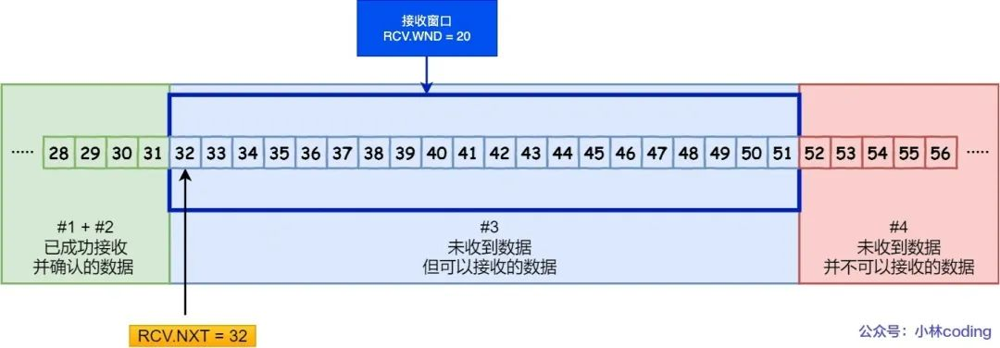

# 计算机网络


## 1、在浏览器地址栏输入一个URL后回车，背后会进行哪些技术步骤？

### 第一种回答

1、查**浏览器缓存**，看看有没有已经缓存好的，如果没有

2 、检查**本机host文件**，

3、调用API，Linux下Socket函数 gethostbyname

4、向DNS服务器发送DNS请求，查询本地DNS服务器，这其中用的是UDP的协议。（DNS是应用层协议之一，基于传输层的UDP协议，端口号为53。）

5、如果在一个子网内采用ARP地址解析协议进行ARP查询如果不在一个子网那就需要对默认网关进行DNS查询，如果还找不到会一直向上找根DNS服务器，直到最终拿到IP地址（全球400多个根DNS服务器，由13个不同的组织管理）

6、这个时候我们就有了服务器的IP地址 以及默认的端口号了，http默认是80 https是 443 端口号，会，首先尝试http然后调用Socket建立TCP连接，（应用层）

7、经过三次握手成功建立连接后，开始传送数据，如果正是http协议的话，就返回就完事了，

8、如果不是http协议，服务器会返回一个5开头的的重定向消息，告诉我们用的是https，那就是说IP没变，但是端口号从80变成443了，好了，再四次挥手，完事，

9、再来一遍，这次除了上述的端口号从80变成443之外，还会采用SSL的加密技术来保证传输数据的安全性，保证数据传输过程中不被修改或者替换之类的，

10、这次依然是三次握手，沟通好双方使用的认证算法，加密和检验算法，在此过程中也会检验对方的CA安全证书。

11、确认无误后，开始通信，然后服务器就会返回你所要访问的网址的一些数据，在此过程中会将界面进行渲染，牵涉到ajax技术之类的，直到最后我们看到色彩斑斓的网页

### 第三种

输入网址的全过程可以分为以下几个步骤：

1. 用户输入网址：用户在浏览器的地址栏中输入要访问的网址，比如 "www.example.com"。

2. DNS解析：浏览器首先需要将域名转换为对应的 IP 地址。它会向本地 DNS 服务器发送域名解析请求，并通过递归查询或迭代查询来获取目标网址的 IP 地址。

3. 建立TCP连接：一旦浏览器获得了目标网址的 IP 地址，它会使用 TCP 协议与目标服务器建立连接。这个过程通过三次握手来确保双方都能够正常通信。

4. 发送HTTP请求：一旦建立了 TCP 连接，浏览器会向服务器发送一个 HTTP 请求。该请求包含了**要访问的资源的路径、请求方法（如 GET、POST 等）以及其他相关的头部信息**。

5. 服务器处理请求：服务器收到浏览器发送的 HTTP 请求后，会根据请求的内容和服务器端配置进行相应的处理。服务器可能需要读取、写入或修改数据，并根据请求生成响应。

6. 返回HTTP响应：服务器处理完请求后，会生成一个 HTTP 响应，并将其发送回浏览器。响应包括**状态码、响应头部以及响应体等信息**。

7. 渲染页面：浏览器收到服务器返回的 HTTP 响应后， 会根据响应中的数据来渲染页面。它会**解析 HTML、CSS 和 JavaScript** 等内容，并将其展示给用户。

8. 关闭TCP连接：一旦页面被完全加载并显示给用户，浏览器会关闭与服务器之间的 TCP 连接。这样，整个网页加载过程就完成了。

需要注意的是，上述过程是一个简化的描述，实际中可能还涉及到更多的细节和步骤。此外，还有一些优化技术，如缓存、CDN、压缩等，可以提高网页加载速度和性能。


## 2、TCP是如何保证可靠传输的？

tcp的序列号可以避免乱序的问题，保证收到的tcp报文都是有序的。
在 TCP 中，当发送端的数据到达接收主机时，接收端主机会返回一个确认应答消息，表示已收到消息。
TCP 针对数据包丢失的情况，会用重传机制解决。
用快重传解决个别报文段的丢失问题。
使用滑动窗口实现流量控制。使用接收方确认报文中的窗口字段来控制发送方发送窗口大小，进而控制发送方的发送速率，使得接收方来得及接收。
使用基于窗口的拥塞控制，来尽量避免避免网络拥塞。

### 第一种回答

- **序列号和确认号**：TCP通过序号和确认号来保证数据的可靠传输。发送方将每个数据报文都标记一个唯一的序号，接收方收到数据后需要回复一个确认号，表示已经成功接收到了这个数据。。

- **超时重传**：发送方在发送数据后会设置一个计时器，如果在规定的时间内没有收到确认，则会重新发送数据。这可以保证即使某个数据包在传输过程中丢失，也能够被及时地重传。

- **数据校验**：TCP报文头有校验和，用于校验报文是否损坏。

- **数据合理分片和排序**：tcp会按最大传输单元(MTU)合理分片，接收方会缓存未按序到达的数据，重新排序后交给应用层。而UDP：IP数据报大于1500字节，大于MTU。这个时候发送方的IP层就需要分片，把数据报分成若干片，使得每一片都小于MTU。而接收方IP层则需要进行数据报的重组。由于UDP的特性，某一片数据丢失时，接收方便无法重组数据报，导致丢弃整个UDP数据报。

- **流量控制**：当接收方来不及处理发送方的数据，能通过滑动窗口，提示发送方降低发送的速率，防止包丢失。

- **拥塞控制**：当网络拥塞时，通过拥塞窗口，减少数据的发送，防止包丢失。


### 第三种回答

**首部校验**

这个校验机制能够确保数据传输不会出错吗？ 答案是不能。

**原因**

TCP协议中规定，TCP的首部字段中有一个字段是校验和，发送方将伪首部、TCP首部、TCP数据使用累加和校验的方式计算出一个数字，然后存放在首部的校验和字段里，接收者收到TCP包后重复这个过程，然后将计算出的校验和和接收到的首部中的校验和比较，如果不一致则说明数据在传输过程中出错。

这就是TCP的数据校验机制。 但是这个机制能够保证检查出一切错误吗？**显然不能**。

因为这种校验方式是累加和，也就是将一系列的数字（TCP协议规定的是数据中的每16个比特位数据作为一个数字）求和后取末位。 但是小学生都知道A+B=B+A，假如在传输的过程中有前后两个16比特位的数据前后颠倒了（至于为什么这么巧合？我不知道，也许路由器有bug？也许是宇宙中的高能粒子击中了电缆？反正这个事情的概率不为零，就有可能会发生），那么校验和的计算结果和颠倒之前是一样的，那么接收端肯定无法检查出这是错误的数据。

**解决方案**

传输之前先使用MD5加密数据获得摘要，跟数据一起发送到服务端，服务端接收之后对数据也进行MD5加密，如果加密结果和摘要一致，则认为没有问题。


## 3、HTTPS和HTTP的区别

1、HTTP协议传输的数据都是未加密的，也就是明文的，因此使用HTTP协议传输隐私信息非常不安全， HTTPS协议是由SSL+HTTP协议构建的可进行加密传输、身份认证的网络协议，要比http协议安全。

2、https协议需要到ca申请证书，一般免费证书较少，因而需要一定费用。

3、http和https使用的是完全不同的连接方式，用的端口也不一样，前者是80，后者是443。


### 面试宝典版

1. HTTP：是互联网上应用最为广泛的一种网络协议，是一个客户端和服务器端请求和应答的标准
（TCP），用于从WWW服务器传输超文本到本地浏览器的传输协议，它可以使浏览器更加高效，
使网络传输减少。
HTTPS：是以安全为目标的HTTP通道，简单讲是HTTP的安全版，即HTTP下加入SSL层，HTTPS
的安全基础是SSL，因此加密的详细内容就需要SSL。
HTTPS协议的主要作用可以分为两种：一种是建立一个信息安全通道，来保证数据传输的安全；
另一种就是确认网站的真实性。
2. HTTP与HTTPS的区别 
    https协议需要到ca申请证书，一般免费证书较少，因而需要一定费用。 
    http是超文本传输协议，信息是明文传输，https则是具有安全性的ssl加密传输协议。
    http和https使用的是完全不同的连接方式，用的端口也不一样，前者是80，后者是443。 

http的连接很简单，是无状态的；HTTPS协议是由SSL+HTTP协议构建的可进行加密传输、身份认
证的网络协议，比http协议安全。


### 复杂版

1. **HTTP**：HTTP 协议是以明文方式发送信息的，如果黑客截取了 Web 浏览器和服务器之间的传输报文，就可以直接获得其中的信息。

   ① 客户端的浏览器首先要通过网络与服务器建立连接，该连接是通过 TCP 来完成的，一般 **TCP 连接的端口号是80**。 建立连接后，客户机发送一个请求给服务器，请求方式的格式为：**统一资源标识符（URI）、协议版本号，后边是 MIME 信息**包括请求修饰符、客户机信息和许可内容。

   | 统一资源标识符（URI） | 协议版本号 | MIME信息 |
   | --------------------- | ---------- | -------- |
   |                       |            |          |

   ② 服务器接到请求后，给予相应的**响应**信息，其格式为**一个状态行，包括信息的协议版本号、一个成功或错误的代码，后边是 MIME 信息**包括服务器信息、实体信息和可能的内容。

   | 状态行（包括协议版本号、code） | MIME信息 |
   | ------------------------------ | -------- |
   |                                |          |

2. **HTTPS**：是以安全为目标的 HTTP 通道，是 HTTP 的安全版。HTTPS 的安全基础是 SSL。SSL 协议位于TCP/IP 协议与各种应用层协议之间，为数据通讯提供安全支持。**端口号是443**

   SSL 协议可分为两层：**SSL 记录协议（SSL Record Protocol）** 建立在可靠的传输协议（如TCP）之上，为高层协议提供数据封装、压缩、加密等基本功能的支持。**SSL 握手协议（SSL Handshake Protocol）** 建立在 SSL 记录协议之上，用于在实际的数据传输开始前，通讯双方进行身份认证、协商加密算法、交换加密密钥等。

   

   **双向身份认证**

   客户端和服务器传输数据之前，会有一个基于X.509证书的双向身份认证的过程：

   ① 客户端发起SSL handshake protocol消息给服务器

   ② 服务端将「证书=签名+原信息」发给给客户端验证

   ③ 客户端检查服务端证书，合规就认证了服务端

   ④ 服务端要求客户端发送证书，并检查是否通过验证，成功之后从证书中拿到公钥


## 4、TCP和UDP的区别

1. TCP是面向连接的协议，建立和释放连接需要进行三次握手和四次挥手。UDP是面向无连接的协议，无需进行三次握手和四次挥手。说明udp比TCP实时性更强。

2. TCP 是流式传输，没有边界，但保证顺序和可靠。UDP 是一个包一个包的发送，是有边界的，但可能会丢包和乱序。

3. TCP连接的可靠性强，UDP的可靠性不强。

4. TCP只能一对一，UDP支持一对多和多对多。

5. TCP的头部开销比UDP大。TCP 首部长度较长，会有一定的开销，首部在没有使用「选项」字段时是 20 个字节，如果使用了「选项」字段则会变长的。UDP 首部只有 8 个字节，并且是固定不变的，开销较小。

### 综上

TCP 提供了一系列的可靠传输机制来保证它这个传输是可靠的，相较而言的话，那它的传**输速度就是慢的**.

UDP 没有做这个可靠的控制，它只是尽力而为，所以说它的**传输速度是快的，而且占用的资源也会更小一些**。具体使用的话要看不同的那个业务场景来进行相关的使用。


## 4、TCP和UDP的使用场景

TCP和UDP是两种常用的传输协议，它们分别适用于不同的网络通信场景。

**TCP协议可靠性较高，适用于数据传输的可靠性要求较高的场景，例如传输大文件或需要确保所有数据都能到达接收端的应用，如FTP、HTTP等应用程序**。

而**UDP协议则适用于对实时性要求较高的场景，例如音视频流媒体、在线游戏等** 。

⼀个是⾯向连接的基于字节流的可靠连接，⼀个是不需要连接的基于数据报的不可靠传输

### 区别

- **连接**：TCP 是面向连接的传输层协议，传输数据前先要建立连接。UDP 是不需要连接，即刻传输数据。
- **服务对象**：TCP 是一对一的两点服务，即一条连接只有两个端点。UDP 支持一对一、一对多、多对多的交互通信
- **可靠性**：TCP 是可靠交付数据的，数据可以无差错、不丢失、不重复、按序到达。UDP 是尽最大努力交付，不保证可靠交付数据。
- **拥塞控制、流量控制**：TCP 有拥塞控制和流量控制机制，保证数据传输的安全性。UDP 则没有，即使网络非常拥堵了，也不会影响 UDP 的发送速率。
- **传输方式**：TCP 是流式传输，没有边界，但保证顺序和可靠。UDP 是一个包一个包的发送，是有边界的，但可能会丢包和乱序。


### TCP vs UDP

- TCP格式


4位头部长度（header length):标识该TCP头部有多少个32bit字(4字节)。因为4位最大能表示15，所以TCP头部最长是60字节。

6位标志位包含如下几项:

- URG标志，表示紧急指针（urgent pointer）是否有效。
- ACK标志，表示确认号是否有效。我们称携带ACK标志的TCP报文段为确认报文段。
- PSH标志，提示接收端应用程序应该立即从TCP接收缓冲区中读走数据，为接收后续数据腾出空间（如果应用程序不将接收到的数据读走，它们就会一直停留在TCP接收缓冲区中)。
- RST标志，表示要求对方重新建立连接。我们称携带RST 标志的TCP报文段为复位报文段。
- SYN标志，表示请求建立一个连接。我们称携带SYN标志的TCP报文段为同步报文段。
- FIN标志，表示通知对方本端要关闭连接了。我们称携带FIN标志的TCP报文段为结束报文段。

- UDP格式


## 5、http1.0 / 1.1 / 2 / 3的区别

### **HTTP 1.0、1.1、2.0和3.0的区别如下：**

- HTTP 1.0是一种无状态，无连接的应用层协议。浏览器每次请求都需要与服务器建立一个TCP连接，服务器处理完成以后立即断开TCP连接(无连接)，服务器不跟踪每个客户端，也不记录过去的请求(无状态) 。
- HTTP 1.1支持长连接和请求的流水线处理，在一个TCP连接上可以传送多个HTTP请求和响应，减少了网络延迟 。可以复用Tcp连接，但是同一时间只能对应一个http请求(http请求在一个Tcp中是串行的)
- HTTP 2.0是基于二进制流的，可以分解为独立的帧，交错发送，从而提高了网络传输效率。
- HTTP/3是最新的版本，它使用了QUIC协议来提高网络传输效率。


### 回答2

http/1.0 :


1. 默认不支持长连接，需要设置keep-alive参数指定
2. 强缓存expired、协商缓存last-modified\if-modified-since 有一定的缺陷

http 1.1 :


1. 默认长连接(keep-alive)，http请求可以复用Tcp连接，但是同一时间只能对应一个http请求(http请
    求在一个Tcp中是串行的)
2. 增加了强缓存cache-control、协商缓存etag\if-none-match 是对http/1 缓存的优化

http/2.0 :


1. 多路复用，一个Tcp中多个http请求是并行的 (雪碧图、多域名散列等优化手段http/2中将变得多
    余)
2. 二进制格式编码传输
3. 使用HPACK算法做headesr压缩
4. 服务端推送


## 5、http2传输

知道了 HTTP/2 的帧结构后，我们再来看看它是如何实现**并发传输**的。

我们都知道 HTTP/1.1 的实现是基于**请求-响应**模型的。同一个连接中，HTTP 完成一个事务（请求与响应），才能处理下一个事务，也就是说在**发出请求等待响应的过程中，是没办法做其他事情的**，如果响应迟迟不来，那么后续的请求是无法发送的，也造成了**队头阻塞**的问题。

而 HTTP/2 就很牛逼了，通过 Stream 这个设计，**多个 Stream 复用一条 TCP 连接，达到并发的效果**，解决了 HTTP/1.1 队头阻塞的问题，提高了 HTTP 传输的吞吐量。

为了理解 HTTP/2 的并发是怎样实现的，我们先来理解 HTTP/2 中的 Stream、Message、Frame 这 3 个概念


你可以从上图中看到：

- 1 个 TCP 连接包含一个或者多个 Stream，Stream 是 HTTP/2 并发的关键技术；
- Stream 里可以包含 1 个或多个 Message，Message 对应 HTTP/1 中的请求或响应，由 HTTP 头部和包体构成；
- Message 里包含一条或者多个 Frame，Frame 是 HTTP/2 最小单位，以二进制压缩格式**存放 HTTP/1 中的内容（头部和包体）** ；

因此，我们可以得出个结论：多个 Stream 跑在一条 TCP 连接，同一个 HTTP 请求与响应是跑在同一个 Stream 中，HTTP 消息可以由多个 Frame 构成， 一个 Frame 可以由多个 TCP 报文构成。


在 HTTP/2 连接上，**不同 Stream 的帧是可以乱序发送的（因此可以并发不同的 Stream ）**，因为每个帧的头部会携带 Stream ID 信息，所以接收端可以通过 Stream ID 有序组装成 HTTP 消息，而**同一 Stream 内部的帧必须是严格有序的**。

比如下图，服务端**并行交错地**发送了两个响应： Stream 1 和 Stream 3，这两个 Stream 都是跑在一个 TCP 连接上，客户端收到后，会根据相同的 Stream ID 有序组装成 HTTP 消息。


客户端和服务器**双方都可以建立 Stream**，因为服务端可以主动推送资源给客户端， 客户端建立的 Stream 必须是奇数号，而服务器建立的 Stream 必须是偶数号。

比如下图，Stream 1 是客户端向服务端请求的资源，属于客户端建立的 Stream，所以该 Stream 的 ID 是奇数（数字 1）；Stream 2 和 4 都是服务端主动向客户端推送的资源，属于服务端建立的 Stream，所以这两个 Stream 的 ID 是偶数（数字 2 和 4）。


同一个连接中的 Stream ID 是不能复用的，只能顺序递增，所以当 Stream ID 耗尽时，需要发一个控制帧 `GOAWAY`，用来关闭 TCP 连接。

在 Nginx 中，可以通过 `http2_max_concurrent_Streams` 配置来设置 Stream 的上限，默认是 128 个。

HTTP/2 通过 Stream 实现的并发，比 HTTP/1.1 通过 TCP 连接实现并发要牛逼的多，**因为当 HTTP/2 实现 100 个并发 Stream 时，只需要建立一次 TCP 连接，而 HTTP/1.1 需要建立 100 个 TCP 连接，每个 TCP 连接都要经过 TCP 握手、慢启动以及 TLS 握手过程，这些都是很耗时的。**

HTTP/2 还可以对每个 Stream 设置不同**优先级**，帧头中的「标志位」可以设置优先级，比如客户端访问 HTML/CSS 和图片资源时，希望服务器先传递 HTML/CSS，再传图片，那么就可以通过设置 Stream 的优先级来实现，以此提高用户体验。


## 6、封包和拆包你听说过吗？它是基于TCP还是UDP的？

封包和拆包都是基于TCP的概念。因为TCP是无边界的流传输，所以需要对TCP进行封包和拆包，确保发送和接收的数据不粘连。

- 封包：封包就是在发送数据报的时候为每个TCP数据包加上一个包头，将数据报分为包头和包体两个部分。包头是一个固定长度的结构体，里面包含该数据包的总长度。
- 拆包：接收方在接收到报文后提取包头中的长度信息进行截取。


## 7、常见的HTTP状态码有哪些？

| 状态码 | 类别                             | 含义                       |
| ------ | -------------------------------- | -------------------------- |
| 1XX    | Informational（信息性状态码）    | 接收的请求正在处理         |
| 2XX    | Success（成功状态码）            | 请求正常处理完毕           |
| 3XX    | Redirection（重定向状态码）      | 需要进行附加操作以完成请求 |
| 4XX    | Client Error（客户端错误状态码） | 服务器无法处理请求         |
| 5XX    | Server Error（服务器错误状态码） | 服务器处理请求出错         |

### 1xx 信息

**100 Continue** ：表明到目前为止都很正常，客户端可以继续发送请求或者忽略这个响应。

### 2xx 成功

- **200 OK**
- **204 No Content** ：请求已经成功处理，但是返回的响应报文不包含实体的主体部分。一般在只需要从客户端往服务器发送信息，而不需要返回数据时使用。
- **206 Partial Content** ：表示客户端进行了范围请求，响应报文包含由 Content-Range 指定范围的实体内容。

### 3xx 重定向

- **301 Moved Permanently** ：永久性重定向
- **302 Found** ：临时性重定向
- **303 See Other** ：和 302 有着相同的功能，但是 303 明确要求客户端应该采用 GET 方法获取资源。
- **304 Not Modified** ：如果请求报文首部包含一些条件，例如：If-Match，If-Modified-Since，If-None-Match，If-Range，If-Unmodified-Since，如果不满足条件，则服务器会返回 304 状态码。
- **307 Temporary Redirect** ：临时重定向，与 302 的含义类似，但是 307 要求浏览器不会把重定向请求的 POST 方法改成 GET 方法。

### 4xx 客户端错误

- **400 Bad Request** ：请求报文中存在语法错误。
- **401 Unauthorized** ：该状态码表示发送的请求需要有认证信息（BASIC 认证、DIGEST 认证）。如果之前已进行过一次请求，则表示用户认证失败。
- **403 Forbidden** ：请求被拒绝。
- **404 Not Found**

### 5xx 服务器错误

- **500 Internal Server Error** ：服务器正在执行请求时发生错误。
- **503 Service Unavailable** ：服务器暂时处于超负载或正在进行停机维护，现在无法处理请求。


### 简单回答

- **301-Moved Permanently**：跳转，代表永久性重定向
- **304-Not Modified**：客户端发送附带条件的请求时，服务器端允许请求访问资源，但因发生请求未满足条件的情况后，直接返回了304
- **401-Unauthorized**：发送的请求需要有通过HTTP认证的认证信息
- **403-Forbidden**：对请求资源的访问被服务器拒绝了

> 参考：<https://www.runoob.com/http/http-status-codes.html>


## 9、HTTP请求和响应报文有哪些主要字段？

### 请求报文


简单来说：

- 请求行：Request Line
- 请求头：Request Headers
- 请求体：Request Body

一个HTTP请求报文由请求行（request line）、请求头部（header）、空行和请求数据4个部分组成，下图给出了请求报文的一般格式。


or

＜request-line＞

＜headers＞

＜blank line＞

[＜request-body＞]

**1.请求头**

请求行由请求方法字段、URL字段和HTTP协议版本字段3个字段组成，它们用空格分隔。例如，GET /index.html HTTP/1.1。

**2.请求头部**

请求头部由关键字/值对组成，每行一对，关键字和值用英文冒号“:”分隔。请求头部通知服务器有关于客户端请求的信息，典型的请求头有：

User-Agent：产生请求的浏览器类型。

Accept：客户端可识别的内容类型列表。

Host：请求的主机名，允许多个域名同处一个IP地址，即虚拟主机。

**3.空行**

最后一个请求头之后是一个空行，发送回车符和换行符，通知服务器以下不再有请求头。

**4.请求数据**

请求数据不在GET方法中使用，而是在POST方法中使用。POST方法适用于需要客户填写表单的场合。与请求数据相关的最常使用的请求头是Content-Type和Content-Length。

### 响应报文

简单来说：

- 状态行：Status Line
- 响应头：Response Headers
- 响应体：Response Body

HTTP响应也由三个部分组成，分别是：状态行、响应报头、响应正文。

如下所示，HTTP响应的格式与请求的格式十分类似：

＜status-line＞

＜headers＞

＜blank line＞

[＜response-body＞]


参考：[HTTP请求报文和HTTP响应报文](https://www.cnblogs.com/biyeymyhjob/archive/2012/07/28/2612910.html)


## 11、HTTP长连接怎么保活

TTP长连接保活的方法有很多，以下是一些常见的方法：

- 在服务器端设置一个**保活定时器**，当定时器开始工作后就定时的向网络通信的另一端发出保活探测的TCP报文，如果接收到了ACK报文，那么就证明对方存活，可以继续保有连接；否则就证明网络存在故障。
- 通过在客户端**发送心跳包**来检测服务器是否存活。如果服务器在一定时间内没有收到客户端的心跳包，则认为客户端已经宕机了，需要重新建立连接。
- 通过在服务器端**设置keep-alive参数来实现长连接保活**。keep-alive参数指定了客户端与服务器之间的长连接超时时间，超过这个时间后，如果没有数据传输，则自动断开连接。如果在这个时间内有数据传输，则重置超时时间。
  HTTP头部字段：在HTTP请求和响应的头部中使用特定的字段来指示保持长连接。常见的字段有 `Connection: keep-alive` 和 `Keep-Alive: timeout=xx, max=yy`。其中，`Connection: keep-alive` 表示客户端希望保持长连接，而 `Keep-Alive: timeout=xx, max=yy` 则指定了连接的超时时间和最大请求数。


## 12、为什么需要三次握手，两次不行吗？

弄清这个问题，我们需要先弄明白三次握手的目的是什么，能不能只用两次握手来达到同样的目的。

- 第一次握手：客户端发送网络包，服务端收到了。 这样服务端就能得出结论：客户端的发送能力、服务端的接收能力是正常的。
- 第二次握手：服务端发包，客户端收到了。 这样客户端就能得出结论：服务端的接收、发送能力，客户端的接收、发送能力是正常的。不过此时服务器并不能确认客户端的接收能力是否正常。
- 第三次握手：客户端发包，服务端收到了。 这样服务端就能得出结论：客户端的接收、发送能力正常，服务器自己的发送、接收能力也正常。

因此，需要三次握手才能确认双方的接收与发送能力是否正常。

> 问题：为什么需要三次握手？
>
> 答案：如果只有两次握手，假设前两次就可以建立连接，假设一个场景：客户端发送一个请求建立连接，但是由于网络延迟很久之后才到服务器，服务器这边也就不会立马ack，此时客户端以为丢失所以就是重传，这时很快就完成了前两次的握手过程，然后传输数据释放连接。**但是之后服务器又收到之前那个请求，又给客户端这边ack，又会建立连接（本来不需要了），所以就造成了不必要的资源浪费。但是如果是三次握手，客户端这边收到ack之后才会给服务器那边ACK**


## 13、HTTPS采用的加密方式有哪些？是对称还是非对称？

HTTPS 采用混合的加密机制，使用**非对称密钥加密用于传输（身份验证、密钥交换），对称密钥来保证传输过程的安全性**，之后使用**对称密钥加密进行通信来保证通信过程的效率**。


确保传输安全过程（其实就是rsa原理）：

1. Client给出协议版本号、一个客户端生成的随机数（Client random），以及客户端支持的加密方法。
2. Server确认双方使用的加密方法，并给出数字证书、以及一个服务器生成的随机数（Server random）。
3. Client确认数字证书有效，然后生成一个新的随机数（Premaster secret），并使用数字证书中的公钥，加密这个随机数，发给Server。
4. Server使用自己的私钥，获取Client发来的随机数（Premaster secret）。
5. Client和Server根据约定的加密方法，使用前面的三个随机数，生成”对话密钥”（session key），用来加密接下来的整个对话过程。

### chatgpt:

HTTPS采用的加密方式包括对称加密和非对称加密。

1. **对称加密：在HTTPS连接中，使用对称加密算法（如AES、DES等）来加密和解密传输的数据**。对称加密使用同一个密钥进行加密和解密，速度较快，适用于大量数据的加密。在HTTPS通信中，对称加密主要用于加密传输过程中的数据，保证数据的机密性。

2. **非对称加密：HTTPS使用非对称加密算法（如RSA、ECC等）来实现身份验证和密钥交换**。非对称加密使用一对密钥，即公钥和私钥。公钥可公开给任何人，而私钥只有服务器持有。公钥用于加密数据，私钥用于解密数据。在HTTPS握手阶段，通过非对称加密算法实现客户端和服务器之间的安全通信，并交换用于后续对称加密的密钥。


## 14、流量控制是使用什么数据结构来实现的？

流量控制是使用**滑动窗口**来实现的。接收方确认报文中的窗口字段可以用来控制发送方窗口的大小。

如果窗户的值为0，则发送方停止发送数据，但是发**送方会定期的向接收方发送窗口探测报文以得到窗口的大小**。

### 补充

在TCP协议中，每个数据包都有一个**序号**，接收方通过序号来确认是否收到了正确的数据包。发送方将数据分成若干个数据段，每个数据段的大小不超过发送窗口的大小，然后将这些数据段发送给接收方。接收方会确认已经收到的数据，同时告诉发送方自己的接收窗口大小。发送方根据接收方的窗口大小，动态调整自己的发送窗口大小，从而控制数据的传输速率。


## 15、IP数据报的报头字段？TTL的设置了解过吗？

IP数据报的报头字段包括：版本号、服务类型、总长度、标识符、标志位、片偏移、生存时间(TTL)、协议和头部校验和等。

其中，TTL字段是由IP数据包的发送者设置，在IP数据包从源到目的的整个转发路径上，每经过一个路由器，路由器都会修改这个TTL字段值，具体的做法是把该TTL的值减1,然后再将IP包转发出去。

如果在IP包到达目的IP之前，TTL减少为0,路由器将会丢弃收到的TTL=0的IP包，并向IP包的发送者发送 ICMP time exceeded消息 。


## 16、为什么有HTTP协议了?还要用RPC?

1.从项目实践的角度上来讲，使用HTTP协议规定的协议码对于RPC框架提供的**异常信息返回的角度**来说，HTTP所蕴含的信息不够丰富,不够直观,比如说通信双方的执行状态只能够通过状态码来描述,而RPC框架可以**返回完整的异常信息**

2.从**编码**的角度上来看，HTTP的编码比较**冗余**，也就是说需要通过**定义一大堆的状态码来定义当前的状态**，对于不同的服务，这些编码可能还有不同的含义，不合适。

3.HTTP通常来说前端和后端通信使用的，包含了**大量的浏览器跳转状态定义**,这些**状态对于后端服务器之间的联调是没有意义的**，因此在这样的情况下,而RPC自定义的协议，可以免去这些冗余的状态,更加**定制化**地定这个后端服务联调

### 补充

**RPC 本质上不算是协议，而是一种调用方式**，而像 gRPC 和 Thrift 这样的具体实现，才是协议，它们是实现了 RPC 调用的协议。目的是希望程序员能像调用本地方法那样去调用远端的服务方法。同时 RPC 有很多种实现方式，不一定非得基于 TCP 协议。

从发展历史来说，HTTP 主要用于 B/S 架构，而 RPC 更多用于 C/S 架构。但现在其实已经没分那么清了，B/S 和 C/S 在慢慢融合。很多软件同时支持多端，所以对外一般用 HTTP 协议，而内部集群的微服务之间则采用 RPC 协议进行通讯。

**RPC 其实比 HTTP 出现的要早，且比目前主流的 HTTP/1.1 性能要更好，所以大部分公司内部都还在使用 RPC。**
**HTTP/2.0在 HTTP/1.1的基础上做了优化，性能可能比很多 RPC 协议都要好**，但由于是这几年才出来的，所以也不太可能取代掉 RPC。


## 17、HTTP长连接和短连接的区别

在HTTP/1.0中默认使用短连接。也就是说，客户端和服务器每进行一次HTTP操作，就建立一次连接，任务结束就中断连接。

而从HTTP/1.1起，默认使用长连接，用以保持连接特性。


## 18、三次握手全流程详解/TCP建立链接的经历


三次握手（Three-way Handshake）其实就是指建立一个TCP连接时，需要客户端和服务器总共发送3个包。进行三次握手的主要作用就是为了确认双方的接收能力和发送能力是否正常、指定自己的初始化序列号为后面的可靠性传送做准备。实质上其实就是连接服务器指定端口，建立TCP连接，并同步连接双方的序列号和确认号，交换`TCP窗口大小`信息。

### 第一种回答

刚开始客户端处于 Closed 的状态，服务端处于 Listen 状态，进行三次握手：

- 第一次握手：客户端给服务端发一个 SYN 报文，并指明客户端的初始化序列号 ISN©。此时客户端处于 `SYN_SEND` 状态。

  首部的同步位SYN=1，初始序号seq=x，SYN=1的报文段不能携带数据，但要消耗掉一个序号。

- 第二次握手：服务器收到客户端的 SYN 报文之后，会以自己的 SYN 报文作为应答，并且也是指定了自己的初始化序列号 ISN(s)。同时会把客户端的 ISN + 1 作为ACK 的值，表示自己已经收到了客户端的 SYN，此时服务器处于 `SYN_RCVD` 的状态。

  在确认报文段中SYN=1，ACK=1，确认号ack=x+1，初始序号seq=y。

- 第三次握手：客户端收到 SYN 报文之后，会发送一个 ACK 报文，当然，也是一样把服务器的 ISN + 1 作为 ACK 的值，表示已经收到了服务端的 SYN 报文，此时客户端处于 `ESTABLISHED` 状态。服务器收到 ACK 报文之后，也处于 `ESTABLISHED` 状态，此时，双方已建立起了连接。

  确认报文段ACK=1，确认号ack=y+1，序号seq=x+1（初始为seq=x，第二个报文段所以要+1），ACK报文段可以携带数据，不携带数据则不消耗序号。

发送第一个SYN的一端将执行主动打开（active open），接收这个SYN并发回下一个SYN的另一端执行被动打开（passive open）。

在socket编程中，客户端执行connect()时，将触发三次握手。

### 第二种回答

- **初始状态**：客户端处于 `closed(关闭)`状态，服务器处于 `listen(监听)` 状态。
- **第一次握手**：客户端发送请求报文将 `SYN = 1`同步序列号和初始化序列号`seq = x`发送给服务端，发送完之后客户端处于`SYN_Send`状态。（验证了客户端的发送能力和服务端的接收能力）
- **第二次握手**：服务端受到 `SYN` 请求报文之后，如果同意连接，会以自己的同步序列号`SYN(服务端) = 1`、初始化序列号 `seq = y`和确认序列号（期望下次收到的数据包）`ack = x+ 1` 以及确认号`ACK = 1`报文作为应答，服务器为`SYN_Receive`状态。（问题来了，两次握手之后，站在客户端角度上思考：我发送和接收都ok，服务端的发送和接收也都ok。但是站在服务端的角度思考：哎呀，我服务端接收ok，但是我不清楚我的发送ok不ok呀，而且我还不知道你接受能力如何呢？所以老哥，你需要给我三次握手来传个话告诉我一声。你要是不告诉我，万一我认为你跑了，然后我可能出于安全性的考虑继续给你发一次，看看你回不回我。）
- **第三次握手**： 客户端接收到服务端的 `SYN + ACK`之后，知道可以下次可以发送了下一序列的数据包了，然后发送同步序列号 `ack = y + 1`和数据包的序列号 `seq = x + 1`以及确认号`ACK = 1`确认包作为应答，客户端转为`established`状态。（分别站在双方的角度上思考，各自ok）


### 小林

**建立连接是通过三次握手来进行的**。三次握手的过程如下图：

TCP 三次握手

- 一开始，客户端和服务端都处于 `CLOSE` 状态。**先是服务端主动监听某个端口，处于 `LISTEN` 状态**。
- 客户端会随机初始化序号（`client_isn`），将此序号置于 TCP 首部的「序号」字段中，同时把 `SYN` 标志位置为 `1`，表示 `SYN` 报文。接着把第一个 SYN 报文发送给服务端，表示向服务端发起连接，该报文不包含应用层数据，之后客户端处于 `SYN-SENT` 状态。
- 服务端收到客户端的 `SYN` 报文后，首先服务端也随机初始化自己的序号（`server_isn`），将此序号填入 TCP 首部的「序号」字段中，其次把 TCP 首部的「确认应答号」字段填入 `client_isn + 1`, 接着把 `SYN` 和 `ACK` 标志位置为 `1`。最后把该报文发给客户端，该报文也不包含应用层数据，之后服务端处于 `SYN-RCVD` 状态。
- 客户端收到服务端报文后，还要向服务端回应最后一个应答报文，首先该应答报文 TCP 首部 `ACK` 标志位置为 `1` ，其次「确认应答号」字段填入 `server_isn + 1` ，最后把报文发送给服务端，这次报文可以携带客户到服务端的数据，之后客户端处于 `ESTABLISHED` 状态。
  （可以携带数据，但是如果不携带数据就不消耗一个序号，该数据包的序列号应为 `client_isn + 1`）
- 服务端收到客户端的应答报文后，也进入 `ESTABLISHED` 状态。


## 19、四次挥手，挥手为什么需要四次？三次不行吗？


- **[→]** 客户端进程发出连接释放报文，并且停止发送数据。释放数据报文首部，FIN=1，其序列号为seq=u（等于前面已经传送过来的数据的最后一个字节的序号加1），**客户端进入FIN-WAIT-1（终止等待1）状态**。 TCP规定，FIN报文段即使不携带数据，也要消耗一个序号。
- **[←]** 服务器收到连接释放报文，发出确认报文，ACK=1，ack=u+1，并且带上自己的序列号seq=v，**服务端就进入了CLOSE-WAIT（关闭等待）状态。**
- 客户端收到服务器的确认请求后，此时，**客户端就进入FIN-WAIT-2（终止等待2）状态**，等待服务器发送连接释放报文（在这之前还需要接受服务器发送的最后的数据）。
- **[←]** 服务器将最后的数据发送完毕后，就向客户端发送连接释放报文，FIN=1，ack=u+1，由于在半关闭状态，服务器很可能又发送了一些数据，假定此时的序列号为seq=w，**服务器就进入了LAST-ACK（最后确认）状态，等待客户端的确认。**
- **[→]** 客户端收到服务器的连接释放报文后，必须发出确认，ACK=1，ack=w+1，而自己的序列号是seq=u+1，**客户端就进入了TIME-WAIT（时间等待）状态**。注意此时TCP连接还没有释放，必须经过2MSL（最长报文段寿命）的时间后，当客户端撤销相应的传输控制块（TCB）后，才进入CLOSED状态。
- **服务器只要收到了客户端发出的确认，立即进入CLOSED状态**。同样，撤销TCB后，就结束了这次的TCP连接。可以看到，服务器结束TCP连接的时间要比客户端早一些。

### 【问题1】为什么连接的时候是三次握手，关闭的时候却是四次握手？

答：**因为当Server端收到Client端的SYN连接请求报文后，可以直接发送SYN+ACK报文**。但是关闭连接时，当Server端收到FIN报文时，很可能并不会立即关闭SOCKET，所以只能先回复一个ACK报文，告诉Client端，"你发的FIN报文我收到了"。**只有等到我Server端所有的报文都发送完了，我才能发送FIN报文，因此不能一起发送**。故需要四步握手。

### 【问题2】为什么TIME_WAIT状态需要经过2MSL(最大报文段生存时间)才能返回到CLOSE状态？

答：**有可能最后一个ACK丢失。所以TIME_WAIT状态就是用来重发可能丢失的ACK报文**。Server如果没有收到ACK，将不断重复发送FIN片段。所以Client不能立即关闭，它必须确认Server接收到了该ACK。Client会设置一个计时器，等待2MSL的时间。如果在该时间内再次收到FIN，那么Client会重发ACK并再次等待2MSL。所谓的**2MSL是两倍的MSL(Maximum Segment Lifetime)** 。**MSL指一个片段在网络中最大的存活时间**，2MSL就是**一个发送和一个回复所需的最大时间**。如果直到2MSL，Client都没有再次收到FIN，那么Client推断ACK已经被成功接收，则结束TCP连接

### 【问题3】如果已经建立了连接，但是客户端突然出现故障了怎么办？

答：**TCP还设有一个保活计时器**，显然，客户端如果出现故障，服务器不能一直等下去，白白浪费资源。服务器每**收到一次客户端的请求后都会重新复位这个计时器**，时间通常是设置为2小时，若两小时还没有收到客户端的任何数据，服务器就会发送一个探测报文段，以后每隔75秒钟发送一次。若一连发送10个探测报文仍然没反应，服务器就认为客户端出了故障，接着就关闭连接。


## 20、对于FIN_WAIT_2，CLOSE_WAIT状态和TIME_WAIT状态？你知道多少?

### FIN_WAIT_1：

- 客户端打算关闭连接，此时会发送一个 TCP 首部 `FIN` 标志位被置为 `1` 的报文，也即 `FIN` 报文，之后客户端进入 `FIN_WAIT_1` 状态。

### FIN_WAIT_2：

- 半关闭状态。
- 发送断开请求一方还有接收数据能力，但已经没有发送数据能力。

### CLOSE_WAIT状态：

- 被动关闭连接一方接收到FIN包会立即回应ACK包表示已接收到断开请求。
- 被动关闭连接一方如果还有剩余数据要发送就会进入CLOSE_WAIT状态。

### TIME_WAIT状态：

- 又叫2MSL等待状态。
- 如果客户端直接进入CLOSED状态，如果服务端没有接收到最后一次ACK包会在超时之后重新再发FIN包，此时因为客户端已经CLOSED，所以服务端就不会收到ACK而是收到RST。所以TIME_WAIT状态目的是**防止最后一次握手数据没有到达对方而触发重传FIN准备的**。
- 在2MSL时间内，同一个socket不能再被使用，否则有可能会和旧连接数据混淆（如果新连接和旧连接的socket相同的话）。


## 21、了解流量控制原理吗？说说？

- **目的是接收方通过TCP头窗口字段告知发送方本方可接收的最大数据量，用以解决发送速率过快导致接收方不能接收的问题。所以流量控制是点对点控制。**
- TCP是双工协议，双方可以同时通信，所以发送方接收方各自维护一个发送窗和接收窗。
  - 发送窗：用来限制发送方可以发送的数据大小，其中发送窗口的大小由**接收端返回的TCP报文段中窗口字段来控制**，接收方通过此字段告知发送方自己的缓冲（受系统、硬件等限制）大小。
  - 接收窗：用来标记可以接收的数据大小。
- TCP是流数据，发送出去的数据流可以被分为以下四部分：已发送且被确认部分 | 已发送未被确认部分 | 未发送但可发送部分 | 不可发送部分，其中发送窗 = 已发送未确认部分 + 未发但可发送部分。接收到的数据流可分为：已接收 | 未接收但准备接收 | 未接收不准备接收。接收窗 = 未接收但准备接收部分。
- **发送窗内数据只有当接收到接收端某段发送数据的ACK响应时才移动发送窗，左边缘紧贴刚被确认的数据。接收窗也只有接收到数据且最左侧连续时才移动接收窗口**。


## 22、TCP 利用滑动窗口实现流量控制的机制？

> 流量控制是为了控制发送方发送速率，保证接收方来得及接收。TCP 利用滑动窗口实现流量控制。

TCP 中采用滑动窗口来进行传输控制，滑动窗口的大小意味着**接收方还有多大的缓冲区可以用于接收数据**。发送方可以通过滑动窗口的大小来确定应该发送多少字节的数据。

当滑动窗口为 0 时，发送方一般不能再发送数据报，

> 但有两种情况除外，一种情况是可以发送紧急数据。例如，允许用户终止在远端机上的运行进程。
>
> 另一种情况是发送方可以发送一个 1 字节的数据报来通知接收方重新声明它希望接收的下一字节及发送方的滑动窗口大小。


### 小林coding

流量控制主要是可以让「发送⽅」根据「接收⽅」的实际接收能⼒控制发送的数据量。

实现的⽅式，接收⽅会有⼀个接收缓冲区，如果内核接收到了数据，没有被应⽤读取的话，接收窗⼝就
会收缩，然后会在tcp报⽂携带接收窗⼝的⼤⼩，发送发收到后，就会控制的发送流量。

下⾯举个栗⼦，为了简单起⻅，假设以下场景：

- 客户端是接收⽅，服务端是发送⽅
- 假设接收窗⼝和发送窗⼝相同，都为 200
- 假设两个设备在整个传输过程中都保持相同的窗⼝⼤⼩，不受外界影响


流量控制
根据上图的流量控制，说明下每个过程：

1. 客户端向服务端发送请求数据报⽂。这⾥要说明下，本次例⼦是把服务端作为发送⽅，所以没有画
出服务端的接收窗⼝。
2. 服务端收到请求报⽂后，发送确认报⽂和 80 字节的数据，于是可⽤窗⼝ **Usable** 减少为 120 字
节，同时 **SND.NXT** 指针也向右偏移 80 字节后，指向 321，**这意味着下次发送数据的时候，序列**
**号是 321**。
3. 客户端收到 80 字节数据后，于是接收窗⼝往右移动 80 字节， RCV.NXT 也就指向 321，这意味着
客户端期望的下⼀个报⽂的序列号是 321，接着发送确认报⽂给服务端。
4. 服务端再次发送了 120 字节数据，于是可⽤窗⼝耗尽为 0，服务端⽆法再继续发送数据。
5. 客户端收到 120 字节的数据后，于是接收窗⼝往右移动 120 字节， RCV.NXT 也就指向 441，接着
发送确认报⽂给服务端。
6. 服务端收到对 80 字节数据的确认报⽂后， SND.UNA 指针往右偏移后指向 321，于是可⽤窗⼝ 
Usable 增⼤到 80。
7. 服务端收到对 120 字节数据的确认报⽂后， SND.UNA 指针往右偏移后指向 441，于是可⽤窗⼝ 
Usable 增⼤到 200。
8. 服务端可以继续发送了，于是发送了 160 字节的数据后， SND.NXT 指向 601，于是可⽤窗⼝ 
Usable 减少到 40。


### 滑动窗口是如何实现的：

发送方的窗口，下图就是发送方缓存的数据，根据处理的情况分成四个部分，其中深蓝色方框是发送窗口，紫色方框是可用窗口：

img

- \#1 是已发送并收到 ACK确认的数据：1~31 字节
- \#2 是已发送但未收到 ACK确认的数据：32~45 字节
- \#3 是未发送但总大小在接收方处理范围内（接收方还有空间）：46~51字节
- \#4 是未发送但总大小超过接收方处理范围（接收方没有空间）：52字节以后

在下图，当发送方把数据「全部」都一下发送出去后，可用窗口的大小就为 0 了，表明可用窗口耗尽，在没收到 ACK 确认之前是无法继续发送数据了。

可用窗口耗尽

在下图，当收到之前发送的数据 `32~36` 字节的 ACK 确认应答后，如果发送窗口的大小没有变化，则**滑动窗口往右边移动 5 个字节，因为有 5 个字节的数据被应答确认**，接下来 `52~56` 字节又变成了可用窗口，那么后续也就可以发送 `52~56` 这 5 个字节的数据了。

32 ~ 36 字节已确认

接下来我们看看接收方的窗口，接收窗口相对简单一些，根据处理的情况划分成三个部分：

- \#1 + #2 是已成功接收并确认的数据（等待应用进程读取）；
- \#3 是未收到数据但可以接收的数据；
- \#4 未收到数据并不可以接收的数据；

接收窗口

其中三个接收部分，使用两个指针进行划分:

- `RCV.WND`：表示接收窗口的大小，它会通告给发送方。
- `RCV.NXT`：是一个指针，它指向期望从发送方发送来的下一个数据字节的序列号，也就是 #3 的第一个字节。
- 指向 #4 的第一个字节是个相对指针，它需要 `RCV.NXT` 指针加上 `RCV.WND` 大小的偏移量，就可以指向 #4 的第一个字节了。


### TCP 滑动窗口

- Stop-Wait：停等协议，swnd = rwnd = 1
- Go-Back-N：GBN 协议，swnd = n，rwnd = 1，发送方可以连续发送多个数据包，但只有在接收方确认接收到前一个数据包之后，才会继续发送下一个数据包。如果接收方在某个数据包中出现错误，它会发送一个 NACK（Negative Acknowledgement）信号给发送方，要求发送方重新发送从出错数据包开始之后的所有数据
- Selective-Repeat：SR 协议，swnd = rwnd = n，发送方可以连续发送多个数据包，但接收方只需要确认已经接收到的数据包，没有出错的数据包可以直接被缓存起来，而无需重新传输。当出现丢包时，接收方会发送一个 SACK（Selective Acknowledgement）信号给发送方，告诉它需要重新发送哪些数据包。

> 参考：<https://blog.csdn.net/weixin_46935110/article/details/126686631>


## 23、拥塞控制原理听说过吗？讲讲？

拥塞控制目的是**防止数据过多注入**到网络中**导致网络资源（路由器、交换机等）过载**。因为拥塞控制涉及网络链路全局，所以属于全局控制。**控制拥塞使用拥塞窗口**。

### TCP 拥塞控制算法

- 慢启动：假定 swnd(发送窗口)= cwnd(拥塞窗口)，发送方每接收到一个 ACK，cwnd 就会增加1，这个阶段 cwnd 呈**指数式**增长
- 拥塞避免：当 cwnd 增长到慢启动门限 slow start threshold 时，使用拥塞避免算法，cwnd 每次加1
- 拥塞发生：如果出现（超时）重传，就说明发生了拥塞，ssthread = cwnd/2，swnd = cwnd = 1
- 快重传和快恢复：如果连续收到 3个重复的 ACK，可以使用快速重传机制，ssthread = cwnd/2，cwnd = ssthread + 3，**直接进入到拥塞避免阶段**
- 最终拥塞窗口会收敛于稳定值。

> 参考：<https://xiaolincoding.com/network/3_tcp/tcp_feature.html>


### 流量控制 vs 拥塞控制

- **流量控制是点到点/端到端的控制**，例如A通过网络给B发数据，A发送的太快导致B没法接收(B缓冲窗口过小或者处理过慢)，这时候的控制就是流量控制，原理是通过滑动窗口的大小改变来实现。
- **拥塞控制全局性的过程**，是A与B之间的网络发生堵塞导致传输过慢或者丢包，来不及传输。防止过多的数据注入到网络中，这样可以使网络中的路由器或链路不至于过载。涉及到所有的主机、路由器，以及与降低网络性能有关的所有因素。


## 24、GET和POST 的区别，你知道哪些？

1. **get是获取数据，post是修改数据**

2. **get把请求的数据放在url上， 以?分割URL和传输数据，参数之间以&相连，所以get不太安全。而post把数据放在HTTP的包体内（request body 相对安全）**

3. **get提交的数据最大是2k（ 限制实际上取决于浏览器）， post理论上没有限制**。

4. **GET产生一个TCP数据包，浏览器会把http header和data一并发送出去，服务器响应200(返回数据); POST产生两个TCP数据包，浏览器先发送header，服务器响应100 continue，浏览器再发送data，服务器响应200 ok(返回数据)**。

5. G**ET请求会被浏览器主动缓存，而POST不会，除非手动设置。**

6. 本质区别：GET是幂等的，而POST不是幂等的

   > 这里的幂等性：幂等性是指一次和多次请求某一个资源应该具有同样的副作用。简单来说意味着对同一URL的多个请求应该返回同样的结果。

正因为它们有这样的区别，所以不应该且**不能用get请求做数据的增删改这些有副作用的操作**。因为get请求是幂等的，**在网络不好的隧道中会尝试重试**。如果用get请求增数据，会有**重复操作**的风险，而这种重复操作可能会导致副作用（浏览器和操作系统并不知道你会用get请求去做增操作）。


### 第二种

- **GET**：GET请求是可以缓存的，我们可以从浏览器历史记录中查找到GET请求，还可以把它收藏到书签中；且GET请求有长度限制，仅用于请求数据（不修改）。

  > 因GET请求的不安全性，在处理敏感数据时，绝不可以使用GET请求。

- **POST**：用于将数据发送到服务器以创建或更新资源，它要求服务器确认请求中包含的内容作为由URI区分的Web资源的另一个下属。

  > POST请求永远不会被缓存，且对数据长度没有限制；我们无法从浏览器历史记录中查找到POST请求。

> 两者区别参考：<https://www.cnblogs.com/logsharing/p/8448446.html>
>
> 1. 最直观的区别就是：GET将参数包含在URL中，POST 通过request body传递参数
>
> 2. GET请求在URL中传递的参数有长度限制，而且参数直接暴露在URL中有危险，POST没有，
>
> 3. 最大的区别就是：GET产生一个TCP数据包，POST产生两个TCP数据包。具体来说即是对于GET方式的请求，**浏览器会把http header和data一并发送出去，服务器响应200 ok（返回数据）**；而对于POST，**浏览器先发送header，服务器响应100 continue，浏览器再发送data，服务器响应200 ok（返回数据）**。
>
>    


## 25、Session和cookie应该如何去选择（适用场景）？

- cookie 和 session 都是用来跟踪**浏览器用户身份的会话方式**。

- Cookie 只能存储 ASCII 码字符串，而 Session 则可以存储任何类型的数据，因此在考虑数据复杂性时首选 Session；

-  cookie数据存放在客户的浏览器上，session数据放在服务器上。

- Cookie 存储在浏览器中，容易被恶意查看。如果非要将一些隐私数据存在 Cookie 中，可以将 Cookie 值进行加密，然后在服务器进行解密；

- 对于大型网站，如果用户所有的信息都存储在 Session 中，那么开销是非常大的，因此不建议将所有的用户信息都存储到 Session 中。

  


### Cookie和Session的关系和区别是什么

- cookie 和 session 都是用来跟踪**浏览器用户身份的会话方式**。[了解一下两者的过程](https://blog.csdn.net/chen13333336677/article/details/100939030)
- cookie 数据保存在客户端，session 数据保存在服务端
  - 浏览器第一次访问服务器时，服务器端创建 Cookie，该 Cookie 中包含用户的信息，然后将该 Cookie 发送到浏览器端，服务器端通过 Cookie 中携带的数据区分不同的用户
  - session 基于 cookies 实现，浏览器第一次访问服务器时候创建一个 session，同时会创建一个特殊的 Cookie（`name`为`JSESSIONID`的固定值，`value`为`session对象的ID`），然后将该 Cookie 发送至浏览器端，服务器端根据 name 为 JSESSIONID 的 Cookie 的 value(sessionId)，去查询Session对象，从而区分不同用户。
- cookies 不是很安全，存储数据大小限制 3K，有 cookies 欺骗，session 一般存放登录等重要信息
- session 会在一定时间内保存在服务器上。当访问增多，会比较占用你服务器的性能，如果主要考虑到减轻服务器性能方面，应当使用 Cookies


## 26、介绍一下TCP重传

TCP（Transmission Control Protocol）重传是指在网络通信中，当**发送方发送数据包到接收方后，如果发送方没有收到接收方的确认（ACK）消息**，或者**接收方收到的数据包出现错误，发送方会重新发送相同的数据包**。下面是对TCP重传的介绍：

1. 原因：TCP重传的主要原因是网络中可能存在的丢包、延迟、拥塞等问题。**当发送方发送数据包后，如果接收方没有及时回复确认消息，或者确认消息在网络中丢失，发送方无法确定数据是否已经成功传输。为了确保数据的可靠传输，发送方会选择重传数据包**。

2. 超时检测：发送方在发送数据包后会**启动一个计时器**，**等待接收方的确认消息**。如果在超时时间内没有收到确认消息，发送方会认为数据包丢失，触发重传机制。超时时间的选择通常**基于网络的往返时间（RTT）和一些拥塞控制算法**。

3. 快速重传：TCP还引入了**快速重传机制，以减少重传的延迟**。当发送方连续收到3次相同的确认消息时，即接**收方对同一个数据包进行多次确认，发送方会立即重传对应的数据包，而不需要等待超时**。

4. 选择性重传：TCP还支持选择性重传，即只重传吧丢失或损坏的数据包，而不是重传所有的数据包。通过使用序号（sequence number）和确认号（acknowledgment number），发送方和接收方可以确定丢失的数据包，并进行重传。**（SACK，选择性确认）**

   


## 27、面试题：服务器在传输过程中死机了，客户端有什么反应？

当服务器在传输过程中死机时，客户端可能会有以下几种反应：

1. **连接中断**：由于服务器死机，与服务器建立的网络连接会被中断。客户端无法再通过该连接发送或接收数据。通常，**客户端的网络库或操作系统会检测到连接的异常中断，并通知应用程序连接已经断开**。

2. **超时**：如果客户端**在服务器死机前发送了请求并等待响应**，但由于服务器无法响应，客户端可能会在一段时间后超时。超时时间的长短取决于客户端的设置和应用程序的实现。一旦超时发生，客户端可以选择重新尝试请求、显示错误信息或执行其他逻辑。

3. **错误处理**：一些客户端应用程序可能会捕获连接中断或超时的异常，并进行相应的错误处理。例如，应用程序可以显示错误提示、记录日志、尝试与其他服务器建立连接等。具体的错误处理方式取决于应用程序的需求和设计。

4. **重连**：在某些情况下，客户端可能会尝试重新连接到服务器，以恢复与服务器的通信。这可能是通过重新建立网络连接或**与备用服务器建立连接来实现的**。客户端应用程序可以根据具体的需求和策略来决定是否进行重连操作。


## 28、面试题：如果客户端一直死机，连接什么时候终止？

1. 服务器端超时：在服务器端设置一个保活定时器，当定时器开始工作后就定时的向网络通信的另一端发出**保活探测**的TCP报文，如果接收到了ACK报文，那么就证明对方存活，可以继续保有连接；否则就证明网络存在故障。

2. **心跳机制**：通过在客户端发送心跳包来检测服务器是否存活。如果服务器在一定时间内没有收到客户端的心跳包，则认为客户端已经宕机了，需要重新建立连接。

4. 客户端的重连机制：有些客户端应用程序实现了重连机制，当客户端重新启动或恢复正常运行时，会尝试重新建立与服务器的连接。在这种情况下，旧的连接可能会被关闭，并建立一个新的连接。


## 29、TCP的连接指的是什么东西

**用于保证可靠性和流量控制维护的某些状态信息，这些信息的组合，包括 Socket、序列号和窗口大小称为连接。**


## 31、路由器和交换机的区别

**从功能上来说**：

路由器和交换机都是计算机网络中的设备，但是它们的功能不同。

路由器是连接因特网中各局域网和广域网的设备，用来做网间连接，也就是用来连接不同网络的。

而交换机是一个扩大网络的器材，能为子网络中提供更多的连接端口，以便连接更多的计算机。

**从层级上来说**：

**普通的交换机一般工作在OSI七层模型的第二层·数据链路层，而路由器则工作在第三层·网络层**。


## 32、UDP怎么实现可靠传输

**最简单的方式是在应用层模仿传输层TCP的可靠性传输**。下面不考虑拥塞处理，可靠UDP的简单设计。

- 1、添加seq/ack机制，确保数据发送到对端
- 2、添加发送和接收缓冲区，主要是用户超时重传。
- 3、添加超时重传机制。

详细说明：发送端发送数据时，生成一个随机seq=x，然后每一片按照数据大小分配seq。数据到达接收端后接收端放入缓存，并发送一个ack=x的包，表示对方已经收到了数据。发送端收到了ack包后，删除缓冲区对应的数据。时间到后，定时任务检查是否需要重传数据。


## 33、怎么理解TCP的流的概念？

当用户消息通过 TCP 协议传输时，**消息可能会被操作系统分组成多个的 TCP 报文**，**也就是一个完整的用户消息被拆分成多个 TCP 报文进行传输**。

这时，**接收方的程序如果不知道发送方发送的消息的长度，也就是不知道消息的边界时，是无法读出一个有效的用户消息的**，因为用户消息被拆分成多个 TCP 报文后，并不能像 UDP 那样，一个 UDP 报文就能代表一个完整的用户消息。

举个实际的例子来说明。

发送方准备发送 「Hi.」和「I am Xiaolin」这两个消息。

在发送端，当我们**调用 send 函数完成数据“发送”以后，数据并没有被真正从网络上发送出去，只是从应用程序拷贝到了操作系统内核协议栈中**。

至于什么时候真正被发送，**取决于发送窗口、拥塞窗口以及当前发送缓冲区的大小等条件**。也就是说，我们**不能认为每次 send 调用发送的数据，都会作为一个整体完整地消息被发送出去**。

如果我们考虑实际网络传输过程中的各种影响，假设发送端陆续调用 send 函数先后发送 「Hi.」和「I am Xiaolin」 报文，那么实际的发送很有可能是这几种情况。

第一种情况，这两个消息被分到同一个 TCP 报文，像这样：


第二种情况，「I am Xiaolin」的部分随 「Hi」 在一个 TCP 报文中发送出去，像这样：


第三种情况，「Hi.」 的一部分随 TCP 报文被发送出去，另一部分和 「I am Xiaolin」 一起随另一个 TCP 报文发送出去，像这样。


类似的情况还能举例很多种，这里主要是想说明，我们不知道 「Hi.」和 「I am Xiaolin」 这两个用户消息是如何进行 TCP 分组传输的。

因此，**我们不能认为一个用户消息对应一个 TCP 报文，正因为这样，所以 TCP 是面向字节流的协议**。

**当两个消息的某个部分内容被分到同一个 TCP 报文时，就是我们常说的 TCP 粘包问题，这时接收方不知道消息的边界的话，是无法读出有效的消息**。

要解决这个问题，要交给**应用程序**。


## 35、TCP粘包问题是什么？你会如何去解决它？

当**两个消息的某个部分内容被分到同一个 TCP 报文时**，就是我们常说的 TCP 粘包问题，这时**接收方不知道消息的边界的话，是无法读出有效的消息**。

### 产生原因

**TCP粘包**是指发送方发送的若干包数据到接收方接收时粘成一包，从接收缓冲区看，后一包数据的头紧接着前一包数据的尾。

- 由TCP**连接复用**造成的粘包问题。

- 因为TCP默认会使用

  Nagle算法，此算法会导致粘包问题。

  - 只有上一个分组得到确认，才会发送下一个分组；
  - 收集多个小分组，在一个确认到来时一起发送。

- **数据包过大**造成的粘包问题。

- 流量控制，**拥塞控制**也可能导致粘包。

- **接收方不及时接收缓冲区的包，造成多个包接收**

### **解决方法**

1. **Nagle算法**问题导致的，需要结合应用场景适当关闭该算法
2. 尾部标记序列。通过特殊标识符表示数据包的边界，例如\n\r，\t，或者一些隐藏字符。
3. 头部标记分步接收。在TCP报文的头部加上表示数据长度。
4. 应用层发送数据时**定长**发送。


### 回答2：

一般有三种方式分包的方式：

- 固定长度的消息；
- 特殊字符作为边界；
- 自定义消息结构。

#### 固定长度的消息

这种是最简单方法，即每个用户消息都是固定长度的，比如规定一个消息的长度是 64 个字节，当接收方接满 64 个字节，就认为这个内容是一个完整且有效的消息。

但是这种方式灵活性不高，实际中很少用。

#### 特殊字符作为边界

我们可以在两个用户消息之间插入一个特殊的字符串，这样接收方在接收数据时，读到了这个特殊字符，就把认为已经读完一个完整的消息。

HTTP 是一个非常好的例子。


HTTP 通过设置回车符、换行符作为 HTTP 报文协议的边界。

有一点要注意，这个作为边界点的特殊字符，如果刚好消息内容里有这个特殊字符，我们要对这个字符转义，避免被接收方当作消息的边界点而解析到无效的数据。

#### 定义消息结构

我们可以自定义一个消息结构，由包头和数据组成，其中**包头包是固定大小的，而且包头里有一个字段来说明紧随其后的数据有多大**。

比如这个消息结构体，首先 4 个字节大小的变量来表示数据长度，真正的数据则在后面。

```cpp
struct { 
    u_int32_t message_length; 
    char message_data[]; 
} message;
```

当接收方接收到包头的大小（比如 4 个字节）后，就**解析包头的内容**，于是就可以**知道数据的长度**，然后接下来**就继续读取数据，直到读满数据的长度，就可以组装成一个完整到用户消息来处理了**。


##  37、简述 traceroute 命令的原理

1. 构造一个 UDP 报文，TTL 分别为1，当这个报文到达第一个路由器后，TTL 减去1后为零，报文被丢弃，然后路由器发送 ICMP 报文（时间超过）给源主机。

2. 构造 UDP 报文，TTL 为2，同样的，第二个路由器会返回 ICMP 报文（时间超过）给源主机

   > 以此类推，注意发送过程中的 UDP 报文使用的端口都是**非法端口**，以使最后达到的时候无法交付，不然你就不知道什么时候应该停

3. 直到 TTL 到达某个值，而这个值可以使这个UDP报文刚好到达目的主机，由于报文的端口号不合法，目的主机返回 ICMP（端口不可达）报文给源主机。

   > 上述过程中，**路由器和目的主机返回的ICMP报文中均含有它们的地址，所以得到了路径**。
   >
   > 实际实现中，源主机每次发送三个相同TTL的UDP报文，因为现实中网络环境比较复杂，可能会有丢包情况发生。


## 40、数据包封装和解封过程


段(segment) - 包(packet) - 帧(frame) - 位(bit)


## 43、TCP四个计时器

- 重传计时器：重传丢失的报文段 **RTT**（Round-Trip Time）
- 保活计时器：解决客户端出现问题的情况，每当服务器端收到客户端的数据时，都将保活计时器重新设置（通常设置为2小时）。过了2小时后，服务器端如果没有收到客户端的数据，会发送探测报文段给客户端，并且每隔75秒发送一个，当连续发送10次以后，仍没有收到对端的来信，则服务器端认为客户端出现故障，并会终止连接
- 时间等待计时器：用于解决服务端发送FIN报文段之后，客户端这边发送ACK丢失的情况 **2MSL**
- **坚持计时器：应付接收端零窗口问题，当发送端TCP收到接收端发来的零窗口通知时，就会启动坚持计时器。当计时器的期限到达时，发送端就会主动发送一个特殊的报文段告诉对方确认已经丢失，必须重新发送**


## 45、HTTP的方法有哪些

- GET： 用于请求访问已经被URI（统一资源标识符）识别的资源，可以通过URL传参给服务器
- POST：用于传输信息给服务器，主要功能与GET方法类似，但一般推荐使用POST方式。
- PUT： 传输文件，报文主体中包含文件内容，保存到对应URI位置。
- DELETE：删除文件，与PUT方法相反，删除对应URI位置的文件。
- HEAD： 获得报文首部，与GET方法类似，只是不返回报文主体，一般用于验证URI是否有效。
- OPTIONS：查询相应URI支持的HTTP方法。


## 46、简述 HTTPS 的加密与认证过程

首先认证服务器 ⟶ 协商会话密钥 ⟶ 加密传输

加密有对称密钥和非对称密钥（公钥和私钥）甚至还有混合密钥，认证过程有CA，包含数字签名

> 参考1：[一文看懂https如何保证数据传输的安全性的 - 帅地 - 博客园 (cnblogs.com)](https://www.cnblogs.com/kubidemanong/p/9390021.html)
>
> 参考2：[一个故事看懂HTTPS - 轩辕之风 - 博客园 (cnblogs.com)](https://www.cnblogs.com/xuanyuan/p/15122294.html)

### 小林

SSL/TLS 协议基本流程：

- 客户端向服务器索要并验证服务器的公钥。
- 双方协商生产「会话秘钥」。
- 双方采用「会话秘钥」进行加密通信。

前两步也就是 SSL/TLS 的建立过程，也就是 TLS 握手阶段。

TLS 的「握手阶段」涉及**四次**通信，基于 RSA 算法的 TLS 握手过程比较容易理解，所以这里先用这个给大家展示 TLS 握手过程，如下图：

HTTPS 连接建立过程

TLS 协议建立的详细流程：

*1. ClientHello*

首先，由客户端向服务器发起加密通信请求，也就是 `ClientHello` 请求。

在这一步，客户端主要向服务器发送以下信息：

（1）客户端支持的 TLS 协议版本，如 TLS 1.2 版本。

（2）客户端生产的随机数（`Client Random`），后面用于生成「会话秘钥」条件之一。

（3）客户端支持的密码套件列表，如 RSA 加密算法。

*2. SeverHello*

服务器收到客户端请求后，向客户端发出响应，也就是 `SeverHello`。服务器回应的内容有如下内容：

（1）确认 TLS 协议版本，如果浏览器不支持，则关闭加密通信。

（2）服务器生产的随机数（`Server Random`），也是后面用于生产「会话秘钥」条件之一。

（3）确认的密码套件列表，如 RSA 加密算法。

（4）服务器的数字证书。

*3.客户端回应*

客户端收到服务器的回应之后，首先通过浏览器或者操作系统中的 CA 公钥，确认服务器的数字证书的真实性。

如果证书没有问题，客户端会**从数字证书中取出服务器的公钥**，然后使用它加密报文，向服务器发送如下信息：

（1）一个随机数（`pre-master key`）。该随机数会被服务器公钥加密。

（2）加密通信算法改变通知，表示随后的信息都将用「会话秘钥」加密通信。

（3）客户端握手结束通知，表示客户端的握手阶段已经结束。这一项同时把之前所有内容的发生的数据做个摘要，用来供服务端校验。

上面第一项的随机数是整个握手阶段的第三个随机数，会发给服务端，所以这个随机数客户端和服务端都是一样的。

**服务器和客户端有了这三个随机数（Client Random、Server Random、pre-master key），接着就用双方协商的加密算法，各自生成本次通信的「会话秘钥」**。

*4. 服务器的最后回应*

服务器收到客户端的第三个随机数（`pre-master key`）之后，通过协商的加密算法，计算出本次通信的「会话秘钥」。

然后，向客户端发送最后的信息：

（1）加密通信算法改变通知，表示随后的信息都将用「会话秘钥」加密通信。

（2）服务器握手结束通知，表示服务器的握手阶段已经结束。这一项同时把之前所有内容的发生的数据做个摘要，用来供客户端校验。

至此，整个 TLS 的握手阶段全部结束。接下来，客户端与服务器进入加密通信，就完全是使用普通的 HTTP 协议，只不过用「会话秘钥」加密内容。


## 80、DNS劫持

> 那DNS服务器会告诉你A网站的IP是A，B网站的IP是B，那假如你输入的A网站域名，但是他给你B的IP，你是不是就访问到别的网站去了？
>
> 既然DNS服务器可以这么玩，我是不是可以将用户引导到我的网站上？比如你要看个电影，然后你输入了爱奇艺的官网，然后我作为DNS服务器，我把优酷的IP返回给你，最后就是你虽然输入的爱奇艺官网，但是却得到了优酷的IP并访问了优酷的IP，进入了优酷的网站上。
>
> 当然这里我只是举个例子，我举这个例子就是想告诉大家，DNS服务器想给你返回什么IP就给你返回什么，所以他可以在幕后操作一些东西。最简单的就是广告。比如A网站没有广告，你直接访问就是没有的，但是你的DNS服务器把A网站下载下来了，给这个网站加了个广告，然后重新上传到了一个IP上，并把这个IP告诉了你，那就是你虽然输入的A网站的域名，但是你访问的是一个包含了广告的复制版A网站，虽然两者功能一样，但是却完全不是一个服务器上的。
>
> 这些就被我们成为DNS劫持，DNS劫持对于网络访问的影响和体验是非常严重的，除了DNS服务器，你的路由器同样可以这么干，所以在买路由器的时候也有人会关注这个路由器是否会进行DNS劫持。


## 82、OSI和TCP/IP模型


7）应用层

**作用**：为应用软件提供接口，使应用程序能够使用网络服务

常见的应用层协议：**http(80)、ftp(20/21)、smtp(25)、pop3(110)、telnet(23)、dns(53)**等

6）表示层

**作用**：数据的解码和编码、数据的加密和解密、数据的压缩和解压缩

常见的标准如：ASCI、IJPEG、……

5）会话层

**作用**：**负责建立、管理和终止表示层实体之间的会话连接**

在各节点之间提供会话控制

它在系统之间协调通信过程,并提供3种不同的方式 来组织它们之间的通信:单工、半双工和全双工

4）传输层：

**作用**：负责建立端到端的连接，保证报文在端到端之间的传输。

服务点编址、分段与重组、连接控制、流量控制、 差错控制。

3）网络层

**作用**：为网络设备提供逻辑地址（三层地址）

进行路由选择、维护路由表

负责将分组数据从源端传输到目的端，  **IP, ICMP, ARP**

**设备：路由器（Router）**

广播、组播隔绝

寻址及转发，选择到达目的网络的最佳路径

流量管理

连接广域网(WAN)

**逻辑地址：IP地址（三层、不同网络间通信时关注）**


2）数据链路层的作用：

**作用**：在不可靠的物理链路上，提供可靠的数据传输服务，把帧从一跳（结点）移动到另一跳（结点）。

组帧、物理编址、流量控制、差错控制、接入控制

**设备：交换机**

每个端口是一个冲突域

整台交换机属于一个广播域

**物理地址（硬件地址）：MAC地址（二层，烧录在网卡上不变，本地有效，同一网段内关注，到了LAN局域网里才考虑MAC）**


1）物理层的作用：

- 负责把逐个的比特从一跳（结点）移动到另一跳（结点）。

物理层功能：

- 定义接口和媒体的物理特性
- 定义比特的表示、数据传输速率、信号的传输模式（单工、半双工、全双工）
- 定义网络物理拓扑（网状、星型、环型、总线型等拓扑）

**设备：集线器**

- 整台设备在同一个冲突域 (collision domain)
- 整台设备都在同一个广播域( broadcast domain)
- 设备共享带宽


**各层常见设备：**

应用层——计算机：**应用程序**，如FTP，SMTP，HTTP

表示层——计算机：**编码方式**，图像编解码、URL字段传输编码

会话层——计算机：**建立会话**，SESSION认证、断点续传

传输层——计算机：**进程和端口**

网络层——网络：**路由器，防火墙、多层交换机**

数据链路层——网络：**网卡，网桥，交换 机**

物理层——网络：**中继器，集线器、网线、HUB**


## 84、为什么服务器会缓存这一项功能?如何实现的？

### **原因**

- 缓解服务器压力；
- 降低客户端获取资源的延迟：缓存通常位于内存中，读取缓存的速度更快。
- 并且缓存服务器在地理位置上也有可能比源服务器来得近，例如浏览器缓存。

### **实现方法**

- 让代理服务器进行缓存；
- 让客户端浏览器进行缓存。


## 86、为什么区域传送用TCP协议？

因为TCP协议可靠性好！

你要**从主DNS上复制内容**啊，你用不可靠的UDP？ 因为**TCP协议传输的内容大**啊，你用最大只能传512字节的UDP协议？万一同步的数据大于512字节，你怎么办？
**所以用TCP协议比较好！**


## 88、DNS负载均衡是什么策略？

当一个网站有足够多的用户的时候，假如每次请求的资源都位于同一台机器上面，那么这台机器随时可能会崩掉。

处理办法就是用DNS负载均衡技术，它的原理是在**DNS服务器中为同一个主机名配置多个IP地址,在应答DNS查询时,DNS服务器对每个查询将以DNS文件中主机记录的IP地址按顺序返回不同的解析结果,将客户端的访问引导到不同的机器上去,使得不同的客户端访问不同的服务器**，从而达到负载均衡的目的｡

例如可以根据每台机器的负载量，该机器离用户地理位置的距离等等。


## 90、介绍几个TCP对应的应用层协议？

**FTP**：定义了文件传输协议，使用21端口.
**Telnet**：它是一种用于远程登陆的端口,23端口
**SMTP**：定义了简单邮件传送协议，服务器开放的是25号端口。
**POP3**：它是和SMTP对应，POP3用于接收邮件。


## 92、数据链路层你知道哪些常见协议？

| 协议 | 名称             | 作用                                                         |
| ---- | ---------------- | ------------------------------------------------------------ |
| ARP  | 地址解析协议     | 根据IP地址获取物理地址                                       |
| RARP | 反向地址转换协议 | 根据物理地址获取IP地址                                       |
| PPP  | 点对点协议       | 主要是用来通过拨号或专线方式建立点对点连接发送数据，使其成为各种主机、网桥和路由器之间简单连接的一种共通的解决方案 |


## 94、DHCP

**什么叫做 DHCP？作用是什么？**

1、DHCP 是动态主机配置协议

2、DHCP [服务器](https://cloud.tencent.com/act/pro/promotion-cvm?from_column=20065&from=20065)的作用是给主机动态的分配地址，DHCP 分配地址是有状态的。DHCP服务器会记录**地址和MAC的对应，已经冲突的地址，分配出去的地址和空闲的地址**。


- **IP地址分配**：DHCP的主要功能之一是分配IP地址给网络上的设备。这些IP地址可以是临时的（动态分配）或永久的（静态分配）。动态分配使得网络管理员能够更有效地管理IP地址资源，避免了手动分配的复杂性。
- **子网掩码和默认网关**：除了IP地址之外，DHCP还可以分配子网掩码和默认网关等网络配置信息，这些信息对于设备正确地与网络相连至关重要。子网掩码用于确定设备所在的子网，而默认网关是设备与其他子网或互联网通信的入口点。
- **DNS服务器**：DHCP还可以提供DNS（域名系统）服务器的信息，这对于将主机名解析为IP地址以实现互联网访问非常重要。DNS服务器能够将人类可读的域名转换为IP地址，使设备能够正确地找到所需的网络资源。
- **租约管理**：DHCP分配的IP地址通常具有**租约期限**，即一段时间后它们**将过期并需要续租**。这**有助于网络管理员回收未使用的IP地址并确保网络资源的有效分配**。

总之，DHCP是一种简化了网络管理的协议，它自动分配和管理网络配置信息，使设备能够轻松地连接到网络并实现通信。这对于大型网络和复杂的IT环境尤为重要。


## 96、telnet

FTP（File Transfer Protocol）是一种用于在计算机网络上传输文件的标准网络协议。以下是对FTP的简要介绍：

- **文件传输**：FTP是一种用于在网络上传输文件的协议。它允许**用户将文件从一个计算机（FTP客户端）传输到另一个计算机（FTP服务器）或从服务器下载文件**。
- **双向传输**：FTP协议采用客户端-服务器模型，其中客**户端发起连接并向服务器发出请求，而服务器响应并处理这些请求**。这使得文件的双向传输成为可能，即客户端可以上传和下载文件。
- **认证和授权**：在FTP传输中，通常需要进行身份验证，以确保只有授权用户可以访问特定的文件或目录。这可以通过用户名和密码进行认证来实现。
- **端口**：**FTP协议使用两个TCP端口进行通信：一个用于控制连接（默认端口21），负责建立、维护和结束FTP会话，另一个用于数据传输（默认端口20），用于实际传输文件**。
- **工作模式**：FTP有两种工作模式，即主动模式和被动模式。在主动模式中，客户端使用一个端口建立控制连接，并通过另一个端口接收数据。而在被动模式中，客户端使用一个端口建立控制连接，并通过另一个端口发送请求和接收数据。

总体而言，FTP是一种用于在计算机网络上传输文件的常用协议，具有可靠性、广泛支持和广泛的应用范围。它为用户提供了简单而有效的文件传输机制。